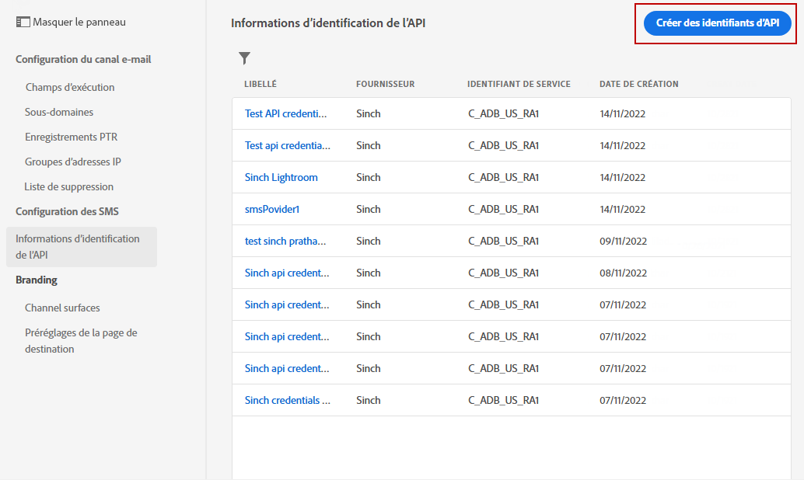

# Configurer le canal SMS {#sms-configuration}

Avant d&#39;envoyer des SMS, vous devez configurer votre environnement Adobe Journey Optimizer. Procédez comme suit :

* [Intégrez les paramètres du fournisseur](#create-api) à Journey Optimizer.
* [Créer une surface SMS](#message-preset-sms) (c.-à-d. paramètre prédéfini SMS)

Ces étapes doivent être exécutées par un [Administrateur ou une Administratrice système](../start/path/administrator.md) Adobe Journey Optimizer.

## Conditions préalables{#sms-prerequisites}

Adobe Journey Optimizer s’intègre actuellement à des fournisseurs tiers qui proposent des services de messages texte indépendants d’Adobe Journey Optimizer. Les fournisseurs pris en charge pour la messagerie texte sont les suivants : **Sinch**, **Twilio** et **Infobip**.

Avant la configuration du canal SMS, vous devez créer un compte auprès de l’un de ces fournisseurs afin de recevoir le **jeton API** et l’**ID de service** qui vous permettront d’établir la connexion entre Adobe Journey Optimizer et le fournisseur approprié.

Votre utilisation des services de messages texte sera soumise aux conditions générales supplémentaires de la part du fournisseur concerné. En tant que solutions tierces, Sinch, Twilio et Infobip sont disponibles pour les utilisateurs et utilisatrices d’Adobe Journey Optimizer via une intégration. Adobe ne contrôle pas et n’est pas responsable des produits tiers. Pour tout problème ou toute demande d&#39;assistance relative aux services de messagerie texte, contactez votre fournisseur.

>[!CAUTION]
>
>Pour accéder aux sous-domaines SMS et les modifier, vous devez disposer de l’autorisation **[!UICONTROL Gestion des sous-domaines SMS]** dans le sandbox de production. Pour en savoir plus sur les autorisations, consultez [cette page](../administration/high-low-permissions.md#administration-permissions).
>

## Créer des informations d’identification de l’API {#create-api}

>[!CONTEXTUALHELP]
>id="ajo_admin_sms_api_header"
>title="Configurer votre fournisseur de SMS avec Journey Optimizer"
>abstract="Adobe Journey Optimizer envoie des message SMS par le biais des fournisseurs de SMS. Sélectionnez votre fournisseur et renseignez vos informations d’identification de l’API."

>[!CONTEXTUALHELP]
>id="ajo_admin_mms_api_header"
>title="Configurer votre fournisseur de SMS avec Journey Optimizer"
>abstract="Adobe Journey Optimizer envoie du contenu média par le biais de fournisseurs de services MMS. Sélectionnez votre fournisseur et renseignez vos informations d’identification de l’API."

>[!CONTEXTUALHELP]
>id="ajo_admin_sms_api"
>title="Configurer votre fournisseur de SMS avec Journey Optimizer"
>abstract="Avant d&#39;envoyer des SMS, vous devez intégrer les paramètres du fournisseur à Journey Optimizer. Une fois que vous avez terminé, vous devez créer une surface SMS. Ces étapes doivent être exécutées par un Administrateur ou une Administratrice système Adobe Journey Optimizer."
>additional-url="https://experienceleague.adobe.com/docs/journey-optimizer/using/sms/sms-configuration.html?lang=fr#message-preset-sms" text="Création d’une surface de canal SMS"

>[!CONTEXTUALHELP]
>id="ajo_admin_sms_configuration"
>title="Sélectionnez la configuration du fournisseur de SMS."
>abstract="Sélectionnez les informations d’identification d’API configurées pour votre fournisseur SMS."

### Sinch {#sinch-api}

Pour configurer Sinch avec Journey Optimizer, procédez comme suit :

1. Dans le rail de gauche, accédez à **[!UICONTROL Administration]** > **[!UICONTROL Canaux]** et sélectionnez le menu **[!UICONTROL Informations d’identification de l’API]**. Cliquez sur le bouton **[!UICONTROL Créer des informations d’identification de l’API]**.

   

1. Configurez vos informations d’identification d’API SMS, comme indiqué ci-dessous :

   * **[!UICONTROL Nom]** : choisissez un nom pour vos informations d’identification d’API.

   * **[!UICONTROL ID de service]** et **[!UICONTROL Jeton API]** : accédez à la page des API, puis à vos informations d’identification sous l’onglet SMS. En savoir plus dans la [Documentation Sinch](https://developers.sinch.com/docs/sms/getting-started/){target="_blank"}.

   * **[!UICONTROL Mots-clés d’opt-in]**: saisissez les mots-clés par défaut ou personnalisés qui déclencheront automatiquement votre **[!UICONTROL Message d’inclusion]**. Pour plusieurs mots-clés, utilisez des valeurs séparées par des virgules.

   * **[!UICONTROL Message d’opt-in]** : saisissez la réponse personnalisée qui est automatiquement envoyée en tant que **[!UICONTROL message d’opt-in]**.

   * **[!UICONTROL Mots-clés d’exclusion]**: saisissez les mots-clés par défaut ou personnalisés qui déclencheront automatiquement votre **[!UICONTROL Message d’exclusion]**. Pour plusieurs mots-clés, utilisez des valeurs séparées par des virgules.

   * **[!UICONTROL Message d’opt-out]** : saisissez la réponse personnalisée qui est automatiquement envoyée en tant que **[!UICONTROL message d’opt-out]**.

   * **[!UICONTROL Mots-clés d’aide]**: saisissez les mots-clés par défaut ou personnalisés qui déclencheront automatiquement votre **Message d’aide**. Pour plusieurs mots-clés, utilisez des valeurs séparées par des virgules.

   * **[!UICONTROL Message d’aide]** : saisissez la réponse personnalisée qui est automatiquement envoyée en tant que **message d’aide**.

   * **[!UICONTROL Mots-clés de double opt-in]** : saisissez les mots-clés qui déclenchent le processus de double opt-in. Si un profil de personne n’existe pas, il est créé lors de la confirmation. Pour plusieurs mots-clés, utilisez des valeurs séparées par des virgules. [En savoir plus sur le double opt-in SMS](https://video.tv.adobe.com/v/3427129/?learn=on).

   * **[!UICONTROL Message de double opt-in]** : saisissez la réponse personnalisée qui est automatiquement envoyée en réponse à la confirmation de double opt-in.

1. Cliquez sur **[!UICONTROL Envoyer]** lorsque vous avez terminé la configuration de vos informations d’identification API.

Après avoir créé et configuré vos informations d’identification API, vous devez maintenant créer une surface de canal (c’est-à-dire un préréglage de message) pour les messages SMS.

<!--
### Sinch MMS

For **[!DNL Sinch MMS]**

        * **[!UICONTROL Name]**: choose a name for your API Credential.

        * **[!UICONTROL Project ID]**, **[!UICONTROL App ID]** and **[!UICONTROL API Token]**: from the Conversation API menu, you can find your credentials in the App menu. Learn more in [Sinch Documentation](https://docs.cc.sinch.com/cloud/service-configuration/en/oxy_ex-1/common/wln1620131604643.html){target="_blank"}.
-->

### Twilio {#twilio-api}

Pour configurer Twilio avec Journey Optimizer, procédez comme suit :

1. Dans le rail de gauche, accédez à **[!UICONTROL Administration]** > **[!UICONTROL Canaux]** et sélectionnez le menu **[!UICONTROL Informations d’identification de l’API]**. Cliquez sur le bouton **[!UICONTROL Créer des informations d’identification de l’API]**.

   

1. Configurez vos informations d’identification d’API SMS, comme indiqué ci-dessous :

   * **[!UICONTROL Nom]** : choisissez un nom pour vos informations d’identification d’API.

   * **[!UICONTROL SID du compte]** et **[!UICONTROL Jeton d’authentification]**: accédez au **Informations sur le compte** du volet de votre page Tableau de bord de la console Twilio pour trouver vos informations d’identification.

   * **[!UICONTROL SID du message]** : saisissez l’identifiant unique attribué à chaque message créé par l’API de Twilio. En savoir plus dans la [Documentation Twilio](https://support.twilio.com/hc/en-us/articles/223134387-What-is-a-Message-SID-){target="_blank"}.

1. Cliquez sur **[!UICONTROL Envoyer]** lorsque vous avez terminé la configuration de vos informations d’identification API.

Après avoir créé et configuré vos informations d’identification API, vous devez maintenant créer une surface de canal (c’est-à-dire un préréglage de message) pour les messages SMS.

### Infobip {#infobip-api}

Pour configurer Infobip avec Journey Optimizer, procédez comme suit :

1. Dans le rail de gauche, accédez à **[!UICONTROL Administration]** > **[!UICONTROL Canaux]** et sélectionnez le menu **[!UICONTROL Informations d’identification de l’API]**. Cliquez sur le bouton **[!UICONTROL Créer des informations d’identification de l’API]**.

   

1. Configurez vos informations dʼidentification de lʼAPI SMS, comme indiqué ci-dessous.

   * **[!UICONTROL Nom]** : choisissez un nom pour vos informations d’identification d’API.

   * **[!UICONTROL URL de base de l’API]** et **[!UICONTROL Clé API]**: accédez à la page d’accueil de votre interface web ou à la page de gestion des clés d’API pour trouver vos informations d’identification. En savoir plus dans la [Documentation Infobip](https://www.infobip.com/docs/api){target="_blank"}.

   * **[!UICONTROL Mots-clés d’opt-in]**: saisissez les mots-clés par défaut ou personnalisés qui déclencheront automatiquement votre **[!UICONTROL Message d’inclusion]**. Pour plusieurs mots-clés, utilisez des valeurs séparées par des virgules.

   * **[!UICONTROL Message d’opt-in]** : saisissez la réponse personnalisée qui est automatiquement envoyée en tant que **[!UICONTROL message d’opt-in]**.

   * **[!UICONTROL Mots-clés d’exclusion]**: entrez le ou les mots-clés par défaut qui déclencheront automatiquement votre **[!UICONTROL Message d’exclusion]**. Pour plusieurs mots-clés, utilisez des valeurs séparées par des virgules.

   * **[!UICONTROL Message d’opt-out]** : saisissez la réponse personnalisée qui est automatiquement envoyée en tant que **[!UICONTROL message d’opt-out]**.

   * **[!UICONTROL Mots-clés d’aide]**: saisissez les mots-clés par défaut ou personnalisés qui déclencheront automatiquement votre **Message d’aide**. Pour plusieurs mots-clés, utilisez des valeurs séparées par des virgules.

   * **[!UICONTROL Message d’aide]** : saisissez la réponse personnalisée qui est automatiquement envoyée en tant que **message d’aide**.

   * **[!UICONTROL Mots-clés de double opt-in]** : saisissez les mots-clés qui déclenchent le processus de double opt-in. Si un profil de personne n’existe pas, il est créé lors de la confirmation. Pour plusieurs mots-clés, utilisez des valeurs séparées par des virgules.

   * **[!UICONTROL Message de double opt-in]** : saisissez la réponse personnalisée qui est automatiquement envoyée en réponse à la confirmation de double opt-in.

   * **[!UICONTROL ID d’entité principale]** : saisissez l’ID d’entité principale DLT qui vous a été attribué.

   * **[!UICONTROL ID de modèle de contenu]** : saisissez l’ID de modèle de contenu DLT enregistré.

   * **[!UICONTROL Période de validité]** : saisissez la période de validité du message en heures. Si les messages ne peuvent pas être livrés dans ce délai, le système effectue d’autres tentatives pour les renvoyer. La période de validité par défaut est définie sur 48 heures.

   * **[!UICONTROL Données de rappel]** : saisissez les données clientes supplémentaires qui seront envoyées à l’URL de notification.

1. Cliquez sur **[!UICONTROL Envoyer]** lorsque vous avez terminé la configuration de vos informations d’identification API.

Après avoir créé et configuré vos informations d’identification API, vous devez maintenant créer une surface de canal (c’est-à-dire un préréglage de message) pour les messages SMS.

## Créer une surface SMS {#message-preset-sms}

>[!CONTEXTUALHELP]
>id="ajo_admin_surface_sms_type"
>title="Définir la catégorie de message"
>abstract="Sélectionnez le type de messages texte utilisant cette surface : marketing pour les messages promotionnels, qui nécessitent le consentement de l’utilisateur ou de l’utilisatrice, ou transactionnel pour les messages non commerciaux, tels que la réinitialisation du mot de passe."
>additional-url="https://experienceleague.adobe.com/docs/journey-optimizer/using/privacy/consent/opt-out.html?lang=fr#sms-opt-out-management" text="Se désinscrire dans les messages texte de marketing"

Une fois votre canal SMS configuré, vous devez créer une surface de canal afin de pouvoir envoyer des SMS depuis **[!DNL Journey Optimizer]**.

Pour créer une surface de canal, procédez comme suit :

1. Dans le rail de gauche, accédez à **[!UICONTROL Administration]** > **[!UICONTROL Canaux]** et sélectionnez **[!UICONTROL Branding]** > **[!UICONTROL Surfaces de canal]**. Cliquez sur le bouton **[!UICONTROL Créer une surface de canal]**.

   

1. Saisissez un nom et une description (facultatif) pour la surface, puis sélectionnez le canal SMS.

   

   >[!NOTE]
   >
   > Les noms doivent commencer par une lettre (A-Z). Ils ne peuvent contenir que des caractères alphanumériques. Vous pouvez également utiliser le trait de soulignement `_`, le point`.` et le trait d&#39;union `-`.

1. Définissez les **paramètres SMS**.

   

   Sélectionnez le **[!UICONTROL Type de SMS]** qui sera envoyé avec la surface : **[!UICONTROL Transactionnel]** ou **[!UICONTROL Marketing]**.

   * Choisissez **Marketing** pour les messages texte promotionnels : ces messages nécessitent le consentement de l’utilisateur ou de l’utilisatrice.
   * Choisissez **Transactionnel** pour les messages non commerciaux tels que la confirmation de commande, les notifications de réinitialisation de mot de passe ou les informations de diffusion, par exemple.

   Lors de la création d’un SMS, vous devez choisir une surface de canal valide correspondant à la catégorie que vous avez sélectionnée pour votre message.

   >[!CAUTION]
   >
   >Les messages **transactionnels** peuvent être envoyés aux profils qui se sont désabonnés des communications marketing. Ces messages ne peuvent être envoyés que dans des contextes spécifiques.

1. Sélectionnez la **[!UICONTROL Configuration SMS]** à associer à la surface.

   Pour plus dʼinformations sur la configuration de votre environnement pour envoyer des messages SMS, consultez [cette section](#create-api).

1. Saisissez le **[!UICONTROL Numéro dʼexpéditeur]** à utiliser lors de vos communications.

1. Sélectionnez votre **[!UICONTROL Champ d’exécution SMS]** pour sélectionner l’**[!UICONTROL Attribut de profil]** associé aux numéros de téléphone des profils.

1. Si vous souhaitez utiliser la fonction de raccourcissement des URL dans vos SMS, sélectionnez un élément de la liste **[!UICONTROL Sous-domaine]**.

   >[!NOTE]
   >
   >Avant de pouvoir sélectionner un sous-domaine, vous devez avoir configuré au moins un sous-domaine SMS. [Voici comment procéder.](sms-subdomains.md)

1. Saisissez le **[!UICONTROL numéro d’opt-out]** que vous voulez utiliser pour cette surface. Lorsque les profils décident de ne plus recevoir de messages depuis ce numéro, vous pouvez toujours leur en envoyer à partir d’autres numéros que vous pouvez utiliser pour envoyer des messages texte avec [!DNL Journey Optimizer].

   >[!NOTE]
   >
   >Dans [!DNL Journey Optimizer], la désinscription aux messages texte n’est plus gérée au niveau du canal. Elle est désormais spécifique à un numéro.

1. Une fois tous les paramètres configurés, cliquez sur **[!UICONTROL Envoyer]** pour confirmer. Vous pouvez également enregistrer la surface de canal en tant que brouillon et reprendre sa configuration ultérieurement.

   

1. Une fois la surface de canal créée, elle s&#39;affiche dans la liste avec le statut **[!UICONTROL Traitement]**.

   >[!NOTE]
   >
   >Si les vérifications ne réussissent pas, découvrez les raisons possibles de l’échec dans [cette section](#monitor-channel-surfaces).

1. Une fois les vérifications effectuées, la surface de canal obtient le statut **[!UICONTROL Actif]**. Elle est prête à être utilisée pour diffuser des messages.

   

Vous pouvez maintenant envoyer des messages texte avec Journey Optimizer.

**Rubriques connexes**

* [Créer un message texte](create-sms.md)
* [Ajouter un message dans un parcours](../building-journeys/journeys-message.md)
* [Ajouter un message dans une campagne](../campaigns/create-campaign.md)

