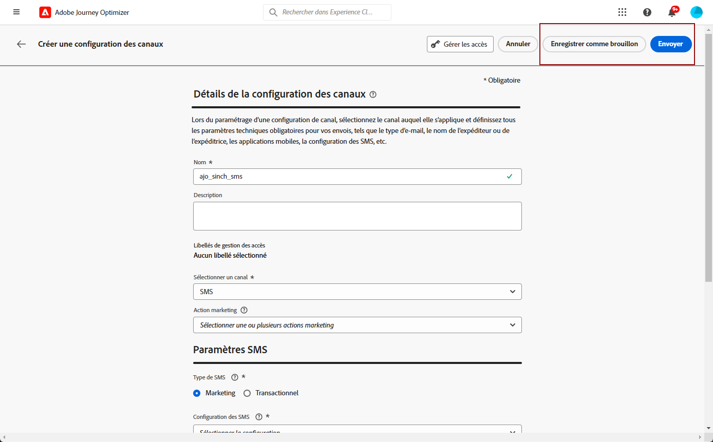

# Configurer le canal SMS {#sms-configuration}

Avant d&#39;envoyer des SMS ou des MMS, vous devez configurer votre environnement Adobe Journey Optimizer. Pour effectuer cette opération :

* [Intégrer les paramètres du fournisseur](#create-api) avec Journey Optimizer
* [Créer une surface SMS](#message-preset-sms) (c’est-à-dire le paramètre prédéfini SMS), également utilisé pour MMS

Ces étapes doivent être effectuées par un Adobe Journey Optimizer [Administrateur système](../start/path/administrator.md).

## Conditions préalables{#sms-prerequisites}

Adobe Journey Optimizer s’intègre actuellement à des fournisseurs tiers qui proposent des services de messagerie texte indépendants de Adobe Journey Optimizer. Les fournisseurs pris en charge pour la messagerie texte sont les suivants : **Sinch**, **Twilio** et **Infobip**. MMS est uniquement pris en charge avec **Sinch**.

Avant de configurer le canal SMS, vous devez créer un compte auprès de l’un de ces fournisseurs pour obtenir votre **Jeton API** et **ID de service**, que vous devez configurer pour la connexion entre Adobe Journey Optimizer et le fournisseur concerné.

Votre utilisation des services de messagerie texte est soumise à des conditions supplémentaires de la part du fournisseur concerné. En tant que solutions tierces, Sinch, Twilio et Infobip sont disponibles pour les utilisateurs de Adobe Journey Optimizer via une intégration. Adobe ne contrôle pas et n’est pas responsable des produits tiers. Pour tout problème ou toute demande d&#39;assistance relative aux services de messagerie texte (SMS/MMS), contactez votre fournisseur.

>[!CAUTION]
>
>Pour accéder aux sous-domaines SMS et les modifier, vous devez disposer de la variable **[!UICONTROL Gestion des sous-domaines SMS]** autorisation sur l’environnement de test de production. En savoir plus sur les autorisations dans [cette page](../administration/high-low-permissions.md#administration-permissions).
>

## Création d’informations d’identification d’API {#create-api}

>[!CONTEXTUALHELP]
>id="ajo_admin_sms_api_header"
>title="Configuration de votre fournisseur SMS/MMS avec Journey Optimizer"
>abstract="Adobe Journey Optimizer envoie des SMS par le biais des fournisseurs de services SMS/MMS. Sélectionnez votre fournisseur et renseignez vos informations d’identification d’API."

>[!CONTEXTUALHELP]
>id="ajo_admin_sms_api"
>title="Configuration de votre fournisseur SMS/MMS avec Journey Optimizer"
>abstract="Avant d&#39;envoyer des SMS (SMS/MMS), vous devez intégrer les paramètres du fournisseur à Journey Optimizer. Une fois cette opération terminée, vous devez créer une surface SMS/MMS. Ces étapes doivent être effectuées par un administrateur système Adobe Journey Optimizer."
>additional-url="https://experienceleague.adobe.com/docs/journey-optimizer/using/sms/sms-configuration.html?lang=fr#message-preset-sms" text="Création d’une surface de canal SMS"

>[!CONTEXTUALHELP]
>id="ajo_admin_sms_configuration"
>title="Sélectionnez la configuration du fournisseur de SMS."
>abstract="Sélectionnez les informations d’identification d’API configurées pour votre fournisseur SMS."

Pour configurer votre fournisseur SMS/MMS avec Journey Optimizer, procédez comme suit :

1. Dans le rail de gauche, accédez à **[!UICONTROL Administration]** > **[!UICONTROL Canaux]** et sélectionnez le menu **[!UICONTROL Informations d’identification de l’API]**. Cliquez sur le bouton **[!UICONTROL Créer des informations d’identification de l’API]**.

   

1. Configurez vos informations d’identification d’API SMS, comme indiqué ci-dessous.

   

   * Pour **[!DNL Sinch]** :

      * **[!UICONTROL Nom]** : choisissez un nom pour vos informations d’identification d’API.

      * **[!UICONTROL ID de service]** et **[!UICONTROL Jeton API]**: accédez à la page API. Vos informations d’identification sont disponibles sous l’onglet SMS . En savoir plus dans [Documentation Sinch](https://developers.sinch.com/docs/sms/getting-started/){target="_blank"}.

      * **[!UICONTROL Message d’opt-in]** : saisissez la réponse personnalisée qui est automatiquement envoyée en tant que **[!UICONTROL message d’opt-in]**.

      * **[!UICONTROL Message d’aide]** : saisissez la réponse personnalisée qui est automatiquement envoyée en tant que **message d’aide**.

   * Pour **[!DNL Sinch MMS]** :

      * **[!UICONTROL Nom]** : choisissez un nom pour vos informations d’identification d’API.

      * **[!UICONTROL Identifiant de projet]**, **[!UICONTROL ID de l’application]** et **[!UICONTROL Jeton API]**: dans le menu API de conversation, vous trouverez vos informations d’identification dans le menu Application. En savoir plus dans [Documentation Sinch](https://docs.cc.sinch.com/cloud/service-configuration/en/oxy_ex-1/common/wln1620131604643.html){target="_blank"}.

   * Pour **[!DNL Twilio]** :

      * **[!UICONTROL Nom]** : choisissez un nom pour vos informations d’identification d’API.

      * **[!UICONTROL SID du compte]** et **[!UICONTROL Jeton d’authentification]** : accédez au volet Informations du compte de la page Tableau de bord de la console Twilio pour trouver vos informations d’identification.

      * **[!UICONTROL SID du message]** : saisissez l’identifiant unique attribué à chaque message créé par l’API de Twilio. En savoir plus dans [Documentation Twilio](https://support.twilio.com/hc/en-us/articles/223134387-What-is-a-Message-SID-){target="_blank"}.

   * Pour **[!DNL Infobip]** :

      * **[!UICONTROL Nom]** : choisissez un nom pour vos informations d’identification d’API.

      * **[!UICONTROL URL de base de l’API]** et **[!UICONTROL Jeton API]** : accédez à la page d’accueil de votre interface web ou à la page de gestion des clés d’API pour trouver vos informations d’identification. En savoir plus dans [Documentation Infobip](https://www.infobip.com/docs/api){target="_blank"}.

1. Cliquez sur **[!UICONTROL Envoyer]** lorsque vous avez terminé la configuration de vos informations d’identification API.

Après avoir créé et configuré vos informations d’identification API, vous devez maintenant créer une surface de canal (c’est-à-dire un préréglage de message) pour les messages SMS.

## Créer une surface SMS {#message-preset-sms}

>[!CONTEXTUALHELP]
>id="ajo_admin_surface_sms_type"
>title="Définition de la catégorie de messages"
>abstract="Sélectionnez le type de messages texte utilisant cette surface : Marketing pour les messages promotionnels, qui requièrent le consentement de l’utilisateur, ou Transactionnel pour les messages non commerciaux, tels que la réinitialisation du mot de passe."
>additional-url="https://experienceleague.adobe.com/docs/journey-optimizer/using/privacy/consent/opt-out.html?lang=fr#sms-opt-out-management" text="Exclusion dans les messages texte marketing"

Une fois votre canal SMS/MMS configuré, vous devez créer une surface de canal pour pouvoir envoyer des SMS depuis **[!DNL Journey Optimizer]**.

Pour créer une surface de canal, procédez comme suit :

1. Dans le rail de gauche, accédez à **[!UICONTROL Administration]** > **[!UICONTROL Canaux]** et sélectionnez **[!UICONTROL Branding]** > **[!UICONTROL Surfaces de canal]**. Cliquez sur le bouton **[!UICONTROL Créer une surface de canal]**.

   

1. Saisissez un nom et une description (facultatif) pour la surface, puis sélectionnez le canal SMS.

   

   >[!NOTE]
   >
   > Les noms doivent commencer par une lettre (A-Z). Ils ne peuvent contenir que des caractères alphanumériques. Vous pouvez également utiliser le trait de soulignement `_`, le point`.` et le trait d&#39;union `-`.

1. Définissez les **paramètres SMS**.

   

   Sélectionnez le **[!UICONTROL Type de SMS]** qui sera envoyé avec la surface : **[!UICONTROL Transactionnel]** ou **[!UICONTROL Marketing]**.

   * Choisir **Marketing** pour les messages promotionnels : ces messages requièrent le consentement de l’utilisateur.
   * Choisissez **Transactionnel** pour les messages non commerciaux tels que la confirmation de commande, les notifications de réinitialisation de mot de passe ou les informations de diffusion, par exemple.

   Lors de la création d&#39;un message SMS/MMS, vous devez choisir une surface de canal valide correspondant à la catégorie que vous avez sélectionnée pour votre message.

   >[!CAUTION]
   >
   >Les messages **transactionnels** peuvent être envoyés aux profils qui se sont désabonnés des communications marketing. Ces messages ne peuvent être envoyés que dans des contextes spécifiques.

1. Sélectionnez la **[!UICONTROL Configuration SMS]** à associer à la surface.

   Pour plus dʼinformations sur la configuration de votre environnement pour envoyer des messages SMS, consultez [cette section](#create-api).

1. Saisissez le **[!UICONTROL Numéro dʼexpéditeur]** à utiliser lors de vos communications.

1. Sélectionnez votre **[!UICONTROL Champ d’exécution SMS]** pour sélectionner l’**[!UICONTROL Attribut de profil]** associé aux numéros de téléphone des profils.

1. Si vous souhaitez utiliser la fonction de raccourcissement des URL dans vos SMS, sélectionnez un élément de la liste **[!UICONTROL Sous-domaine]**.

   >[!NOTE]
   >
   >Pour pouvoir sélectionner un sous-domaine, vérifiez que vous avez déjà configuré au moins un sous-domaine SMS/MMS. [Voici comment procéder.](sms-subdomains.md)

1. Saisissez le **[!UICONTROL numéro d’opt-out]** que vous voulez utiliser pour cette surface. Lorsque les profils s’excluent de ce nombre, vous pouvez toujours leur envoyer des messages à partir d’autres numéros que vous pouvez utiliser pour envoyer des messages texte avec [!DNL Journey Optimizer].

   >[!NOTE]
   >
   >Dans [!DNL Journey Optimizer], l’exclusion des messages texte n’est plus gérée au niveau du canal. Elle est désormais spécifique à un numéro.

1. Une fois tous les paramètres configurés, cliquez sur **[!UICONTROL Envoyer]** pour confirmer. Vous pouvez également enregistrer la surface de canal en tant que brouillon et reprendre sa configuration ultérieurement.

   

1. Une fois la surface de canal créée, elle s&#39;affiche dans la liste avec le statut **[!UICONTROL Traitement]**.

   >[!NOTE]
   >
   >Si les vérifications ne réussissent pas, découvrez les raisons possibles de l’échec dans [cette section](#monitor-channel-surfaces).

1. Une fois les vérifications effectuées, la surface de canal obtient le statut **[!UICONTROL Actif]**. Elle est prête à être utilisée pour diffuser des messages.

   

Vous êtes maintenant prêt à envoyer des messages texte avec Journey Optimizer.

**Rubriques connexes**

* [Créer un message texte (SMS/MMS)](create-sms.md)
* [Ajouter un message dans un parcours](../building-journeys/journeys-message.md)
* [Ajouter un message dans une campagne](../campaigns/create-campaign.md)

