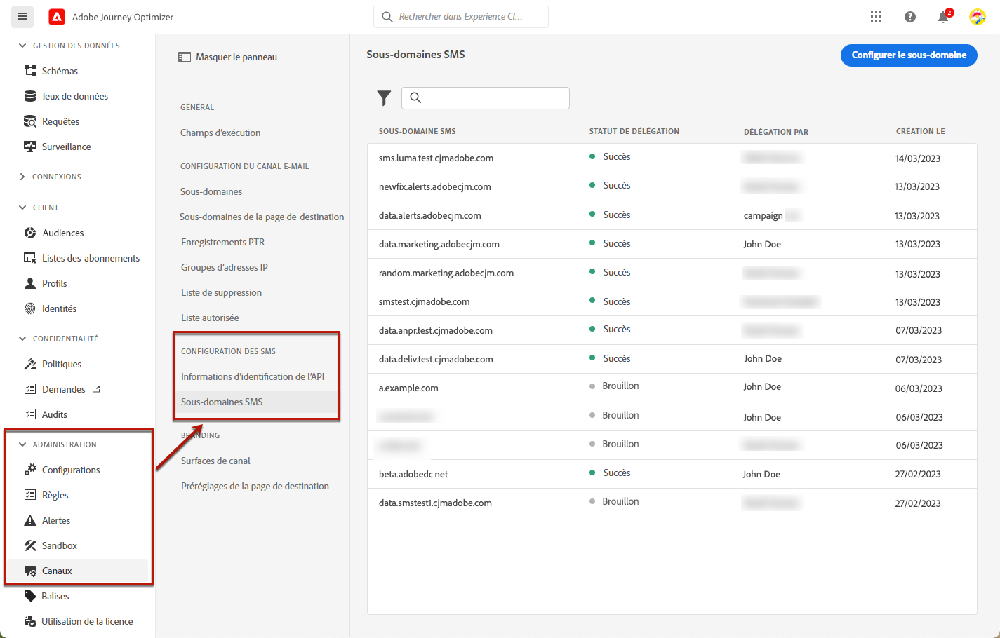

# Configurer des sous-domaines SMS {#lp-subdomains}

>[!CONTEXTUALHELP]
>id="ajo_admin_subdomain_sms_header"
>title="Déléguer un sous-domaine SMS"
>abstract="Votre tâche consiste à configurer votre sous-domaine pour les SMS. Vous pouvez utiliser un sous-domaine déjà délégué à Adobe ou en configurer un autre."

>[!CONTEXTUALHELP]
>id="ajo_admin_subdomain_sms"
>title="Déléguer un sous-domaine SMS"
>abstract="Vous devez configurer un sous-domaine dédié aux SMS, car vous en aurez besoin pour créer une surface SMS. Vous pouvez utiliser un sous-domaine déjà délégué à Adobe ou configurer un nouveau sous-domaine."
>additional-url="https://experienceleague.adobe.com/docs/journey-optimizer/using/sms/sms-configuration.html?lang=fr#message-preset-sms" text="Créer des surfaces SMS"

>[!CONTEXTUALHELP]
>id="ajo_admin_config_sms_subdomain"
>title="Sélectionner un sous-domaine SMS"
>abstract="Avant de créer une surface SMS, vous devez déjà avoir configuré au moins un sous-domaine SMS, que vous pouvez sélectionner dans la liste des noms de sous-domaines."
>additional-url="https://experienceleague.adobe.com/docs/journey-optimizer/using/sms/sms-configuration.html?lang=fr#message-preset-sms" text="Créer des surfaces SMS"

Avant de raccourcir les URL ajoutées à vos SMS, vous devez configurer le sous-domaine qui sera utilisé lors de la [création de la surface SMS](sms-configuration.md#message-preset-sms).

Vous pouvez utiliser un sous-domaine déjà délégué à Adobe ou en configurer un autre. En savoir plus sur la délégation de sous-domaines à Adobe dans [cette section](../configuration/delegate-subdomain.md).

>[!CAUTION]
>
>La configuration de sous-domaines SMS est identique dans tous les environnements. Par conséquent :
>
>* Pour accéder aux sous-domaines SMS et les modifier, vous devez disposer de l’autorisation **[!UICONTROL Gestion des sous-domaines SMS]** dans la sandbox de production.
>
> * Toute modification apportée à un sous-domaine SMS aura également un impact sur les sandbox de production.

## Utiliser un sous-domaine existant {#sms-use-existing-subdomain}

Pour utiliser un sous-domaine déjà délégué à Adobe, procédez comme suit.

1. Accédez au menu **[!UICONTROL Administration]** > **[!UICONTROL Canaux]**, puis sélectionnez **[!UICONTROL Configuration des SMS]** > **[!UICONTROL Sous-domaines SMS]**.

   

1. Cliquez sur **[!UICONTROL Configurer le sous-domaine]**.

   

1. Sélectionnez **[!UICONTROL Utiliser le sous-domaine délégué]** dans la section **[!UICONTROL Type de configuration]**.

   

1. Saisissez le préfixe qui sʼaffichera dans lʼURL de votre SMS.

   >[!NOTE]
   >
   >Seuls les caractères alphanumériques et les tirets sont autorisés.

1. Sélectionnez un sous-domaine délégué dans la liste.

   >[!NOTE]
   >
   >Vous ne pouvez pas sélectionner un sous-domaine déjà utilisé comme sous-domaine SMS.

   <!--Capital letters are not allowed in subdomains. TBC by PM-->

   

   <!--Note that you cannot use multiple delegated subdomains of the same parent domain. For example, if 'marketing1.yourcompany.com' is already delegated to Adobe for your SMS messages, you will not be able to use 'marketing2.yourcompany.com'. However, multi-level subdomains being supported for SMS, you may proceed using a subdomain of 'marketing1.yourcompany.com' (such as 'email.marketing1.yourcompany.com'), or a different parent domain.-->

   >[!CAUTION]
   >
   >Si vous sélectionnez un domaine qui a été délégué à Adobe à l’aide de la [méthode CNAME](../configuration/delegate-subdomain.md#cname-subdomain-delegation), vous devez créer l’enregistrement DNS sur votre plateforme d’hébergement. Pour générer l’enregistrement DNS, le processus est le même que lorsque vous configurez un nouveau sous-domaine SMS. Découvrez comment dans [cette section](#sms-configure-new-subdomain).

1. Cliquez sur **[!UICONTROL Envoyer]**.

1. Une fois envoyé, le sous-domaine s’affiche dans la liste avec le statut du **[!UICONTROL Traitement]**. Pour en savoir plus sur les statuts des sous-domaines, consultez [cette section](../configuration/about-subdomain-delegation.md#access-delegated-subdomains).<!--Same statuses?-->

   >[!NOTE]
   >
   >Avant de pouvoir utiliser ce sous-domaine pour envoyer des messages, vous devez attendre qu’Adobe effectue les vérifications nécessaires, ce qui peut prendre jusqu’à 4 heures.<!--Learn more in [this section](delegate-subdomain.md#subdomain-validation).-->

1. Une fois les vérifications effectuées, le sous-domaine obtient le statut **[!UICONTROL Succès]**. Vous pouvez à présent l’utiliser pour créer des surfaces de canal SMS.

## Configurer un nouveau sous-domaine {#sms-configure-new-subdomain}

>[!CONTEXTUALHELP]
>id="ajo_admin_sms_subdomain_dns"
>title="Générer l’enregistrement DNS correspondant"
>abstract="Pour configurer un nouveau sous-domaine SMS, vous devez copier les informations du serveur de noms Adobe affichées dans l’interface de Journey Optimizer et les coller dans votre solution d’hébergement de domaine pour générer l’enregistrement DNS correspondant. Une fois les vérifications effectuées, le sous-domaine est prêt à être utilisé pour créer des surfaces SMS."

Pour configurer un nouveau sous-domaine, procédez comme suit :

1. Accédez au menu **[!UICONTROL Administration]** > **[!UICONTROL Canaux]**, puis sélectionnez **[!UICONTROL Configuration des SMS]** > **[!UICONTROL Sous-domaines SMS]**.

1. Cliquez sur **[!UICONTROL Configurer le sous-domaine]**.

1. Sélectionnez **[!UICONTROL Ajouter votre propre domaine]** de la section **[!UICONTROL Type de configuration]**.

   

1. Spécifiez le sous-domaine à déléguer.

   >[!CAUTION]
   >
   >Vous ne pouvez pas utiliser un sous-domaine SMS existant.
   >
   >Les majuscules ne sont pas autorisées dans les sous-domaines.

   La délégation d’un sous-domaine non valide à Adobe n’est pas autorisée. Veillez à saisir un sous-domaine valide détenu par votre entreprise, tel que marketing.votre_entreprise.com.

   >[!NOTE]
   >
   >Les sous-domaines à plusieurs niveaux (du même domaine parent) sont pris en charge. Par exemple, vous pouvez utiliser « ms.marketing.yourcompany.com ».

1. L’enregistrement à placer dans les serveurs DNS s’affiche. Copiez cet enregistrement ou téléchargez un fichier CSV, puis accédez à votre solution d’hébergement de domaine pour générer l’enregistrement DNS correspondant.

1. Assurez-vous que l’enregistrement DNS a été généré dans votre solution d’hébergement de domaine. Si tout est correctement configuré, cochez la case « Je confirme... », puis cliquez sur **[!UICONTROL Envoyer]**.

   

   >[!NOTE]
   >
   >Lorsque vous configurez un nouveau sous-domaine SMS, il pointe toujours vers un enregistrement CNAME.

1. Une fois la délégation de sous-domaine envoyée, le sous-domaine s&#39;affiche dans la liste avec le statut **[!UICONTROL Traitement]**. Pour en savoir plus sur les statuts des sous-domaines, consultez [cette section](../configuration/about-subdomain-delegation.md#access-delegated-subdomains).<!--Same statuses?-->

   >[!NOTE]
   >
   >Avant d’utiliser ce sous-domaine pour envoyer des SMS, vous devez attendre qu’Adobe effectue les vérifications nécessaires, ce qui peut prendre jusqu’à 4 heures.<!--Learn more in [this section](#subdomain-validation).-->

1. Une fois les vérifications effectuées, le sous-domaine obtient le statut **[!UICONTROL Succès]**. Vous pouvez à présent l’utiliser pour créer des surfaces de canal SMS.

   Le statut du sous-domaine sera marqué comme en **[!UICONTROL Échec]** si la création de lʼenregistrement de validation sur votre solution dʼhébergement nʼa pas réussi.
