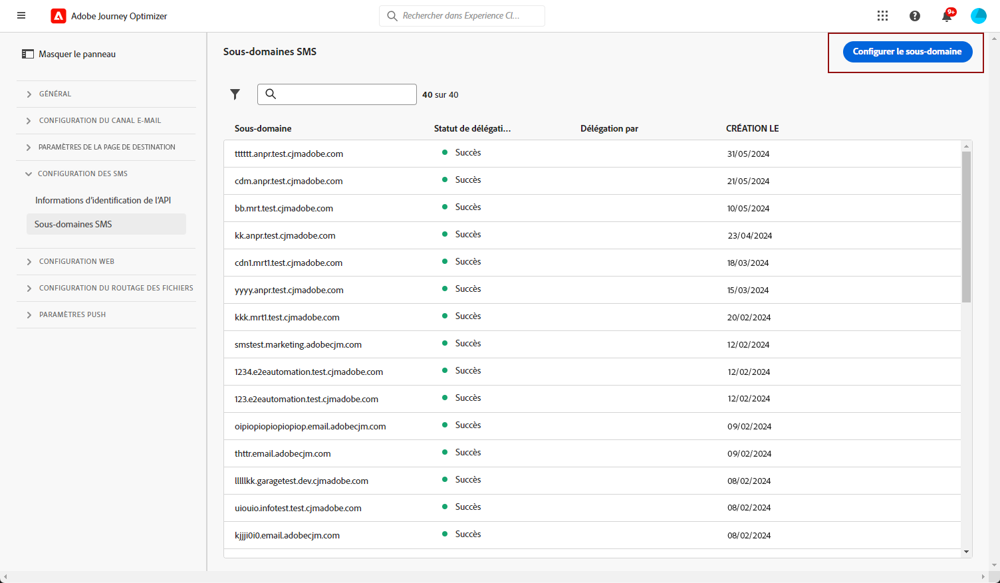

# Configurer des sous-domaines SMS {#sms-mms-subdomains}

>[!CONTEXTUALHELP]
>id="ajo_admin_subdomain_sms_header"
>title="Déléguer un sous-domaine SMS/MMS"
>abstract="Configurez votre sous-domaine pour les messages texte (SMS/MMS). Vous pouvez utiliser un sous-domaine déjà délégué à Adobe ou en configurer un nouveau."

>[!CONTEXTUALHELP]
>id="ajo_admin_subdomain_sms"
>title="Déléguer un sous-domaine SMS/MMS"
>abstract="Vous devez configurer un sous-domaine dédié aux SMS, car vous en aurez besoin pour créer une configuration des SMS. Vous pouvez utiliser un sous-domaine déjà délégué à Adobe ou en configurer un nouveau."
>additional-url="https://experienceleague.adobe.com/fr/docs/journey-optimizer/using/channels/sms/configure-sms/sms-configuration-surface" text="Créer une configuration des SMS"

>[!CONTEXTUALHELP]
>id="ajo_admin_config_sms_subdomain"
>title="Sélectionner un sous-domaine SMS/MMS"
>abstract="Avant de créer une configuration des SMS, vous devez déjà avoir configuré au moins un sous-domaine SMS, que vous pouvez sélectionner dans la liste des noms de sous-domaines."
>additional-url="https://experienceleague.adobe.com/fr/docs/journey-optimizer/using/channels/sms/configure-sms/sms-configuration-surface" text="Créer une configuration des SMS"

## Commencer avec les sous-domaines de SMS {#gs-sms-mms-subdomains}

Avant de raccourcir les URL ajoutées à vos SMS/MMS, vous devez configurer le sous-domaine qui sera sélectionné lors de la [création d’une configuration des SMS](sms-configuration.md#sms-prerequisites).

Vous pouvez utiliser un sous-domaine déjà délégué à Adobe ou en configurer un autre. Pour en savoir plus sur la délégation de sous-domaines à Adobe, consultez [cette section](../configuration/delegate-subdomain.md).

La configuration de sous-domaines de SMS est **partagée entre tous les environnements**. Par conséquent, toute modification apportée à un sous-domaine aura également un impact sur les sandbox de production.

Pour accéder aux sous-domaines SMS et les modifier, vous devez disposer de l’autorisation **[!UICONTROL Gestion des sous-domaines SMS]** dans le sandbox de production. Pour en savoir plus sur les autorisations, consultez [cette section](../administration/high-low-permissions.md).

## Utiliser un sous-domaine existant {#sms-use-existing-subdomain}

Pour utiliser un sous-domaine déjà délégué à Adobe, procédez comme suit.

1. Accédez au menu **[!UICONTROL Administration]** > **[!UICONTROL Canaux]**, puis sélectionnez **[!UICONTROL Paramètres des SMS]** > **[!UICONTROL Sous-domaines SMS]**.

1. Cliquez sur **[!UICONTROL Configurer le sous-domaine]**.

   

1. Sélectionnez **[!UICONTROL Utiliser le sous-domaine délégué]** dans la section **[!UICONTROL Type de configuration]**.

   

1. Saisissez le préfixe qui sʼaffichera dans lʼURL de votre SMS.

   Seuls les caractères alphanumériques et les tirets sont autorisés.

   >[!CAUTION]
   >
   >N’utilisez pas les préfixes `cdn` ou `data`, car ils sont réservés à un usage interne. D’autres préfixes restreints ou réservés tels que `dmarc` ou `spf` doivent également être évités.

1. Sélectionnez un sous-domaine délégué dans la liste.

   Vous ne pouvez pas sélectionner un sous-domaine déjà utilisé comme sous-domaine SMS.

   <!--Capital letters are not allowed in subdomains. TBC by PM-->

   

   <!--Note that you cannot use multiple delegated subdomains of the same parent domain. For example, if 'marketing1.yourcompany.com' is already delegated to Adobe for your SMS messages, you will not be able to use 'marketing2.yourcompany.com'. However, multi-level subdomains being supported for SMS, you may proceed using a subdomain of 'marketing1.yourcompany.com' (such as 'email.marketing1.yourcompany.com'), or a different parent domain.-->

   >[!CAUTION]
   >
   >Si vous sélectionnez un domaine qui a été délégué à Adobe à l’aide de la [méthode CNAME](../configuration/delegate-subdomain.md#cname-subdomain-setup), vous devez créer l’enregistrement DNS sur votre plateforme d’hébergement. Pour générer l’enregistrement DNS, le processus est le même que lorsque vous configurez un nouveau sous-domaine SMS. Découvrez comment dans [cette section](#sms-configure-new-subdomain).

1. Cliquez sur **[!UICONTROL Envoyer]**.

1. Une fois envoyé, le sous-domaine s’affiche dans la liste avec le statut du **[!UICONTROL Traitement]**. Pour en savoir plus sur les statuts des sous-domaines, consultez [cette section](../configuration/delegate-subdomain.md#access-delegated-subdomains).<!--Same statuses?-->

   Avant de pouvoir utiliser ce sous-domaine pour envoyer des messages, vous devez attendre qu’Adobe effectue les vérifications nécessaires, ce qui peut prendre **jusqu’à 4 heures**.<!--Learn more in [this section](../configuration/delegate-subdomain.md#subdomain-validation).-->

1. Une fois les vérifications effectuées, le sous-domaine obtient le statut **[!UICONTROL Succès]**. Vous pouvez à présent l’utiliser pour créer des configurations de canal SMS.

## Configurer un nouveau sous-domaine {#sms-configure-new-subdomain}

>[!CONTEXTUALHELP]
>id="ajo_admin_sms_subdomain_dns"
>title="Générer l’enregistrement DNS correspondant"
>abstract="Pour configurer un nouveau sous-domaine SMS, vous devez copier les informations du serveur de noms Adobe affichées dans l’interface de Journey Optimizer et les coller dans votre solution d’hébergement de domaine pour générer l’enregistrement DNS correspondant. Une fois les contrôles effectués, le sous-domaine est prêt à être utilisé pour créer une configuration des SMS."

Pour configurer un nouveau sous-domaine, procédez comme suit.

1. Accédez au menu **[!UICONTROL Administration]** > **[!UICONTROL Canaux]**, puis sélectionnez **[!UICONTROL Paramètres des SMS]** > **[!UICONTROL Sous-domaines SMS]**.

1. Cliquez sur **[!UICONTROL Configurer un sous-domaine]**.

   

1. Sélectionnez **[!UICONTROL Ajouter votre propre domaine]** de la section **[!UICONTROL Type de configuration]**.

   

1. Spécifiez le sous-domaine à déléguer.

   >[!CAUTION]
   >
   >* Vous ne pouvez pas utiliser un sous-domaine SMS existant.
   >
   >* Les majuscules ne sont pas autorisées dans les sous-domaines.

   La délégation d’un sous-domaine non valide à Adobe n’est pas autorisée. Veillez à saisir un sous-domaine valide détenu par votre entreprise, tel que marketing.votre_entreprise.com.

   Les sous-domaines à plusieurs niveaux (du même domaine parent) sont pris en charge. Par exemple, vous pouvez utiliser « sms.marketing.yourcompany.com ».

1. L’enregistrement à placer dans les serveurs DNS s’affiche. Copiez cet enregistrement ou téléchargez un fichier CSV, puis accédez à votre solution d’hébergement de domaine pour générer l’enregistrement DNS correspondant.

1. Assurez-vous que l’enregistrement DNS a été généré dans votre solution d’hébergement de domaine. Si tout est correctement configuré, cochez la case « Je confirme... », puis cliquez sur **[!UICONTROL Envoyer]**.

   

   Lorsque vous configurez un nouveau sous-domaine de SMS, il pointe toujours vers un enregistrement CNAME.

1. Une fois la délégation de sous-domaine envoyée, le sous-domaine s&#39;affiche dans la liste avec le statut **[!UICONTROL Traitement]**. Pour en savoir plus sur les statuts des sous-domaines, consultez [cette section](../configuration/delegate-subdomain.md#access-delegated-subdomains).<!--Same statuses?-->

Avant de pouvoir utiliser un sous-domaine pour envoyer des messages SMS, vous devez attendre qu’Adobe effectue les vérifications nécessaires, ce qui peut prendre jusqu’à 4 heures.<!--Learn more in [this section](#subdomain-validation).-->Une fois les vérifications effectuées, le sous-domaine obtient le statut **[!UICONTROL Succès]**. Vous pouvez à présent l’utiliser pour créer des configurations de canal SMS.

Le statut du sous-domaine sera marqué comme en **[!UICONTROL Échec]** si la création de lʼenregistrement de validation sur votre solution dʼhébergement nʼa pas réussi.

## Mécanismes de sécurisation {#guardrails}

Actuellement, l’interface d’utilisation de [!DNL Journey Optimizer] ne permet pas de supprimer ni d’annuler la délégation des sous-domaines SMS une fois qu’ils ont été configurés.

Cependant, lors du test des fonctionnalités dans [!DNL Journey Optimizer], il peut être nécessaire de créer un sous-domaine SMS. Une fois les tests terminés, cela peut encombrer les environnements avec des configurations inutiles, car l’interface d’utilisation ne permet pas de supprimer ni d’annuler la délégation des sous-domaines SMS.

Voici quelques étapes et points à prendre en compte :

<!--As an alternative action, create a new SMS subdomain for future use cases and avoid using the existing one if it is no longer needed.-->

* Il est recommandé de maintenir un environnement ordonné en ne créant que les composants et configurations nécessaires.
* Dans les cas où il existe un impact commercial, contactez votre représentant ou représentante Adobe qui pourra vous aider à supprimer/annuler la délégation du sous-domaine SMS. [En savoir plus](#undelegate-subdomain)
* Si vous avez besoin d’une assistance supplémentaire, contactez Adobe pour obtenir des conseils sur la manière de gérer efficacement votre instance.

## Annuler la délégation d’un sous-domaine {#undelegate-subdomain}

Si vous souhaitez annuler la délégation d’un sous-domaine SMS, contactez votre représentant ou représentante Adobe en indiquant le sous-domaine pour lequel vous souhaitez annuler la délégation.

Si le sous-domaine SMS pointe vers un enregistrement CNAME, vous pouvez supprimer l’enregistrement DNS CNAME que vous avez créé pour le sous-domaine SMS de votre solution d’hébergement (mais ne supprimez pas le sous-domaine d’e-mail d’origine, le cas échéant).

>[!NOTE]
>
>Un sous-domaine SMS peut pointer vers un enregistrement CNAME, car il s’agissait d’un [sous-domaine existant](#sms-use-existing-subdomain) délégué à Adobe à l’aide de la méthode [CNAME](../configuration/delegate-subdomain.md#cname-subdomain-setup) ou d’un [nouveau sous-domaine SMS](#sms-configure-new-subdomain) que vous avez configuré.

Une fois votre demande traitée par Adobe, le domaine dont la délégation a été annulée ne s’affiche plus sur la page d’inventaire des sous-domaines.
