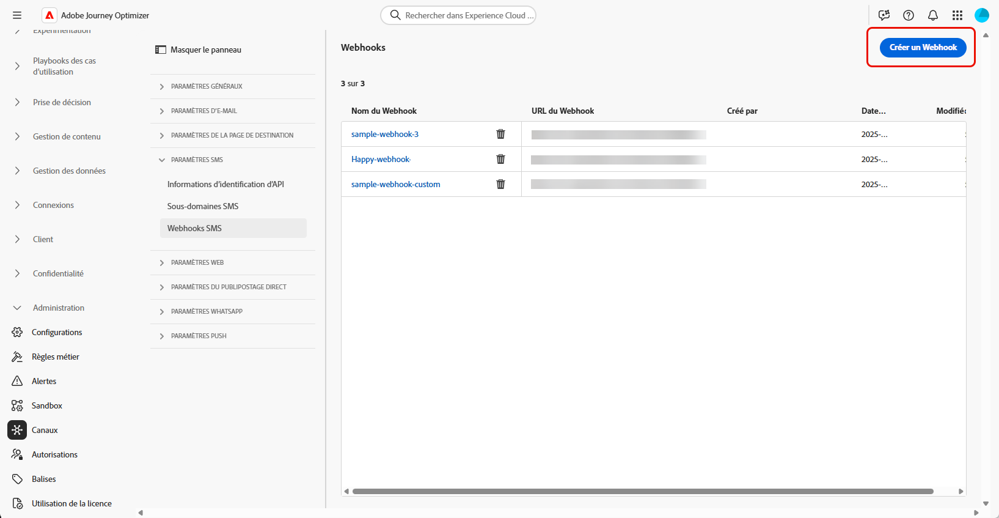
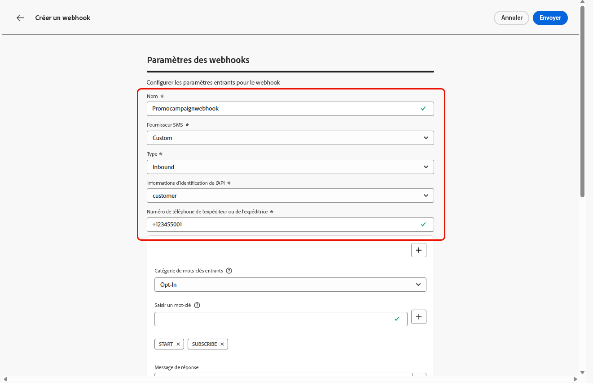
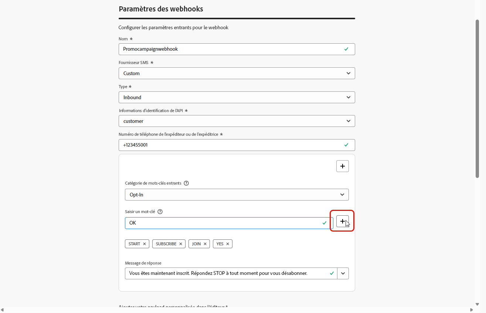
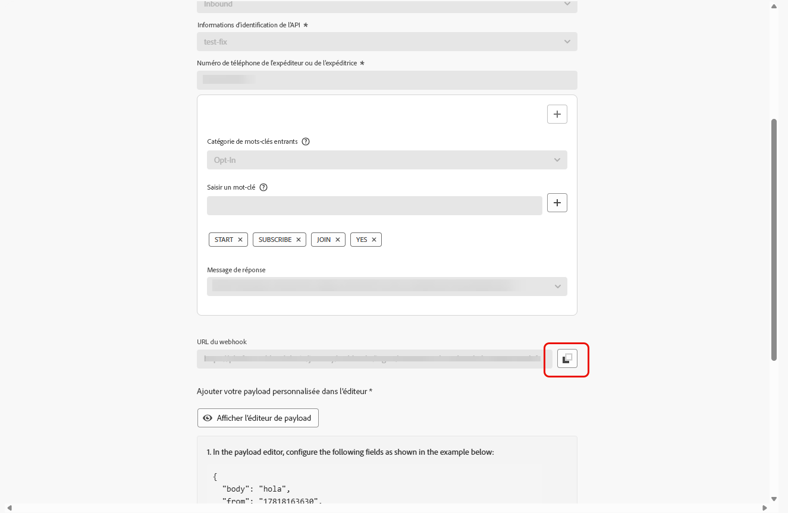

# Créer un webhook {#webhook}

>[!BEGINSHADEBOX]

Si les mots-clés relatifs à l’opt-in ou à l’opt-out ne sont pas fournis, des messages de consentement standard sont utilisés pour respecter la confidentialité des personnes. L’ajout de mots-clés personnalisés remplace automatiquement les valeurs par défaut.

**Mots-clés par défaut :**

* **Opt-in** : SUBSCRIBE (s’abonner), YES (oui), UNSTOP (redémarrer), START (démarrer), CONTINUE (continuer), RESUME (reprendre), BEGIN (commencer).
* **Opt-out** : STOP (arrêter), QUIT (quitter), CANCEL (annuler), END (terminer), UNSUBSCRIBE (se désabonner), NO (non).
* **Aide** : HELP (aide).

>[!ENDSHADEBOX]

Une fois vos informations d’identification d’API créées, vous pouvez configurer des webhooks pour capturer les réponses entrantes afin de gérer le consentement d’opt-in et d’opt-out, et pour recevoir des rapports de diffusion tels que des confirmations de lecture (le cas échéant).

Lors de la configuration d’un webhook, vous pouvez définir son objectif en fonction du type de données que vous souhaitez capturer :

* **[!UICONTROL Entrant]** : utilisez cette option si vous souhaitez capturer des réponses de consentement, telles que les opt-ins ou les opt-outs, et collecter les préférences utilisateur.

* **[!UICONTROL Commentaires]** : sélectionnez cette option pour effectuer le suivi des événements de diffusion et d’engagement, y compris les confirmations de lecture et les interactions utilisateur, afin de prendre en charge les rapports et analyses.

Parcourez les onglets ci-dessous en fonction de vos fournisseurs SMS :

>[!BEGINTABS]

>[!TAB Valeur personnalisée]

1. Dans le rail de gauche, accédez à **[!UICONTROL Administration]** `>` **[!UICONTROL Canaux]**, sélectionnez le menu **[!UICONTROL Webhooks SMS]** sous **[!UICONTROL Paramètres SMS]**, puis cliquez sur le bouton **[!UICONTROL Créer un webhook]**.

   {zoomable="yes"}

1. Configurez vos paramètres de webhook comme indiqué ci-dessous :

   * **[!UICONTROL Nom]** : saisissez un nom pour votre webhook.

   * **[!UICONTROL Sélectionner le fournisseur de SMS]** : personnalisé.

   * **[!UICONTROL Type]** : entrant.

   * **[!UICONTROL Informations d’identification d’API]** : choisissez dans la liste déroulante les [informations d’identification d’API configurées précédemment](sms-configuration-custom.md#api-credential).

   * **[!UICONTROL Numéro de téléphone d’expéditeur ou d’expéditrice]** : saisissez le numéro de téléphone d’expéditeur ou d’expéditrice que vous souhaitez utiliser pour vos communications.

     {zoomable="yes"}

1. Cliquez sur  pour ajouter vos catégories de mots-clés, puis configurez-les en fonction de votre fournisseur SMS :

   * **[!UICONTROL Catégorie de mots-clés entrants]** : sélectionnez vos catégories de mots-clés **[!UICONTROL Opt-in]**, **[!UICONTROL Opt-out]**, **[!UICONTROL Double Opt-in]**, **[!UICONTROL Aide]** ou **[!UICONTROL Personnalisé]**.

   * **[!UICONTROL Saisir un mot-clé]** : saisissez les mots-clés par défaut ou personnalisés qui déclencheront automatiquement votre message. Cliquez sur  pour ajouter plusieurs mots-clés.

     Pour **[!UICONTROL Mot-clé personnalisé]**, utilisez des mots-clés non liés au consentement pour les actions par lots dans un parcours.

   * **[!UICONTROL Message de réponse]** : sélectionnez dans la liste déroulante la réponse personnalisée qui sera automatiquement envoyée.

   * **[!UICONTROL Opt-out flou]** : activez cette option pour envoyer une réponse automatique lorsqu’un mot-clé d’opt-out proche de la correspondance est détecté.

   {zoomable="yes"}

1. Saisissez un **[!UICONTROL Message de réponse par défaut]** automatiquement envoyé lorsqu’un message entrant ne correspond à aucun mot-clé ou catégorie configuré.

1. Cliquez sur **[!UICONTROL Afficher l’éditeur de payload]** pour valider et personnaliser les payloads de votre requête.

   Vous pouvez personnaliser votre payload de manière dynamique à l’aide d’attributs de profil, et veiller à ce que des données précises sont envoyées pour le traitement et la génération de réponse à l’aide de fonctions d’assistance intégrées.

1. Cliquez sur **[!UICONTROL Envoyer]** lorsque vous avez terminé la configuration de votre webhook.

1. Pour créer un webhook **[!UICONTROL Commentaires]**, procédez comme ci-dessus, en sélectionnant **[!UICONTROL Commentaires]** comme webhook **[!UICONTROL Type]**.

1. Dans le menu **[!UICONTROL Webhooks]**, vous pouvez modifier ou supprimer des webhooks existants, ou accéder à l’**[!UICONTROL URL Webhook]** et la copier pour l’intégration à votre fournisseur SMS.

   {zoomable="yes"}

Après avoir créé et configuré les paramètres du Webhook, vous devez maintenant créer une [configuration des canaux](sms-configuration-surface.md) pour les SMS.

Une fois configurés, vous pouvez tirer parti de toutes les fonctionnalités d’origine des canaux, telles que la création de messages, la personnalisation, le suivi des liens et la création de rapports.

>[!TAB  Infobip ]

1. Dans le rail de gauche, accédez à **[!UICONTROL Administration]** `>` **[!UICONTROL Canaux]**, sélectionnez le menu **[!UICONTROL Webhooks SMS]** sous **[!UICONTROL Paramètres SMS]**, puis cliquez sur le bouton **[!UICONTROL Créer un webhook]**.

   {zoomable="yes"}

1. Configurez vos paramètres de webhook comme indiqué ci-dessous :

   * **[!UICONTROL Nom]** : saisissez un nom pour votre webhook.

   * **[!UICONTROL Sélectionnez le fournisseur de SMS]** : Infobip.

   * **[!UICONTROL Type]** : entrant.

   * **[!UICONTROL Informations d’identification d’API]** : choisissez dans la liste déroulante les [informations d’identification d’API configurées précédemment](sms-configuration-infobip.md#api-credential).

   * **[!UICONTROL Numéro de téléphone d’expéditeur ou d’expéditrice]** : saisissez le numéro de téléphone d’expéditeur ou d’expéditrice que vous souhaitez utiliser pour vos communications.

     {zoomable="yes"}

1. Cliquez sur  pour ajouter vos catégories de mots-clés, puis configurez-les en fonction de votre fournisseur SMS :

   * **[!UICONTROL Catégorie de mots-clés entrants]** : sélectionnez vos catégories de mots-clés **[!UICONTROL Opt-in]**, **[!UICONTROL Opt-out]**, **[!UICONTROL Double Opt-in]**, **[!UICONTROL Aide]** ou **[!UICONTROL Personnalisé]**.

   * **[!UICONTROL Saisir un mot-clé]** : saisissez les mots-clés par défaut ou personnalisés qui déclencheront automatiquement votre message. Cliquez sur  pour ajouter plusieurs mots-clés.

     Pour **[!UICONTROL Mot-clé personnalisé]**, utilisez des mots-clés non liés au consentement pour les actions par lots dans un parcours.

   * **[!UICONTROL Message de réponse]** : sélectionnez dans la liste déroulante la réponse personnalisée qui sera automatiquement envoyée.

   * **[!UICONTROL Opt-out flou]** : activez cette option pour envoyer une réponse automatique lorsqu’un mot-clé d’opt-out proche de la correspondance est détecté.

   {zoomable="yes"}

1. Saisissez un **[!UICONTROL Message de réponse par défaut]** automatiquement envoyé lorsqu’un message entrant ne correspond à aucun mot-clé ou catégorie configuré.

1. Cliquez sur **[!UICONTROL Envoyer]** lorsque vous avez terminé la configuration de votre webhook.

1. Pour créer un webhook **[!UICONTROL Commentaires]**, procédez comme ci-dessus, en sélectionnant **[!UICONTROL Commentaires]** comme webhook **[!UICONTROL Type]**.

1. Dans le menu **[!UICONTROL Webhooks]**, vous pouvez modifier ou supprimer des webhooks existants, ou accéder à l’**[!UICONTROL URL Webhook]** et la copier pour l’intégration à votre fournisseur SMS.

   {zoomable="yes"}

Après avoir créé et configuré les paramètres entrants pour le webhook, vous devez créer une [configuration des canaux](sms-configuration-surface.md) pour les messages SMS.

Une fois configurés, vous pouvez tirer parti de toutes les fonctionnalités d’origine des canaux, telles que la création de messages, la personnalisation, le suivi des liens et la création de rapports.

>[!TAB  Sinch ]

1. Dans le rail de gauche, accédez à **[!UICONTROL Administration]** `>` **[!UICONTROL Canaux]**, sélectionnez le menu **[!UICONTROL Webhooks SMS]** sous **[!UICONTROL Paramètres SMS]**, puis cliquez sur le bouton **[!UICONTROL Créer un webhook]**.

   {zoomable="yes"}

1. Configurez vos paramètres de webhook comme indiqué ci-dessous :

   * **[!UICONTROL Nom]** : saisissez un nom pour votre webhook.

   * **[!UICONTROL Sélectionnez le fournisseur de SMS]** : Sinch.

   * **[!UICONTROL Type]** : entrant.

   * **[!UICONTROL Informations d’identification d’API]** : choisissez dans la liste déroulante les [informations d’identification d’API configurées précédemment](sms-configuration-sinch.md#create-api).

   * **[!UICONTROL Numéro de téléphone d’expéditeur ou d’expéditrice]** : saisissez le numéro de téléphone d’expéditeur ou d’expéditrice que vous souhaitez utiliser pour vos communications.

     {zoomable="yes"}

1. Cliquez sur  pour ajouter vos catégories de mots-clés, puis configurez-les en fonction de votre fournisseur SMS :

   * **[!UICONTROL Catégorie de mots-clés entrants]** : sélectionnez vos catégories de mots-clés **[!UICONTROL Opt-in]**, **[!UICONTROL Opt-out]**, **[!UICONTROL Double Opt-in]**, **[!UICONTROL Aide]** ou **[!UICONTROL Personnalisé]**.

   * **[!UICONTROL Saisir un mot-clé]** : saisissez les mots-clés par défaut ou personnalisés qui déclencheront automatiquement votre message. Cliquez sur  pour ajouter plusieurs mots-clés.

     Pour **[!UICONTROL Mot-clé personnalisé]**, utilisez des mots-clés non liés au consentement pour les actions par lots dans un parcours.

   * **[!UICONTROL Message de réponse]** : sélectionnez dans la liste déroulante la réponse personnalisée qui sera automatiquement envoyée.

   * **[!UICONTROL Opt-out flou]** : activez cette option pour envoyer une réponse automatique lorsqu’un mot-clé d’opt-out proche de la correspondance est détecté.

   {zoomable="yes"}

1. Saisissez un **[!UICONTROL Message de réponse par défaut]** automatiquement envoyé lorsqu’un message entrant ne correspond à aucun mot-clé ou catégorie configuré.

1. Cliquez sur **[!UICONTROL Envoyer]** lorsque vous avez terminé la configuration de votre webhook.

1. Dans le menu **[!UICONTROL Webhooks]**, cliquez sur l’ pour supprimer votre webhook.

1. Pour modifier la configuration existante, recherchez le webhook souhaité et cliquez sur l’option **[!UICONTROL Modifier]** pour apporter les modifications nécessaires.

1. Accédez à la nouvelle **[!UICONTROL URL du webhook]** et copiez-la à partir du **[!UICONTROL webhook]** précédemment envoyé.

   {zoomable="yes"}

Après avoir créé et configuré les paramètres entrants pour le webhook, vous devez créer une [configuration des canaux](sms-configuration-surface.md) pour les messages SMS.

Une fois configurés, vous pouvez tirer parti de toutes les fonctionnalités d’origine des canaux, telles que la création de messages, la personnalisation, le suivi des liens et la création de rapports.

>[!TAB  Twilio ]

1. Dans le rail de gauche, accédez à **[!UICONTROL Administration]** `>` **[!UICONTROL Canaux]**, sélectionnez le menu **[!UICONTROL Webhooks SMS]** sous **[!UICONTROL Paramètres SMS]**, puis cliquez sur le bouton **[!UICONTROL Créer un webhook]**.

   {zoomable="yes"}

1. Configurez vos paramètres de webhook comme indiqué ci-dessous :

   * **[!UICONTROL Nom]** : saisissez un nom pour votre webhook.

   * **[!UICONTROL Sélectionnez le fournisseur de SMS]** : Twilio.

   * **[!UICONTROL Type]** : entrant.

   * **[!UICONTROL Informations d’identification d’API]** : choisissez dans la liste déroulante les [informations d’identification d’API configurées précédemment](sms-configuration-twilio.md#create-api).

   * **[!UICONTROL Numéro de téléphone d’expéditeur ou d’expéditrice]** : saisissez le numéro de téléphone d’expéditeur ou d’expéditrice que vous souhaitez utiliser pour vos communications.

1. Cliquez sur  pour ajouter vos catégories de mots-clés, puis configurez-les en fonction de votre fournisseur SMS :

   * **[!UICONTROL Catégorie de mots-clés entrants]** : sélectionnez vos catégories de mots-clés **[!UICONTROL Opt-in]**, **[!UICONTROL Opt-out]**, **[!UICONTROL Double Opt-in]**, **[!UICONTROL Aide]** ou **[!UICONTROL Personnalisé]**.

   * **[!UICONTROL Saisir un mot-clé]** : saisissez les mots-clés par défaut ou personnalisés qui déclencheront automatiquement votre message. Cliquez sur  pour ajouter plusieurs mots-clés.

     Pour **[!UICONTROL Mot-clé personnalisé]**, utilisez des mots-clés non liés au consentement pour les actions par lots dans un parcours.

   * **[!UICONTROL Message de réponse]** : sélectionnez dans la liste déroulante la réponse personnalisée qui sera automatiquement envoyée.

   * **[!UICONTROL Opt-out flou]** : activez cette option pour envoyer une réponse automatique lorsqu’un mot-clé d’opt-out proche de la correspondance est détecté.

1. Saisissez un **[!UICONTROL Message de réponse par défaut]** automatiquement envoyé lorsqu’un message entrant ne correspond à aucun mot-clé ou catégorie configuré.

1. Cliquez sur **[!UICONTROL Envoyer]** lorsque vous avez terminé la configuration de votre webhook.

1. Dans le menu **[!UICONTROL Webhooks]**, cliquez sur l’ pour supprimer votre webhook.

1. Pour modifier la configuration existante, recherchez le webhook souhaité et cliquez sur l’option **[!UICONTROL Modifier]** pour apporter les modifications nécessaires.

1. Accédez à la nouvelle **[!UICONTROL URL du webhook]** et copiez-la à partir du **[!UICONTROL webhook]** précédemment envoyé.

Après avoir créé et configuré les paramètres entrants pour le webhook, vous devez créer une [configuration des canaux](sms-configuration-surface.md) pour les messages SMS.

Une fois configurés, vous pouvez tirer parti de toutes les fonctionnalités d’origine des canaux, telles que la création de messages, la personnalisation, le suivi des liens et la création de rapports.

>[!ENDTABS]

## Vidéo pratique {#video}

>[!VIDEO](https://video.tv.adobe.com/v/3431625)

