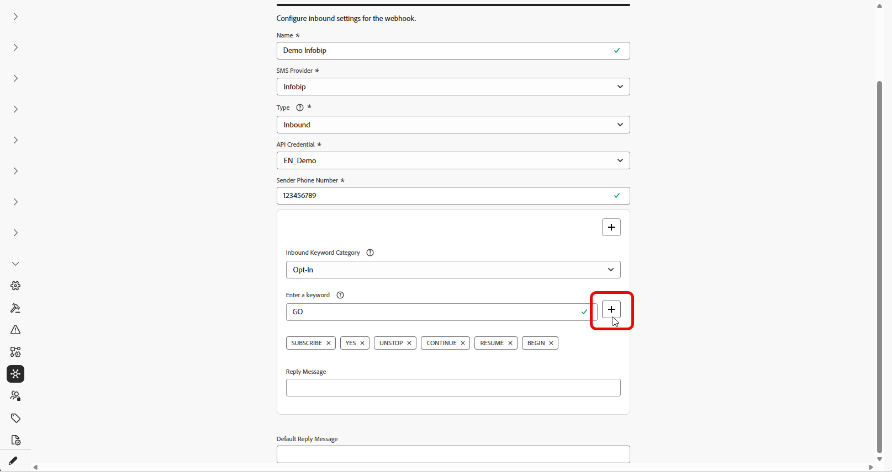

# Créer un webhook {#webhook}

>[!CONTEXTUALHELP]
>id="ajo_channels_sms_webhook_settings_create"
>title="Créer un Webhook SMS"
>abstract="Vous pouvez configurer des Webhooks pour capturer les réponses entrantes afin de gérer le consentement d’opt-in et d’opt-out, et pour recevoir des rapports de diffusion, y compris des accusés de réception de lecture, le cas échéant."

>[!CONTEXTUALHELP]
>id="ajo_admin_sms_webhook_flow_type"
>title="Choisissez votre type de Webhook"
>abstract="Lors de la configuration d’un webhook, choisissez **Entrant** pour capturer les réponses de consentement et les préférences utilisateur, ou **[!UICONTROL Commentaires]** pour effectuer le suivi des événements de diffusion et d’engagement pour la création de rapports et l’analyse."

>[!BEGINSHADEBOX]

Lorsque de nouvelles informations d’identification d’API sont créées dans Journey Optimizer, les webhooks SMS permettent désormais de capturer à la fois les mots-clés entrants et les événements de commentaires tels que les diffusions et les erreurs. Chaque fournisseur disposant de fonctionnalités différentes, il existe des instructions distinctes pour activer les Webhooks.
Les webhooks prenant désormais en charge les fournisseurs personnalisés, il est désormais possible de collecter les commentaires et la collecte de mots-clés entrants de la part de n’importe quel fournisseur pour les signaler et les traiter dans Journey Optimizer.

* **Nouveaux clients :** suivez les instructions ici pour configurer correctement les Webhooks SMS.

* **Clients existants :** vous pouvez migrer des informations stockées dans les informations d’identification de l’API vers des Webhooks et il n’existe aucun calendrier pour les clients de migrer. Pour les clients existants qui souhaitent migrer vers des Webhooks SMS, les étapes de migration doivent être effectuées comme indiqué dans le guide de migration.

>[!ENDSHADEBOX]

## Vue d’ensemble {#overview}

Une fois vos informations d’identification d’API créées, vous pouvez configurer des webhooks afin de capturer les réponses entrantes pour la gestion du consentement d’opt-in et d’opt-out, et de recevoir les rapports de diffusion, y compris les accusés de réception de lecture, le cas échéant.

Lors de la configuration d’un webhook, vous pouvez définir son objectif en fonction du type de données que vous souhaitez capturer :

* **Entrant** : utilisez cette option si vous souhaitez capturer des réponses de consentement, telles que les opt-ins ou les opt-outs, et collecter les préférences utilisateur.

* **Commentaires** : sélectionnez cette option pour effectuer le suivi des événements de diffusion et d’engagement, y compris les diffusions, les erreurs sortantes, les accusés de réception de lecture (le cas échéant) pour prendre en charge les rapports et analyses.

Selon votre fournisseur, les attentes quant à ce qui doit être configuré pour une implémentation SMS réussie seront différentes :

* **Sinch et Sinch Conversational** : créez un webhook qui gère les événements entrants et de retour. Aucune configuration de payload n’est requise.

* **Infobip** : créez deux webhooks distincts, l’un pour les événements entrants et l’autre pour les événements de commentaires. Aucune configuration de payload n’est requise pour les webhook.

* **Twilio** : les Webhooks ne sont pas disponibles. La collecte de données entrantes et de commentaires n’est pas prise en charge.

* **Fournisseur personnalisé** : créez deux webhooks distincts, l’un pour les événements entrants et l’autre pour les événements de commentaires. La configuration de la payload est requise pour que les deux Webhooks fonctionnent correctement.

### Assistance du fournisseur {#provider-support}

>[!NOTE]
>
>Le seul format webhook pris en charge est JSON. Les données de formulaire pour les Webhooks ne sont pas prises en charge.

Le tableau suivant indique les fournisseurs qui prennent en charge les webhooks de retour et entrants, et si la création d’une payload est requise :

| Prestataire | Webhook Entrant | Webhook de commentaires | Mots-clés | Création de payload nécessaire | Webhook nécessaire | Création de la payload |
| --- | --- | --- | --- | --- | --- | --- |
| Infobip | Configurable | Configurable | Configurable | Non requis | Obligatoire | Non requis |
| Sinch | Configurable | Configurable | Configurable | Non requis | Non. Intégré | S.O. |
| Conversationnel Sinch | Configurable | Configurable | Configurable | Non requis | Non. Intégré | S.O. |
| Twilio | Non disponible | Non disponible | Non disponible | Non disponible | Non disponible | S.O. |
| Valeur personnalisée | Configurable | Configurable | Configurable | Obligatoire | Obligatoire | Obligatoire |

Pour les clients qui passent des informations d’identification d’API aux webhooks SMS, des informations sur le chemin de migration sont disponibles dans le guide de migration.

## Créer un webhook

### Pour Sinch et Sinch Conversational {#create-webhook-sinch}

Pour Sinch et Sinch Conversational, créez un webhook unique qui gère les événements entrants et de retour. Aucune configuration de payload personnalisée n’est requise.

1. Dans le rail de gauche, accédez à **[!UICONTROL Administration]** `>` **[!UICONTROL Canaux]**, sélectionnez le menu **[!UICONTROL Webhooks SMS]** sous **[!UICONTROL Paramètres SMS]**, puis cliquez sur le bouton **[!UICONTROL Créer un webhook]**.

   

1. Configurez vos paramètres webhook, comme décrit ci-dessous :

   * **[!UICONTROL Nom]** : saisissez un nom pour votre webhook.

   * **[!UICONTROL Sélectionnez le fournisseur de SMS]** : Sinch ou Sinch Conversational.

   * **[!UICONTROL Informations d’identification d’API]** : choisissez dans la liste déroulante les [informations d’identification d’API configurées précédemment](sms-configuration-sinch.md).

   * **[!UICONTROL Numéro de téléphone de l’expéditeur]** : saisissez le numéro de téléphone de l’expéditeur que vous souhaitez utiliser pour vos communications.

   

1. Commencez à configurer les mots-clés entrants en saisissant des mots-clés dans le champ **[!UICONTROL Saisir un mot-clé]**. Plusieurs mots-clés peuvent être ajoutés et supprimés. Notez que les mots-clés ne respectent pas la casse.

   

1. Sélectionnez une catégorie de mots-clés dans le menu déroulant **[!UICONTROL Catégorie de mots-clés entrante]** pour configurer :

   * &#x200B;
     +++ Abonnement

      * Activez les mots-clés qui inscrivent des utilisateurs avec leur consentement. Lorsque le message d’un utilisateur correspond à un mot-clé configuré, son numéro de téléphone est accepté pour recevoir des SMS.

      * Par défaut, les mots-clés suivants sont activés : S’abonner, Oui, Reprendre, Continuer, Reprendre et Commencer. Supprimez tous les mots-clés par défaut en cliquant sur .

      * Utilisez le champ **[!UICONTROL Message de réponse]** pour créer un message automatiquement envoyé lorsque le message entrant d’un utilisateur correspond à un mot-clé d’accord préalable.

     +++

   * &#x200B;
     +++ Opt-Out

      * Activez les mots-clés qui désactivent les utilisateurs et suppriment le consentement pour envoyer des messages texte. Lorsque le message d’un utilisateur correspond à un mot-clé configuré, son numéro de téléphone est désinscrit de la réception des SMS.

      * Par défaut, les mots-clés suivants sont activés : Arrêter, Arrêter, Annuler, Terminer, Se désabonner, Non. Supprimez tous les mots-clés par défaut en cliquant sur .

      * Utilisez le champ **[!UICONTROL Message de réponse]** pour créer un message qui est automatiquement envoyé lorsque le message entrant d’un utilisateur correspond à un mot-clé d’opt-out.

      * Activez **[!UICONTROL Logique floue]** pour détecter des mots-clés similaires aux mots-clés d’exclusion configurés. Si la réponse d’un utilisateur est proche mais non exacte, le message saisi dans le champ **[!UICONTROL Réponse automatique floue]** est envoyé. En règle générale, ce message indique que le processus d’opt-out n’a pas eu lieu et indique le mot-clé exact nécessaire pour se désabonner.

     +++

   * &#x200B;
     +++ Double Opt-In

      * Activez les mots-clés pour l’exigence de double opt-in. Lorsque le message d’un utilisateur correspond à un mot-clé configuré, il n’est pas entièrement opt-in à ce stade. Ce workflow de consentement en deux étapes nécessite que les utilisateurs confirment leur opt-in par un deuxième mot-clé.

      * Utilisez le champ **[!UICONTROL Message de réponse]** pour créer un message qui est automatiquement envoyé lorsqu’un mot-clé de double opt-in est recherché. Ce message demande à l’utilisateur de saisir un mot-clé d’accord préalable pour terminer le processus d’accord préalable.

   +++

   * &#x200B;
     +++ Aide

      * Activez les mots-clés qui fournissent une réponse standard lorsque de l’aide est demandée. Lorsque le message d’un utilisateur correspond à un mot-clé configuré, il reçoit le message de réponse d’aide.

      * Par défaut, les mots-clés suivants sont activés : Aide, Infos, Informations. Supprimez tous les mots-clés par défaut en cliquant sur .

      * Utilisez le champ **[!UICONTROL Message de réponse]** pour créer un message qui est automatiquement envoyé lorsque le message entrant d’un utilisateur correspond à un mot-clé d’aide.

     +++

   * &#x200B;
     +++ Valeur personnalisée

      * Configurez un seul mot-clé personnalisé. Lorsque le message d’un utilisateur ou d’une utilisatrice correspond à ce mot-clé, celui-ci est écrit dans le jeu de données **[!UICONTROL Suivi des commentaires sur les messages]** pour la création de rapports et d’audiences.

      * Créez une audience (par flux ou par lots) qui fait référence à ce mot-clé à utiliser dans vos parcours et campagnes.

     +++

1. Saisissez un **[!UICONTROL Message de réponse par défaut]**. Ce message est automatiquement envoyé lorsque la réponse d’un utilisateur ne correspond à aucun mot-clé configuré.

   

1. Cliquez sur **[!UICONTROL Envoyer]** pour enregistrer la configuration du webhook.

1. Dans le menu **[!UICONTROL Webhooks]**, vous pouvez modifier ou supprimer des webhooks existants.

1. Accédez au Webhook que vous venez de créer et copiez l’**[!UICONTROL URL du Webhook]**.

   

1. Utilisez votre **[!UICONTROL URL Webhook]** pour activer les événements **Feedback** et **Inbound** dans Journey Optimizer.

   * Pour le canal SMS , [en savoir plus dans la documentation Sinch](https://community.sinch.com/t5/SMS/How-do-I-assign-a-callback-URL-to-an-SMS-service/ta-p/8414)

   * Pour le canal MMS, [en savoir plus dans la documentation Sinch](https://developers.sinch.com/docs/conversation/getting-started#5-handle-incoming-messages)

   * Pour les clients qui ont acheté des SMS directement via Journey Optimizer, enregistrez un ticket d’assistance auprès de l’assistance Adobe. L’équipe du compte Adobe configurera l’URL du webhook pour vous.
     

Si votre webhook utilise des informations d’identification d’API associées à une configuration de canal existante, le webhook prend immédiatement effet. Sinon, créez une configuration de canal.

➡️[En savoir plus sur la configuration des canaux](sms-configuration-surface.md)

### Pour Infobip {#create-webhook-infobip}

Pour Infobip, créez deux webhooks distincts : l’un pour les événements de commentaires et l’autre pour les événements entrants.

1. Dans le rail de gauche, accédez à **[!UICONTROL Administration]** `>` **[!UICONTROL Canaux]**, sélectionnez le menu **[!UICONTROL Webhooks SMS]** sous **[!UICONTROL Paramètres SMS]**, puis cliquez sur le bouton **[!UICONTROL Créer un webhook]**.

   

1. Configurez vos paramètres webhook, comme décrit ci-dessous :

   * **[!UICONTROL Nom]** : saisissez un nom pour votre webhook.

   * **[!UICONTROL Sélectionnez le fournisseur de SMS]** : Infobip.

   * **[!UICONTROL Type]** : sélectionnez Commentaires ou Entrant. Vous devez créer les deux séparément. Ici, nous commençons par Inbound.

   * **[!UICONTROL Informations d’identification d’API]** : choisissez dans la liste déroulante les [informations d’identification d’API configurées précédemment](sms-configuration-infobip.md#api-credential).

   * **[!UICONTROL Numéro de téléphone de l’expéditeur]** : saisissez le numéro de téléphone de l’expéditeur que vous souhaitez utiliser pour vos communications.

   

1. Commencez à configurer les mots-clés entrants en saisissant des mots-clés dans le champ **[!UICONTROL Saisir un mot-clé]**. Plusieurs mots-clés peuvent être ajoutés et supprimés. Notez que les mots-clés ne respectent pas la casse.

   

1. Sélectionnez une catégorie de mots-clés dans le menu déroulant **[!UICONTROL Catégorie de mots-clés entrante]** pour configurer :

   * &#x200B;
     +++ Abonnement

      * Activez les mots-clés qui inscrivent des utilisateurs avec leur consentement. Lorsque le message d’un utilisateur correspond à un mot-clé configuré, son numéro de téléphone est accepté pour recevoir des SMS.

      * Par défaut, les mots-clés suivants sont activés : S’abonner, Oui, Reprendre, Continuer, Reprendre et Commencer. Supprimez tous les mots-clés par défaut en cliquant sur .

      * Utilisez le champ **[!UICONTROL Message de réponse]** pour créer un message automatiquement envoyé lorsque le message entrant d’un utilisateur correspond à un mot-clé d’accord préalable.

     +++

   * &#x200B;
     +++ Opt-Out

      * Activez les mots-clés qui désactivent les utilisateurs et suppriment le consentement pour envoyer des messages texte. Lorsque le message d’un utilisateur correspond à un mot-clé configuré, son numéro de téléphone est désinscrit de la réception des SMS.

      * Par défaut, les mots-clés suivants sont activés : Arrêter, Arrêter, Annuler, Terminer, Se désabonner, Non. Supprimez tous les mots-clés par défaut en cliquant sur .

      * Utilisez le champ **[!UICONTROL Message de réponse]** pour créer un message qui est automatiquement envoyé lorsque le message entrant d’un utilisateur correspond à un mot-clé d’opt-out.

      * Activez **[!UICONTROL Logique floue]** pour détecter des mots-clés similaires aux mots-clés d’exclusion configurés. Si la réponse d’un utilisateur est proche mais non exacte, le message saisi dans le champ **[!UICONTROL Réponse automatique floue]** est envoyé. En règle générale, ce message indique que le processus d’opt-out n’a pas eu lieu et indique le mot-clé exact nécessaire pour se désabonner.

     +++

   * &#x200B;
     +++ Double Opt-In

      * Activez les mots-clés pour l’exigence de double opt-in. Lorsque le message d’un utilisateur correspond à un mot-clé configuré, il n’est pas entièrement opt-in à ce stade. Ce workflow de consentement en deux étapes nécessite que les utilisateurs confirment leur opt-in par un deuxième mot-clé.

      * Utilisez le champ **[!UICONTROL Message de réponse]** pour créer un message qui est automatiquement envoyé lorsqu’un mot-clé de double opt-in est recherché. Ce message demande à l’utilisateur de saisir un mot-clé d’accord préalable pour terminer le processus d’accord préalable.

     +++

   * &#x200B;
     +++ Aide

      * Activez les mots-clés qui fournissent une réponse standard lorsque de l’aide est demandée. Lorsque le message d’un utilisateur correspond à un mot-clé configuré, il reçoit le message de réponse d’aide.

      * Par défaut, les mots-clés suivants sont activés : Aide, Infos, Informations. Supprimez tous les mots-clés par défaut en cliquant sur .

      * Utilisez le champ **[!UICONTROL Message de réponse]** pour créer un message qui est automatiquement envoyé lorsque le message entrant d’un utilisateur correspond à un mot-clé d’aide.

     +++

   * &#x200B;
     +++ Valeur personnalisée

      * Configurez un seul mot-clé personnalisé. Lorsque le message d’un utilisateur ou d’une utilisatrice correspond à ce mot-clé, celui-ci est écrit dans le jeu de données **[!UICONTROL Suivi des commentaires sur les messages]** pour la création de rapports et d’audiences.

      * Créez une audience (par flux ou par lots) qui fait référence à ce mot-clé à utiliser dans vos parcours et campagnes.

     +++

1. Saisissez un **[!UICONTROL Message de réponse par défaut]**. Ce message est automatiquement envoyé lorsque la réponse d’un utilisateur ne correspond à aucun mot-clé configuré.

   

1. Cliquez sur **[!UICONTROL Envoyer]** pour enregistrer la configuration du webhook.

1. Dans le menu **[!UICONTROL Webhooks]**, vous devez maintenant créer un webhook **Feedback** pour Infobip.

1. Configurez vos paramètres webhook, comme décrit ci-dessous :

   * **[!UICONTROL Nom]** : saisissez un nom pour votre webhook.

   * **[!UICONTROL Sélectionnez le fournisseur de SMS]** : Infobip.

   * **[!UICONTROL Type]** : sélectionnez Commentaires.

   

1. Cliquez sur **[!UICONTROL Envoyer]** pour enregistrer la configuration du Webhook de commentaires.

1. Dans le menu **[!UICONTROL Webhooks]**, vous pouvez modifier ou supprimer des webhooks existants.

1. Accédez à vos Webhooks nouvellement créés et copiez l’**[!UICONTROL URL du Webhook]** à partir de chacun de vos Webhooks.

   

1. Vous pouvez désormais utiliser ces URL pour activer les deux URL de rappel afin d’importer des commentaires et des événements entrants dans Journey Optimizer.

Si votre webhook utilise des informations d’identification d’API associées à une configuration de canal existante, le webhook prend immédiatement effet. Sinon, créez une configuration de canal.

➡️[En savoir plus sur la configuration des canaux](sms-configuration-surface.md)

### Pour le fournisseur personnalisé {#create-webhook-custom}

Pour les fournisseurs de SMS personnalisés, créez deux webhooks distincts : l’un pour les événements de commentaires et l’autre pour les événements entrants.

1. Dans le rail de gauche, accédez à **[!UICONTROL Administration]** `>` **[!UICONTROL Canaux]**, sélectionnez le menu **[!UICONTROL Webhooks SMS]** sous **[!UICONTROL Paramètres SMS]**, puis cliquez sur le bouton **[!UICONTROL Créer un webhook]**.

   

1. Configurez vos paramètres webhook, comme décrit ci-dessous :

   * **[!UICONTROL Nom]** : saisissez un nom pour votre webhook.

   * **[!UICONTROL Sélectionner le fournisseur de SMS]** : personnalisé.

   * **[!UICONTROL Type]** : sélectionnez Commentaires ou Entrant. Vous devez créer les deux séparément. Ici, nous commençons par Inbound.

   * **[!UICONTROL Informations d’identification d’API]** : choisissez dans la liste déroulante les [informations d’identification d’API configurées précédemment](sms-configuration-custom.md).

   * **[!UICONTROL Numéro de téléphone de l’expéditeur]** : saisissez le numéro de téléphone de l’expéditeur que vous souhaitez utiliser pour vos communications.

   

1. Commencez à configurer les mots-clés entrants en saisissant des mots-clés dans le champ **[!UICONTROL Saisir un mot-clé]**. Plusieurs mots-clés peuvent être ajoutés et supprimés. Notez que les mots-clés ne respectent pas la casse.

   

1. Sélectionnez une catégorie de mots-clés dans le menu déroulant **[!UICONTROL Catégorie de mots-clés entrante]** pour configurer :

   * &#x200B;
     +++ Abonnement

      * Activez les mots-clés qui inscrivent des utilisateurs avec leur consentement. Lorsque le message d’un utilisateur correspond à un mot-clé configuré, son numéro de téléphone est accepté pour recevoir des SMS.

      * Par défaut, les mots-clés suivants sont activés : S’abonner, Oui, Reprendre, Continuer, Reprendre et Commencer. Supprimez tous les mots-clés par défaut en cliquant sur .

      * Utilisez le champ **[!UICONTROL Message de réponse]** pour créer un message automatiquement envoyé lorsque le message entrant d’un utilisateur correspond à un mot-clé d’accord préalable.

     +++

   * &#x200B;
     +++ Opt-Out

      * Activez les mots-clés qui désactivent les utilisateurs et suppriment le consentement pour envoyer des messages texte. Lorsque le message d’un utilisateur correspond à un mot-clé configuré, son numéro de téléphone est désinscrit de la réception des SMS.

      * Par défaut, les mots-clés suivants sont activés : Arrêter, Arrêter, Annuler, Terminer, Se désabonner, Non. Supprimez tous les mots-clés par défaut en cliquant sur .

      * Utilisez le champ **[!UICONTROL Message de réponse]** pour créer un message qui est automatiquement envoyé lorsque le message entrant d’un utilisateur correspond à un mot-clé d’opt-out.

      * Activez **[!UICONTROL Logique floue]** pour détecter des mots-clés similaires aux mots-clés d’exclusion configurés. Si la réponse d’un utilisateur est proche mais non exacte, le message saisi dans le champ **[!UICONTROL Réponse automatique floue]** est envoyé. En règle générale, ce message indique que le processus d’opt-out n’a pas eu lieu et indique le mot-clé exact nécessaire pour se désabonner.

     +++

   * &#x200B;
     +++ Double Opt-In

      * Activez les mots-clés pour l’exigence de double opt-in. Lorsque le message d’un utilisateur correspond à un mot-clé configuré, il n’est pas entièrement opt-in à ce stade. Ce workflow de consentement en deux étapes nécessite que les utilisateurs confirment leur opt-in par un deuxième mot-clé.

      * Utilisez le champ **[!UICONTROL Message de réponse]** pour créer un message qui est automatiquement envoyé lorsqu’un mot-clé de double opt-in est recherché. Ce message demande à l’utilisateur de saisir un mot-clé d’accord préalable pour terminer le processus d’accord préalable.

     +++

   * &#x200B;
     +++ Aide

      * Activez les mots-clés qui fournissent une réponse standard lorsque de l’aide est demandée. Lorsque le message d’un utilisateur correspond à un mot-clé configuré, il reçoit le message de réponse d’aide.

      * Par défaut, les mots-clés suivants sont activés : Aide, Infos, Informations. Supprimez tous les mots-clés par défaut en cliquant sur .

      * Utilisez le champ **[!UICONTROL Message de réponse]** pour créer un message qui est automatiquement envoyé lorsque le message entrant d’un utilisateur correspond à un mot-clé d’aide.

     +++

   * &#x200B;
     +++ Valeur personnalisée

      * Configurez un seul mot-clé personnalisé. Lorsque le message d’un utilisateur ou d’une utilisatrice correspond à ce mot-clé, celui-ci est écrit dans le jeu de données **[!UICONTROL Suivi des commentaires sur les messages]** pour la création de rapports et d’audiences.

      * Créez une audience (par flux ou par lots) qui fait référence à ce mot-clé à utiliser dans vos parcours et campagnes.

     +++

1. Saisissez un **[!UICONTROL Message de réponse par défaut]**. Ce message est automatiquement envoyé lorsque la réponse d’un utilisateur ne correspond à aucun mot-clé configuré.

   

1. Créez une payload personnalisée correspondant au fichier JSON provenant du fournisseur. Notez que le seul format webhook pris en charge est JSON. Les données de formulaire pour les Webhooks ne sont pas prises en charge.

   Le webhook entrant nécessite les champs suivants pour recevoir des valeurs du webhook de votre fournisseur :

   * **InboundMessage** : message entrant ou mot-clé reçu de l’utilisateur.
   * **ProfileNumber** : numéro de téléphone de l’utilisateur qui a envoyé le message.
   * **RequestID** : identifiant unique fourni par votre fournisseur SMS pour identifier une transaction spécifique.
   * **OriginTimestamp** : la date et l’heure de réception du message, au format UTC.
   * **InboundNumber** : numéro de téléphone utilisé pour cette configuration de webhook.

   +++Exemple de payload

        « json 
       &lbrace;
       « inboundMessage »: « {{inboundMessage}} »,
       « profileNumber »: « {{profileNumber}} »,
       « requestId »: « {{requestId}} »,
       « originTimestamp » : « {{originTimestamp}} »,
       « inboundNumber »: « {{inboundNumber}} »
       &rbrace;
       « 
   +++

1. Une fois votre fichier JSON créé, cliquez sur **[!UICONTROL Afficher l’éditeur de payload]**, puis copiez et collez votre payload JSON dans l’éditeur et enregistrez-la.

   

1. Cliquez sur **[!UICONTROL Envoyer]** pour enregistrer la configuration du webhook.

1. Dans le menu **[!UICONTROL Webhooks]**, vous devez maintenant créer un webhook **Feedback** pour le fournisseur personnalisé.

1. Configurez vos paramètres webhook, comme décrit ci-dessous :

   * **[!UICONTROL Nom]** : saisissez un nom pour votre webhook.

   * **[!UICONTROL Sélectionner le fournisseur de SMS]** : personnalisé.

   * **[!UICONTROL Type]** : sélectionnez Commentaires.

   

1. Créez une payload personnalisée correspondant au format JSON de votre fournisseur. Notez que le seul format webhook pris en charge est JSON. Les données de formulaire pour les Webhooks ne sont pas prises en charge.

   Le webhook de commentaires nécessite les champs suivants pour recevoir les valeurs du webhook de votre fournisseur :

   * **Référence client** : identifiant unique renvoyé dans la payload à des fins de journalisation.
   * **Code** : code d’échec fourni par votre fournisseur SMS.
   * **Statut** : le statut d’échec fourni par votre fournisseur SMS.

   +++Exemple de payload

        « json 
       &lbrace;
       « clientReference »: « {{client_reference}} »,
        « status » : &lbrack;
       &lbrace;
       « code »: « {{failureCode}} »,
       « status »: « {{feedbackStatus}} »
       &rbrace;
       &rbrack;
       &rbrace;
       « 
   
   +++

1. Cliquez sur **[!UICONTROL Afficher l’éditeur de payload]**, puis copiez et collez votre payload JSON dans l’éditeur et enregistrez-la.

   

1. Cliquez sur **[!UICONTROL Envoyer]** pour enregistrer la configuration du Webhook de commentaires.

1. Dans le menu **[!UICONTROL Webhooks]**, vous pouvez modifier ou supprimer des webhooks existants.

1. Accédez à vos Webhooks nouvellement créés et copiez l’**[!UICONTROL URL du Webhook]** à partir de chacun de vos Webhooks.

1. Configurez votre fournisseur de SMS pour envoyer des événements **Commentaires** et **Entrant** à ces URL webhook dans Journey Optimizer.

   Les instructions de configuration varient selon le fournisseur SMS. Consultez la documentation de votre fournisseur pour plus d’informations sur la configuration des URL de rappel.

Si votre webhook utilise des informations d’identification d’API associées à une configuration de canal existante, le webhook prend immédiatement effet. Sinon, créez une configuration de canal.

➡️[En savoir plus sur la configuration des canaux](sms-configuration-surface.md)
