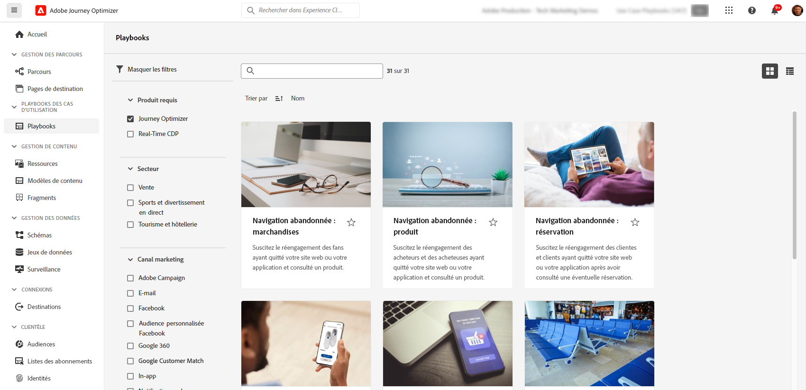

# Fonctionnalités intelligentes et d’IA {#ai-features}

Adobe Journey Optimizer exploite la puissance de l’intelligence artificielle et du machine learning pour vous aider à créer, optimiser et offrir des expériences client exceptionnelles. De la génération de contenu personnalisé à la prévision d’heures d’envoi optimales, les fonctionnalités d’IA rationalisent votre workflow et maximisent l’impact. Les playbooks de cas d’utilisation fournissent des modèles préconfigurés pour mettre en œuvre rapidement des scénarios marketing courants.

## Assistant IA {#ai-assistant}

AI Assistant est votre guide conversationnel de Adobe Journey Optimizer. Utilisez-le pour obtenir des réponses instantanées sur les fonctionnalités des produits, des informations opérationnelles sur vos parcours et une aide à la navigation sur la plateforme.

### Accéder à l’assistant IA

Cliquez sur l’icône de l’assistant AI dans la barre supérieure pour ouvrir le panneau de l’assistant sur le côté droit de l’écran.

>[!IMPORTANT]
>
>Vous devez accepter les [instructions d’utilisation de l’IA générative de Adobe Experience Cloud](https://experienceleague.adobe.com/fr/docs/experience-platform/ai-assistant/home){target="_blank"} avant d’utiliser l’assistant AI.

### Ce que peut faire l’assistant d’IA

**Connaissance du produit** - Posez des questions sur les fonctionnalités et les concepts de Adobe Journey Optimizer :

* « Comment configurer une campagne dans Adobe Journey Optimizer ? »
* « Comment créer une action personnalisée à utiliser dans parcours ? »
* « Combien d’activités en direct puis-je avoir dans un sandbox ? »

**Informations opérationnelles (Beta)** Obtenez des informations en temps réel sur vos parcours :

* « Combien de parcours en direct ai-je ? »
* « Me donner la liste de tous les parcours planifiés »
* « Combien de parcours ont été créés au cours des 7 derniers jours ? »

>[!NOTE]
>
>Actuellement, les informations opérationnelles ne sont disponibles que pour **Parcours** et reflètent les données de votre sandbox actuel.

### Utilisation de l’assistant AI

1. Saisissez votre question dans le champ de texte en bas du panneau
2. Appuyez sur Entrée pour envoyer votre requête.
3. Examiner la réponse générée par l’IA
4. Cliquez sur **Afficher les sources** pour accéder à la documentation associée
5. Utiliser les pouces vers le haut/bas pour évaluer la qualité de la réponse

{width="40%" align="left"}

[En savoir plus sur l’assistant AI dans Experience Platform](https://experienceleague.adobe.com/fr/docs/experience-platform/ai-assistant/home){target="_blank"}

## Agents AI avancés pour l’optimisation des Parcours {#ai-agents}

En s’appuyant sur les capacités de conversation de l’assistant d’IA, Adobe Journey Optimizer propose des agents d’IA spécialisés qui fournissent une analyse approfondie et des recommandations exploitables pour l’optimisation et l’expérimentation des parcours.

### Agent d’analyse de parcours {#journey-agent}

L&#39;agent d&#39;analyse de Parcours [&#128279;](https://experienceleague.adobe.com/fr/docs/experience-cloud-ai/experience-cloud-ai/agents/ajo-agent-analyze){target="_blank"} vous aide à optimiser les performances du parcours grâce à l&#39;analyse du langage naturel :

+++**Fonctionnalités clés**

* **Analyse des abandons de Parcours** - Identifiez où et pourquoi les clients abandonnent lors des parcours, détectez les schémas de désengagement
* **Détection de chevauchement des audiences** - Analysez le chevauchement des audiences sur plusieurs parcours pour éviter la fatigue due au surciblage.
* **Détection des conflits de planification** - Identifiez les conflits de synchronisation entre les parcours planifiés ciblant la même audience
* **Informations opérationnelles** - Obtenez des informations basées sur des invites telles que « Afficher tous les parcours en direct » ou « Quelles audiences sont utilisées dans plus de X parcours »

+++

+++**Exemples d’invites**

* « Effectuer une analyse des abandons pour le parcours \[Nom du Parcours\] »
* « Existe-t-il des conflits de planification pour le parcours \[Nom du Parcours\] ? »
* « Afficher les conflits de chevauchement d’audience pour le parcours \[Nom du Parcours\] »
* « Quelles audiences sont utilisées dans plus de 5 parcours ? »

+++

+++**Autorisations requises**

* **Afficher les Parcours** - Affichez des informations sur les parcours directement dans l’assistant AI
* **Gérer les Parcours** - Créez des parcours directement dans l’assistant AI
* **Afficher les segments** - Obtenez des informations sur les audiences
* **Gérer les segments** - Créez de nouvelles audiences directement dans l’assistant AI

+++

### Agent d’expérimentation {#experimentation-agent}

Le [agent d’expérimentation](https://experienceleague.adobe.com/fr/docs/experience-cloud-ai/experience-cloud-ai/agents/agent-experiment){target="_blank"} modernise la manière dont vous exécutez et gérez les expériences numériques sur les sites web, les e-mails, les messages push et les applications :

+++**Fonctionnalités clés**

* **Analyse des performances** - Affichage clair de ce qui s’est passé dans les expériences
* **Génération d’informations** - Explication des raisons des résultats
* **Découverte d’opportunités** - Conseils sur les prochaines actions à entreprendre
* **Analyse de contenu** - Examinez les éléments de message pour comprendre pourquoi certains traitements ont surpassé les autres
* **génération de recommandations** - Suggérer de nouveaux traitements ou ajustements en fonction des informations obtenues.

+++

+++**Exemples d’invites**

* « Quelles expériences sont en cours d’exécution pour \[Nom de la campagne\] ? »
* « Pour mon \[Nom de l’expérience\], quel traitement mène-t-il ? »
* « Qu’avons-nous appris de \[Nom de l’expérience\] ? »
* « Que me recommandez-vous de faire ensuite après cette expérience ? »
* « Quels sont les schémas communs qui ressortent des tests récents ? »

+++

+++**Autorisations requises**

* **Afficher les expériences** - Affichez des informations sur les expériences dans l’assistant AI
* **Gérer les métadonnées d’expérience** - Créer de nouvelles expériences dans l’assistant IA

**Remarque :** disponible avec la licence Journey Optimizer Experimentation Accelerator.

+++

### Agents IA supplémentaires

**Audience Agent** - Pour l’exploration et la gestion des audiences conversationnelles dans Adobe Experience Platform, y compris la détection des doublons et le suivi de la taille. [En savoir plus sur Audience Agent](https://experienceleague.adobe.com/fr/docs/experience-cloud-ai/experience-cloud-ai/agents/audience){target="_blank"}

**Agent Orchestrator** - Coordonne plusieurs agents spécialisés pour résoudre des défis marketing complexes et en plusieurs étapes. L&#39;orchestrateur détermine automatiquement les agents à impliquer et organise leur travail efficacement. [En savoir plus sur Agent Orchestrator](https://experienceleague.adobe.com/fr/docs/experience-cloud-ai/experience-cloud-ai/agents/agent-orchestrator){target="_blank"}

## Génération de contenu optimisée par l’IA {#content-generation}

Utilisez l’IA générative pour créer et personnaliser du contenu sur plusieurs canaux, ce qui accélère votre processus de création de contenu tout en préservant la cohérence de la marque. L’assistant AI pour la génération de contenu est disponible pour les expériences [e-mail](../email/get-started-email.md), [notifications push](../push/get-started-push.md), [SMS](../sms/get-started-sms.md) et [web](../web/get-started-web.md). Il vous permet de générer des lignes d’objet, du corps de texte, des images et de compléter des variations de message.

### Fonctionnalités clés

* **Génération de texte** - Créez une copie attrayante basée sur la voix et les objectifs de votre marque. [&#x200B; Générer du texte avec l’IA &#x200B;](../content-management/generative-text.md)
* **Génération d’images** - Générez des images personnalisées à l’aide d’Adobe Firefly. [Générer des images avec l’IA](../content-management/generative-image.md)
* **Variations de contenu** - Produisez plusieurs variations pour les tests A/B. [&#x200B; Expérience de contenu avec l’IA &#x200B;](../content-management/generative-experimentation.md)
* **Alignement des marques** - Assurez-vous que le contenu généré correspond à vos directives de marque. [Évaluation de l’alignement de la marque](../content-management/brands-score.md)
* **Prise en charge des modèles** - Tirez parti de vos modèles d’e-mail existants. [Utiliser des modèles de contenu](../content-management/content-templates.md)

### Bonnes pratiques

* **Soyez précis** - Fournissez des invites claires et détaillées pour de meilleurs résultats.
* **Chargement de ressources de marque** - Utilisez des fichiers PDF, des images ou des fichiers ZIP (50 Mo max.) pour maintenir la cohérence de la marque
* **Utiliser des modèles personnalisés** - Utilisez des modèles spécifiques à la marque avec jusqu’à 8 à 10 images.
* **Fournir du feeback** - Évaluer les sorties pour aider à améliorer les modèles d&#39;IA
* **Consulter tout le contenu** - Vérifiez toujours la précision du contenu généré par l’IA avant de le publier

[En savoir plus sur la génération de contenu par IA](../content-management/gs-generative.md)

## Optimisation de l’heure d’envoi {#send-time-optimization}

Utilisez l’IA pour prédire l’heure optimale d’envoi de chaque message en fonction des modèles de comportement individuels des clients, ce qui optimise l’engagement.

### Fonctionnement

L’optimisation de l’heure d’envoi analyse les données d’engagement historiques (ouvertures et clics) afin de prédire à quel moment chaque client est le plus susceptible d’interagir avec vos messages. Le système planifie automatiquement la livraison dans la fenêtre temporelle spécifiée.

### Quand l’utiliser

| Idéal pour | Non Recommandé Pour |
|----------|---------------------|
| Campagnes marketing et newsletters | Messages opérationnels sensibles au temps (confirmations de commande, réinitialisations de mot de passe) |
| Messages promotionnels | Notifications urgentes (retards de vol, alertes d&#39;urgence) |
| Contenu éducatif | Messages basés sur un événement avec des exigences de minutage spécifiques |
| Campagnes d’engagement | |

[En savoir plus sur l’optimisation de l’heure d’envoi](../building-journeys/send-time-optimization.md)

## Modèles d’IA pour la prise de décision {#ai-decisioning}

Créez des modèles de classement intelligents qui optimisent automatiquement les offres à présenter à chaque client, maximisant ainsi les objectifs commerciaux.

### Types de modèles

**Optimisation automatique** - Tire les leçons des interactions des clients pour améliorer automatiquement les performances des offres au fil du temps

**Optimisation personnalisée** - Utilise les attributs de profil client et le comportement pour prédire la meilleure offre pour chaque individu

### Conditions requises

* Au moins 2 offres avec des données d’interaction suffisantes :
   * Plus de 100 événements d’affichage
   * &#x200B;+ de 5 clics sur les événements
   * Au cours des 14 derniers jours
* Maximum de 5 modèles de classement IA par organisation

[En savoir plus sur les modèles d’IA pour la prise de décision](../experience-decisioning/ranking/ai-models.md) | [Créer des modèles de classement IA](../experience-decisioning/ranking/create-ai-models.md)

## Contenu : expérimentation avec l’IA {#experimentation}

**Accélérateur d’expériences** vous permet d’exécuter des expériences plus rapidement avec des informations et des recommandations pilotées par l’IA, en identifiant plus rapidement les variations de contenu gagnantes.

Fonctionnalités clés :

* Génération automatique de plusieurs variations de contenu
* Recevoir des recommandations de l’IA pour la conception d’expériences
* Obtention des premiers indicateurs des tendances de performances
* Accélérer le délai d’obtention de la signification statistique

[En savoir plus sur l’accélérateur d’expériences](../content-management/experiment-accelerator-gs.md)

## Playbooks de cas d’utilisation {#playbooks}

Les playbooks de cas d’utilisation sont des workflows préconfigurés qui vous permettent d’implémenter rapidement des scénarios marketing courants. Chaque playbook comprend des parcours prêts à l’emploi, des messages, des schémas et des segments.

### Fonctionnement des playbooks

1. **Parcourez** la bibliothèque de playbooks pour trouver des cas d’utilisation correspondant à vos objectifs
2. **Activer** un playbook pour générer automatiquement toutes les ressources requises
3. **Personnaliser** les ressources générées pour répondre à votre marque et à vos besoins
4. **Déployer** en production ou tester dans un sandbox de développement

### Playbooks disponibles

Parcourez les playbooks Journey Optimizer pour obtenir des scénarios courants tels que :

* Récupération de panier abandonné
* Série de bienvenue pour les nouveaux clients
* Engagement après achat
* Messages d’anniversaire
* Campagnes de réengagement

+++**Conditions préalables**

* Sandbox avec les autorisations appropriées
* Configurations de canal pour les e-mails, les notifications push et/ou les SMS
* Autorisations utilisateur pour la création de parcours et de messages

+++

[Afficher tous les playbooks disponibles](https://experienceleague.adobe.com/docs/experience-platform/use-case-playbooks/playbooks/playbooks-list.html?lang=fr){target="_blank"} | [En savoir plus dans la documentation Experience Platform](https://experienceleague.adobe.com/docs/experience-platform/use-case-playbooks/playbooks/overview.html){target="_blank"}

## Fonctionnalités d’IA supplémentaires {#additional-capabilities}

### Convertisseur d’images en HTML

Transformez des conceptions d’images statiques (JPEG, PNG) en modèles d’e-mail HTML modifiables à l’aide de la technologie de conversion optimisée par l’IA.

[En savoir plus sur la fonctionnalité Image vers HTML](../email/image-to-html.md)

### Marque : évaluation de l’alignement

Évaluez dans quelle mesure votre contenu correspond aux directives de votre marque à l’aide d’une notation optimisée par l’IA qui mesure la cohérence du ton, de la voix et des messages.

[En savoir plus sur l’alignement des marques](../content-management/brands-score.md)

## Questions fréquentes {#faq}

+++**De quelles autorisations ai-je besoin pour les fonctionnalités d’IA ?**

* **[Assistant AI pour la génération de contenu](#content-generation)** - Nécessite l’autorisation « Générer du contenu »
* **[Assistant IA](#ai-assistant)** connaissance du produit - Nécessite un accord avec les directives d’utilisation de l’IA générative Adobe
* **[Agent d’analyse des Parcours](#journey-agent)** - Nécessite des autorisations d’affichage/de gestion des Parcours et d’affichage/de gestion des segments
* **[Agent d’expérimentation](#experimentation-agent)** - Nécessite d’afficher les expériences et de gérer les métadonnées d’expérience

Tous les agents AI doivent avoir accès à l’assistant AI et accepter les directives d’utilisation de Adobe Experience Cloud Generative AI.

[En savoir plus sur les autorisations](../administration/ootb-permissions.md)

+++

+++**Le contenu généré par l’IA est-il toujours exact ?**

Non. Examinez toujours le [contenu généré par l’IA](#content-generation) pour en vérifier l’exactitude et la pertinence de la marque. Utilisez les outils de commentaires (pouces vers le haut/vers le bas) pour améliorer les modèles.

+++

+++**Quelles sont les principales limitations ?**

* **[Optimisation de l’heure d’envoi](#send-time-optimization)** - Disponible uniquement pour les e-mails et les notifications push dans les parcours ; nécessite une période de formation de 30 jours
* **[Génération de contenu AI](#content-generation)** - Non disponible pour le publipostage direct, les cartes de contenu, LINE ou WhatsApp
* **[Modèles de classement AI](#ai-decisioning)** - Maximum de 5 modèles par organisation ; nécessite des données d’interaction minimales

+++

+++**Comment puis-je accéder à ces fonctionnalités ?**

La plupart des fonctionnalités d’IA sont incluses dans Adobe Journey Optimizer. Certaines fonctionnalités telles que [Optimisation de l’heure d’envoi](#send-time-optimization) ou [Agents d’IA](#ai-agents) peuvent nécessiter une activation par Adobe. Contactez votre représentant Adobe pour plus d’informations sur votre licence spécifique et les fonctionnalités disponibles.

+++
