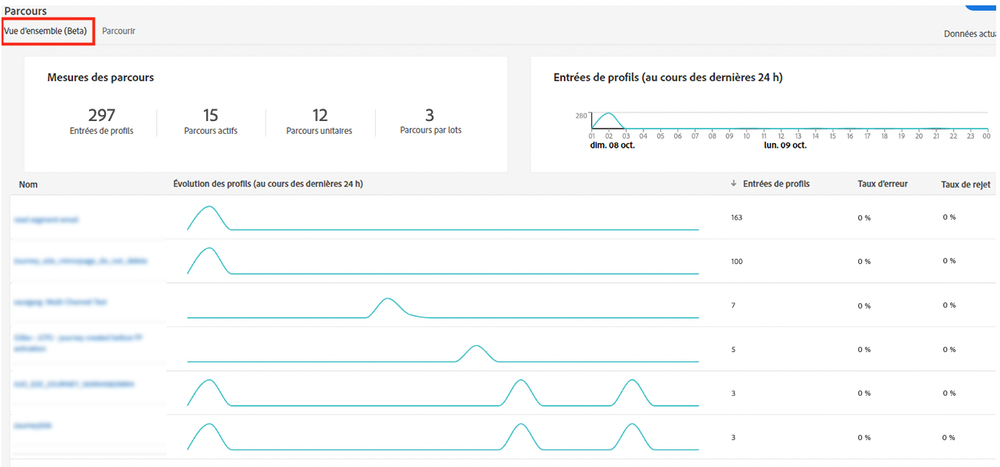
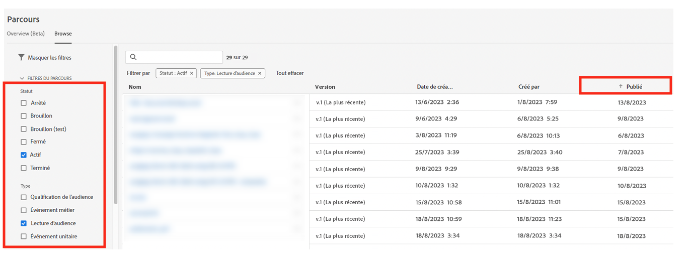

# Bonnes pratiques {#best-practices}

## Conseils pour la personnalisation des cas d’utilisation en temps réel et des omnicanaux {#real-time-guidance}

Suite à la mise à jour du Service d’identités 2.0, la connexité d’identités en temps réel a évolué.

Adobe Journey Optimizer exploite le Service d’identités pour fusionner des profils et personnaliser les expériences de l’utilisateur ou de l’utilisatrice. Par conséquent, le service doit tenir compte de certains aspects importants lors de la création de vos cas d’utilisation. En tant que marque, vous cherchez à offrir une expérience personnalisée. Le graphique d’identité permet aux spécialistes du marketing de comprendre les appareils auxquels une personne est associée sur différents canaux. Le graphique peut contenir des identités qui représentent une personne (CRMID) ou un navigateur web (ECID). Le Service d’identités rassemble ces informations, ce qui permet la création d’une « vision à 360 degrés » de la personne ou du profil fusionné. En d’autres termes, lorsqu’une personne navigue sur votre site, puis se connecte, toutes les données antérieures de cette session peuvent être associées à l’utilisateur ou l’utilisatrice de la connexion. Cette action se produit en plusieurs étapes :

1. Connexité initiale des identités : lorsqu’une personne se connecte, l’identifiant de connexion (CRMID) est associé à l’identifiant du navigateur web (session web ou application mobile).

   * Cela peut prendre entre 30 minutes et 4 heures.
   * En règle générale, cet événement de connexion génère un graphique d’identité qui lie les CRMID aux ECID.

1. Après la connexité initiale, toutes les données envoyées avec l’une des deux identités seront associées au profil fusionné et disponibles pour personnalisation dans Journey Optimizer en temps réel. La mise à jour du profil avec les dernières données comportementales peut prendre jusqu’à 1 minute. Voir cette [page](https://experienceleague.adobe.com/docs/experience-platform/ingestion/streaming/overview.html?lang=fr).

Lors de la création de cas d’utilisation, tenez compte des points suivants :

1. La marque souhaite réengager un visiteur ou une visiteuse de site 30 minutes après l’abandon (par exemple, un e-mail de panier abandonné) :

   Utilisez l’identité avec les données : ECID. Si vous souhaitez capturer 100 % des visiteurs et visiteuses ayant fourni leur adresse e-mail ou installation d’application au cours des 30 dernières minutes, vous devez utiliser l’identité basée sur les cookies pour lancer ce parcours (ECID). Cela suppose que votre adresse e-mail, votre jeton push ou toute autre adresse de l’expérience soient associés à l’ECID.

1. Engagement omnicanal sur le web, e-mail, notification push, etc.:

   * Les adresses de communication doivent être disponibles sur le profil au moment de l’engagement. Pour que cela se produise de manière cohérente et opportune, assurez-vous que vos données sont associées à l’identité que vous souhaitez utiliser.
   * Si vous devez utiliser des informations provenant d’une nouvelle application ou session de navigateur installée, combinées à des informations connues ou connectées, cette communication doit être envoyée après la connexité de ces identités. Cela peut varier d’un client ou d’une cliente à l’autre, nous vous invitons donc à attendre au moins 30 minutes pour obtenir le volume de profils le plus élevé.

## Mettre à l’échelle avec les mécanismes de sécurisation des parcours {#scale}

Cette section vous guide sur la mise à l’échelle avec les deux limites suivantes :

* Journey Optimizer dispose d’un mécanisme de sécurisation de 50 activités dans la zone de travail du parcours. Ce mécanisme de sécurisation permet de faciliter la lisibilité, l’assurance qualité et la résolution des problèmes. Le nombre d’activités d’un parcours apparaît dans la section supérieure gauche de sa zone de travail lorsque vous approchez de la limite (10 activités).

* Lorsque vous publiez des parcours, Journey Optimizer les met automatiquement à l’échelle et les ajuste pour garantir une stabilité et un débit maximaux. Lorsque vous approchez du jalon de 500 parcours actifs à la fois dans une sandbox, un recouvrement orange et un signe d’avertissement s’affichent dans l’interface pour cette réalisation. Si cette notification s’affiche et que vous devez étendre vos parcours au-delà de 500 parcours actifs à la fois, créez un ticket pour l’assistance clientèle. Nous vous aiderons à atteindre vos objectifs.

Il existe un certain nombre de bonnes pratiques que vous pouvez adopter, qui vous aideront à respecter les mécanismes de sécurisation et à utiliser le système efficacement.

* Si vous approchez de votre limite de parcours actifs, la première étape que vous pouvez effectuer est d’accéder à l’onglet **Aperçu** sous **Parcours** pour voir combien de parcours ont été actifs au cours des dernières 24 heures de parcours qui avaient des profils actifs. Vous pouvez vérifier le nombre de profils entrant et sortant du parcours dans cette section.

  

* Ensuite, dans la section Inventaire des parcours, vous pouvez filtrer tous les parcours par Statut = « Actif » et Type = « Lecture d’audience ». Triez ensuite par date de publication (du plus ancien au plus récent). Cliquez sur le parcours et accédez au planning. Arrêtez tous les parcours actifs dont l’exécution était planifiée **Une fois** ou **Dès que possible** qui ont plus d’une journée et n’ont qu’une seule action.

  

* Si votre parcours **Lecture d’audience** ne comporte qu’une seule action, aucune attente/décision ou optimisation de l’heure d’envoi, envisagez de le déplacer vers les campagnes Journey Optimizer. Les campagnes sont mieux adaptées à un engagement à une seule étape. L’une des principales différences entre une campagne et un parcours est de savoir s’il est important d’écouter activement l’interaction client afin de déterminer l’étape suivante et de lancer une autre action.
* Pour réduire le nombre d’activités au sein d’un parcours, vérifiez les étapes des conditions. Il y aura de nombreux cas où vous pourrez déplacer les conditions dans la définition de segment ou la composition de l’audience.
* Si les mêmes conditions sont répétées sur plusieurs parcours (contrôles du consentement, suppressions), envisagez de les déplacer dans le cadre de la définition de segment. Par exemple, si vous avez une condition pour vérifier que « l’adresse e-mail n’est pas vide » sur plusieurs parcours, cette condition est incluse dans la définition de segment.
* Si votre parcours comporte plusieurs conditions pour diviser l’audience afin d’afficher les nombres à chaque étape, pensez à utiliser Customer Journey Analytics ou d’autres solutions de création de rapports mieux adaptées à l’analyse.
* Si vous approchez de la limite des nœuds sur la zone de travail, envisagez de consolider les actions avec des paramètres ou du contenu dynamiques pour servir le contenu approprié plutôt que des nœuds explicites.

* Si vous avez un parcours **Lecture d’audience** avec le segment par lots (A) et si vous utilisez dans le parcours le segment de streaming (B) dans l’audience pour exclure (c’est-à-dire exécuter A-B), envisagez de déplacer cette logique vers la logique de segmentation et d’utiliser l’exclusion dans le cadre de la logique de segmentation elle-même.