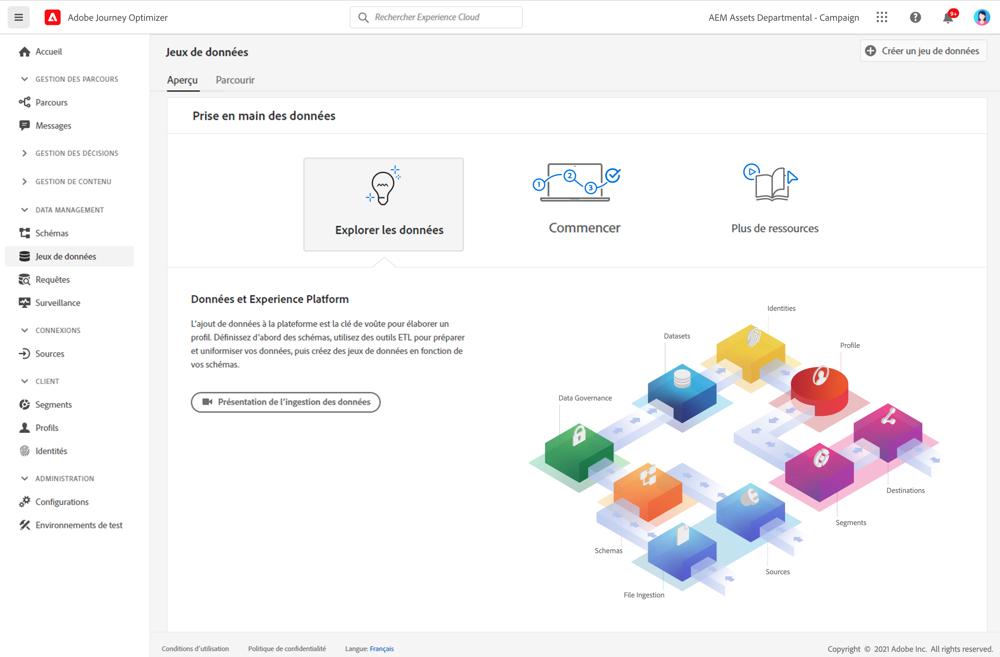
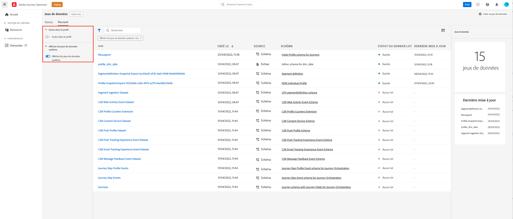
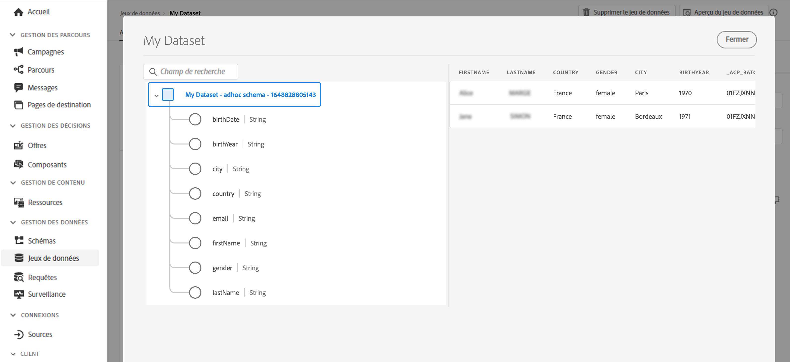

# Prise en main des jeux de données {#datasets-gs}

Toutes les données correctement ingérées par Adobe Experience Platform sont conservées sous forme de jeux de données dans le lac de données. Un jeu de données est une structure de stockage et de gestion pour la collecte de données, généralement sous la forme d&#39;un tableau, qui contient un schéma (des colonnes) et des champs (des lignes).

## Accès aux jeux de données{#access-datasets}

L’espace de travail **Jeux de données** de l’interface utilisateur [!DNL Adobe Journey Optimizer] vous permet d’explorer les données et de créer des jeux de données.

Sélectionnez **Jeux de données** dans le volet de navigation de gauche pour ouvrir le tableau de bord Jeux de données.

L’ajout de données à [!DNL Adobe Experience Platform] est la base de la création d’un profil. Vous pouvez ensuite exploiter les profils dans [!DNL Adobe Journey Optimizer]. Commencez par définir des schémas, utilisez les outils ETL pour préparer et normaliser vos données, puis créez des jeux de données basés sur vos schémas.

Sélectionnez l’onglet **Parcourir** pour afficher la liste de tous les jeux de données disponibles pour votre organisation. Des détails s’affichent pour chaque jeu de données répertorié, notamment son nom, le schéma auquel le jeu de données adhère et l’état de l’exécution d’ingestion la plus récente.

Par défaut, seuls les jeux de données que vous avez ingérés s’affichent. Si vous souhaitez afficher les jeux de données générés par le système, activez le bouton bascule **Afficher des jeux de données système** à partir du filtre.

Sélectionnez le nom d’un jeu de données pour accéder à l’écran Activité du jeu de données et consulter les détails du jeu de données que vous avez sélectionné. L’onglet activité contient un graphique qui permet de visualiser le taux de messages consommé ainsi qu’une liste des lots réussis et en échec.

Voici les différents jeux de données disponibles :

**Reporting**

* _Reporting - Jeu de données d’événement de retour de message_: Logs de diffusion des messages. Informations sur toutes les diffusions de messages à partir de Journey Optimizer à des fins de création de rapports et de segments. Les commentaires des FAI par e-mail sur les bounces sont également enregistrés dans ce jeu de données.
* _Reporting - Jeu de données d’événement de suivi de messagerie_: Logs d’interaction pour le canal Email qui est utilisé à des fins de création de rapports et de segments. Informations stockées : informations sur les actions effectuées par l’utilisateur final dans un email (ouvertures, clics, etc.).
* _Reporting - Jeu de données d’événement de suivi push_: Logs d’interaction pour le canal Push utilisés à des fins de création de rapports et de segments. Informations stockées : informations sur les actions effectuées par l’utilisateur final dans les notifications push.
* _Reporting - Événement d’étape de Parcours_: Capture tous les événements d’expérience d’étape de Parcours générés à partir de Journey Optimizer pour être utilisés par des services tels que la création de rapports. Également essentiel pour la création de rapports en Customer Journey Analytics pour l’analyse YoY. Associé à des métadonnées de Parcours.
* _Reporting - Parcours_: Jeu de données de métadonnées contenant des informations sur chaque étape d’un parcours.
* _Reporting - Cci_: Jeu de données d’événement de retour qui stocke les logs de diffusion pour les emails en Cci. À utiliser à des fins de création de rapports.

**Consentement**

* _Jeu de données du service de consentement_: stocke les informations de consentement d’un profil.

**Intelligent Services**

* _Scores d’optimisation du temps d’envoi / Scores d’engagement_: Scores de sortie de l’IA Parcours.

## Aperçu des jeux de données{#preview-datasets}

Dans l’écran Activité du jeu de données, sélectionnez **Prévisualiser le jeu de données** près du coin supérieur droit de l’écran pour prévisualiser le lot le plus récent ayant réussi dans ce jeu de données. Lorsqu’un jeu de données est vide, le lien de prévisualisation est désactivé.

## Création de jeux de données{#create-datasets}

Pour créer un jeu de données, commencez par sélectionner **Créer un jeu de données** dans le tableau de bord Jeux de données.

Vous pouvez :

* Créer un jeu de données à partir d’un schéma. [En savoir plus dans cette documentation](https://experienceleague.adobe.com/docs/experience-platform/catalog/datasets/user-guide.html?lang=fr#schema){target=&quot;_blank&quot;}
* Créer un jeu de données à partir d’un fichier CSV. [En savoir plus dans cette documentation](https://experienceleague.adobe.com/docs/experience-platform/ingestion/tutorials/map-a-csv-file.html?lang=fr){target=&quot;_blank&quot;}

Regardez cette vidéo pour découvrir comment créer un jeu de données, le mapper à un schéma, y ajouter des données et confirmer que les données ont été ingérées.

>[!VIDEO](https://video.tv.adobe.com/v/334293?quality=12)

## Gouvernance des données

Dans un jeu de données, parcourez l’onglet **Gouvernance des données** pour vérifier les libellés au niveau du jeu de données et du champ. La gouvernance des données classe les données en fonction du type de stratégies qui s’applique.

L’une des principales fonctionnalités de [!DNL Adobe Experience Platform] est de rassembler des données issues de plusieurs systèmes d’entreprise afin de permettre aux professionnels du marketing d’identifier, de comprendre et d’impliquer les clients avec plus d’efficacité. Ces données peuvent être soumises à des restrictions d’utilisation définies par votre organisation ou par des réglementations juridiques. Il est donc important de s’assurer que vos opérations de données sont conformes aux stratégies d’utilisation des données.

 [!DNL Adobe Experience Platform Data Governance] vous permet de gérer les données clients et de garantir la conformité aux réglementations, aux restrictions et aux stratégies applicables à l’utilisation des données. Elle joue un rôle clé dans Experience Platform à différents niveaux, notamment dans le catalogage, la traçabilité des données, l’étiquetage de l’utilisation des données, les politiques d’utilisation des données et le contrôle de l’utilisation des données lors d’activités marketing.

En savoir plus sur la gouvernance des données et les libellés d’utilisation des données dans la [documentation sur la gouvernance des données](https://experienceleague.adobe.com/docs/experience-platform/data-governance/labels/user-guide.html?lang=fr){target=&quot;_blank&quot;}

## Exemples et cas pratiques{#uc-datasets}

Découvrez comment créer un schéma et un jeu de données et ingérer des données pour ajouter des profils de test dans Adobe Journey Optimizer dans [cet exemple de bout en bout](../segment/creating-test-profiles.md)

Apprenez-en davantage sur la création d’un jeu de données dans la [documentation Adobe Experience Platform](https://experienceleague.adobe.com/docs/experience-platform/catalog/datasets/overview.html?lang=fr){target=&quot;_blank&quot;}.

Découvrez comment utiliser l’interface utilisateur des jeux de données dans la [documentation de présentation de l’ingestion des données](https://experienceleague.adobe.com/docs/experience-platform/ingestion/home.html?lang=fr){target=&quot;_blank&quot;}.

Une liste de cas d’utilisation avec des exemples de requête est disponible [ici](../start/datasets-query-examples.md).

**Voir également**

* [Présentation de l’ingestion par flux](https://experienceleague.adobe.com/docs/experience-platform/ingestion/streaming/overview.html?lang=fr){target=&quot;_blank&quot;}
* [Ingestion de données dans Adobe Experience Platform](https://experienceleague.adobe.com/docs/experience-platform/ingestion/tutorials/ingest-batch-data.html?lang=fr){target=&quot;_blank&quot;}
