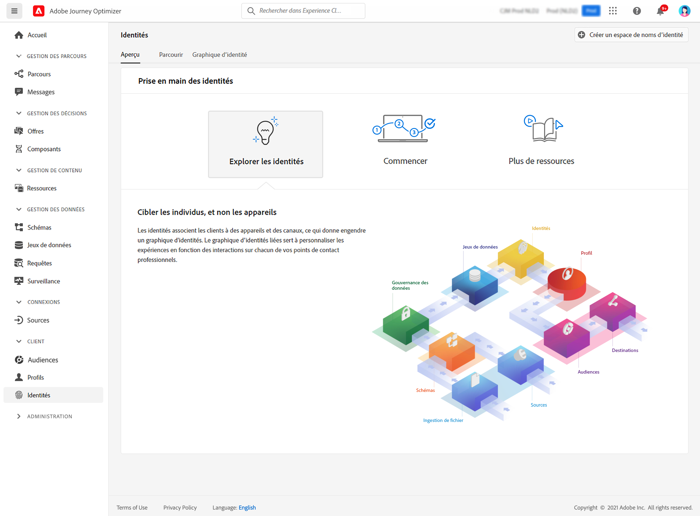

# Prise en main des identités {#identities-gs}

Une identité correspond à des données propres à une entité, généralement une personne individuelle. Une identité telle qu’un identifiant de connexion, un ECID ou un identifiant de fidélité correspond à une identité connue.

Les informations d’identification personnelle (PII) telles que l’adresse e-mail et le numéro de téléphone permettent d’identifier directement un client. Par conséquent, les PII sont utilisées pour faire correspondre les identités multiples d’un client sur plusieurs systèmes.

Dans [!DNL Adobe Journey Optimizer], les **identités** relient les consommateurs sur les différents appareils et canaux. Le résultat est un [graphique d’identités](#id-graph). Le graphique d’identité lié est utilisé pour personnaliser les expériences en fonction des interactions entre tous les points de contact de votre entreprise.

Découvrez le **Service d’identités** dans [cette documentation](https://experienceleague.adobe.com/docs/experience-platform/identity/home.html?lang=fr){target=&quot;_blank&quot;}.

## Espaces de noms d’identité {#identity-namespaces}

Les **espaces de noms d’identité** sont des composants du Service d’identités qui servent d’indicateurs du contexte auquel une identité se rapporte. Par exemple, ils distinguent une valeur `name@email.com` comme adresse e-mail ou `443522` comme identifiant CRM numérique. L’utilisation des espaces de noms d’identité nécessite une compréhension des différents services d’Adobe Experience Platform impliqués. Avant de commencer à travailler avec les espaces de noms d’identité, veuillez consulter la documentation relative aux services suivants :

Découvrez les **espaces de noms d’identité** dans [cette documentation](https://experienceleague.adobe.com/docs/experience-platform/identity/namespaces.html?lang=fr){target=&quot;_blank&quot;}.

## Graphique d’identités{#id-graph}

Un **graphique d’identités** est une carte des relations entre différentes identités pour un client spécifique. Il permet de visualiser la façon dont un client interagit avec votre marque sur différents canaux. Tous les graphiques d’identités client sont gérés et mis à jour collectivement par le Service d’identités d’Adobe Experience Platform en temps quasi réel, en réponse à l’activité du client.

La visionneuse de graphiques d’identités de l’interface utilisateur [!DNL Adobe Journey Optimizer] permet de visualiser et de mieux comprendre quelles identités de client sont regroupées, et de quelles façons. La visionneuse vous permet de faire glisser différentes parties du graphique et d’interagir avec celles-ci. Vous pouvez ainsi examiner les relations d’identité complexes, effectuer plus efficacement le débogage et bénéficier d’une plus grande transparence en ce qui concerne l’utilisation des informations.

Découvrez le **graphique d’identités** dans [cette documentation](https://experienceleague.adobe.com/docs/experience-platform/identity/ui/identity-graph-viewer.html?lang=fr){target=&quot;_blank&quot;}.
