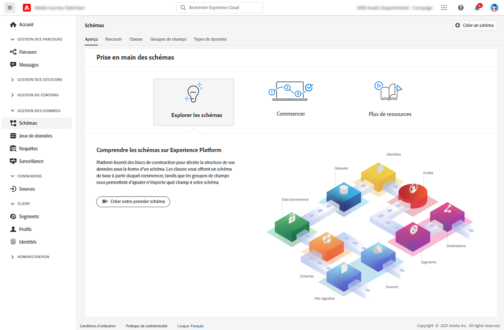

# Prise en main des schémas {#schemas-gs}

Les schémas sont la manière standard de décrire les données dans Experience Platform. Ils permettent à toutes les données conformes aux schémas d’être réutilisables sans conflit au sein d’une organisation et même d’être partagées entre plusieurs organisations.

➡️ [Découvrez comment créer et configurer un schéma dans cette vidéo](#video-schema) (vidéo)

Un schéma est un jeu de règles qui représente et valide la structure et le format des données. À un niveau élevé, les schémas fournissent une définition abstraite d’un objet du monde réel (une personne, par exemple) et indiquent les données à inclure dans chaque instance de cet objet (comme le prénom, le nom, l’anniversaire, etc.).

Découvrez comment créer des schémas dans [cette documentation](https://experienceleague.adobe.com/docs/experience-platform/xdm/schema/composition.html?lang=fr){target=&quot;_blank&quot;}

L’espace de travail **Schémas** de l’interface utilisateur [!DNL Adobe Journey Optimizer] vous permet de gérer les ressources du modèle de données d’expérience (XDM), y compris les schémas, les classes, les groupes de champs de schéma et les types de données. Vous pouvez afficher et explorer les ressources de base fournies par Adobe, ainsi que créer des ressources et des schémas personnalisés pour votre organisation.

Découvrez comment utiliser l’interface utilisateur des schémas dans [cette documentation](https://experienceleague.adobe.com/docs/experience-platform/xdm/ui/overview.html?lang=fr){target=&quot;_blank&quot;}

La documentation détaillée pour créer un schéma à l’aide de l’éditeur de schémas est disponible dans [cette page](https://experienceleague.adobe.com/docs/experience-platform/xdm/tutorials/create-schema-ui.html?lang=fr){target=&quot;_blank&quot;}.

## Vidéo pratique{#video-schema}

Découvrez comment créer un schéma, ajouter des groupes de champs, et créer et configurer des groupes de champs personnalisés.

>[!VIDEO](https://video.tv.adobe.com/v/334461?quality=12)

**Voir également**

* [Création d’un schéma, d’un jeu de données et ingestion des données pour ajouter des profils de test dans Journey Optimizer](../segment/creating-test-profiles.md)
* [Présentation du système XDM](https://experienceleague.adobe.com/docs/experience-platform/xdm/home.html?lang=fr){target=&quot;_blank&quot;}
* [Bonnes pratiques pour la modélisation des données](https://experienceleague.adobe.com/docs/experience-platform/xdm/schema/best-practices.html?lang=fr){target=&quot;_blank&quot;}
* [Création d’un schéma à l’aide de l’API Schema Registry](https://experienceleague.adobe.com/docs/experience-platform/xdm/tutorials/create-schema-api.html?lang=fr){target=&quot;_blank&quot;}
* [Définition d’une relation entre deux schémas à l’aide de l’éditeur de schémas](https://experienceleague.adobe.com/docs/experience-platform/xdm/tutorials/relationship-ui.html?lang=fr){target=&quot;_blank&quot;}
