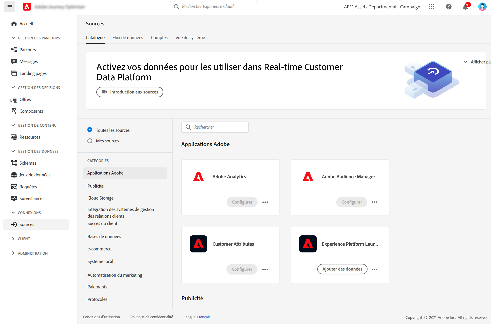

# Prise en main des connecteurs source {#sources-gs}

## Qu’est-ce qu’une source ? {#what-is-source}

Une **source** est un connecteur qui apporte des données externes dans Adobe Journey Optimizer. Les sources vous permettent d’importer des informations sur les clients à partir des systèmes que vous utilisez déjà, tels que les plateformes CRM, l’espace de stockage dans le cloud ou les bases de données, et de rendre ces données disponibles pour créer des parcours clients personnalisés.

Considérez les sources comme des ponts entre Journey Optimizer et vos systèmes de données externes. Ils synchronisent automatiquement les données afin que vous disposiez toujours d’informations client à jour pour alimenter vos campagnes marketing.

## Importance des sources {#why-sources-matter}

Les sources sont essentielles pour créer des expériences client personnalisées et basées sur les données dans Journey Optimizer. En voici la raison :

* **Vue unifiée du client** - Combinez les données de plusieurs systèmes pour obtenir une vue d’ensemble de chaque client
* **Personnalisation en temps réel** - Utilisez des données récentes pour diffuser des messages opportuns et pertinents dans vos parcours.
* **Synchronisation automatisée des données** - Maintenez les informations client à jour sans importations manuelles de données
* **Workflows efficaces** - Connectez-vous une seule fois, puis les données circulent automatiquement dans vos parcours

Par exemple, vous pouvez utiliser des sources pour importer l’historique des achats à partir de votre plateforme d’e-commerce, puis créer des parcours qui envoient des recommandations de produits personnalisées basées sur les achats des clients.

## Utilisation des sources {#sources-use-cases}

Les cas d’utilisation courants des sources dans Journey Optimizer incluent :

* **Importer les données client des systèmes CRM** - Synchroniser les informations de contact, les préférences et l’historique de l’engagement à partir de plateformes telles que Salesforce ou Microsoft Dynamics.
* **Connecter les données d’achat** - Intégrez l’historique des commandes et les préférences de produits des plateformes d’e-commerce pour personnaliser les offres
* **Intégrer les données du programme de fidélité** - Accédez aux soldes de points et aux informations de niveau pour récompenser vos clients les plus engagés
* **Synchronisation des données comportementales** - Importez des interactions de site web et des modèles d’utilisation d’application pour déclencher des parcours pertinents.
* **Mettre à jour les attributs de profil** - Maintenez les profils clients à jour avec les données provenant de l’espace de stockage ou des bases de données

## Types de sources courants {#source-types}

Journey Optimizer prend en charge différents types de sources pour se connecter à vos systèmes existants :

**Applications Adobe :**
* Adobe Analytics
* Adobe Audience Manager
* Adobe Campaign
* Adobe Commerce

**Stockage dans le cloud :**
* Amazon S3
* Stockage Azure Blob
* Google Cloud Storage
* SFTP

**Bases de données :**
* Amazon Redshift
* Google BigQuery
* Microsoft SQL Server
* MySQL
* PostgreSQL

**Automatisation du CRM et du marketing :**
* Microsoft Dynamics
* Salesforce
* Salesforce Marketing Cloud

➡️ Voir la liste complète dans le catalogue [des sources Experience Platform](https://experienceleague.adobe.com/docs/experience-platform/sources/home.html?lang=fr#sources-catalog){target="_blank"}

## Avant de commencer {#prerequisites}

Avant de configurer des sources, vérifiez que vous disposez des éléments suivants :

* **Autorisations appropriées** - Accès pour la gestion des sources dans Adobe Experience Platform
* **Informations d’identification du système Source** - Informations d’authentification pour le système externe auquel vous souhaitez vous connecter
* **Compréhension de vos données** - Savoir quels champs de données vous avez besoin et comment ils sont associés à des profils Journey Optimizer

➡️ En savoir plus sur [le contrôle d’accès et les autorisations](../administration/permissions.md)

## Fonctionnement des sources {#how-sources-work}

Adobe Journey Optimizer utilise le framework de sources de Adobe Experience Platform. Le workflow de base est le suivant :

1. **Connect** - Configurez l’authentification à votre système de données externe
2. **Sélectionner les données** - Choisissez les données à importer et la fréquence de synchronisation
3. **Mapper les champs** - Définit la manière dont les champs de données externes correspondent aux attributs de profil Journey Optimizer
4. **Planification** - Configurer des intervalles d’actualisation automatique des données
5. **Monitor** - Suivre le flux de données et résoudre les problèmes de synchronisation

Une fois configurées, les sources s’exécutent automatiquement en arrière-plan, conservant vos données client à jour et prêtes à être utilisées dans les parcours.

## En savoir plus {#learn-more}

Regardez cette vidéo pour comprendre les connecteurs source et comment les configurer dans Journey Optimizer :

>[!VIDEO](https://video.tv.adobe.com/v/335919?quality=12)

Pour plus d’informations sur la configuration et la gestion des sources, consultez la documentation sur les sources Adobe Experience Platform [&#128279;](https://experienceleague.adobe.com/docs/experience-platform/sources/home.html?lang=fr){target="_blank"}.

## Étapes suivantes {#next-steps}

Maintenant que vous comprenez ce que sont les sources et pourquoi elles sont importantes :

* Explorez le [catalogue de sources](https://experienceleague.adobe.com/docs/experience-platform/sources/home.html?lang=fr#sources-catalog){target="_blank"} pour trouver des connecteurs pour vos systèmes
* Découvrez comment [&#x200B; créer une connexion source &#x200B;](https://experienceleague.adobe.com/docs/experience-platform/sources/ui-tutorials/create/overview.html){target="_blank"}
* Comprendre le [mappage et transformation des données](https://experienceleague.adobe.com/docs/experience-platform/sources/ui-tutorials/dataflow/overview.html){target="_blank"}
* Voir comment [utiliser des données importées dans des parcours &#x200B;](../building-journeys/journey-gs.md)
