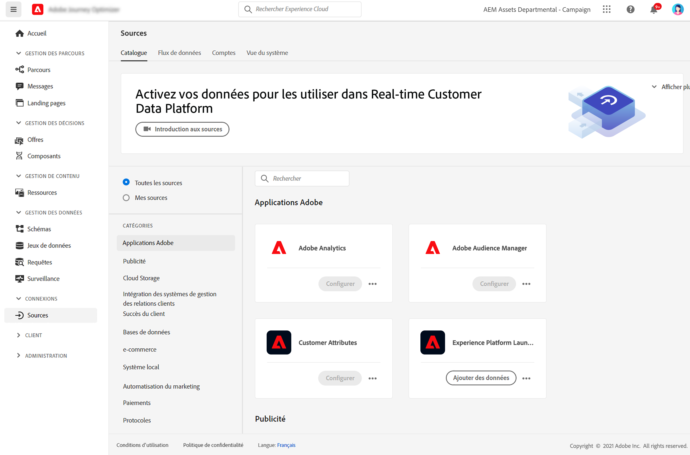

# Prise en main des connecteurs source {#sources-gs}

>[!BEGINSHADEBOX]

**Sur cette page :** découvrez les connecteurs sources et comment ils acheminent des données à partir de votre CRM, de l’espace de stockage dans le cloud et des bases de données vers Adobe Journey Optimizer, afin de pouvoir alimenter des parcours clients personnalisés et axés sur les données.

>[!ENDSHADEBOX]

## Qu’est-ce qu’une source ? {#what-is-source}

Une **source** est un connecteur qui importe des données externes dans Adobe Journey Optimizer. Les sources vous permettent d’importer des informations sur les clientes et clients à partir des systèmes que vous utilisez déjà, tels que les plateformes CRM, l’espace de stockage dans le cloud ou les bases de données, et de rendre ces données disponibles pour créer des parcours clients personnalisés.

Considérez les sources comme des ponts entre Journey Optimizer et vos systèmes de données externes. Elles synchronisent automatiquement les données afin que vous disposiez toujours d’informations sur les clientes et clients à jour pour alimenter vos campagnes marketing.

## Importance des sources {#why-sources-matter}

Les sources sont essentielles pour créer des expériences clients personnalisées et pilotées par les données dans Journey Optimizer. Voici pourquoi :

* **Vue client unifiée** : combinez les données de plusieurs systèmes pour obtenir une vue d’ensemble de chaque client et cliente.
* **Personnalisation en temps réel** : utilisez des données récentes pour diffuser des messages opportuns et pertinents dans vos parcours.
* **Synchronisation automatisée des données** : maintenez les informations sur les clientes et clients à jour sans imports manuels de données.
* **Workflows efficaces** : connectez-vous une seule fois, les données circulent ensuite automatiquement dans vos parcours.

Par exemple, vous pouvez utiliser des sources pour importer l’historique des achats à partir de votre plateforme d’e-commerce, puis créer des parcours qui envoient des recommandations de produits personnalisées basées sur les achats des clientes et clients.

## Utilisation des sources {#sources-use-cases}

Les cas d’utilisation courants des sources dans Journey Optimizer incluent :

* **Importer les données clients des systèmes CRM** : synchronisez les informations de contact, les préférences et l’historique de l’engagement à partir de plateformes telles que Salesforce ou Microsoft Dynamics.
* **Connecter les données d’achat** : intégrez l’historique des commandes et les préférences de produits des plateformes d’e-commerce pour personnaliser les offres.
* **Intégrer les données du programme de fidélité** : accédez aux soldes de points et aux informations de niveau pour récompenser vos clientes et clients les plus engagés.
* **Synchroniser les données comportementales** : importez des interactions de site web et des modèles d’utilisation d’application pour déclencher des parcours pertinents.
* **Mettre à jour les attributs de profil** : maintenez les profils des clientes et clients à jour avec les données provenant de l’espace de stockage dans le cloud ou des bases de données.

## Types de sources courants {#source-types}

Journey Optimizer prend en charge différents types de sources pour se connecter à vos systèmes existants :

**Applications Adobe :**
* Adobe Analytics
* Adobe Audience Manager
* Adobe Campaign
* Adobe Commerce

**Espace de stockage dans le cloud :**
* Amazon S3
* Stockage Azure Blob
* Google Cloud Storage
* SFTP

**Bases de données :**
* Amazon Redshift
* Google BigQuery
* Microsoft SQL Server
* MySQL
* PostgreSQL

**Automatisation du CRM et du marketing :**
* Microsoft Dynamics
* Salesforce
* Salesforce Marketing Cloud

**Fidélité et récompenses :**
* Talon.One
* Capillaire
* Kobie

➡️ Voir la liste complète dans le [catalogue des sources Experience Platform](https://experienceleague.adobe.com/docs/experience-platform/sources/home.html?lang=fr#sources-catalog){target="_blank"}

## Avant de commencer {#prerequisites}

Avant de configurer des sources, vérifiez que vous disposez des éléments suivants :

* **Autorisations appropriées** : accès pour la gestion des sources dans Adobe Experience Platform
* **Informations d’identification du système source** : informations d’authentification pour le système externe que vous souhaitez connecter.
* **Compréhension de vos données** : identifiez les champs de données dont vous avez besoin et comment ils sont associés à des profils Journey Optimizer.

➡️ En savoir plus sur [le contrôle d’accès et les autorisations](../administration/permissions.md)

## Fonctionnement des sources {#how-sources-work}

Adobe Journey Optimizer utilise le framework de sources d’Adobe Experience Platform. Le workflow de base est le suivant :

1. **Connecter** : configurez l’authentification à votre système de données externe.
2. **Sélectionner les données** : choisissez les données à importer et la fréquence de synchronisation.
3. **Mapper les champs** : définissez la manière dont les champs de données externes correspondent aux attributs de profil Journey Optimizer.
4. **Planifier** : configurez des intervalles d’actualisation automatique des données.
5. **Surveiller** : suivez le flux de données et résolvez les problèmes de synchronisation.

Une fois configurées, les sources s’exécutent automatiquement en arrière-plan, conservant vos données clients à jour et prêtes à être utilisées dans les parcours.

>[!NOTE]
>
>**Ingestion de données pour les campagnes orchestrées** : pour les sources de capture de données modifiées basées sur fichiers qui sont utilisées avec les campagnes orchestrées, le champ `_change_request_type` est obligatoire. Les valeurs prises en charge sont `u` (upsert) ou `d` (delete). Ces valeurs doivent être `u` et `d` en minuscules, et non `U` et `D` en majuscules. [En savoir plus sur les mécanismes de sécurisation et les limites des campagnes orchestrées](../orchestrated/guardrails.md)

## En savoir plus {#learn-more}

Regardez cette vidéo pour comprendre les connecteurs sources et comment les configurer dans Journey Optimizer :

>[!VIDEO](https://video.tv.adobe.com/v/335919?quality=12)

Pour plus d’informations sur la configuration et la gestion des sources, consultez la [documentation sur les sources Adobe Experience Platform](https://experienceleague.adobe.com/docs/experience-platform/sources/home.html?lang=fr){target="_blank"}.

## Étapes suivantes {#next-steps}

Maintenant que vous comprenez ce que sont les sources et pourquoi elles sont importantes :

* Explorez le [catalogue de sources](https://experienceleague.adobe.com/docs/experience-platform/sources/home.html?lang=fr#sources-catalog){target="_blank"} pour trouver des connecteurs pour vos systèmes.
* Découvrir comment [créer une connexion source](https://experienceleague.adobe.com/fr/docs/experience-platform/sources/home){target="_blank"}
* Comprendre [le mappage et la transformation des données](https://experienceleague.adobe.com/fr/docs/experience-platform/sources/home){target="_blank"}
* Découvrir comment [utiliser des données importées dans les parcours](../building-journeys/journey-gs.md)
* Consultez la présentation [Prise en main de la gestion des données](../data/gs-data.md) pour comprendre comment les sources s’intègrent dans la configuration des données pour Journey Optimizer.
