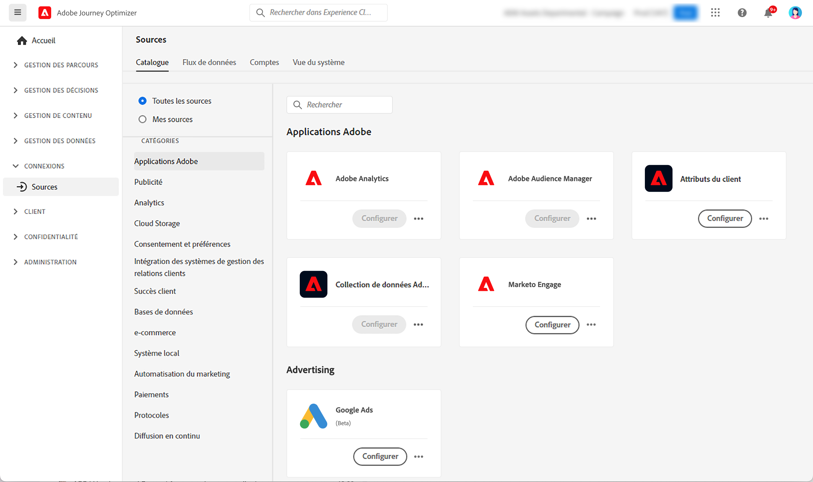

# Prise en main des connecteurs source {#sources-gs}

Adobe Journey Optimizer permet d’ingérer des données à partir de sources externes tout en vous permettant de structurer, de libeller et d’améliorer les données entrantes à l’aide des services de Platform. Vous pouvez ingérer des données provenant de diverses sources telles que les applications Adobe, les stockages dans le cloud, des bases de données, etc.

Découvrez les connecteurs source et comment les configurer dans Journey Optimizer grâce à cette vidéo :

>[!VIDEO](https://video.tv.adobe.com/v/3422583?quality=12&captions=fre_fr)

Découvrez comment ingérer des données provenant de sources externes avec des connecteurs source dans la [documentation Adobe Experience Platform](https://experienceleague.adobe.com/docs/experience-platform/sources/home.html?lang=fr){target="_blank"}.
