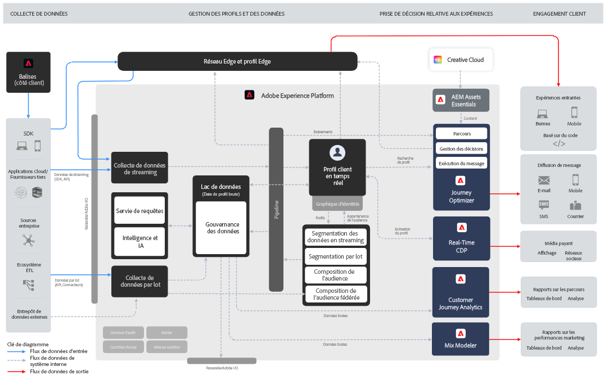

# Prise en main de Journey Optimizer {#cjm-gs}

## Qu’est-ce que [!DNL Adobe Journey Optimizer] ?{#about-cjm}

[!DNL Adobe Journey Optimizer] aide les sociétés à proposer des expériences connectées, contextuelles et personnalisées à leurs clientes et clients. Le parcours client est l’ensemble du processus d’interaction d’une cliente ou d’un client avec la marque, depuis le premier moment de contact jusqu’au départ de la cliente ou du client. Il débute avec la phase de sensibilisation, où le client découvre la marque et commence à interagir. Le client interagira ensuite davantage avec la marque, se rendra sur les sites Web et physiques, effectuera des achats, enverra des messages ou publiera des commentaires.

[!DNL Adobe Journey Optimizer] est conçu de manière native sur [!DNL Adobe Experience Platform] et associe un profil client en temps réel unifié, un framework ouvert API-First, une fonction Offer Decisioning centralisée, une intelligence artificielle (IA) et du machine learning (ML) pour la personnalisation et l&#39;optimisation. Journey Optimizer permet aux marques de déterminer intelligemment la meilleure interaction possible, avec l&#39;échelle, la vitesse et la flexibilité adaptées, pour l&#39;ensemble du parcours client. Avec [!DNL Adobe Journey Optimizer], les entreprises peuvent créer et diffuser des campagnes marketing planifiées (comme des promotions hebdomadaires pour un magasin de vente au détail) et des communications individuelles personnalisées (comme une notification push pour un article qu&#39;un client d&#39;une application avec points de fidélité peut avoir consulté et qui était précédemment en rupture de stock) dans la même application.

➡️ [Découvrir Journey Optimizer](https://experienceleague.adobe.com/docs/journey-optimizer-learn/tutorials/introduction-to-journey-optimizer/introduction.html?lang=fr){target="_blank"} (vidéo)

<!-- Use [!DNL Adobe Journey Optimizer] to build multi-step customer journeys that initiate a sequence of interactions, offers, and messages across channels in real time. This approach ensures customers are engaged at the optimal moments based on their actions and relevant business signals. Learn how to build journeys in [this section](../building-journeys/journey-gs.md).

You can also create audience-based campaigns to send messages.-->

## Cas d’utilisation {#use-cases}

* Les spécialistes marketing peuvent utiliser [!DNL Adobe Journey Optimizer] pour envoyer à la fois des communications personnalisées et des communications par lots basées sur l’audience. Par exemple, une boutique de vêtements envoie généralement des enquêtes après achat à tous les clients qui ont acheté des produits la semaine précédente. En raison des intempéries, quelques envois ont été retardés. En identifiant les clientes et clients qui n’ont pas reçu leurs achats, la boutique de vêtements peut les exclure de l’envoi de l’enquête de satisfaction client programmée et envoyer à la place un e-mail personnalisé s’excusant du retard et proposant un code de remise avec des suggestions de produits basées sur leurs achats précédents.

  Les spécialistes marketing peuvent également utiliser l’application pour envoyer des communications en temps réel basées sur le comportement. Par exemple, le même détaillant peut interagir avec un client ou une cliente fidèle qui se rend sur le parking du magasin en temps réel en lui envoyant une notification push à propos d’un pull dans sa taille qui est de nouveau en stock.

* Les personnes autres que les spécialistes marketing comme les équipes opérationnelles et le service clientèle qui sont impliquées dans l’expérience client peuvent utiliser [!DNL Adobe Journey Optimizer] pour gérer différentes tâches, telles que des notifications opérationnelles, ou pour surveiller le processus d’intégration des nouveaux clients. Prenez par exemple un parc d&#39;attraction dont les visiteurs téléchargent une application mobile dans le cadre de leur séjour dans le parc. Le personnel de maintenance peut utiliser [!DNL Adobe Journey Optimizer] pour avertir les visiteurs du parc des itinéraires actuellement fermés en raison de travaux de maintenance.

## Fonctionnalités principales {#key-capabilities}

[!DNL Adobe Journey Optimizer] est une application agile et évolutive permettant de créer et de diffuser des expériences clients personnalisées, connectées et opportunes
sur une application, un appareil ou un canal.

Les fonctionnalités principales sont les suivantes :

* **Informations sur le client et engagement en temps réel** : un profil intégré fusionne les données actives de toutes les sources entre les points de contact des clients, y compris les données comportementales, transactionnelles, financières et opérationnelles afin d&#39;optimiser les expériences personnelles et contextuelles des clients en temps réel.

* **Exécution et orchestration omnicanales modernes** : une zone de travail unique sur laquelle harmoniser et optimiser le parcours client pour l’engagement client 1:1 et la portée marketing, afin d&#39;aider les marques à proposer une plus grande valeur ajoutée tout au long du cycle de vie client. Les parcours clients conçus dans [!DNL Adobe Journey Optimizer] peuvent être dynamiques et basés sur des événements pour permettre aux marques de réagir aux signaux en temps réel et d’associer ces interactions à des campagnes planifiées. Cela permet de prendre les bonnes décisions concernant les communications à envoyer à un client ou une cliente, le moment et les canaux à utiliser.

* **Prise de décision et personnalisation intelligentes** : les marques peuvent appliquer une prise de décision centralisée et intégrer l’intelligence artificielle et le machine learning pour configurer des informations prédictives tout au long de l’expérience du client ou de la cliente, ce qui facilite l’automatisation des décisions et l’optimisation de l’expérience à grande échelle. La prise de décisions alimente les offres centralisées sur tous les canaux à l’échelle via [!DNL Adobe Journey Optimizer].

>[!NOTE]
>
>* Les composants et fonctionnalités disponibles dans votre environnement dépendent de vos [autorisations](../administration/permissions.md) et de votre [package de licences](https://helpx.adobe.com/fr/legal/product-descriptions/adobe-journey-optimizer.html){target="_blank"}. Pour toute question, contactez votre responsable du succès client Adobe ou votre représentant ou représentante Adobe.
>
>* Les lignes directrices et procédures générales d&#39;Adobe Experience Cloud sur la protection des données personnelles s&#39;appliquent à [!DNL Journey Optimizer]. [En savoir plus sur la confidentialité d&#39;Adobe Experience Cloud](https://www.adobe.com/fr/privacy/experience-cloud.html){target="_blank"}.

## Architecture {#architecture}

Découvrez l’architecture de base d’[!DNL Adobe Journey Optimizer], les points d’intégration et la relation entre [!DNL Journey Optimizer] et [!DNL Experience Platform], dans le diagramme ci-dessous.

Adobe Experience Platform est une base de données puissante, flexible, ouverte et centralisée qui collecte, normalise, régit, applique les informations d’IA et unifie les données afin d’offrir des expériences client numériques réfléchies et pertinentes.

{width="70%" zoomable="yes"}

Quatre applications sont prise en charge en mode natif sur Experience Platform : Adobe Real-Time Customer Data Platform, Journey Optimizer, Customer Journey Analytics et Adobe Mix Modeler.

Les fonctionnalités et services principaux de Journey Optimizer fonctionnent à partir des composants fondamentaux d’Adobe Experience Platform, qui inclut le profil client en temps réel. Bien que Journey Optimizer fonctionne de manière transparente et soit interopérable avec Real-Time CDP et Customer Journey Analytics, il peut également fonctionner indépendamment en tant qu’application autonome.

{width="70%" zoomable="yes"}

### Plans directeur d’Adobe Journey Optimizer

Les plans directeurs d’expérience digitale fournissent des diagrammes d’architecture du système et des flux de données pour permettre de mieux comprendre la façon dont Adobe Experience Platform et les applications sont intégrées et mises en œuvre. Les plans directeurs fournissent une représentation visuelle des flux de contenu et de données entre les systèmes et les composants, de la séquence des opérations et des dépendances afin de contribuer à la conception et à l’architecture des cas d’utilisation d’Adobe Experience Platform et des applications.

Voir [Plans directeurs d’Adobe Journey Optimizer](https://experienceleague.adobe.com/fr/docs/blueprints-learn/architecture/customer-journeys/journey-optimizer/journey-optimizer-overview){target="_blank"}.

>[!MORELIKETHIS]
>
>* [Étapes clés pour commencer](quick-start.md)
>* [Concevoir des parcours et envoyer des messages](../building-journeys/journey-gs.md)
>* [Rapports dynamiques](../reports/live-report.md)
>* [Tutoriel Présentation de Journey Optimizer](https://experienceleague.adobe.com/fr/docs/journey-optimizer-learn/tutorials/introduction-to-journey-optimizer/introduction){target="_blank"}
>* [Vue d’ensemble de la sécurité de Journey Optimizer](https://www.adobe.com/content/dam/cc/en/security/pdfs/AJO_SecurityOverview.pdf) (PDF)
>* [Description du produit Journey Optimizer](https://helpx.adobe.com/fr/legal/product-descriptions/adobe-journey-optimizer.html){target="_blank"}
