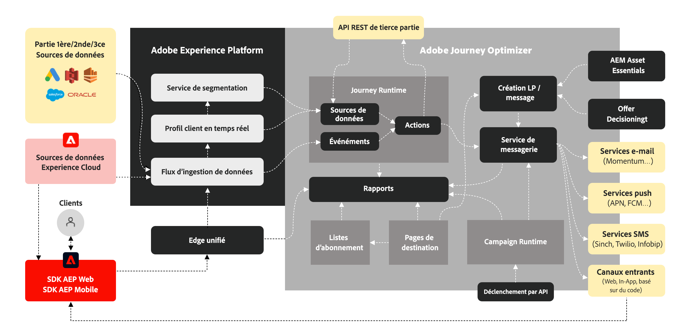

# Prise en main de Journey Optimizer {#cjm-gs}

>[!CONTEXTUALHELP]
>id="test_id"
>title="Contenu du test"
>abstract="Testez le contenu pour l’intégration de l’aide contextuelle dans AJO."

## Présentation [!DNL Adobe Journey Optimizer]?{#about-cjm}

[!DNL Adobe Journey Optimizer] aide les entreprises à offrir à leurs clients des expériences connectées, contextuelles et personnalisées. Le parcours d’un client correspond à l’ensemble du processus d’interaction d’un client avec la marque, du premier moment de contact au départ du client. Il commence par la phase de sensibilisation, où le client apprend de la marque et commence à s’engager. Le client interagira ensuite davantage avec la marque, visitera des sites en ligne et physiques, et effectuera des achats, enverra des messages ou publiera des commentaires.

[!DNL Adobe Journey Optimizer] est créé de manière native sur [!DNL Adobe Experience Platform] et combine un profil client en temps réel unifié, un cadre ouvert d’abord axé sur les API, une prise de décision centralisée des offres, ainsi qu’une intelligence artificielle (IA) et un apprentissage automatique (ML) pour la personnalisation et l’optimisation. Journey Optimizer permet aux marques de déterminer intelligemment la meilleure interaction possible avec l’échelle, la vitesse et la flexibilité tout au long du parcours client. Avec [!DNL Adobe Journey Optimizer], les entreprises peuvent créer et diffuser des campagnes marketing planifiées (comme des promotions hebdomadaires pour un magasin de détail) et des communications individuelles personnalisées (comme une notification push pour un article qu’un client d’application de fidélité peut avoir consulté et qui était précédemment en rupture de stock) dans la même application.

➡️ [Discover Journey Optimizer](https://experienceleague.adobe.com/docs/journey-optimizer-learn/tutorials/introduction-to-journey-optimizer/introduction.html){target=&quot;_blank&quot;} (vidéo)

## Cas d’utilisation {#use-cases}

* Les marketeurs peuvent utiliser [!DNL Adobe Journey Optimizer] envoyer des communications par lots individualisées ainsi que des communications par lots basées sur l’audience ; Par exemple, une boutique de vêtements envoie généralement des enquêtes après achat à tous les clients qui ont acheté des produits la semaine dernière. En raison des intempéries, quelques envois ont été retardés. En voyant les clients qui n’ont pas reçu leurs envois, la boutique de vêtements peut les exclure de l’envoi de satisfaction client programmée et envoyer à la place un email personnalisé s’excusant du retard et proposant un code de remise avec des recommandations de produits basées sur les achats passés du client.

   Les marketeurs peuvent également utiliser l’application pour envoyer des communications en temps réel basées sur le comportement. Par exemple, le même détaillant pourrait engager un client fidèle qui se rend sur le parking du magasin en temps réel en lui envoyant une notification push à propos d’un pull qui est de nouveau en stock au même niveau que le client.

* Les non-spécialistes du marketing tels que les équipes d’opérations et le service clientèle qui sont impliqués dans l’expérience client peuvent utiliser [!DNL Adobe Journey Optimizer] pour gérer diverses tâches, telles que des notifications opérationnelles, voire pour surveiller le processus d’intégration. Prenez par exemple un parc d’attraction où les visiteurs du parc téléchargent une application mobile dans le cadre de leur expérience dans le parc. Le personnel de maintenance peut utiliser les [!DNL Adobe Journey Optimizer] pour informer les visiteurs du parc des trajets actuellement fermés en raison de travaux de maintenance.

## Fonctionnalités clés {#key-capabilities}

[!DNL Adobe Journey Optimizer] est une application agile et évolutive permettant de créer et de proposer des expériences client personnalisées, connectées et opportunes sur n’importe quelle application, périphérique ou canal.

Les principales fonctionnalités sont les suivantes :

* **Informations et engagement client en temps réel** - Un profil intégré fusionne les données en direct de toutes les sources entre les points de contact des clients, y compris les données comportementales, transactionnelles, financières et opérationnelles afin d’optimiser les expériences personnelles et contextuelles pour les clients à leur époque.

* **Orchestration et exécution omnicanal modernes** - Un canevas unique sur lequel harmoniser et optimiser le parcours client pour l’engagement client 1:1 et la sensibilisation marketing, afin d’aider les marques à offrir plus de valeur tout au long du cycle de vie du client. Parcours client conçus dans [!DNL Adobe Journey Optimizer] peuvent être dynamiques et basées sur des événements afin d’aider les marques à réagir aux signaux en temps réel et à lier ces interactions à des campagnes planifiées afin de prendre les bonnes décisions concernant les communications à envoyer à un client, le moment et les canaux.

* **Prise de décision et personnalisation intelligentes** - Les marques peuvent appliquer une prise de décision centralisée et intégrer l’intelligence artificielle et l’apprentissage automatique pour faire apparaître des informations prédictives tout au long de l’expérience client, ce qui facilite l’automatisation des décisions et l’optimisation de l’expérience à grande échelle. La prise de décision permet de centraliser les offres sur l’ensemble des canaux à l’échelle de tous les canaux. [!DNL Adobe Journey Optimizer].

## Architecture {#architecture}

Présentation de l’architecture de base de [!DNL Adobe Journey Optimizer], les points d’intégration et la relation entre [!DNL Journey Optimizer] et [!DNL Experience Platform], dans le diagramme ci-dessous.

>[!NOTE]
>
> Les instructions et procédures générales relatives à la confidentialité d’Adobe Experience Cloud s’appliquent à [!DNL Journey Optimizer]. [En savoir plus sur la confidentialité d’Adobe Experience Cloud](https://www.adobe.com/privacy/experience-cloud.html).
> Vous devez également être conscient de [Barrières de sécurité pour les données de Real-time Customer Profile avant le démarrage](https://experienceleague.adobe.com/docs/experience-platform/profile/guardrails.html).

**Voir aussi**

* [Principales étapes de démarrage](quick-start.md)
* [Concevoir des parcours et envoyer des messages](../building-journeys/journey-gs.md)
* [Rapports en direct](../reports/live-report.md)
* [FAQ sur Journey Optimizer](assets/do-not-localize/AJO-FAQ.pdf) (PDF)
* [Présentation de la sécurité de Journey Optimizer](https://www.adobe.com/content/dam/cc/en/security/pdfs/AJO_SecurityOverview.pdf) (PDF)
