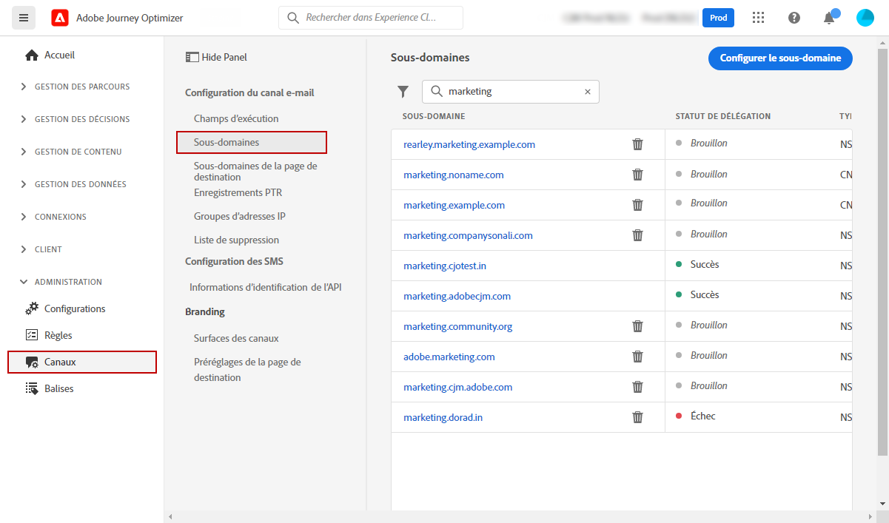
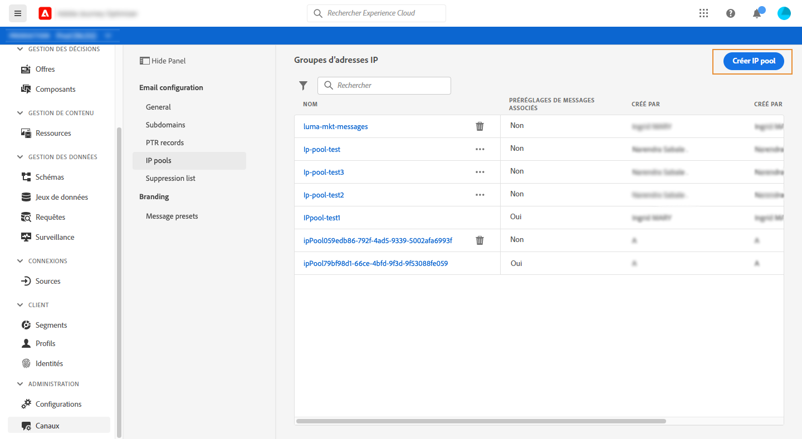
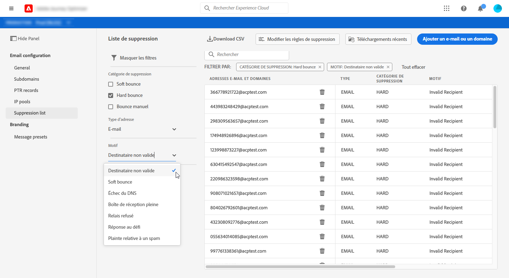

# Prise en main pour les administrateurs système {#get-started-sys-admins}

Avant de commencer à utiliser [!DNL Adobe Journey Optimizer], plusieurs étapes sont nécessaires pour préparer votre environnement. Vous devez effectuer les étapes suivantes afin que l’[ingénieur de données](data-engineer.md) et le [marketeur](marketer.md) puissent commencer à utiliser [!DNL Adobe Journey Optimizer].

En tant qu’**administrateur ou administratrice système**, vous devez **comprendre les rôles et attribuer des autorisations** pour l’administration des sandbox et la configuration des canaux. Vous devez également configurer des sandbox et les gérer pour les rôles disponibles. Vous pourrez ensuite affecter des membres de l’équipe à des rôles. Pendant que les [Ingénieurs de données](data-engineer.md) configurent les schémas et les sources de données, et les [Développeurs](developer.md) implémentent des intégrations techniques, vous vous assurez que les bonnes personnes ont accès aux bonnes fonctionnalités.

Ces fonctionnalités peuvent être gérées par les **[!UICONTROL administrateurs et administratrices de produits]** qui ont accès au produit Autorisations. [En savoir plus sur les autorisations](../../administration/permissions.md){target="_blank"}.

## Configurer l’accès et les autorisations

Pour configurer la gestion des accès, procédez comme suit :

1. **Créer des sandbox** pour partitionner vos instances en environnements virtuels distincts et isolés. Les **sandbox** sont créés dans [!DNL Journey Optimizer]. Pour en savoir plus, consultez la section [Sandbox](../../administration/sandboxes.md).

   >[!NOTE]
   >En tant qu’**administrateur ou administratrice système**, si vous ne pouvez pas voir le menu **[!UICONTROL Sandbox]** dans [!DNL Journey Optimizer], vous devez mettre à jour vos autorisations. Découvrez comment mettre à jour votre rôle sur [cette page](../../administration/permissions.md#edit-product-profile).

1. **Comprendre les rôles**. Les rôles sont des ensembles de droits unitaires qui permettent aux utilisateurs et aux utilisatrices d’accéder à certaines fonctionnalités ou à certains objets dans l’interface. En savoir plus dans la section [Rôles prêts à l’emploi](../../administration/ootb-product-profiles.md).

1. **Définissez les autorisations** pour les rôles, y compris pour les **Sandbox**, et accordez des accès aux personnes membres de votre équipe en les affectant à différents rôles. Les autorisations sont des droits unitaires qui vous permettent de définir les permissions attribuées au **[!UICONTROL rôle]**. Chaque autorisation est regroupée sous des fonctionnalités, par exemple Parcours ou Offres, ce qui représente les différentes fonctionnalités ou objets dans [!DNL Journey Optimizer]. Pour en savoir plus, consultez la section [Niveaux d’autorisation](../../administration/high-low-permissions.md).

1. **Utilisez le contrôle d’accès au niveau de l’objet** (facultatif). Appliquez les libellés d’accès aux objets tels que les parcours, les campagnes et les configurations de canal pour contrôler quels utilisateurs peuvent accéder à des ressources spécifiques. En savoir plus sur [Contrôle d’accès au niveau de l’objet (OLAC)](../../administration/object-based-access.md).

En outre, vous devez ajouter les utilisateurs et les utilisatrices qui doivent accéder à Assets Essentials aux rôles **Utilisateurs et utilisatrices clients Assets Essentials** et/ou **Utilisateurs et utilisatrices Assets Essentials**. [Pour en savoir plus, consultez la documentation sur Assets Essentials](https://experienceleague.adobe.com/docs/experience-manager-assets-essentials/help/deploy-administer.html?lang=fr){target="_blank"}.

Lors de l&#39;accès à [!DNL Journey Optimizer] pour la première fois, vous recevez un sandbox de production et un certain nombre d’adresses IP vous sont attribuées en fonction de votre contrat.

## Configuration des canaux et des messages

Pour permettre aux [marketeurs](marketer.md) de créer et d&#39;envoyer des messages, accédez au menu **ADMINISTRATION**. Parcourez le menu **[!UICONTROL Canaux]** pour configurer les paramètres des canaux.

>[!NOTE]
>En tant qu’**administrateur ou administratrice système**, si le menu **[!UICONTROL Canaux]** ne s’affiche pas dans [!DNL Journey Optimizer], mettez à jour vos autorisations dans le produit [Autorisations](../../administration/permissions.md){target="_blank"}.

Procédez comme suit :

1. **Configurez les configurations de canal**. Définissez tous les paramètres techniques requis pour les e-mails, SMS, notifications push et autres canaux :

   * Définissez **paramètres de notification push** dans la collecte de données [!DNL Adobe Experience Platform] et Adobe Experience Platform. [En savoir plus](../../push/push-gs.md)

   * Créez des **configurations de canal** pour configurer tous les paramètres techniques requis pour les canaux e-mail, SMS, push, in-app, web et autres. [En savoir plus](../../configuration/channel-surfaces.md)

   * Configurez le **canal SMS** pour configurer tous les paramètres techniques requis pour les SMS. [En savoir plus](../../sms/sms-configuration.md)

   * Gérez le nombre de jours pendant lesquels des **reprises** sont effectuées avant de transmettre des adresses e-mail à la liste de suppression. [En savoir plus](../../configuration/manage-suppression-list.md)

1. **Déléguer des sous-domaines** : pour un nouveau sous-domaine à utiliser dans Journey Optimizer, la première étape consiste à le déléguer. [En savoir plus](../../configuration/about-subdomain-delegation.md)

   

1. **Créer des groupes d’adresses IP** : améliorez la délivrabilité et la réputation de vos e-mails en regroupant les adresses IP configurées avec votre instance. [En savoir plus](../../configuration/ip-pools.md)

   

1. **Gérer les listes de suppression et d’autorisation** : améliorez votre délivrabilité grâce aux listes de suppression et d’autorisation.

   * Une [liste de suppression](../../reports/suppression-list.md) est constituée d’adresses e-mail que vous souhaitez exclure de vos diffusions, car l’envoi d’e-mails à ces contacts pourrait nuire à votre réputation d’envoi et à vos taux de diffusion. Vous pouvez surveiller toutes les adresses e-mail qui sont automatiquement exclues de l’envoi d’un parcours, telles que les adresses non valides, les adresses qui entraînent constamment des rebonds temporaires et qui pourraient nuire à la réputation de vos e-mails, ainsi que les destinataires qui demandent le classement de l’un de vos e-mails comme spam. Découvrez comment gérer la [liste de suppression](../../configuration/manage-suppression-list.md) et les [reprises](../../configuration/retries.md).

   

   * La [liste autorisée](../../configuration/allow-list.md) vous permet de spécifier des adresses e-mail ou des domaines individuels qui seront les seuls destinataires ou domaines autorisés à recevoir les e-mails que vous envoyez à partir d’un sandbox spécifique. Cela peut vous empêcher d&#39;envoyer accidentellement des e-mails à des adresses client réelles lorsque vous vous trouvez dans un environnement de test. Découvrez comment [activer la liste autorisée](../../configuration/allow-list.md).

   En savoir plus sur la gestion de la délivrabilité dans [!DNL Adobe Journey Optimizer] [sur cette page](../../reports/deliverability.md).

## Fonctionnalités supplémentaires

Au fur et à mesure que les besoins de votre entreprise se développent, tenez compte des fonctionnalités avancées suivantes :

* **Politiques de consentement** : si votre organisation a acheté Healthcare Shield ou Privacy and Security Shield, créez des politiques de consentement pour respecter les préférences des clients sur l’ensemble des canaux. [En savoir plus](../../action/consent.md)

* **Politiques de gouvernance des données** : appliquez des libellés et des politiques d’utilisation des données pour contrôler la manière dont les données sont utilisées dans les actions marketing. [En savoir plus](../../action/action-privacy.md)

* **Plans de préchauffage d’adresses IP** : augmentez progressivement les volumes d’envoi des e-mails pour renforcer la réputation de l’expéditeur auprès des fournisseurs de messagerie. [En savoir plus](../../configuration/ip-warmup-gs.md)

## Collaborer avec d’autres rôles

Votre travail administratif permet à toutes les équipes de réussir :

* **Prise en charge [Ingénieurs de données](data-engineer.md)** : octroi d’autorisations pour la gestion des données, approbation de l’accès aux sandbox et coordination sur les politiques de conservation des données

* **Activer [Développeurs](developer.md)** : fournissez les informations d’identification d’API, configurez des environnements de test pour les sandbox et approuvez les configurations de canal

* **Autoriser les [spécialistes du marketing](marketer.md)** : attribuez les autorisations appropriées pour créer des parcours et des campagnes, configurer les canaux qu’ils utiliseront et prendre en charge les environnements de test

## Restez à jour

Tenez-vous informé des dernières mises à jour de la plateforme Journey Optimizer et des modifications administratives :

* **[Notes de mise à jour](../../rn/release-notes.md)** : consultez les nouvelles fonctionnalités, les mises à jour de la plateforme, les correctifs de sécurité et les modifications de configuration publiés chaque mois
* **[Mises à jour de la documentation](../../rn/documentation-updates.md)** : suivez les modifications récentes apportées aux guides de configuration, aux mises à jour des autorisations et aux nouvelles fonctionnalités administratives.
* **Notifications de produit** : activez les notifications dans votre profil [Adobe Experience Cloud](https://experience.adobe.com/preferences){target="_blank"} pour recevoir des alertes critiques sur :
   * Fenêtres de maintenance du système et temps d’arrêt planifié
   * Mises à jour et correctifs de sécurité
   * Nouvelles fonctionnalités administratives et modifications des autorisations
   * Mises à jour des licences et des droits
   * Annonces de produits critiques

  Pour activer les notifications, cliquez sur l’icône de votre profil en haut à droite de Adobe Experience Cloud, accédez à **Préférences > Notifications**, puis configurez vos préférences de notification Journey Optimizer. En tant qu’administrateur, vous devez activer toutes les notifications système critiques.

## Étapes suivantes

Une fois l’environnement configuré :

1. **Vérifier la configuration** : vérifier que tous les membres de l’équipe peuvent accéder à leurs fonctionnalités requises
2. **Surveillance de l’utilisation** : utilisez les tableaux de bord d’administration pour suivre l’utilisation du système et identifier les problèmes
3. **Conserver les autorisations** : vérifiez et mettez à jour régulièrement les autorisations au fur et à mesure que les rôles des équipes évoluent
