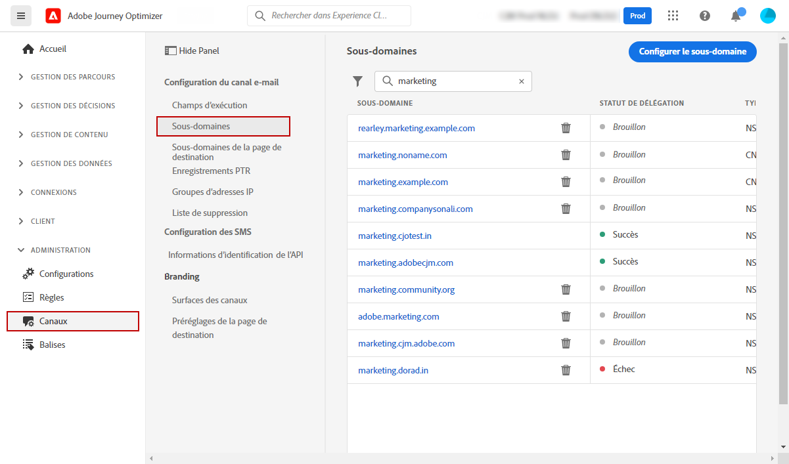
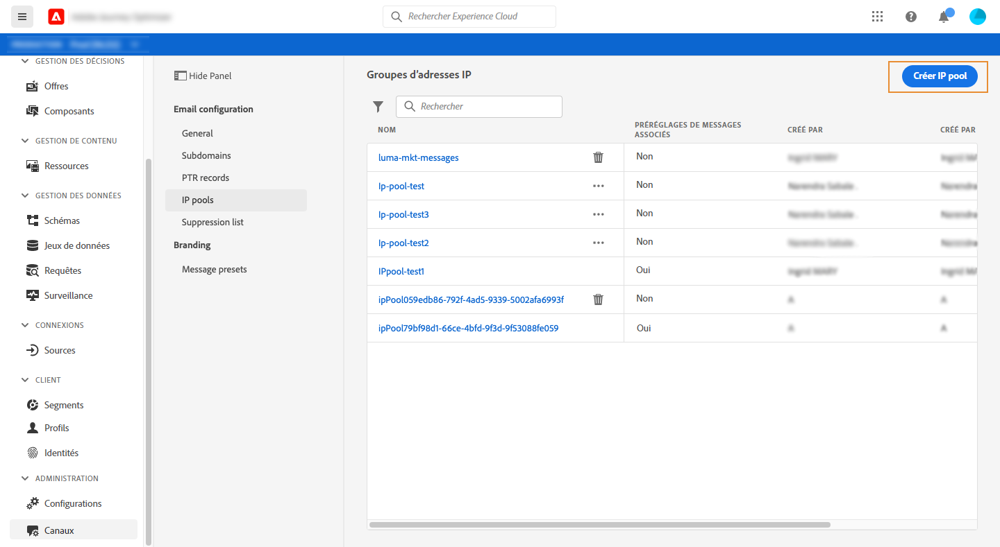
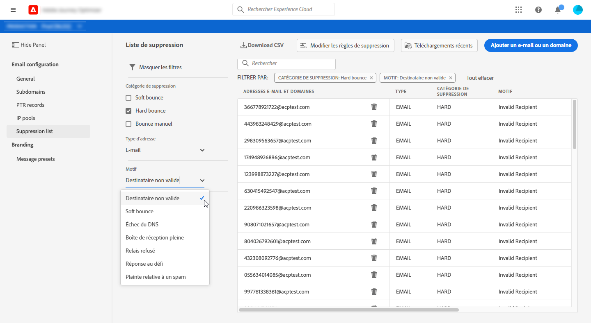

# Commencer en tant qu’administrateurs et administratrices système {#get-started-sys-admins}

En tant qu’**administrateur ou administratrice système**, vous pouvez configurer l’environnement Journey Optimizer et gérer les accès pour permettre à vos équipes de travailler efficacement et en toute sécurité. Vous effectuez les étapes de configuration essentielles pour que les [ingénieurs et ingénieures de données](data-engineer.md), les [développeurs et développeuses](developer.md) et les [responsables marketing](marketer.md) puissent commencer à utiliser [!DNL Adobe Journey Optimizer].

Vos principales responsabilités incluent la configuration des groupes d’utilisateurs et d’utilisatrices et des autorisations, la création et la gestion des sandbox pour le partitionnement des données et des parcours pour différents groupes d’utilisateurs et d’utilisatrices, ainsi que la configuration des canaux de diffusion et des préréglages de messages afin de garantir un branding cohérent dans les différents messages et ressources diffusés via Journey Optimizer. Vous vous assurez que les bonnes personnes ont accès aux bonnes fonctionnalités tout en préservant la sécurité et la gouvernance.

Ces fonctionnalités peuvent être gérées par les **[!UICONTROL administrateurs et administratrices de produits]** qui ont accès au produit Autorisations. [En savoir plus sur les autorisations](../../administration/permissions.md){target="_blank"}.

## Configurer les accès et les autorisations

Pour configurer la gestion des accès, procédez comme suit :

1. **Créer des sandbox** pour partitionner vos instances en environnements virtuels distincts et isolés. Les **sandbox** sont créés dans [!DNL Journey Optimizer]. Pour en savoir plus, consultez la section [Sandbox](../../administration/sandboxes.md).

   >[!NOTE]
   >En tant qu’**administrateur ou administratrice système**, si vous ne pouvez pas voir le menu **[!UICONTROL Sandbox]** dans [!DNL Journey Optimizer], vous devez mettre à jour vos autorisations. Découvrez comment mettre à jour votre rôle sur [cette page](../../administration/permissions.md#edit-product-profile).

1. **Comprendre les rôles**. Les rôles sont des ensembles de droits unitaires qui permettent aux utilisateurs et aux utilisatrices d’accéder à certaines fonctionnalités ou à certains objets dans l’interface. En savoir plus dans la section [Rôles prêts à l’emploi](../../administration/ootb-product-profiles.md).

1. **Définissez les autorisations** pour les rôles, y compris pour les **Sandbox**, et accordez des accès aux personnes membres de votre équipe en les affectant à différents rôles. Les autorisations sont des droits unitaires qui vous permettent de définir les permissions attribuées au **[!UICONTROL rôle]**. Chaque autorisation est regroupée sous des fonctionnalités, par exemple Parcours ou Offres, ce qui représente les différentes fonctionnalités ou objets dans [!DNL Journey Optimizer]. Pour en savoir plus, consultez la section [Niveaux d’autorisation](../../administration/high-low-permissions.md).

1. **Utilisez le contrôle d’accès au niveau de l’objet** (facultatif). Appliquez des libellés d’accès aux objets, tels que les parcours, les campagnes et les configurations de canal, afin de contrôler quels utilisateurs et utilisatrices peuvent accéder à des ressources spécifiques. En savoir plus sur le [contrôle d’accès au niveau de l’objet (OLAC)](../../administration/object-based-access.md).

En outre, vous devez ajouter les utilisateurs et les utilisatrices qui doivent accéder à Assets Essentials aux rôles **Utilisateurs et utilisatrices clients Assets Essentials** et/ou **Utilisateurs et utilisatrices Assets Essentials**. [Pour en savoir plus, consultez la documentation sur Assets Essentials](https://experienceleague.adobe.com/docs/experience-manager-assets-essentials/help/deploy-administer.html?lang=fr){target="_blank"}.

Lors du premier accès à [!DNL Journey Optimizer], vous recevez un sandbox de production et un certain nombre d’adresses IP vous sont attribuées en fonction de votre contrat.

## Configurer les canaux et les messages

Pour permettre aux [responsables marketing](marketer.md) de créer et d’envoyer des messages, accédez au menu **ADMINISTRATION**. Accédez au menu **[!UICONTROL Canaux]** pour configurer les paramètres des canaux.

>[!NOTE]
>En tant qu’**administrateur ou administratrice système**, si le menu **[!UICONTROL Canaux]** ne s’affiche pas dans [!DNL Journey Optimizer], mettez à jour vos autorisations dans le produit [Autorisations](../../administration/permissions.md){target="_blank"}.

Procédez comme suit :

1. **Paramétrez les configurations de canaux**. Définissez tous les paramètres techniques requis pour les e-mails, les SMS, les notifications push, les notifications push web, le publipostage direct et les autres canaux :

   * Définissez les **paramètres de notification push** dans [!DNL Adobe Experience Platform] et dans la collecte de données Adobe Experience Platform. [En savoir plus](../../push/push-gs.md)

   * Configurez les **notifications push web** pour diffuser des notifications aux navigateurs mobiles et de bureau. [En savoir plus](../../push/push-configuration-web.md)

   * Créez des **configurations de canal** pour configurer tous les paramètres techniques requis pour les canaux e-mail, SMS, de notifications push, in-app, web et autres. [En savoir plus](../../configuration/channel-surfaces.md)

   * Configurez le **canal SMS** pour définir tous les paramètres techniques requis pour les SMS. [En savoir plus](../../sms/sms-configuration.md)

   * Gérez le nombre de jours pendant lesquels des **reprises** sont effectuées avant de transmettre des adresses e-mail à la liste de suppression. [En savoir plus](../../configuration/manage-suppression-list.md)

   * Activez l’**export de messages** au niveau de la configuration des canaux pour archiver le contenu des e-mails et des SMS envoyés si nécessaire (offre de module complémentaire). [En savoir plus](../../configuration/message-export.md)

1. **Déléguer des sous-domaines** : pour un nouveau sous-domaine à utiliser dans Journey Optimizer, la première étape consiste à le déléguer. [En savoir plus](../../configuration/about-subdomain-delegation.md). Si nécessaire, vous pouvez migrer des sous-domaines de CNAME vers la délégation personnalisée. [En savoir plus](../../configuration/custom-subdomain-migration.md)

   

1. **Créer des groupes d’adresses IP** : améliorez la délivrabilité et la réputation de vos e-mails en regroupant les adresses IP configurées avec votre instance. [En savoir plus](../../configuration/ip-pools.md)

   

1. **Gérer les listes de suppression et d’autorisation** : améliorez votre délivrabilité grâce aux listes de suppression et d’autorisation.

   * Une [liste de suppression](../../reports/suppression-list.md) est constituée d’adresses e-mail que vous souhaitez exclure de vos diffusions, car l’envoi d’e-mails à ces contacts pourrait nuire à votre réputation d’envoi et à vos taux de diffusion. Vous pouvez surveiller toutes les adresses e-mail qui sont automatiquement exclues de l’envoi d’un parcours, telles que les adresses non valides, les adresses qui entraînent constamment des rebonds temporaires et qui pourraient nuire à la réputation de vos e-mails, ainsi que les destinataires qui demandent le classement de l’un de vos e-mails comme spam. Découvrez comment gérer la [liste de suppression](../../configuration/manage-suppression-list.md) et les [reprises](../../configuration/retries.md).

   

   * La [liste autorisée](../../configuration/allow-list.md) vous permet de spécifier des adresses e-mail ou des domaines individuels qui seront les seuls destinataires ou domaines autorisés à recevoir les e-mails que vous envoyez à partir d’un sandbox spécifique. Cela peut vous empêcher d&#39;envoyer accidentellement des e-mails à des adresses client réelles lorsque vous vous trouvez dans un environnement de test. Découvrez comment [activer la liste autorisée](../../configuration/allow-list.md).

   En savoir plus sur la gestion de la délivrabilité dans [!DNL Adobe Journey Optimizer] [sur cette page](../../reports/deliverability.md).

## Fonctionnalités supplémentaires

Au fur et à mesure que les besoins de votre entreprise se développent, envisagez d’utiliser les fonctionnalités avancées suivantes :

* **Politiques de consentement** : si votre organisation a acheté Healthcare Shield ou Privacy and Security Shield, créez des politiques de consentement pour respecter les préférences des clientes et des clients sur l’ensemble des canaux. [En savoir plus](../../action/consent.md)

* **Politiques de gouvernance des données** : appliquez des libellés et des politiques d’utilisation des données pour contrôler la manière dont les données sont utilisées dans les actions marketing. [En savoir plus](../../action/action-privacy.md)

* **Plans de préchauffage d’adresses IP** : augmentez progressivement les volumes d’envoi des e-mails pour renforcer la réputation de l’expéditeur auprès des fournisseurs de messagerie. [En savoir plus](../../configuration/ip-warmup-gs.md)

* **Heures de tranquillité** : configurez des jeux de règles pour les exclusions temporelles afin d’empêcher l’envoi de messages pendant des périodes spécifiques. [En savoir plus](../../conflict-prioritization/quiet-hours.md)

## Collaboration entre les rôles

Votre travail d’administration permet à toutes les équipes de réussir :

>[!BEGINTABS]

>[!TAB Soutenir les ingénieurs et ingénieures de données]

Collaborez avec les [ingénieures et ingénieurs de données](data-engineer.md) sur la gestion et l’accès aux données. Consultez la vue d’ensemble [Commencer avec la gestion des données](../../data/gs-data.md) pour comprendre les schémas, les jeux de données et les sources de données que vos ingénieures et ingénieurs de données doivent configurer.

* Octroyez des autorisations pour la gestion des données et la création de schémas
* Approuvez les accès aux sandbox pour le développement et les tests
* Coordonnez les politiques de conservation des données et les règles de gouvernance
* Activez l’accès aux fonctionnalités avancées telles que la composition d’audiences fédérées

>[!TAB Déployez les développeurs et développeuses]

Collaborez avec [les développeurs et développeuses](developer.md) sur l’accès aux API et le test des API :

* Fournissez les informations d’identification d’API via Adobe Developer Console
* Configurez des environnements sandbox pour le développement et les tests
* Approuvez les configurations de canal (certificats push, fournisseurs de SMS)
* Coordonnez les environnements de test et la stratégie de déploiement

>[!TAB Donnez aux responsables marketing les moyens d’agir]

Collaborez avec les [responsables marketing](marketer.md) sur les autorisations et la configuration des canaux :

* Attribuez les autorisations appropriées pour créer des parcours et des campagnes
* Configurez les canaux qu’ils utiliseront (e-mail, notification push, SMS, etc.)
* Accompagnez les environnements de test et les workflows d’approbation
* Accordez l’accès aux nouvelles fonctionnalités

>[!ENDTABS]

## Étapes suivantes

Une fois l’environnement configuré, effectuez les étapes suivantes :

1. **Vérification de la configuration** : vérifiez que tous les membres de l’équipe peuvent accéder aux fonctionnalités dont ils ont besoin
2. **Surveillance de l’utilisation** : utilisez les tableaux de bord d’administration pour suivre l’utilisation du système et identifier les problèmes
3. **Conservation des autorisations** : vérifiez et mettez à jour régulièrement les autorisations au fur et à mesure que les rôles des équipes évoluent
