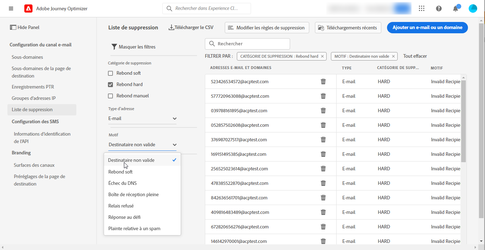

# Prise en main pour les administrateurs système {#get-started-sys-admins}

Avant de commencer à utiliser [!DNL Adobe Journey Optimizer], plusieurs étapes sont nécessaires pour préparer votre environnement.  Vous devez effectuer ces étapes de sorte que l’ [ingénieur de données](data-engineer.md) et le [praticien de Parcours](marketer.md) puissent commencer à travailler avec [!DNL Adobe Journey Optimizer].

En tant qu&#39; **administrateur système**, vous devez **comprendre les rôles et attribuer des autorisations** pour l’administration des environnements de test et la configuration des canaux. Vous devez également configurer des environnements de test et les gérer pour les rôles disponibles. Vous pourrez ensuite affecter des membres de l’équipe à des rôles.

Ces fonctionnalités peuvent être gérées par les **[!UICONTROL administrateurs de produit]** ayant accès au produit Autorisations. [En savoir plus sur les autorisations](../../administration/permissions.md){target="_blank"}.

Découvrez la gestion des accès dans les pages suivantes :

1. **Créer des sandbox** pour partitionner vos instances en environnements virtuels distincts et isolés. Les **sandbox** sont créés dans [!DNL Journey Optimizer]. Pour en savoir plus, consultez la section [Sandbox](../../administration/sandboxes.md).

   >[!NOTE]
   >En tant qu&#39; **administrateur système**, si vous ne pouvez pas voir le menu **[!UICONTROL Sandbox]** dans [!DNL Journey Optimizer], vous devez mettre à jour vos autorisations. Découvrez comment mettre à jour votre rôle dans [cette page](../../administration/permissions.md#edit-product-profile).

1. **Comprendre les rôles**. Les rôles sont un ensemble de droits unitaires qui permet aux utilisateurs d’accéder à certaines fonctionnalités ou à certains objets de l’interface. Pour en savoir plus, consultez la section [Rôles d&#39;usine](../../administration/ootb-product-profiles.md) .

1. **Définissez des autorisations** pour les rôles, y compris **Sandbox**, et accordez l’accès aux membres de votre équipe en les affectant à différents rôles. Les autorisations sont des droits unitaires qui vous permettent de définir les autorisations attribuées à **[!UICONTROL Rôle]**. Chaque autorisation est regroupée sous des fonctionnalités, par exemple Parcours ou Offres, ce qui représente les différentes fonctionnalités ou objets dans [!DNL Journey Optimizer]. Pour en savoir plus, consultez la section [Niveaux d’autorisation](../../administration/high-low-permissions.md).

En outre, vous devez ajouter aux rôles **Utilisateurs consommateurs Assets Essentials** ou/et **Utilisateurs Assets Essentials** les utilisateurs qui doivent avoir accès aux Assets Essentials. [Pour en savoir plus, consultez la documentation sur Assets Essentials](https://experienceleague.adobe.com/docs/experience-manager-assets-essentials/help/deploy-administer.html?lang=fr){target="_blank"}.

>[!NOTE]
>Pour les produits Journey Optimizer obtenus avant le 6 janvier 2022, vous devez déployer [!DNL Adobe Experience Manager Assets Essentials] pour votre organisation. Pour en savoir plus, reportez-vous à la section [Déploiement d’Assets Essentials](https://experienceleague.adobe.com/docs/experience-manager-assets-essentials/help/deploy-administer.html?lang=fr){target="_blank"}

Lorsque vous accédez à [!DNL Journey Optimizer] pour la première fois, un sandbox de production vous est alloué ainsi qu’un certain nombre d’adresses IP en fonction de votre contrat.

Pour pouvoir créer vos parcours et envoyer des messages, accédez au menu **ADMINISTRATION**. Parcourez le menu **[!UICONTROL Canaux]** pour configurer les messages et les configurations des canaux (c’est-à-dire les paramètres prédéfinis de message).

>[!NOTE]
>En tant qu&#39; **administrateur système**, si vous ne pouvez pas voir le menu **[!UICONTROL Canaux]** dans [!DNL Journey Optimizer], mettez à jour vos autorisations dans le produit [Autorisations](../../administration/permissions.md){target="_blank"}.
>

Suivez les étapes énumérées ci-dessous :

1. **Configurer les messages et les canaux** : permet de définir des configurations, d’adapter et de personnaliser les paramètres des e-mails, des SMS et des messages push.

   * Définissez **les paramètres des notifications push** dans [!DNL Adobe Experience Platform] et [!DNL Adobe Experience Platform Launch]. [En savoir plus](../../push/push-gs.md)

   * Créez des **configurations de canal** (c’est-à-dire des paramètres prédéfinis de message) pour configurer tous les paramètres techniques requis pour les e-mails, SMS et notifications push. [En savoir plus](../../configuration/channel-surfaces.md)

   * Configurez le **canal SMS** pour configurer tous les paramètres techniques requis pour les SMS. [En savoir plus](../../sms/sms-configuration.md)

   * Gérez le nombre de jours pendant lesquels des **reprises** sont effectuées avant de transmettre des adresses e-mail à la liste de suppression. [En savoir plus](../../configuration/manage-suppression-list.md)

1. **Déléguer des sous-domaines** : pour un nouveau sous-domaine à utiliser dans Journey Optimizer, la première étape consiste à le déléguer. [En savoir plus](../../configuration/about-subdomain-delegation.md)

   

1. **Créer des groupes d’adresses IP** : améliorez la délivrabilité et la réputation de vos e-mails en regroupant les adresses IP configurées avec votre instance. [En savoir plus](../../configuration/ip-pools.md)

   

1. **Gérer les listes de suppression et d’autorisation** : améliorez votre délivrabilité grâce aux listes de suppression et d’autorisation.

   * Une [liste de suppression](../../reports/suppression-list.md) est constituée d’adresses e-mail que vous souhaitez exclure de vos diffusions, car l’envoi d’e-mails à ces contacts pourrait nuire à votre réputation d’envoi et à vos taux de diffusion. Vous pouvez surveiller toutes les adresses e-mail qui sont automatiquement exclues de l’envoi d’un parcours, telles que les adresses non valides, les adresses qui entraînent constamment des rebonds temporaires et qui pourraient nuire à la réputation de vos e-mails, ainsi que les destinataires qui demandent le classement de l’un de vos e-mails comme spam. Découvrez comment gérer la [liste de suppression](../../configuration/manage-suppression-list.md) et les [reprises](../../configuration/retries.md).

   

   * La [liste autorisée](../../configuration/allow-list.md) vous permet de spécifier des adresses e-mail ou des domaines individuels qui seront les seuls destinataires ou domaines autorisés à recevoir les e-mails que vous envoyez à partir d’un sandbox spécifique. Cela peut vous empêcher d&#39;envoyer accidentellement des e-mails à des adresses client réelles lorsque vous vous trouvez dans un environnement de test. Découvrez comment [activer la liste autorisée](../../configuration/allow-list.md).

   En savoir plus sur la gestion de la délivrabilité dans [!DNL Adobe Journey Optimizer] [sur cette page](../../reports/deliverability.md).
