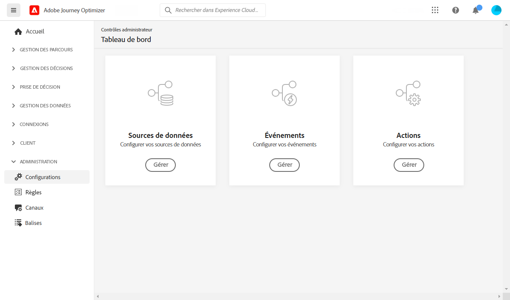

# Prise en main pour l’ingénieur de données {#data-engineer}

En tant qu’**architecte de données** ou **ingénieur ou ingénieure de données**, vous configurez et gérez les données de profil client et d’autres sources de données sur lesquelles sont basées les expériences orchestrées par [!DNL Journey Optimizer]. Cela inclut l’intégration de toutes les données de vos clientes et clients et de votre entreprise dans une vue unifiée à 360 degrés du client ou de la cliente, ces données pouvant provenir de sources web, hors ligne ou d’un CRM. Vous modélisez les données de profil client et les données d’entreprise dans des schémas, configurez les connecteurs de sources pour l’ingestion de données et vous vous assurez du bon fonctionnement du flux de données pour permettre l’obtention d’informations sur les clientes et clients et un engagement en temps réel. Vous pouvez commencer à utiliser [!DNL Adobe Journey Optimizer] une fois que l’[administrateur ou l’administratrice système](administrator.md) vous a accordé l’accès et a préparé votre environnement.

>[!NOTE]
>
>En savoir plus sur l’**ingestion de données** dans la [documentation Adobe Experience Platform](https://experienceleague.adobe.com/docs/experience-platform/ingestion/home.html?lang=fr){target="_blank"}.

## Étapes essentielles de configuration des données

Pour configurer la base de données de Journey Optimizer, procédez comme suit :

1. **Créez des espaces de noms d’identités**. Dans Adobe [!DNL Journey Optimizer], les **Identités** relient les consommateurs sur les différents appareils et canaux, ce qui permet d’obtenir un graphique d’identité. Le graphique d’identité associé est utilisé pour personnaliser les expériences en fonction des interactions entre tous les points de contact de votre entreprise. En savoir plus sur les identités et les espaces de noms d’identité [sur cette page](../../audience/get-started-identity.md).

   En outre, configurez des **identifiants supplémentaires** pour permettre au même profil de rejoindre plusieurs instances de parcours à l’aide d’identifiants secondaires tels que les identifiants de commande ou de réservation. En savoir plus sur les [identifiants supplémentaires](../../building-journeys/supplemental-identifier.md).

1. **Créez des schémas** et activez-les pour les profils. Un schéma est un jeu de règles qui représente et valide la structure et le format des données. À un niveau élevé, les schémas fournissent une définition abstraite d’un objet du monde réel (une personne, par exemple) et indiquent les données à inclure dans chaque instance de cet objet (comme le prénom, le nom, la date d’anniversaire, etc.).

   * Pour les parcours et campagnes standard : utilisez des [schémas XDM](../../data/get-started-schemas.md).
   * Pour les campagnes orchestrées : créez des [schémas relationnels](../../orchestrated/gs-schemas.md) pour activer la segmentation d’entités multiples.

1. **Créez des jeux de données** et activez-les pour les profils. Un jeu de données est une structure de stockage et de gestion pour une collection de données, généralement sous la forme d’un tableau, qui contient un schéma (des colonnes) et des champs (des lignes). Les jeux de données contiennent également des métadonnées qui décrivent divers aspects des données stockées. Une fois qu’un jeu de données est créé, vous pouvez le mapper à un schéma existant et y ajouter des données. En savoir plus sur les jeux de données sur [cette page](../../data/get-started-datasets.md).

   Pour les scénarios avancés, préparez les **jeux de données pour des recherches d’exécution** afin d’enrichir l’exécution du parcours avec des données en temps réel à partir de jeux de données d’enregistrements. En savoir plus sur la [recherche de jeux de données](../../building-journeys/dataset-lookup.md).

1. **Configurez les connecteurs source**. Adobe Journey Optimizer permet d’ingérer des données à partir de sources externes tout en vous permettant de structurer, de libeller et d’améliorer les données entrantes à l’aide des services de Platform. Vous pouvez ingérer des données provenant de diverses sources telles que les applications Adobe, les stockages dans le cloud, les bases de données, etc. En savoir plus sur les connecteurs source [sur cette page](../get-started-sources.md).

1. **Création de profils de test**. Les profils de test sont requis lors de l’utilisation du [mode test](../../building-journeys/testing-the-journey.md) dans un parcours et pour [prévisualiser et tester vos messages](../../content-management/preview-test.md) avant l’envoi. Les étapes de création des profils de test sont présentées [dans cette page](../../audience/creating-test-profiles.md).

1. **Configurez les attributs calculés** (facultatif). Créez des attributs dérivés à partir des données de profil pour simplifier la segmentation et la personnalisation. Les attributs calculés calculent automatiquement des mesures complexes telles que le « total des achats au cours des 90 derniers jours » ou la « valeur de commande moyenne ». En savoir plus sur les [attributs calculés](../../audience/computed-attributes.md).

De plus, pour pouvoir envoyer des messages dans des parcours, vous devez configurer les **[!UICONTROL sources de données]**, les **[!UICONTROL événements]** et les **[!UICONTROL actions]**. En savoir plus dans [cette section](../../configuration/about-data-sources-events-actions.md).

* La configuration des **sources de données** vous permet de définir une connexion à un système afin de récupérer des informations supplémentaires qui seront utilisées dans vos parcours. En savoir plus sur les sources de données [dans cette section](../../datasource/about-data-sources.md).

* **Les événements vous permettent de déclencher vos parcours de manière unitaire pour envoyer des messages, en temps réel, à l&#39;individu progressant dans le parcours.** Dans la configuration des événements, vous configurez les événements attendus dans les parcours. Les données des événements entrants sont normalisées conformément au modèle de données Adobe Experience (XDM). Les événements authentifiés et non authentifiés proviennent des API d&#39;ingestion en flux continu (notamment ceux issus du kit de développement Adobe Mobile SDK). En savoir plus sur les événements [dans cette section](../../event/about-events.md).

* [!DNL Journey Optimizer] est fourni avec des fonctionnalités de message intégrées : vous pouvez créer vos messages dans un parcours et concevoir votre contenu. Si vous utilisez un système tiers pour envoyer vos messages, par exemple Adobe Campaign, créez une **action personnalisée**. En savoir plus sur les actions dans [cette section](../../action/action.md).

## Surveiller et analyser les données de parcours

Une fois les parcours en cours d’exécution, vous pouvez interroger les événements d’étape de parcours dans le lac de données pour surveiller les performances, résoudre les problèmes et analyser le comportement des clientes et clients. Utilisez des requêtes SQL pour analyser les éléments suivants :

* Comportements d’entrée et de sortie des profils
* Taux d’erreurs et raisons des rejets
* Performances du traitement de l’export de lecture d’audience
* Mesures de performances des actions personnalisées
* États et goulets d’étranglement des instances de parcours

Explorez des [exemples de requêtes prêts à l’emploi pour l’analyse de parcours](../../reports/query-examples.md) afin de commencer à analyser les données et à résoudre les problèmes.

## Collaboration entre les rôles

Votre travail de configuration des données est essentiel pour les autres équipes :

>[!BEGINTABS]

>[!TAB Collaborer avec les administrateurs et administratrices]

Collaborez avec les [administrateurs et les administratrices](administrator.md) sur l’accès et la gouvernance :

* Demandez les autorisations requises pour la gestion des données et la création de schémas.
* Coordonnez l’accès aux sandbox pour le développement et les tests.
* Alignez-vous sur les politiques de gouvernance des données et la gestion du consentement.
* Discutez des politiques de conservation des données et des exigences en matière de stockage.

>[!TAB Collaborer avec les développeurs et développeuses]

Collaborez avec [les développeurs et développeuses](developer.md) sur la structure des données et les événements :

* Fournissez les schémas XDM et les structures d’événement qu’ils doivent implémenter.
* Définissez les événements à envoyer et le format requis de leur payload.
* Alignez-vous sur les exigences en matière de collecte de données et les normes de qualité des données.
* Testez conjointement la diffusion des événements et l’ingestion des données.

>[!TAB Collaborer avec les responsables marketing]

Collaborez avec les [responsables marketing](marketer.md) sur les audiences et les données :

* Créez des attributs calculés pour la personnalisation et la segmentation.
* Créez des audiences en fonction des exigences de leurs campagnes et de leurs parcours.
* Créez des schémas relationnels pour les campagnes orchestrées.
* Utilisez la segmentation d’entités multiples pour les cas d’utilisation avancés.

>[!ENDTABS]
