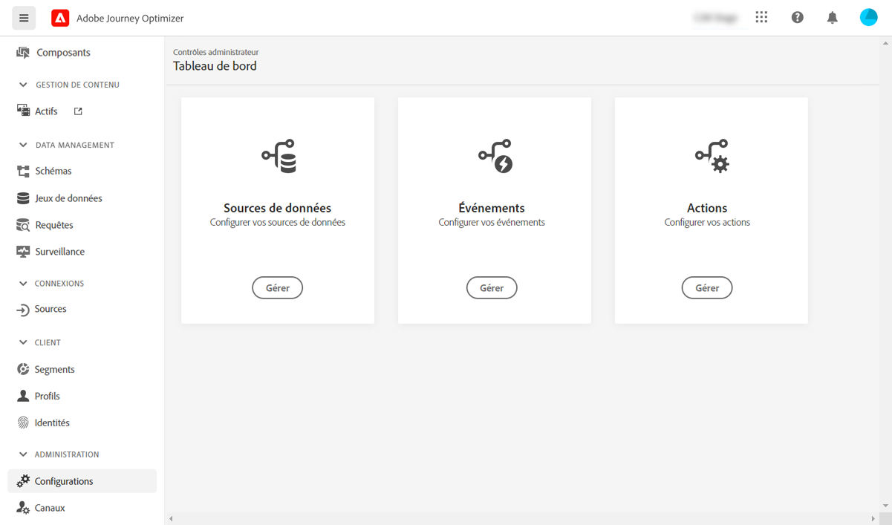

# Prise en main pour l’ingénieur de données {#data-engineer}

En tant qu’**ingénieur de données d’Adobe Journey Optimizer**, préparez et conservez les données de profil client pour alimenter les expériences orchestrées par [!DNL Journey Optimizer], modélisez les données clients et commerciales dans les schémas et configurez les connecteurs source pour l’ingestion de données. Vous pouvez commencer à utiliser [!DNL Adobe Journey Optimizer] une fois que l’[administrateur système](administrator.md) vous a accordé l’accès et a préparé votre environnement.

Découvrez comment **identifier des données et créer un schéma et un jeu de données** pour intégrer vos données dans Adobe Experience Platform sur cette page.

>[!NOTE]
>
>En savoir plus sur l’**ingestion de données** dans la [documentation Adobe Experience Platform](https://experienceleague.adobe.com/docs/experience-platform/ingestion/home.html?lang=fr){target="_blank"}.

Les étapes de création d’un espace de noms d’identité et d’un jeu de données activé pour les profils, ainsi que les profils de test sont détaillés dans les sections ci-dessous :

1. **Création d’un espace de noms d’identité**. Dans Adobe [!DNL Journey Optimizer], les **Identités** relient les consommateurs sur les différents appareils et canaux, on obtient ainsi un graphique d’identités. Le graphique d’identités lié est utilisé pour personnaliser les expériences en fonction des interactions entre tous les points de contact de votre entreprise.  En savoir plus sur les identités et les espaces de noms d’identité [sur cette page](../../audience/get-started-identity.md).

1. **Créer un schéma** et l’activer pour les profils. Un schéma est un jeu de règles qui représente et valide la structure et le format des données. À un niveau élevé, les schémas fournissent une définition abstraite d’un objet du monde réel (une personne, par exemple) et indiquent les données à inclure dans chaque instance de cet objet (comme le prénom, le nom, la date d’anniversaire, etc.).  En savoir plus sur les schémas [sur cette page](../../data/get-started-schemas.md).

1. **Créer des jeux de données** et les activer pour les profils. Un jeu de données est une structure de stockage et de gestion pour une collection de données, généralement sous la forme d’un tableau, qui contient un schéma (des colonnes) et des champs (des lignes). Les jeux de données contiennent également des métadonnées qui décrivent divers aspects des données stockées. Une fois qu’un jeu de données est créé, vous pouvez le mapper à un schéma existant et y ajouter des données. En savoir plus sur les jeux de données sur [cette page](../../data/get-started-datasets.md).

1. **Configuration des connecteurs source**. Adobe Journey Optimizer permet d’ingérer des données à partir de sources externes tout en vous permettant de structurer, de libeller et d’améliorer les données entrantes à l’aide des services de Platform. Vous pouvez ingérer des données provenant de diverses sources telles que les applications Adobe, les stockages dans le cloud, les bases de données, etc. En savoir plus sur les connecteurs source [sur cette page](../get-started-sources.md).

1. **Création de profils de test**. Les profils de test sont requis lors de l’utilisation du [mode test](../../building-journeys/testing-the-journey.md) dans un parcours et pour [prévisualiser et tester vos messages](../../content-management/preview-test.md) avant l’envoi. Les étapes de création des profils de test sont présentées [dans cette page](../../audience/creating-test-profiles.md).

En outre, pour pouvoir envoyer des messages dans des parcours, vous devez configurer les **[!UICONTROL sources de données]**, les **[!UICONTROL événements]** et les **[!UICONTROL actions]**. En savoir plus dans [cette section](../../configuration/about-data-sources-events-actions.md).

* La configuration des **sources de données** vous permet de définir une connexion à un système afin de récupérer des informations supplémentaires qui seront utilisées dans vos parcours. En savoir plus sur les sources de données [dans cette section](../../datasource/about-data-sources.md).

* **Les événements vous permettent de déclencher vos parcours de manière unitaire pour envoyer des messages, en temps réel, à l&#39;individu progressant dans le parcours.** Dans la configuration des événements, vous configurez les événements attendus dans les parcours. Les données des événements entrants sont normalisées conformément au modèle de données Adobe Experience (XDM). Les événements authentifiés et non authentifiés proviennent des API d&#39;ingestion en flux continu (notamment ceux issus du kit de développement Adobe Mobile SDK). En savoir plus sur les événements [dans cette section](../../event/about-events.md).

* [!DNL Journey Optimizer] est fourni avec des fonctionnalités de message intégrées : vous pouvez créer vos messages dans un parcours et concevoir votre contenu. Si vous utilisez un système tiers pour envoyer vos messages, par exemple Adobe Campaign, créez une **action personnalisée**. En savoir plus sur les actions [dans cette section](../../action/action.md).
