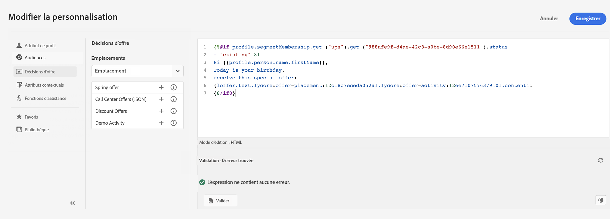
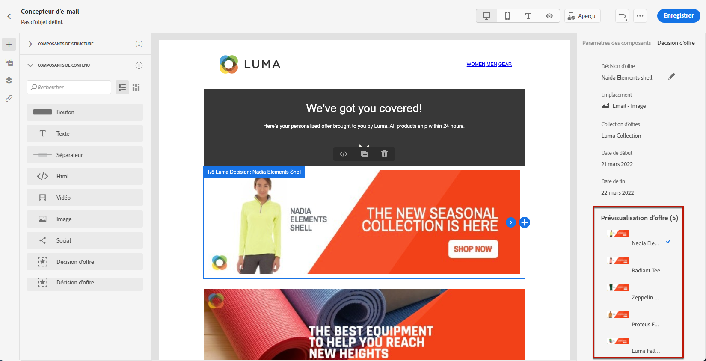
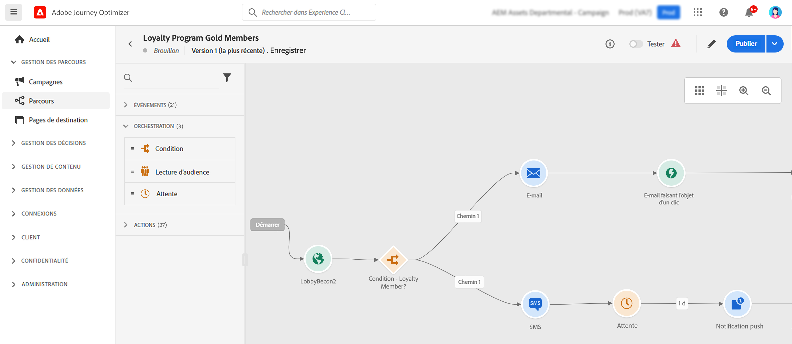

# Prise en main pour les responsables marketing {#get-started-marketers}

En tant que **responsable marketing** ou qu’**utilisateur ou utilisatrice professionnel**, vous concevez des parcours client pour offrir à votre clientèle des expériences personnelles et contextuelles. Vous créez et gérez tous les différents composants de ces parcours personnalisés, notamment les e-mails et les messages push, les offres et les composants de décision, afin de personnaliser intelligemment le contenu des messages. Journey Optimizer offre une expérience client unifiée où vous pouvez mettre en œuvre des cas d’utilisation de bout en bout de manière centralisée. Vous pouvez commencer à utiliser [!DNL Adobe Journey Optimizer] une fois que l’[administrateur ou l’administratrice système](administrator.md) et l’[ingénieur ou l’ingénieure de données](data-engineer.md) vous ont accordé l’accès et ont préparé votre environnement.

## Commencer avec les principes de base

Journey Optimizer réunit des informations sur la clientèle en temps réel, une orchestration omnicanale moderne et une prise de décision intelligente dans une seule application. Créez des expériences client personnalisées et connectées par e-mail, SMS, notification push web, in-app, web, courrier, cartes de contenu, etc.

Journey Optimizer propose deux approches d’orchestration puissantes :

* **Parcours** : engagement individuel et en temps réel, où chaque client ou cliente évolue à son propre rythme, en fonction de son comportement ou d’événements.
* **Campagnes orchestrées** : campagnes par lots complexes et en plusieurs étapes à grande échelle où les audiences progressent ensemble par le biais de workflows : idéales pour les campagnes lancées par une marque comme les promotions saisonnières, les lancements de produits ou les communications basées sur des comptes.

Collaborez avec vos [administrateurs et administratrices](administrator.md) pour obtenir les accès et avec les [ingénieurs et ingénieures de données](data-engineer.md) pour configurer des audiences, des données et des schémas relationnels pour la segmentation avancée.

Pour commencer à créer des expériences, suivez les étapes essentielles suivantes :

1. **Créer des audiences** Créez des audiences par le biais de définitions de segments, en chargeant des fichiers CSV ou via la composition d’audiences. Journey Optimizer offre plusieurs façons de cibler les bons clients et clientes. En savoir plus sur les [audiences](../../audience/about-audiences.md) et [la création de définitions de segments](../../audience/creating-a-segment-definition.md).

1. **Concevoir du contenu** Créez des messages attrayants sur tous les canaux, y compris les e-mails, SMS, notifications push web, in-app, web, courrier et cartes de contenu :
   * Utilisez l’**assistant IA** pour générer le contenu, les objets et les images des e-mails en fonction des directives de votre marque. [En savoir plus sur la génération de contenu par l’IA](../../content-management/gs-generative.md)
   * **Personnalisez les messages** avec des données client, du contenu dynamique et une logique conditionnelle. [En savoir plus sur la personnalisation](../../personalization/personalize.md)
   * **Effectuez une itération sur des données contextuelles** pour afficher des listes dynamiques à partir d’événements, d’actions personnalisées et de recherches dans des jeux de données. [En savoir plus sur l’itération de données contextuelles](../../personalization/iterate-contextual-data.md)
   * Créez des **modèles de contenu** et des **fragments** réutilisables pour conserver la cohérence de la marque. [Utiliser des modèles](../../content-management/content-templates.md)
   * Diffusez des **cartes de contenu** persistantes et non intrusives dans les applications mobiles et les sites web. Contrairement aux notifications push, les cartes de contenu restent visibles jusqu’à ce qu’elles soient fermées manuellement. [En savoir plus sur les cartes de contenu](../../content-card/create-content-card.md)
   * Gérez les ressources avec l’intégration d’**Adobe Experience Manager Assets**. [En savoir plus sur les ressources](../../integrations/assets.md)

   

1. **Ajouter des offres et des prises de décision** Proposez la meilleure offre à chaque client ou cliente au bon moment à l’aide de la prise de décision basée sur l’IA. Utilisez Decisioning pour personnaliser les notifications push, les SMS et d’autres canaux. En savoir plus sur la [gestion des décisions](../../offers/get-started/starting-offer-decisioning.md) et les [décisions pour les expériences](../../experience-decisioning/gs-experience-decisioning.md).

   

1. **Tester et valider**. Prévisualisez et testez le contenu avant l’envoi :
   * Utilisez des **profils de test** pour prévisualiser la personnalisation et vérifier le rendu sur tous les appareils.
   * Testez avec des **exemples de données** provenant de fichiers CSV/JSON.
   * Prévisualisez le **rendu des e-mails** sur les principaux clients de messagerie.
   * Exécutez des tests **A/B et des expériences** pour optimiser les variations de contenu. Utilisez l’expérimentation du bandit manchot pour affecter automatiquement davantage de trafic aux variations gagnantes en temps réel. [En savoir plus sur l’expérimentation](../../content-management/content-experiment.md)
   * Configurez des **workflows d’approbation** pour les campagnes et les parcours (une licence supplémentaire est requise). [En savoir plus sur les approbations](../../test-approve/gs-approval.md)

   Découvrez comment [tester et valider des messages](../../content-management/preview-test.md).

1. **Créer des parcours client** Créez des expériences personnalisées en temps réel à l’aide de la zone de travail du parcours. Utilisez **Journey Agent** dans l&#39;assistant AI pour créer des parcours à partir d&#39;invites en langage naturel. [En savoir plus sur Journey Agent](../ai-features.md#journey-agent)

   * Déclenchez des parcours avec des **événements** (actions client) ou des **audiences** (envois par lots).
   * Ajoutez des **conditions** pour créer des chemins personnalisés en fonction des données client.
   * Utilisez l’activité **Action** unifiée pour toutes les actions de canal (e-mail, notification push, SMS, etc.). [En savoir plus sur l’activité Action](../../building-journeys/journey-action.md)
   * Ajoutez l’**activité de décision de contenu** pour intégrer des offres personnalisées directement dans votre flux de parcours. [En savoir plus sur l’activité de décision de contenu](../../building-journeys/content-decision.md)
   * Utilisez des **activités d’attente** pour créer le timing parfait entre les messages.
   * Envoyez des messages sur **plusieurs canaux** dans un seul parcours.
   * Utilisez **l’envoi de vagues** pour envoyer des messages par lots contrôlés (disponibilité limitée pour les parcours).
   * Effectuez des **tests A/B** et optimisez les heures d’envoi pour maximiser l’engagement.
   * Utilisez la **recherche dans les jeux de données** pour enrichir les parcours avec des données en temps réel issues d’Adobe Experience Platform. [En savoir plus sur la recherche dans des jeux de données](../../building-journeys/dataset-lookup.md)
   * Utilisez des **identifiants supplémentaires** pour permettre au même profil de rejoindre plusieurs instances de parcours (par exemple, différentes commandes ou réservations). [En savoir plus sur les identifiants supplémentaires](../../building-journeys/supplemental-identifier.md)

   

   Découvrez comment [concevoir et exécuter des parcours](../../building-journeys/journey-gs.md) et explorez des [cas d’utilisation de parcours](../../building-journeys/jo-use-cases.md). Découvrez les [critères d’entrée/de sortie &#x200B;](../../building-journeys/entry-exit-criteria-guide.md) pour contrôler les flux des profils.

1. **Lancer des campagnes orchestrées** Concevez des campagnes par lots complexes et en plusieurs étapes à grande échelle à l’aide d’une zone de travail visuelle :

   * Créez des **audiences à la demande** en utilisant instantanément des requêtes relationnelles pour connecter les données client à des comptes, des achats, des abonnements et d’autres entités.
   * Créez une **segmentation d’entités multiples** pour un ciblage précis (par exemple, « clients et clientes avec des abonnements expirant dans 30 jours » ou « comptes ayant effectué des achats récents à forte valeur »).
   * Obtenez de la **visibilité avant l’envoi** avec une évaluation précise de la taille des audiences avant le lancement.
   * Concevez des **workflows à plusieurs étapes** pour les promotions saisonnières, les lancements de produits, les offres de fidélité ou le marketing basé sur les comptes.
   * Planifiez des campagnes pour qu’elles s’exécutent immédiatement, à des heures spécifiques ou selon des planifications récurrentes (quotidiennes, hebdomadaires, mensuelles).
   * Traitez les audiences **par lots**, avec tous les profils progressant ensemble tout au long du workflow.
   * Utilisez **l’envoi de vagues** pour diffuser des messages par lots contrôlés afin d’améliorer la délivrabilité et le contrôle de la charge

   Découvrez comment [commencer à utiliser les campagnes orchestrées](../../orchestrated/gs-orchestrated-campaigns.md) et quand [utiliser des campagnes plutôt que des parcours](../../orchestrated/orchestrated-campaigns-faq.md).

1. **Surveiller et optimiser** Effectuez un suivi des performances et améliorez les résultats au fil du temps :
   * Surveillez les performances des **parcours actifs** et identifiez les goulets d’étranglement.
   * Analysez les taux de **diffusion des messages** et les mesures d’engagement.
   * Utilisez les **tableaux de bord de rapports** avec l’intégration de Customer Journey Analytics.
   * Suivez la **conversion** et l’impact commercial.
   * Gérez la **fréquence et hiérarchisation des messages** avec des règles de gestion des conflits pour éviter la surcommunication
   * Utilisez des **heures creuses** (exclusions temporelles) pour éviter les envois pendant des périodes spécifiques. [En savoir plus sur la gestion des conflits](../../conflict-prioritization/gs-conflict-prioritization.md) et [les heures calmes](../../conflict-prioritization/quiet-hours.md)

   Découvrez comment [surveiller les performances](../../reports/report-gs-cja.md).

## Bonnes pratiques pour atteindre le succès

### Création de contenu

* **Commencez avec des modèles** : utilisez des modèles et des fragments de contenu préconfigurés pour accélérer la création et maintenir la cohérence.
* **Testez dès le début et testez souvent** : prévisualisez toujours le contenu sur les différents appareils et utilisez des profils de test pour valider la personnalisation.
* **Exploitez l’IA à bon escient** : utilisez l’assistant IA pour les brouillons initiaux et les variations, mais examinez et affinez toujours les résultats en fonction de la charte de votre marque.
* **Restez simple** : des messages clairs et concis avec de forts appels à l’action ont de meilleurs résultats que des mises en page complexes.

### Conception de parcours

* **Définissez des objectifs clairs** : établissez des mesures de succès avant de créer votre parcours.
* **Mappez l’expérience client** : visualisez l’ensemble du parcours avant son implémentation.
* **Utilisez les activités d’attente de manière stratégique** : donnez aux clientes et aux clients le temps d’interagir avant d’envoyer des actions de suivi.
* **Planifiez des stratégies de sortie** : définissez quand et pourquoi les clientes et les clients doivent quitter le parcours.
* **Testez en mode brouillon** : validez la logique de parcours via un test à blanc avant de l’activer.

[Découvrez les bonnes pratiques en matière de parcours](../../building-journeys/entry-exit-criteria-guide.md#best-practices)

### Orchestration de campagnes

* **Choisissez la bonne approche** : [comparez les types de parcours](../../building-journeys/journey.md#journey-types) pour des expériences en temps réel déclenchées par un comportement ou les [types de campagnes](../../campaigns/get-started-with-campaigns.md#campaign-types) pour des campagnes planifiées et par lots.
* **Définissez des objectifs de campagne clairs** : établissez des objectifs avant de concevoir des workflows à plusieurs étapes.
* **Commencez avec des audiences pilotes** : validez les quantités et la logique de segmentation avant de travailler à grande échelle.
* **Utilisez les données relationnelles** : utilisez la segmentation d’entités multiples pour connecter les données client aux comptes, aux achats et aux abonnements pour un ciblage précis.
* **Concevez une segmentation simple** : optimisez les performances et la transparence grâce à des règles claires et faciles à gérer.
* **Utilisez des noms cohérents** : facilitez la gestion des campagnes grâce à des conventions de nommage claires.

### Ciblage des audiences

* **Segmentez de manière réfléchie** : créez des segments d’audience ciblés, spécifiques et exploitables selon des critères clairs.
* **Actualisez régulièrement** : assurez-vous que les audiences restent à jour en définissant des plannings d’évaluation appropriés.
* **Équilibrez taille et précision** : ciblez des audiences suffisamment grandes pour disposer d’une signification statistique, mais suffisamment spécifiques pour être pertinentes.
* **Utilisez des attributs d’enrichissement** : utilisez les attributs calculés et les données d’enrichissement pour une personnalisation plus approfondie.

### Gestion de la fréquence

* **Respectez les préférences des clientes et clients** : respectez les désinscriptions et les préférences de communication.
* **Définissez des limites de fréquence** : utilisez des ensembles de règles pour éviter la lassitude due aux messages sur les différents canaux.
* **Coordonnez les campagnes** : utilisez la gestion des conflits pour vous assurer que les clientes et les clients reçoivent le message approprié au bon moment.
* **Surveillez l’engagement** : surveillez les signes de lassitude (baisse des taux d’ouverture, augmentation des désabonnements).

[En savoir plus sur le capping de la fréquence](../../conflict-prioritization/channel-capping.md)

## Explorer les cas d’utilisation

Découvrez les fonctionnalités de Journey Optimizer à partir d’exemples concrets :

**Cas d’utilisation de parcours** (temps réel, de type « un à un ») :

* **Série de bienvenue** : intégrez de nouveaux clients et clientes avec des parcours personnalisés à plusieurs étapes. [Afficher le cas d’utilisation](https://experienceleague.adobe.com/fr/docs/journey-optimizer-learn/tutorials/use-cases/customer-onboarding)
* **Récupération de panier abandonné** : générez à nouveau de l’engagement chez les clientes et les clients qui ont laissé des articles dans leur panier. [Afficher le cas d’utilisation](https://experienceleague.adobe.com/fr/docs/journey-optimizer-learn/tutorials/use-cases/abandoned-cart)
* **Messagerie pilotée par les événements** : répondez aux actions des clientes et des clients en temps réel.
* **Campagnes d’anniversaire** : envoyez des messages d’anniversaire personnalisés déclenchés par les dates des profils.
* **Recommandations de produits** : suggérez des produits pertinents en fonction de l’historique de navigation et d’achat.

**Cas pratiques de campagnes orchestrées** (par lots, de type « un à plusieurs ») :

* **Promotions saisonnières** : lancez des campagnes coordonnées sur plusieurs segments de clientèle (par exemple, soldes saisonnières, rentrée scolaire).
* **Lancements de produits** : annoncez de nouveaux produits auprès d’audiences ciblées avec des messages séquencés.
* **Offres du programme de fidélité** : récompensez les clientes et les clients à forte valeur ajoutée par des offres échelonnées en fonction de l’historique des achats.
* **Marketing basé sur les comptes** : ciblez les comptes présentant des caractéristiques spécifiques et des contacts pertinents.
* **Renouvellements d’abonnements** : contactez les clientes et les clients dont les abonnements expirent bientôt à l’aide de requêtes à entités multiples.
* **Campagnes de réengagement** : récupérez les clients et clientes inactifs avec des offres ciblées par lots. [Afficher le cas d’utilisation](https://experienceleague.adobe.com/fr/docs/experience-platform/rtcdp/use-cases/personalization-insights-engagement/use-cases-luma)

**Modèles de parcours :**

* [Envoyez des messages aux personnes abonnées](../../building-journeys/message-to-subscribers-uc.md) : ciblez les listes d’abonnements avec du contenu personnalisé.
* [Messagerie multicanal](../../building-journeys/journeys-uc.md) : combinez les e-mails et les notifications push avec des événements de réaction.
* [Envoi d’e-mails uniquement en semaine](../../building-journeys/weekday-email-uc.md) : planifiez vos communications à l’aide de conditions de date.

Parcourez l’ensemble de la [bibliothèque de cas d’utilisation de parcours](../../building-journeys/jo-use-cases.md) et découvrez plus en détail les [campagnes orchestrées](../../orchestrated/gs-orchestrated-campaigns.md).

## Collaboration entre les rôles

Votre travail de marketing est relié aux autres équipes :

>[!BEGINTABS]

>[!TAB Collaborer avec les ingénieurs et ingénieures de données]

Collaborez avec les [ingénieurs et ingénieures de données](data-engineer.md) sur les configurations de données et d’audience :

* Demandez de nouveaux attributs calculés pour la personnalisation et la segmentation.
* Coordonnez des schémas relationnels pour les campagnes orchestrées.
* Rédigez des commentaires sur la qualité de l’audience et la précision des données.
* Alignez-vous sur les exigences en matière de données d’entités multiples pour la segmentation avancée.

>[!TAB Collaborer avec les développeurs et développeuses]

Collaborez avec [les développeurs et développeuses](developer.md) sur le suivi et l’implémentation des événements :

* Déterminez quelles interactions utilisateur doivent déclencher des événements de parcours.
* Testez les implémentations web et mobiles avant le lancement.
* Validez le suivi pour les performances du contenu et l’interaction client.
* Résolvez les problèmes liés à la diffusion ou à la personnalisation des messages.

>[!TAB Collaborer avec les administrateurs et administratrices]

Collaborez avec les [administrateurs et les administratrices](administrator.md) sur les accès et les configurations :

* Demandez des configurations de canal pour vos campagnes et vos parcours.
* Confirmez l’accès aux licences pour les campagnes orchestrées et les autres fonctionnalités.
* Signalez les problèmes liés aux autorisations ou aux accès.
* Coordonnez la mise en place de nouvelles fonctionnalités et les environnements de test.

>[!ENDTABS]

## Étapes suivantes

1. **Commencez simplement** : créez un parcours de bienvenue simple ou une campagne à message unique pour apprendre à utiliser la plateforme.
2. **Utilisez l’IA** : utilisez l’assistant IA pour poser des questions et accélérer la création de contenu.
3. **Rejoignez la communauté** : discutez avec d’autres utilisateurs et utilisatrices de Journey Optimizer dans la [communauté Experience League](https://experienceleaguecommunities.adobe.com/t5/journey-optimizer/ct-p/journey-optimizer){target="_blank"}.
4. **Explorez les tutoriels** : regardez des vidéos détaillées sur [Experience League](https://experienceleague.adobe.com/docs/journey-optimizer-learn/tutorials/overview.html?lang=fr){target="_blank"}.
