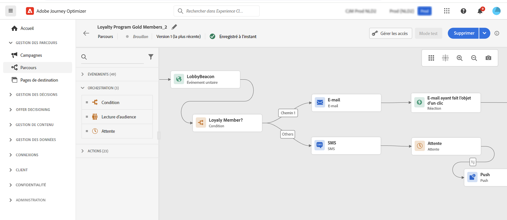

# Prise en main pour les responsables marketing {#get-started-marketers}

En tant que **spécialiste marketing** ou **professionnel**, vous concevez des parcours client pour offrir aux clients des expériences personnelles et contextuelles. Vous créez et gérez tous les différents composants de ces parcours personnalisés, notamment les e-mails et les messages push, les offres et les composants de décision, afin de personnaliser intelligemment le contenu des messages. Journey Optimizer offre une expérience utilisateur unifiée où vous pouvez mettre en œuvre des cas d’utilisation complets en un seul endroit. Vous pouvez commencer à utiliser [!DNL Adobe Journey Optimizer] une fois que l’[administrateur système](administrator.md) et l’[ingénieur de données](data-engineer.md) vous ont accordé l’accès et ont préparé votre environnement.

## Prise en main de l’essentiel

Journey Optimizer réunit des informations client en temps réel, une orchestration omnicanale moderne et une prise de décision intelligente dans une seule application. Créez des expériences client personnalisées et connectées par e-mail, SMS, notification push, in-app, web, cartes de contenu, etc.

Journey Optimizer propose deux approches d’orchestration puissantes :

* **Parcours** : engagement individuel en temps réel, où chaque client évolue à son propre rythme, en fonction du comportement ou des événements
* **Campagnes orchestrées** : campagnes par lots complexes et à plusieurs étapes à grande échelle où les audiences progressent ensemble par le biais de workflows, idéales pour les campagnes lancées par la marque comme les promotions saisonnières, les lancements de produits ou les communications basées sur un compte

Collaborez avec vos [administrateurs](administrator.md) pour obtenir l’accès et avec les [ingénieurs de données](data-engineer.md) pour configurer des audiences, des données et des schémas relationnels en vue d’une segmentation avancée.

Pour commencer à créer des expériences, procédez comme suit :

1. **Créer des audiences** Créez des audiences par le biais de définitions de segment, chargez des fichiers CSV ou utilisez la composition d’audience. Journey Optimizer offre plusieurs façons de cibler les bons clients. En savoir plus sur les [audiences](../../audience/about-audiences.md) et [la création de définitions de segment](../../audience/creating-a-segment-definition.md).

1. **Conception du contenu**. Créez des messages attrayants sur tous les canaux, y compris les e-mails, SMS, notifications push, in-app, web et cartes de contenu :
   * Utilisez l’**assistant AI** pour générer le contenu, les objets et les images des e-mails en fonction des directives de votre marque. [En savoir plus sur la génération de contenu IA](../../content-management/gs-generative.md)
   * **Personnalisez les messages** avec des données client, du contenu dynamique et une logique conditionnelle. [En savoir plus sur la personnalisation](../../personalization/personalize.md)
   * **Effectuez une itération sur les données contextuelles** pour afficher des listes dynamiques à partir d’événements, d’actions personnalisées et de recherches de jeux de données. [En savoir plus sur l’itération des données contextuelles](../../personalization/iterate-contextual-data.md)
   * Créez des **modèles de contenu** et des **fragments** réutilisables pour maintenir la cohérence de la marque. [Utiliser des modèles](../../content-management/content-templates.md)
   * Diffusez des cartes de contenu **persistantes et non intrusives** dans les applications mobiles et les sites web. Contrairement aux notifications push, les cartes de contenu restent visibles jusqu’à leur rejet. [En savoir plus sur les cartes de contenu ](../../content-card/create-content-card.md)
   * Gérez les ressources avec l’intégration **Adobe Experience Manager Assets**. [En savoir plus sur les ressources ](../../integrations/assets.md)

   

1. **Ajouter des offres et une prise de décision**. Proposez la meilleure offre à chaque client au bon moment à l’aide de la prise de décision optimisée par l’IA. Découvrez [Gestion des décisions](../../offers/get-started/starting-offer-decisioning.md) et [Experience Decisioning](../../experience-decisioning/gs-experience-decisioning.md).

   

1. **Tester et valider**. Prévisualiser et tester le contenu avant l’envoi :
   * Utilisez des **profils de test** pour prévisualiser la personnalisation et vérifier le rendu sur tous les appareils
   * Tester avec des **exemples de données** provenant de fichiers CSV/JSON
   * Prévisualiser **rendu des e-mails** sur les principaux clients de messagerie
   * Exécutez des tests **A/B et des expériences** pour optimiser les variations de contenu. Utilisez l’expérimentation de bandit à plusieurs bras pour affecter automatiquement davantage de trafic aux variations gagnantes en temps réel. [En savoir plus sur l’expérimentation](../../content-management/content-experiment.md)
   * Configurer des **workflows de validation** pour les campagnes et les parcours (une licence supplémentaire est requise). [En savoir plus sur les validations](../../test-approve/gs-approval.md)

   Découvrez comment [tester et valider des messages](../../content-management/preview-test.md).

1. **Créer des parcours client**. Créez des expériences personnalisées en temps réel à l’aide de la zone de travail de parcours :

   * Déclenchez des parcours avec **événements** (actions client) ou **audiences** (envois par lots).
   * Ajoutez des **conditions** pour créer des chemins personnalisés en fonction des données client
   * Utilisez des **activités d’attente** pour créer un timing parfait entre les messages
   * Envoyer des messages sur **plusieurs canaux** dans un seul parcours
   * Appliquez des **tests A/B** et optimisez les heures d’envoi pour optimiser l’engagement
   * Utilisez **recherche de jeu de données** pour enrichir les parcours avec des données en temps réel de Adobe Experience Platform. [En savoir plus sur la recherche de jeux de données](../../building-journeys/dataset-lookup.md)
   * Utilisez des **identifiants supplémentaires** pour permettre au même profil de saisir plusieurs instances de parcours (par exemple, différentes commandes ou réservations). [En savoir plus sur les identifiants supplémentaires](../../building-journeys/supplemental-identifier.md)

   

   Découvrez comment [concevoir et exécuter des parcours ](../../building-journeys/journey-gs.md) et explorez des [cas d’utilisation de parcours ](../../building-journeys/jo-use-cases.md). Comprenez [ critères d’entrée/sortie ](../../building-journeys/entry-exit-criteria-guide.md) pour contrôler le flux du profil.

1. **Lancer des campagnes orchestrées**. Concevez des campagnes par lots complexes et à plusieurs étapes à grande échelle à l’aide d’une zone de travail visuelle :

   * Créez **audiences à la demande** en utilisant instantanément des requêtes relationnelles pour connecter les données client à des comptes, des achats, des abonnements et d’autres entités
   * Créez une **segmentation d’entités multiples** pour un ciblage précis (par exemple, « clients avec des abonnements expirant dans 30 jours » ou « comptes avec des achats récents à forte valeur »)
   * Obtenez **visibilité de pré-envoi** avec un nombre précis d’audiences avant le lancement
   * Concevez des **workflows à plusieurs étapes** pour les promotions saisonnières, les lancements de produits, les offres de fidélité ou le marketing basé sur les comptes
   * Planifiez des campagnes pour qu’elles s’exécutent immédiatement, à des heures spécifiques ou selon des planifications récurrentes (quotidiennes, hebdomadaires, mensuelles).
   * Traiter les audiences en **mode batch** où tous les profils progressent ensemble tout au long du workflow

   Découvrez comment [commencer avec les campagnes orchestrées](../../orchestrated/gs-orchestrated-campaigns.md) et quand [utiliser les campagnes plutôt que les parcours ](../../orchestrated/orchestrated-campaigns-faq.md).

1. **Surveiller et optimiser**. Suivez les performances et améliorez les résultats au fil du temps :
   * Surveillez **parcours en direct** les performances et identifiez les goulots d’étranglement
   * Analyse **diffusion des messages** taux et mesures d’engagement
   * Utilisation de **tableaux de bord de rapports** avec l’intégration de Customer Journey Analytics
   * Suivi **conversion** et de l’impact commercial
   * Gérez la **fréquence et hiérarchisation des messages** avec des règles de gestion des conflits pour éviter la surcommunication. [En savoir plus sur la gestion des conflits ](../../conflict-prioritization/gs-conflict-prioritization.md)

   Découvrez comment [ surveiller les performances ](../../reports/report-gs-cja.md).

## Bonnes pratiques pour réussir

### Création de contenu

* **Prise en main des modèles** : utilisez des modèles et des fragments de contenu préconfigurés pour accélérer la création et maintenir la cohérence.
* **Tester tôt, tester souvent** : prévisualisez toujours le contenu sur les différents appareils et utilisez des profils de test pour valider la personnalisation
* **Exploiter l’IA à bon escient** : utilisez l’assistant AI pour les brouillons initiaux et les variations, mais examinez et affinez toujours pour la voix de votre marque
* **Restez simple** : des messages clairs et concis avec de forts appels à l’action ont de meilleurs résultats que des mises en page complexes

### Parcours design

* **Définir des objectifs clairs** : établir des mesures de succès avant de créer votre parcours
* **Mapper l’expérience client** : visualiser l’ensemble du parcours avant l’implémentation
* **Utiliser les activités d’attente de manière stratégique** : donnez aux clients le temps d’interagir avant d’envoyer des suivis
* **Planifier les stratégies de sortie** : définir quand et pourquoi les clients doivent quitter le parcours
* **Test en mode brouillon** : validez la logique de parcours avec l’essai avant l’activation.

[Découvrir les bonnes pratiques relatives au parcours](../../building-journeys/entry-exit-criteria-guide.md#best-practices)

### Orchestration des campagnes

* **Choisir la bonne approche** : utilisez des Parcours pour les expériences en temps réel déclenchées par un comportement. Utilisez des campagnes orchestrées pour les campagnes planifiées et par lots.
* **Définir des objectifs de campagne clairs** : établissez des objectifs avant de concevoir des workflows à plusieurs étapes
* **Commencer par les audiences pilotes** : valider les nombres et la logique de segmentation avant la mise à l’échelle
* **Utiliser les données relationnelles** : utilisez la segmentation d’entités multiples pour connecter les données client aux comptes, aux achats, aux abonnements pour un ciblage précis
* **Maintenir la segmentation simple** : optimisez les performances et la transparence grâce à des règles claires et gérables.
* **Utiliser des noms cohérents** : facilitez la gestion des campagnes grâce à des conventions de nommage claires

### Ciblage des audiences

* **Segmenter de manière réfléchie** : créez des segments ciblés spécifiques et exploitables selon des critères clairs
* **Actualiser régulièrement** : assurez-vous que les audiences restent à jour en définissant des plannings d’évaluation appropriés
* **Taille et précision de l’équilibre** : les audiences cibles sont suffisamment importantes pour avoir une signification statistique, mais suffisamment spécifiques pour être pertinentes
* **Utiliser des attributs d’enrichissement** : utilisez les attributs calculés et les données d’enrichissement pour une personnalisation plus approfondie

### Gestion des fréquences

* **Respecter les préférences du client** : respecter les désinscriptions et les préférences de communication
* **Définir des limites de fréquence** : utilisez des ensembles de règles pour éviter la fatigue des messages sur plusieurs canaux
* **Coordonner des campagnes** : utilisez la gestion des conflits pour vous assurer que les clients reçoivent le message approprié au bon moment.
* **Surveiller l&#39;engagement** : surveiller les signes de fatigue (baisse des taux d&#39;ouverture, augmentation des désabonnements)

[En savoir plus sur le capping de la fréquence](../../conflict-prioritization/channel-capping.md)

## Explorer les cas d’utilisation

Apprenez à partir d’exemples pratiques qui démontrent les fonctionnalités de Journey Optimizer :

**Cas d’utilisation de Parcours** (temps réel, un-à-un) :

* **Série de bienvenue** : intégrez de nouveaux clients avec des parcours personnalisés à plusieurs étapes. [Afficher le cas d’utilisation](https://experienceleague.adobe.com/fr/docs/journey-optimizer-learn/tutorials/use-cases/customer-onboarding)
* **Récupération de panier abandonné** : réengagez les clients qui ont laissé des articles dans leur panier. [Afficher le cas d’utilisation](https://experienceleague.adobe.com/fr/docs/journey-optimizer-learn/tutorials/use-cases/abandoned-cart)
* **Messagerie pilotée par les événements** : répondez aux actions des clients en temps réel
* **Campagnes d’anniversaire** : envoyez des messages d’anniversaire personnalisés déclenchés par les dates de profil
* **Recommandations de produits** : suggérez des produits pertinents en fonction de l’historique de navigation et d’achat

**Cas pratiques de campagnes orchestrées** (par lots, de type « un à plusieurs ») :

* **Promotions saisonnières** : lancez des campagnes coordonnées sur plusieurs segments de clientèle (par exemple, ventes de vacances, rentrée scolaire).
* **Lancements de produits** : annonce de nouveaux produits auprès d’audiences ciblées avec une messagerie séquencée
* **Offres du programme de fidélité** : récompensez les clients à forte valeur ajoutée par des offres échelonnées en fonction de l’historique des achats
* **Marketing basé sur les comptes** : comptes cibles présentant des caractéristiques spécifiques et contacts associés
* **Renouvellements d’abonnement** : joignez les clients dont les abonnements expirent bientôt à l’aide de requêtes d’entités multiples
* **Campagnes de réengagement** : récupérez les clients et clientes inactifs avec des offres ciblées en mode batch. [Afficher le cas d’utilisation](https://experienceleague.adobe.com/fr/docs/experience-platform/rtcdp/use-cases/personalization-insights-engagement/use-cases-luma)

**modèles de Parcours :**

* [Envoyer des messages aux abonnés](../../building-journeys/message-to-subscribers-uc.md) : cibler les listes d’abonnements avec du contenu personnalisé
* [Messagerie multicanal](../../building-journeys/journeys-uc.md) : combinez e-mail et notification push avec des événements de réaction
* [E-mails réservés à la semaine](../../building-journeys/weekday-email-uc.md) : planifier des communications à l’aide de conditions temporelles

Parcourez l’ensemble de la bibliothèque de cas d’utilisation de [parcours ](../../building-journeys/jo-use-cases.md) et découvrez [Campagnes orchestrées](../../orchestrated/gs-orchestrated-campaigns.md).

## Collaborer avec d’autres rôles

Votre travail marketing se connecte à d’autres équipes :

* **Collaboration avec les [ingénieurs de données](data-engineer.md)** : demandez de nouveaux attributs calculés, coordonnez les schémas relationnels pour les campagnes orchestrées, donnez votre avis sur la qualité de l’audience et alignez-vous sur les exigences en matière de données multi-entités pour une segmentation avancée
* **Travailler avec [les développeurs](developer.md)** : alignement sur les déclencheurs d’événement, test des implémentations mobiles et validation du suivi
* **Utilisation avec [Administrateurs](administrator.md)** : demandez des configurations de canal, confirmez l’accès sous licence pour les campagnes orchestrées, signalez les problèmes liés aux autorisations et assurez la coordination pour l’activation des nouvelles fonctionnalités

## Restez à jour

Suivez les dernières fonctionnalités de Journey Optimizer et de marketing :

* **[Notes de mise à jour](../../rn/release-notes.md)** : consultez les nouvelles fonctionnalités, les mises à jour de canal et les améliorations publiées chaque mois
* **[Mises à jour de la documentation](../../rn/documentation-updates.md)** : suivez les modifications récentes, y compris les nouveaux cas d’utilisation, les bonnes pratiques et la documentation sur les fonctionnalités
* **[Notifications de produit](../../rn/releases.md#staying-informed)** : découvrez comment vous abonner à des e-mails et des alertes sur le produit pour les mises à jour de Journey Optimizer, y compris les nouveaux canaux, les lancements de fonctionnalités à venir et les annonces de campagnes importantes

## Étapes suivantes

1. **Commencez petit** : créez un parcours de bienvenue simple ou une campagne à message unique pour apprendre à utiliser la plateforme
2. **Utiliser l’IA** : utilisez l’assistant d’IA pour poser des questions et accélérer la création de contenu
3. **Rejoindre la communauté** : entrez en contact avec d’autres utilisateurs Journey Optimizer de la [communauté Experience League](https://experienceleaguecommunities.adobe.com/t5/journey-optimizer/ct-p/journey-optimizer){target="_blank"}
4. **Explorer les tutoriels** : regardez des vidéos détaillées sur [Experience League](https://experienceleague.adobe.com/docs/journey-optimizer-learn/tutorials/overview.html?lang=fr){target="_blank"}
