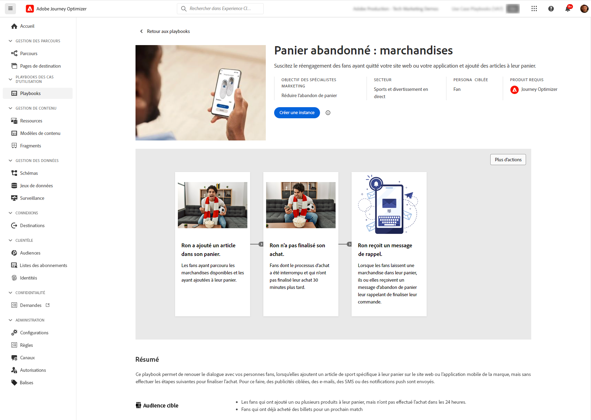

# Playbooks de cas d’utilisation {#playbooks}

## Que sont les playbooks de cas d’utilisation ? {#gs}

Les playbooks de cas d’utilisation sont des workflows prédéfinis qui répondent aux cas d’utilisation courants que vous pouvez exécuter dans Adobe Experience Platform et Journey Optimizer.

{width="85%"}

Chaque playbook fournit une vue d’ensemble complète, incluant l’intention, les objectifs, les personnes ciblées et les ressources nécessaires à sa mise en œuvre. En outre, un mind-mapping est disponible dans chaque playbook pour représenter visuellement les points de contact des clientes et clients réels relatifs au playbook.

{width="85%"}

## Prérequis {#prerequisites}

Les étapes de configuration suivantes sont requises avant d’utiliser des playbooks de cas d’utilisation. Des informations détaillées sur chaque étape sont disponibles dans la page Documentation des playbooks de cas d’utilisation [Prise en main](https://experienceleague.adobe.com/docs/experience-platform/use-case-playbooks/playbooks/get-started.html?lang=fr){target="_blank"}.

* Créer un sandbox
* Configurer les autorisations des utilisateurs et des utilisatrices
* Paramétrer les configuration de canal Journey Optimizer pour les notifications par e-mail, push et SMS

## Accès et activation d’un playbook {#access}

Pour accéder aux playbooks, accédez au menu **[!UICONTROL Playbooks]** situé dans le rail de navigation de gauche. La bibliothèque inclut plusieurs playbooks qui sont implémentés à l’aide d’Adobe Journey Optimizer. Pour y accéder facilement, utilisez les filtres disponibles situés à côté de la barre de recherche. Une liste complète des playbooks Journey Optimizer est disponible dans la [documentation sur les playbooks de cas d’utilisation](https://experienceleague.adobe.com/docs/experience-platform/use-case-playbooks/playbooks/playbooks-list.html?lang=fr){target="_blank"}.

{width="85%"}

Une fois que vous avez choisi le playbook qui correspond le mieux à vos besoins, vous pouvez l’activer. Cela crée une instance du playbook et génère automatiquement les ressources nécessaires pour prendre en charge votre cas d’utilisation spécifique. Les ressources incluent les ressources Journey Optimizer telles que les parcours, les messages, ainsi que les ressources Adobe Experience Platform telles que les schémas ou les segments.

>[!NOTE]
>
>La fonction de ces objets est de vous aider à comprendre toutes les ressources requises pour mettre en œuvre votre cas d’utilisation spécifique. Ils ne contiennent aucune donnée et sont créés dans des sandbox de développement.

Pour mettre en œuvre votre cas d’utilisation, vous pouvez accéder à chaque objet afin de l’ajuster selon vos besoins. Vous pouvez également partager l’URL de la page de l’instance du playbook avec votre équipe afin de collaborer à la mise en œuvre du cas d’utilisation.

En outre, vous pouvez importer les ressources des playbooks dans d’autres sandbox. Cela vous permet d’aligner les ressources générées avec vos ressources existantes et de garantir leur compatibilité avec vos données si vous avez déjà configuré vos propres schémas, champs et groupes de champs. Ces étapes sont détaillées dans la documentation sur les playbooks de cas d’utilisation : [Publication de ressources générées par un playbook sur d’autres sandbox](https://experienceleague.adobe.com/docs/experience-platform/use-case-playbooks/playbooks/data-awareness.html?lang=fr){target="_blank"}.

## Créer vos propres playbooks (Private Beta) {#create}

>[!AVAILABILITY]
>
>La création de playbooks de cas d’utilisation n’est actuellement disponible que pour un ensemble d’organisations sous la forme d’une version bêta privée. Pour en bénéficier, contactez votre représentant ou représentante Adobe.

Outre l’utilisation de playbooks prédéfinis, vous pouvez créer et partager vos propres playbooks dans Adobe Experience Platform.

Vous pouvez définir des métadonnées à l’aide de l’assistance de l’IA ou d’une saisie manuelle, associer des ressources techniques telles que des schémas et des segments et partager vos playbooks dans différentes organisations IMS.

Pour plus d’informations sur la création et le partage de playbooks, consultez la documentation sur les playbooks de cas d’utilisation : [Créer et partager vos propres playbooks à l’aide de l’assistant IA](https://experienceleague.adobe.com/docs/experience-platform/use-case-playbooks/playbooks/author.html?lang=fr#sharing-playbooks-sandboxes){target="_blank"}.
