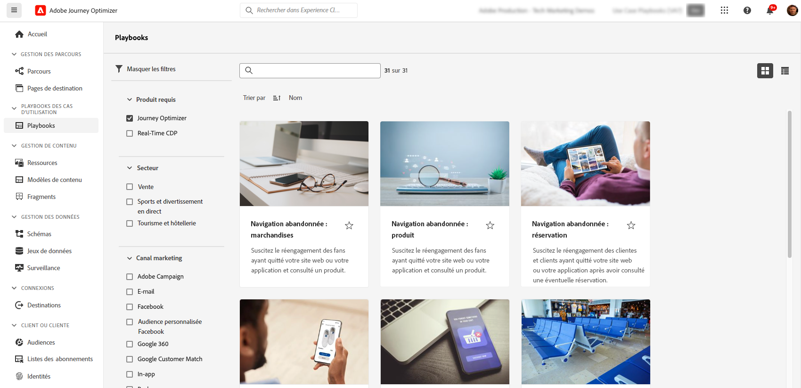

# Cas d’utilisation des classeurs {#playbooks}

>[!PREREQUISITES]
>
>Les étapes de configuration suivantes sont requises avant d’utiliser des classeurs de cas d’utilisation. Des informations détaillées sur chaque étape sont disponibles dans la documentation des cahiers de travail des cas d’utilisation . [Prise en main](https://experienceleague.corp.adobe.com/docs/experience-platform/use-case-playbooks/playbooks/get-started.html){target="_blank"} page.
>
>* Création d’un sandbox
>* Configuration des autorisations utilisateur
>* Configuration des surfaces des canaux Journey Optimizer pour les notifications par e-mail, push et SMS

Les classeurs de cas d’utilisation sont des processus prédéfinis qui répondent aux cas d’utilisation courants que vous pouvez exécuter à l’aide de Adobe Experience Platform et Journey Optimizer.

{width="85%"}

Chaque playbook offre une vue d’ensemble complète, y compris l’intention, les objectifs, les personnes ciblées et les ressources nécessaires à sa mise en oeuvre. En outre, une carte d’esprit est disponible dans chaque manuel de lecture pour représenter visuellement les points de contact client réels associés au manuel de lecture.

{width="85%"}

Pour accéder aux classeurs, accédez au **[!UICONTROL Livres]** situé dans le rail de navigation de gauche. La bibliothèque comprend plusieurs playbooks qui sont implémentés à l’aide de Adobe Journey Optimizer. Pour y accéder facilement, utilisez les filtres disponibles en regard de la barre de recherche. Une liste complète des playbooks Journey Optimizer est disponible dans la [Documentation sur les cahiers de travail des cas d’utilisation](https://experienceleague.adobe.com/docs/experience-platform/use-case-playbooks/playbooks/playbooks-list.html){target="_blank"}.

{width="85%"}

Une fois que vous avez choisi le manuel qui correspond le mieux à vos besoins, vous pouvez l’activer. Cela crée une instance du playbook et génère automatiquement les ressources nécessaires pour prendre en charge votre cas d’utilisation spécifique. Les ressources comprennent les ressources Journey Optimizer telles que les parcours, les messages, ainsi que les ressources Adobe Experience Platform telles que les schémas ou les segments.

>[!NOTE]
>
>Ces objets ont pour but de vous aider à comprendre toutes les ressources nécessaires pour mettre en oeuvre votre cas d’utilisation spécifique. Ils ne contiennent aucune donnée et sont créés sur des environnements de test de développement.

Pour mettre en oeuvre votre cas d’utilisation, vous pouvez accéder à chaque objet afin de l’adapter à vos besoins. Vous pouvez également partager l’URL de la page de l’instance du manuel de lecture avec votre équipe afin de collaborer à la mise en oeuvre du cas d’utilisation.

En outre, vous pouvez importer les ressources des livres de lecture dans d’autres environnements de test. Cela vous permet d’aligner les ressources générées avec vos ressources existantes et de vous assurer qu’elles sont compatibles avec vos données, au cas où vous auriez déjà configuré vos propres schémas, champs et groupes de champs. Ces étapes sont détaillées dans la section [Documentation sur les cahiers de travail des cas d’utilisation](https://experienceleague.adobe.com/docs/experience-platform/use-case-playbooks/playbooks/data-awareness.html){target="_blank"}.
