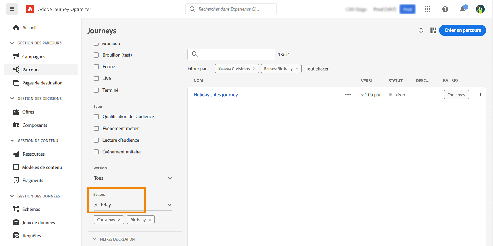

# Rechercher, filtrer, organiser {#search-filter-organize}

À mesure que vos projets Adobe Journey Optimizer se développent, la recherche et l’organisation du contenu deviennent essentielles pour un travail efficace. Cette page vous explique comment localiser rapidement des parcours, des campagnes et des ressources à l’aide de la recherche universelle, filtrer les listes pour se concentrer sur des éléments spécifiques et organiser votre travail à l’aide de balises et de catégories. Ces outils vous aident à parcourir de grands volumes de contenu, à maintenir la cohérence entre les équipes et à rationaliser vos workflows quotidiens.

## Recherche {#unified-search}

Dans l’interface Adobe Journey Optimizer, utilisez la recherche Adobe Experience Cloud unifiée au centre de la barre supérieure pour rechercher des ressources, des parcours, des jeux de données et plus encore dans vos sandbox.

Commencez à saisir du contenu pour afficher les meilleurs résultats. Les articles d’aide sur les mots-clés saisis apparaissent également dans les résultats.

Appuyez sur **Entrée** pour accéder à tous les résultats et filtrer par objet métier.

## Filtrer les listes {#filter-lists}

Dans la plupart des listes, utilisez la barre de recherche pour rechercher des éléments spécifiques et définir des critères de filtrage.

Pour accéder aux filtres, cliquez sur l’icône en forme de filtre en haut à gauche d’une liste. Le menu Filtrer vous permet de filtrer les éléments affichés selon différents critères : vous pouvez choisir d’afficher uniquement les éléments d’un certain type ou statut, ceux que vous avez créés ou ceux que vous avez modifiés au cours des 30 derniers jours. Les options varient en fonction du contexte.

De plus, vous pouvez utiliser les balises unifiées pour filtrer une liste en fonction des balises affectées à un objet. Pour l’instant, les balises sont disponibles pour les parcours et les campagnes. [Découvrir comment utiliser les balises](#tags)

>[!NOTE]
>
>Notez que les colonnes affichées peuvent être personnalisées à l&#39;aide du bouton de configuration en haut à droite des listes. La personnalisation est enregistrée pour chaque utilisateur.

Il est possible d’effectuer des actions de base sur chaque élément des différentes listes. Vous pouvez par exemple dupliquer ou supprimer un élément.

## Utiliser des balises unifiées {#tags}

>[!CONTEXTUALHELP]
>id="ajo_campaigns_tags"
>title="Balises"
>abstract="Ce champ vous permet d’attribuer des balises unifiées Adobe Experience Platform à votre campagne. Vous pouvez ainsi facilement les classer et améliorer la recherche à partir de la liste des campagnes."

Avec les [balises unifiées](https://experienceleague.adobe.com/docs/experience-platform/administrative-tags/overview.html?lang=fr) Adobe Experience Platform, vous pouvez facilement classer vos objets Journey Optimizer pour améliorer la recherche dans les listes.

Ajouter des balises explicites aux audiences dans Journey Optimizer vous permet par la suite de filtrer et de rechercher ces dernières plus facilement. Les balises peuvent également être utilisées dans des règles de décision d’expérience, ainsi que pour organiser les audiences dans des dossiers pertinents et recherchables, et créer des offres et des expériences personnalisées.

### Ajouter des balises à un objet {#add-tags}

Le champ **[!UICONTROL Balises]** vous permet de définir des balises pour votre objet. Les balises sont disponibles pour les objets suivants :

* [Campagnes](../campaigns/create-campaign.md)
* [Éléments de décision](../experience-decisioning/items.md)
* [Fragments](../content-management/fragments.md)
* [Parcours](../building-journeys/journey-properties.md)
* [Pages de destination](../landing-pages/create-lp.md)
* [Listes des abonnements](../landing-pages/subscription-list.md)
* [Modèles](../content-management/content-templates.md)
* [Configurations de canal](../configuration/channel-surfaces.md#channel-config-tags)

Vous pouvez sélectionner une balise existante ou en créer une nouvelle. Pour ce faire, procédez comme suit.

1. Commencez à saisir le nom de la balise souhaitée et sélectionnez-la dans la liste.

   

   >[!NOTE]
   >
   > Les balises ne sont pas sensibles à la casse.

1. Si la balise que vous recherchez n’est pas disponible, cliquez sur **[!UICONTROL Créer «  »]** pour en définir une nouvelle. Elle est automatiquement ajoutée à l’objet actif et devient disponible pour tous les autres objets.

   

1. La liste des balises sélectionnées ou créées s’affiche sous le champ **[!UICONTROL Balises]**. Vous pouvez définir autant de balises que vous le souhaitez.

>[!NOTE]
> 
> Si vous dupliquez ou créez une nouvelle version d’un objet, les balises sont conservées.

### Filtrer les balises {#filter-on-tags}

La liste des objets comporte une colonne dédiée permettant de visualiser facilement les balises.

Un filtre est également disponible pour afficher uniquement les objets comportant certaines balises.

Vous pouvez ajouter ou supprimer des balises de n’importe quel type de parcours ou de campagne (dynamique, brouillon, etc.). Cliquez sur l’icône **[!UICONTROL Plus d’actions]** en regard de l’objet, puis sélectionnez **[!UICONTROL Modifier les balises]**.

### Gérer les balises {#manage-tags}

L’administration peut supprimer des balises et les classer par catégorie dans le menu **[!UICONTROL Balises]**, sous **[!UICONTROL Administration]**. En savoir plus sur la gestion des balises dans la [documentation sur les balises unifiées](https://experienceleague.adobe.com/docs/experience-platform/administrative-tags/ui/managing-tags.html?lang=fr).

>[!NOTE]
>
> Les balises créées directement à partir du champ **[!UICONTROL Balises]** dans Journey Optimizer sont automatiquement ajoutées à la catégorie intégrée « Non classé ».
