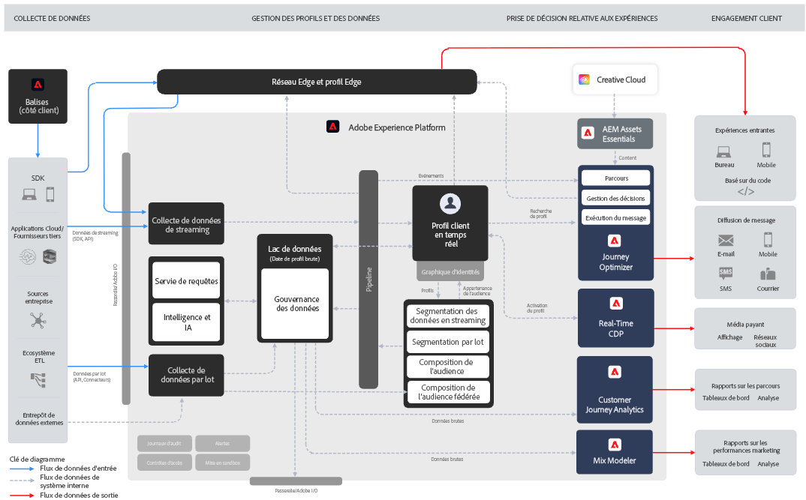
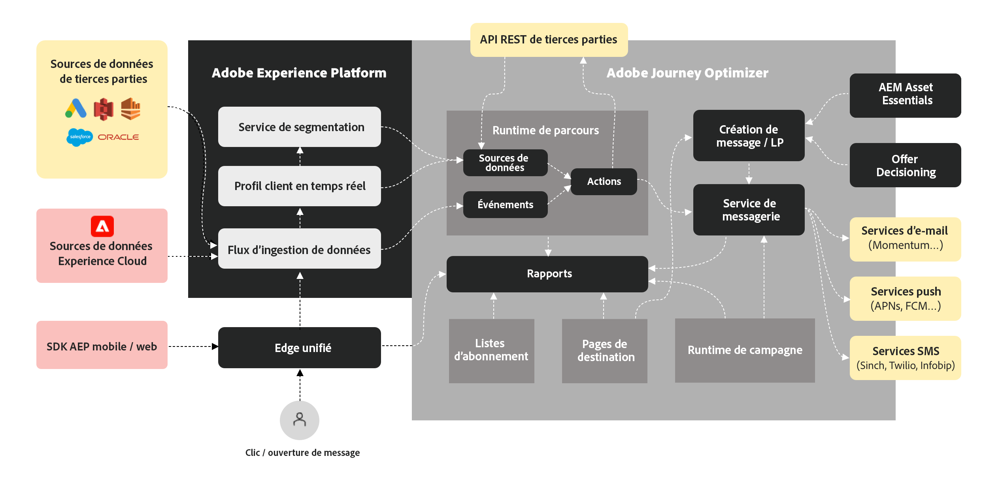

# Présentation de Journey Optimizer {#understanding-ajo}

Adobe Journey Optimizer et Adobe Experience Platform fonctionnent ensemble pour activer la personnalisation pilotée par les données à grande échelle. Cette page explique le fonctionnement de ces systèmes et la manière dont leurs domaines fonctionnels clés se combinent pour offrir des expériences client exceptionnelles. [En savoir plus sur les fonctionnalités clés](get-started.md) | [Explorer la terminologie clé](terminology.md)

## Fonctionnement de Journey Optimizer {#how-it-works}

Adobe Journey Optimizer fonctionne comme un flux continu où les données sont collectées, analysées et appliquées pour créer des parcours clients personnalisés.

### Adobe Experience Platform : The Foundation {#aep-foundation}

Adobe Experience Platform sert de colonne vertébrale, ce qui permet aux marques de centraliser les données client et de les activer pour des expériences personnalisées :

* **Data Platform** - hub central pour la collecte, la gestion et la structuration des données clients afin d’assurer la cohérence entre les systèmes. [Découvrez les schémas et les jeux de données](../data/get-started-schemas.md)
* **Ingestion de données (sources)** - Importez des données à partir de plateformes CRM, de sites web, d’applications mobiles et de solutions de stockage dans le cloud à l’aide de connecteurs préconfigurés. [Explorer des sources de données](get-started-sources.md)
* **Real-time Customer Profile** - Crée des profils unifiés en fusionnant des données issues de plusieurs sources (interactions par e-mail, achats en magasin, comportement web). [En savoir plus sur les profils &#x200B;](../audience/get-started-profiles.md)
* **Couche de gouvernance** - Régit l’accès aux données, la conformité en matière de confidentialité et la sécurité tout en respectant les réglementations. [Afficher la documentation sur la confidentialité](../privacy/get-started-privacy.md)

### Adobe Journey Optimizer : moteur d’orchestration {#ajo-orchestration}

Adobe Journey Optimizer applique les données et les informations de Adobe Experience Platform pour offrir des expériences client intelligentes et personnalisées :

* **Présentation du client** - Les profils client en temps réel permettent la segmentation des audiences pour la messagerie ciblée. [Création d’audiences](../audience/about-audiences.md)
* **Contenu et offres** - Outils de création, de gestion et de personnalisation de contenu ; logique en temps réel pour sélectionner la meilleure offre pour chaque individu. [Conception du contenu](../../rp_landing_pages/content-management-landing-page.md) | [Gérer les offres](../offers/get-started/starting-offer-decisioning.md)
* **Gestion des Parcours et des campagnes** - Automatise les séquences d’interactions (parcours) ou planifie des messages ciblés ponctuels (campagnes). [Créer des parcours &#x200B;](../building-journeys/journey-gs.md) | [Créer des campagnes](../campaigns/get-started-with-campaigns.md)
* **Diffusion (connexions)** - Diffuse les messages par le biais de canaux tels que les e-mails, les SMS, les notifications push et le publipostage direct ; exporte les données vers des systèmes externes. [Configurer des canaux](../configuration/get-started-configuration.md)
* **Mesures et analyses** - Effectue le suivi de l’engagement des clients et des performances des campagnes avec des rapports d’amélioration continue. [Affichage des rapports](../reports/campaign-global-report-cja.md)

### Le cycle d’optimisation continue {#optimization-cycle}

Cet écosystème fonctionne comme un cycle d’optimisation continu. Les données approfondissent la compréhension des clientes et des clients, ce qui guide la personnalisation des contenus et oriente les décisions. Elles sont orchestrées dans des parcours, diffusées sur l’ensemble des canaux, mesurées pour en évaluer l’efficacité et affinées au fil du temps.

## Principaux domaines fonctionnels {#functional-areas}

Journey Optimizer comprend sept domaines fonctionnels clés qui fonctionnent ensemble de manière transparente :

| Zone fonctionnelle | Rôle | Activités Clés |
|-----------------|---------|----------------|
| **Gestion des données** | Organisation des données client | Définir des schémas, créer des jeux de données, importer des données de divers systèmes. [En savoir plus](../data/get-started-schemas.md) |
| **Gestion des clients** | Comprendre qui est la clientèle | Créer des profils unifiés, résoudre des identités et créer des audiences. [En savoir plus](../audience/get-started-profiles.md) |
| **Gestion de contenu** | Création de messages personnalisés | Concevoir des e-mails, gérer des ressources, créer des modèles et des fragments, personnaliser le contenu. [En savoir plus](../../rp_landing_pages/content-management-landing-page.md) |
| **Gestion des décisions** | Sélection de la meilleure offre en temps réel | Gérer la bibliothèque des offres, définir des règles, appliquer des contraintes, établir une logique de classement. [En savoir plus](../offers/get-started/starting-offer-decisioning.md) |
| **Gestion des Parcours** | Concevoir des expériences client automatisées | Créez des parcours avec le concepteur visuel, définissez des déclencheurs, ajoutez des conditions et des étapes d’attente. [En savoir plus](../building-journeys/journey-gs.md) |
| **Connexions** | Connecter les sources de données et les canaux | Configurez les connecteurs source, configurez les canaux, connectez-vous aux plateformes externes. [En savoir plus](../configuration/get-started-configuration.md) |
| **Administration et confidentialité** | Configuration et conformité du contrôle | Gérez les utilisateurs, configurez les sandbox, configurez les canaux, gérez les demandes d’accès à des informations personnelles. [En savoir plus](../administration/permissions.md) |

### Comment Ces Domaines Fonctionnent Ensemble {#working-together}

Ces domaines fonctionnels fonctionnent selon un cycle continu :

1. **Ingestion des données** - Flux de données dans Adobe Experience Platform, structuré par Data Management
2. **Présentation du client** - Les profils client en temps réel unifient les données ; Customer Management crée des audiences
3. **Stratégie de contenu et d’offre** - La gestion de contenu crée des messages ; la gestion des décisions définit la logique d’offre
4. **Orchestration** - Parcours Management mappe les interactions entre les canaux à l’aide des données, du contenu et des décisions des clients
5. **Diffusion** - Les connexions facilitent la diffusion des messages par le biais de canaux ou le partage de données avec des systèmes externes
6. **Mesure** - Les données de performance fournissent des informations qui permettent d’affiner les audiences, le contenu, les décisions et les parcours
7. **Gouvernance** - Les contrôles d’administration et de confidentialité garantissent la conformité tout au long du

## Détails de l’architecture {#architecture-details}

Pour les équipes techniques, voici le diagramme d’architecture détaillé montrant comment Journey Optimizer s’intègre à Adobe Experience Platform. [Parcourez l’interface](user-interface.md) pour explorer ces composants en pratique.

Quatre applications sont créées en mode natif sur Experience Platform : Adobe Real-Time Customer Data Platform, Journey Optimizer, Customer Journey Analytics et Adobe Mix Modeler. Journey Optimizer fonctionne de manière transparente avec ces applications, mais peut également fonctionner de manière indépendante. [Consultez les mécanismes de sécurisation et les limitations](guardrails.md) pour des considérations d’implémentation.

### Points d’intégration {#integration-points}

Journey Optimizer s’intègre à Adobe Experience Platform à plusieurs niveaux :

* **Couche de données** - Partage du même profil client en temps réel, du même graphique d’identités et des mêmes jeux de données
* **Couche de service** - Exploite les services de gouvernance, de confidentialité et de requête de Adobe Experience Platform
* **Couche applicative** - Permet l’orchestration des parcours, la gestion des décisions et la gestion de contenu en plus de Adobe Experience Platform

En savoir plus sur les [plans directeurs Adobe Journey Optimizer](https://experienceleague.adobe.com/fr/docs/blueprints-learn/architecture/customer-journeys/journey-optimizer/journey-optimizer-overview){target="_blank"}.

## Confidentialité et sécurité {#privacy-security}

Les pratiques de confidentialité et de sécurité d’Adobe Experience Cloud s’appliquent à Adobe Journey Optimizer. Ces mesures garantissent la conformité aux réglementations de confidentialité comme le RGPD, ce qui vous permet de proposer des expériences personnalisées tout en préservant la confiance des clients. [En savoir plus sur la confidentialité dans Journey Optimizer](../privacy/get-started-privacy.md)
