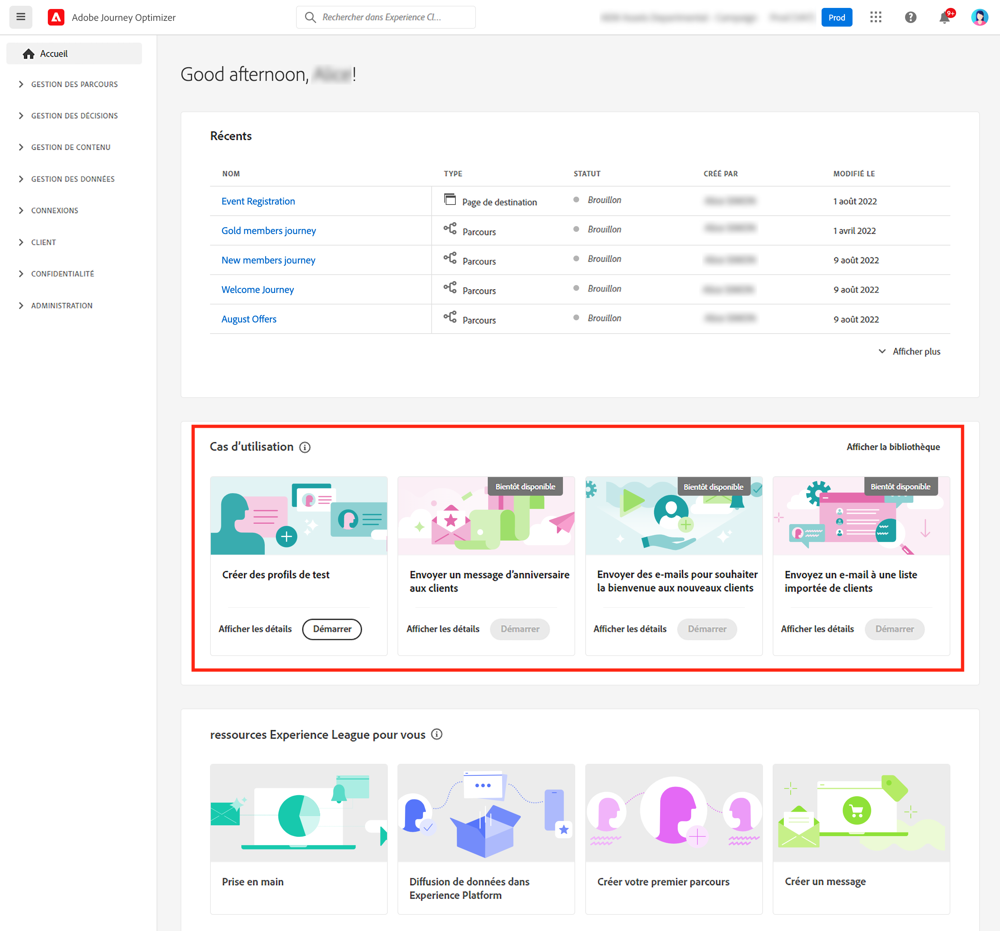
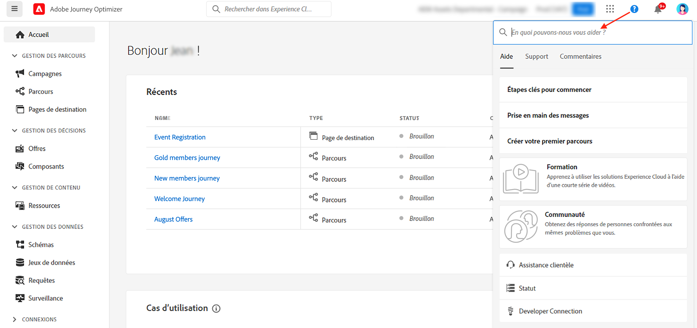
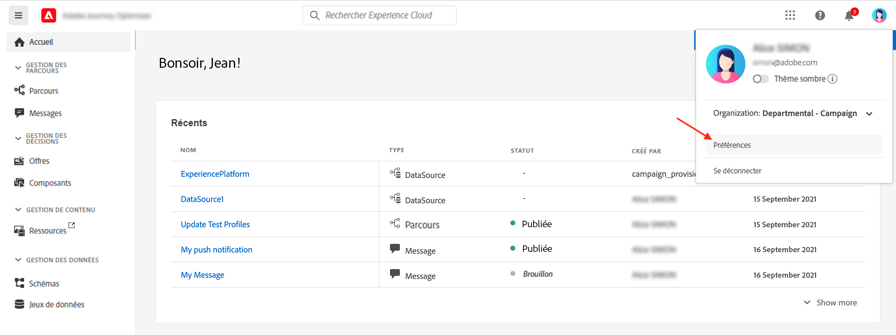
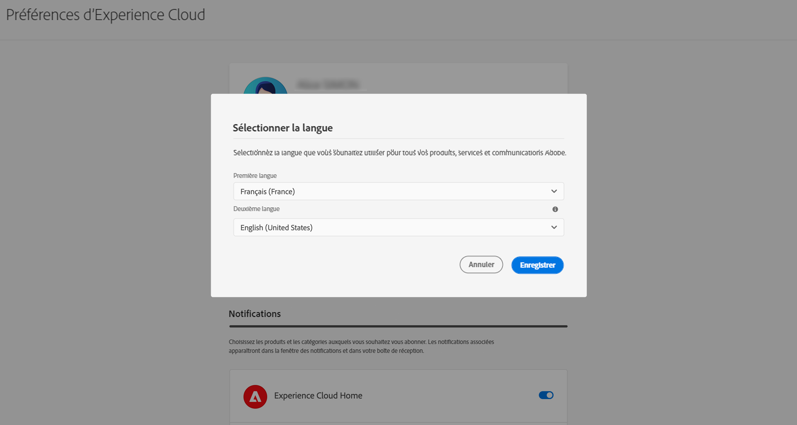

# Interface d’utilisation {#cjm-user-interface}

Pour accéder à [!DNL Adobe Journey Optimizer], connectez-vous à [Adobe Experience Cloud](https://experience.adobe.com) avec votre Adobe ID, puis sélectionnez [!DNL Journey Optimizer].

Les concepts clés lors de la navigation dans l’interface utilisateur sont les mêmes que ceux d’Adobe Experience Platform. Pour plus d&#39;informations, consultez la [documentation Adobe Experience Platform](https://experienceleague.adobe.com/docs/experience-platform/landing/platform-ui/ui-guide.html?lang=fr#adobe-experience-platform-ui-guide){target="_blank"}.

>[!NOTE]
>
>* Les composants et fonctionnalités disponibles dans votre environnement dépendent de vos [autorisations](../administration/permissions.md) et de votre [package de licence](https://helpx.adobe.com/fr/legal/product-descriptions/adobe-journey-optimizer.html){target="_blank"}. Pour toute question, contactez votre responsable du succès client Adobe ou votre représentant ou représentante Adobe.
>
>* Cette documentation est fréquemment mise à jour pour prendre en compte les dernières modifications de l&#39;interface utilisateur du produit. Cependant, certaines captures d&#39;écran peuvent être légèrement différentes de votre interface utilisateur.
>

## Volet de navigation de gauche {#left-nav}

Utilisez les liens sur la gauche pour parcourir les fonctionnalités de [!DNL Journey Optimizer].

>[!NOTE]
>
>Les fonctionnalités disponibles peuvent varier en fonction de vos autorisations et de votre contrat de licence.

Vous trouverez ci-dessous la liste complète des services et fonctionnalités disponibles dans la navigation de gauche et des liens vers la documentation associée.

### Accueil {#left-nav-home}

La page d’accueil [!DNL Journey Optimizer] contient des liens et des ressources clés pour commencer.

La liste **[!UICONTROL Récents]** fournit des raccourcis vers les événements et parcours récemment créés. Cette liste montre les dates et le statut de leur création et de leur modification.

Parcourez les cas d’utilisation internes au produit pour commencer à créer des ressources et des messages. [En savoir plus](#in-product-use-cases).

Utilisez les liens au bas de la page d’accueil pour savoir comment démarrer avec [!DNL Journey Optimizer]. [En savoir plus](#find-help-and-support).

### [!UICONTROL GESTION DES PARCOURS] {#left-nav-journey}

Créez des campagnes et des parcours à partir de cette section.

* **[!UICONTROL Campagnes]** - Créez, configurez et orchestrez des campagnes pour diffuser du contenu ponctuel à une audience spécifique, à l’aide de divers canaux. [En savoir plus](../campaigns/get-started-with-campaigns.md).

* **[!UICONTROL Parcours]** - Créez, configurez et orchestrez vos parcours client : combinez les activités d’événement, d’orchestration et d’action pour créer vos scénarios cross-canal à plusieurs étapes. [En savoir plus](../building-journeys/journey-gs.md#jo-build).

* **[!UICONTROL Rapports]** - La création de rapports de Journey Optimizer est entièrement intégrée aux fonctionnalités de Customer Journey Analytics, permettant ainsi de normaliser la création de rapports sur les deux plateformes et d’améliorer la cohérence et la fiabilité des données. Cette intégration transparente entre Journey Optimizer et Customer Journey Analytics fournit une meilleure visibilité des mesures de performances, ce qui aide les utilisateurs et les utilisatrices à prendre des décisions plus éclairées. [En savoir plus](../reports/report-gs-cja.md)

### [!UICONTROL GESTION DES DÉCISIONS] {#left-nav-decision}

Créez des offres et des composants à partir de cette section.

* **[!UICONTROL Offres]** - Accédez à vos sources et jeux de données récents à partir de ce menu. Cette section vous permet de créer des offres. [En savoir plus](../offers/offer-library/creating-personalized-offers.md).

* **[!UICONTROL Composants]** : créez des emplacements, des règles et des balises. [En savoir plus](../offers/offer-library/key-steps.md)

### [!UICONTROL GESTION DE CONTENU] {#left-nav-content}

Créez et gérez des contenus à partir de cette section.

* **[!UICONTROL Ressources]** - [!DNL Adobe Experience Manager Assets] est un référentiel centralisé de ressources que vous pouvez utiliser pour renseigner vos messages. [En savoir plus](../integrations/assets.md)

* **[!UICONTROL Modèles de contenu]** - Pour accélérer et améliorer le processus de conception, vous pouvez créer des modèles autonomes pour réutiliser facilement du contenu personnalisé dans les campagnes et parcours Journey Optimizer. [En savoir plus](../content-management/content-templates.md).

* **[!UICONTROL Fragments]** - Créez et gérez des fragments pour optimiser le processus de conception des e-mails : précréez des blocs de contenu personnalisés qui peuvent être utilisés pour assembler rapidement le contenu des e-mails. [En savoir plus](../content-management/fragments.md).

* **[!UICONTROL Pages de destination]** - Créez, concevez, testez et publiez des pages de destination : envoyez à vos utilisateurs et utilisatrices des liens vers des formulaires en ligne où ils ou elles peuvent choisir de recevoir ou non vos communications ou s’abonner à des services spécifiques. [En savoir plus](../landing-pages/get-started-lp.md)

### [!UICONTROL GESTION DES DONNÉES] {#left-nav-data}

Gérez vos données à partir de cette section.

* **[!UICONTROL Schémas]** - Utilisez Adobe Experience Platform pour créer et gérer des schémas de modèle de données d’expérience (XDM) dans une zone de travail visuelle interactive appelé Éditeur de schéma. [En savoir plus](../data/get-started-schemas.md)

* **[!UICONTROL Jeux de données]** - Toutes les données correctement ingérées par Adobe Experience Platform sont conservées sous forme de jeux de données dans le lac de données. Un jeu de données est une structure de stockage et de gestion pour la collecte de données, généralement sous la forme d&#39;un tableau, qui contient un schéma (des colonnes) et des champs (des lignes). [En savoir plus](../data/get-started-datasets.md)

* **[!UICONTROL Requêtes]** - Utilisez le service de requête d&#39;Adobe Experience Platform pour écrire et exécuter des requêtes, afficher des requêtes précédemment exécutées et accéder à des requêtes enregistrées par des utilisateurs de votre organisation. [En savoir plus](../data/get-started-queries.md)

* **[!UICONTROL Surveillance]** - Utilisez ce menu pour surveiller l&#39;ingestion de vos données dans l&#39;interface utilisateur d&#39;Adobe Experience Platform. Pour en savoir plus, consultez la [documentation d’Adobe Experience Platform](https://experienceleague.adobe.com/docs/experience-platform/ingestion/quality/monitor-data-ingestion.html?lang=fr){target="_blank"}.

### [!UICONTROL CONNEXIONS] {#left-nav-connections}

Gérez vos connexions de données avec d’autres applications et clouds à partir de cette section.

* **[!UICONTROL Sources]** : ce menu vous permet d’ingérer des données provenant de différentes sources (applications Adobe, espaces de stockage dans le cloud, bases de données, etc.). Vous pouvez structurer, étiqueter et améliorer les données entrantes. [En savoir plus](get-started-sources.md).

* **[!UICONTROL Destinations]** - Utilisez ce menu pour établir une connexion active aux emplacements d’espace de stockage afin d’exporter le contenu de vos jeux de données. [En savoir plus](../data/export-datasets.md)

### [!UICONTROL CLIENT] {#left-nav-customers}

Gérez vos audiences et vos données de profil à partir de cette section.

* **[!UICONTROL Audiences]** : créez et gérez des audiences Experience Platform et utilisez-les dans vos parcours. [En savoir plus](../audience/about-audiences.md).

* **[!UICONTROL Listes d’abonnements]** - Dans [!DNL Journey Optimizer], la clientèle inscrite à un service d’abonnement est regroupée dans une liste d’abonnements. [En savoir plus](../landing-pages/subscription-list.md)

* **[!UICONTROL Profils]** - Le profil client en temps réel offre une vue d&#39;ensemble de chaque client en combinant des données issues de plusieurs canaux, notamment des données en ligne, hors ligne, CRM et tierces. [En savoir plus](../audience/get-started-profiles.md)

* **[!UICONTROL Identités]** - Le service d&#39;identités d&#39;Adobe Experience Platform gère l&#39;identification inter-appareils, inter-canaux et en temps quasi réel de vos clients, dans ce qu&#39;on appelle un graphique d&#39;identités dans Adobe Experience Platform. [En savoir plus](../audience/get-started-identity.md)

### [!UICONTROL CONFIDENTIALITÉ] {#left-nav-privacy}

Contrôlez les demandes et la gestion concernant la confidentialité à partir de cette section.

* **[!UICONTROL Politiques]** - Adobe Experience Platform vous permet d’étiqueter vos champs et de créer des actions marketing pour chaque canal. Vous pouvez ensuite définir une politique de gouvernance associée à une étiquette et à une action marketing. [En savoir plus](../action/action-privacy.md).

* **[!UICONTROL Demandes]** - Les demandes d’accès à des données personnelles sont gérées dans Adobe Experience Platform Privacy Service. Il fournit une API RESTful et une interface utilisateur pour vous aider à gérer les demandes liées aux données de la clientèle. [En savoir plus](../privacy/requests.md).

* **[!UICONTROL Audit]** - Accédez à cette section pour vérifier les journaux d’activité. [En savoir plus](../privacy/audit-logs.md).

* **[!UICONTROL Cycle de vie des données]** : cette section vous permet de configurer et de planifier les opérations de cycle de vie des données, en veillant à ce que vos enregistrements soient correctement conservés. [En savoir plus](../privacy/data-hygiene.md)

### [!UICONTROL ADMINISTRATION] {#left-nav-admin}

* **[!UICONTROL Configurations]** - Utilisez ce menu pour configurer les [événements](../event/about-events.md), les [sources de données](../datasource/about-data-sources.md) et les [actions](../action/action.md) à utiliser dans vos parcours.

  Vous pouvez également accéder à la section **Création de rapports** pour configurer les rapports pour l’expérimentation de campagnes, ainsi que pour le web et les applications mobiles. [En savoir plus](../reports/reporting-configuration.md)

* **[!UICONTROL Règles métier]** - Utilisez cette section pour créer des règles métier cross-canal afin de contrôler la fréquence à laquelle les utilisateurs et utilisatrices reçoivent un message ou entrent dans un parcours. [En savoir plus](../conflict-prioritization/rule-sets.md).

* **[!UICONTROL Alertes]** - Lʼinterface utilisateur vous permet de consulter lʼhistorique des alertes reçues en fonction des mesures affichées par Adobe Experience Platform Observability Insights. Lʼinterface utilisateur vous permet également dʼafficher, dʼactiver et de désactiver les règles dʼalerte disponibles. [En savoir plus](../reports/alerts.md).

* **[!UICONTROL Sandbox]** : Adobe Experience Platform fournit des sandbox qui divisent une instance de plateforme unique en environnements virtuels distincts pour favoriser le développement et l’évolution d’applications d’expérience digitale. En outre, [!DNL Journey Optimizer] vous permet d’utiliser les fonctionnalités d’export et d’import de packages pour copier des objets tels que des parcours, des modèles ou des fragments de contenu sur plusieurs sandbox. [En savoir plus](../administration/sandboxes.md)

* **[!UICONTROL Canaux]** - Utilisez cette section pour configurer vos canaux, notamment les sous-domaines, les configurations et les paramètres de délivrabilité. [En savoir plus](../configuration/get-started-configuration.md).

* **[!UICONTROL Balises]** - Avec les balises unifiées, vous pouvez facilement classer vos parcours et campagnes pour améliorer la recherche dans les listes. [En savoir plus](../start/search-filter-categorize.md#work-with-unified-tags)

## Cas d’utilisation internes au produit {#in-product-uc}

La page d’accueil d’[!DNL Adobe Journey Optimizer] propose des cas d’utilisation de produit qui vous permettent de créer rapidement des profilts de test ou vos premiers parcours client.

+++ **Cas d’utilisation disponibles**

Les cas d&#39;utilisation disponibles sont les suivants :

* **Créer des profils de test** : pour créer des profils de test à l&#39;aide de notre modèle CSV afin de tester des messages et des parcours personnalisés. Découvrez comment mettre en œuvre ce cas d’utilisation [sur cette page](../audience/creating-test-profiles.md#use-case-1).
* **Envoyer un message d&#39;anniversaire aux clients** : pour envoyer automatiquement un e-mail afin de souhaiter un bon anniversaire à vos clients. (bientôt disponible)
* **Envoyer des e-mails pour souhaiter la bienvenue aux nouveaux clients** : pour envoyer facilement jusqu&#39;à deux e-mails afin d&#39;accueillir vos nouveaux clients enregistrés. (bientôt disponible)
* **Envoyer des messages push à la liste importée de clients** : pour envoyer rapidement une notification push à une liste de clients importés à partir d&#39;un fichier CSV. (bientôt disponible)

+++

Pour en savoir plus sur un cas d’utilisation, cliquez sur le lien **[!UICONTROL Afficher les détails]**.

Pour lancer le cas d’utilisation, cliquez sur le bouton **[!UICONTROL Commencer]**.

Vous pouvez accéder aux cas d’utilisation exécutés à partir du bouton **[!UICONTROL Afficher la bibliothèque]**.

## Obtention d’aide et de support {#find-help}

Accédez aux pages d&#39;aide principales d&#39;Adobe Journey Optimizer à partir de la section inférieure de la page d&#39;accueil.

Utilisez l’icône **Aide** pour accéder aux pages d’aide, contacter l’assistance et partager vos commentaires. Vous pouvez rechercher des articles et des vidéos d’aide dans le champ de recherche.

Les boutons d’aide contextuelle, disponibles sur chaque page, permettent d’en savoir plus sur une fonction et d’accéder à la documentation **[!DNL Adobe Experience League]**.

## Notifications intégrées au produit {#in-product-notifications}

Vous pouvez activer les **alertes par produit et par e-mail** pour recevoir des notifications sur plusieurs événements susceptibles de vous intéresser : les échecs détectés par le système, les demandes d’approbation et/ou les versions de produits [!DNL Journey Optimizer].

Pour activer ces notifications, procédez comme suit.

1. Accédez à [!DNL Adobe Experience Cloud] **[!UICONTROL Préférences]**.
1. Sous **[!UICONTROL Notifications]**, recherchez **[!UICONTROL Journey Optimizer]**.
1. Activez les notifications in-app et/ou par e-mail selon vos besoins :

   * **[!UICONTROL Alertes]** : en cas d’échec, vous pouvez obtenir des notifications système pour les alertes auxquelles vous êtes abonné. [En savoir plus](../reports/alerts.md)
   * **[!UICONTROL Validations]** : vous recevez une notification lorsqu’une personne vous demande d’approuver un objet ou d’accéder à un objet.
   * **[!UICONTROL Nouvelles versions]** : vous êtes informé(e) de toutes les nouvelles versions du produit [!DNL Journey Optimizer].

{width="70%" align="left"}

## Assistant IA {#ai-assistant}

L’Assistant IA est une fonctionnalité de l’interface d’utilisation qui vous permet de parcourir et de comprendre les concepts Adobe et d’obtenir des informations opérationnelles pour votre environnement spécifique. Il est disponible dans plusieurs produits Adobe Experience Cloud, y compris Adobe Journey Optimizer.

Pour accéder à l’Assistant IA, cliquez sur l’icône située dans la barre supérieure. L’Assistant IA s’affiche dans la partie droite de l’écran.

Découvrez comment accéder à l’Assistant IA et comment l’utiliser [sur cette page](ai-assistant.md).

## Préférences linguistiques {#language-pref}

L’interface utilisateur est disponible dans les langues suivantes :

* Anglais
* Français
* Allemand
* Italien
* Espagnol
* Portugais (brésilien)
* Japonais
* Coréen
* Chinois traditionnel
* Chinois simplifié

Votre langue d&#39;interface par défaut est déterminée par la langue préférée spécifiée dans votre profil utilisateur.

+++ **Pour modifier la langue**

Pour changer de langue, procédez comme suit :

1. Cliquez sur **Préférences** depuis votre avatar, en haut à droite.
   
1. Cliquez ensuite sur la langue affichée sous votre adresse e-mail.
1. Sélectionnez la langue de votre choix et cliquez sur **Enregistrer**. Vous pouvez sélectionner une seconde langue au cas où le composant que vous utilisez ne serait pas localisé dans votre langue maternelle.
   

+++

## En savoir plus {#more}

Vous découvrez [!DNL Journey Optimizer] ? Utilisateur expérimenté avec des questions spécifiques ? Administrateur de l’instance de votre entreprise ? [Tracez votre propre chemin pour atteindre plus rapidement vos objectifs](quick-start.md) !

<!--CONTEXTUAL HELP TO DISPATCH IN DOCS ONCE FEATURE LIVE-->

<!--ORCHESTRATED CAMPAIGNS - Overview page-->

<!--OVERVIEW TAB ORCHESTRATED CAMPAIGNS SKU only-->

>[!CONTEXTUALHELP]
>id="ajo_oc_campaign_ovv_1"
>title="Orchestration des campagnes"
>abstract="Partager, combiner, enrichir et manipuler des jeux de données relationnels pour définir votre audience"

>[!CONTEXTUALHELP]
>id="ajo_oc_campaign_ovv_2"
>title="Exploiter les données multi-entités"
>abstract="Découvrir comment les campagnes orchestrées peuvent tirer parti des jeux de données relationnelles pour enrichir les données à des fins de segmentation et de personnalisation."

>[!CONTEXTUALHELP]
>id="ajo_oc_campaign_ovv_3"
>title="Segmentation ad hoc et décomptes exacts"
>abstract="Créer votre segment étape par étape avec des décomptes exacts"

>[!CONTEXTUALHELP]
>id="ajo_oc_campaign_ovv_4"
>title="Canaux disponibles"
>abstract="E-mail, SMS, notifications push, courrier"

<!--OVERVIEW TAB ORCHESTRATED CAMPAIGNS + JOURNEYS SKU -->

>[!CONTEXTUALHELP]
>id="ajo_oc_jo_camppaign_ovv_1"
>title="IU guidée pour créer et envoyer une campagne"
>abstract="Définissez une ou plusieurs actions avec un canal, choisissez une audience, définissez un contenu, définissez un planning... tout est prêt pour l’envoi !"

>[!CONTEXTUALHELP]
>id="ajo_oc_jo_camppaign_ovv_2"
>title="Canaux disponibles"
>abstract="E-mail, SMS, notifications push et expériences in-app, web, basées sur du code"

<!--OVERVIEW TAB ORCHESTRATED CAMPAIGNS - API triggered tab -->

>[!CONTEXTUALHELP]
>id="ajo_oc_api_camppaign_ovv_1"
>title="Campagnes déclenchées par l’API transactionnelle"
>abstract="Déclencher des messages en temps réel par le biais d’appels API"

>[!CONTEXTUALHELP]
>id="ajo_oc_api_camppaign_ovv_2"
>title="Messages marketing"
>abstract="Contenu promotionnel (nécessite un accord préalable, soumis aux règles métier)"

>[!CONTEXTUALHELP]
>id="ajo_oc_api_camppaign_ovv_3"
>title="Messages transactionnels"
>abstract="Contenu lié au service (confirmations, alertes, non soumis à un consentement marketing)"

>[!CONTEXTUALHELP]
>id="ajo_oc_api_camppaign_ovv_4"
>title="Canaux disponibles"
>abstract="E-mail, SMS, notifications push"

<!--APPROVAL POLICIES-->

>[!CONTEXTUALHELP]
>id="ajo_campaigns_edit_disabled"
>title="Modifier désactivé"
>abstract="Modifier désactivé (campagnes)"

>[!CONTEXTUALHELP]
>id="ajo_journey_edit_disabled"
>title="Modifier désactivé"
>abstract="Modifier désactivé (parcours)"

>[!CONTEXTUALHELP]
>id="ajo_approval_policy_approval_status"
>title="Statut d’approbation"
>abstract="Statut d’approbation"

>[!CONTEXTUALHELP]
>id="ajo_campaigns_approve"
>title="Approuver"
>abstract="Approuver (campagnes)"

>[!CONTEXTUALHELP]
>id="ajo_journey_approve"
>title="Approuver"
>abstract="Approuver (parcours)"

>[!CONTEXTUALHELP]
>id="ajo_journey_simulation"
>title="Simuler votre parcours"
>abstract="La simulation de parcours vous permet de valider vos parcours et de voir leurs performances avant leur activation. Elle utilise les données d’un modèle formé pour fournir des chiffres sur tout le parcours, afin d’illustrer comment le parcours se comportera dans un scénario réel."

<!-- QUIET HOURS -->

>[!CONTEXTUALHELP]
>id="ajo_rule_type"
>title="Type de règle"
>abstract="Type de règle"

>[!CONTEXTUALHELP]
>id="ajo_journey_business_rules"
>title="Jeu de règles"
>abstract="Jeu de règles"
