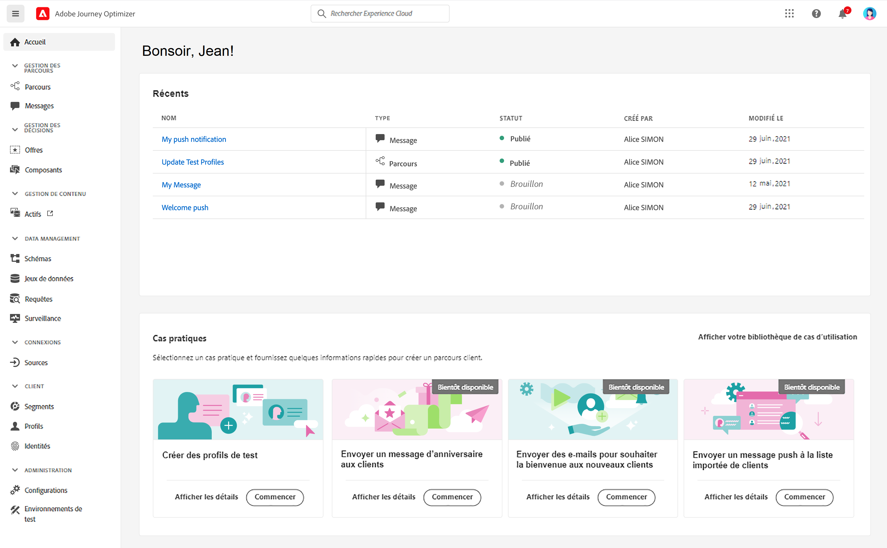

# Navigation dans l’interface {#user-interface}

>[!BEGINSHADEBOX]

**Sur cette page :** Découvrez l’interface de Adobe Journey Optimizer (barre supérieure, page d’accueil et navigation de gauche) afin d’accéder rapidement aux fonctionnalités dont vous avez besoin.

>[!ENDSHADEBOX]

Pour accéder à Adobe Journey Optimizer, connectez-vous à [Adobe Experience Cloud](https://experience.adobe.com?lang=fr) avec votre Adobe ID, puis sélectionnez [!DNL Journey Optimizer].

>[!NOTE]
>
>* Les composants et fonctionnalités disponibles dans votre environnement dépendent de vos [autorisations](../administration/permissions.md) et de votre [package de licences](https://helpx.adobe.com/legal/product-descriptions/adobe-journey-optimizer.html){target="_blank"}.
>* Cette documentation est régulièrement mise à jour. Certaines captures d’écran peuvent être légèrement différentes de votre interface.

## Aperçu rapide {#quick-tour}

L’interface de Journey Optimizer se compose de quatre zones principales :

1. **Navigation de gauche** - Accédez à toutes les fonctionnalités organisées par fonction
2. **Barre supérieure** - Recherche universelle, aide, notifications et paramètres
3. **Page d’accueil** - Accès rapide aux éléments récents et aux ressources utiles
4. **Espace de travail principal** - Là où vous créez et gérez votre contenu

**Conseil :** les nouveaux utilisateurs et nouvelles utilisatrices peuvent utiliser la page **Accueil** pour accéder aux éléments récents et aux cas d’utilisation, ou cliquer sur l’icône **Aide** dans la barre supérieure pour obtenir une assistance contextuelle.

## Fonctions de la barre supérieure {#top-bar}

### Recherche universelle {#universal-search}

Utilisez l’icône de recherche pour rechercher rapidement des parcours, des campagnes, des ressources et d’autres objets dans Journey Optimizer. Saisissez des mots-clés pour afficher les résultats pertinents issus de toutes les zones de la plateforme. [En savoir plus sur la recherche universelle](search-filter-categorize.md#unified-search).

### Aide et assistance {#help}

Cliquez sur l’icône **Aide** pour :

* Rechercher des articles et des vidéos d’aide
* Accéder à l’aide contextuelle pour la page active
* Contacter l’assistance Adobe
* Partager vos commentaires

L’aide contextuelle affiche des conseils relatifs à l’écran sur lequel vous êtes et des liens vers la documentation correspondante, afin que vous puissiez obtenir les informations dont vous avez besoin sans quitter votre workflow.

#### Consignes pour les tickets de support {#support-ticket-guidelines}

Lorsque vous contactez l’assistance Adobe, indiquez les éléments suivants pour accélérer l’analyse des causes racines et la résolution du problème :

* **Détails de l’environnement** : nom du sandbox, ID d’organisation et domaine produit (par exemple, Parcours, Campagnes, Prise de décision)
* **Niveau d’impact** : gravité du problème (par exemple, production bloquée, fonctionnalités limitées, problème esthétique)
* **Étapes de réplication** : instructions claires et détaillées pour reproduire le problème
* **Journaux ou captures d’écran** : messages d’erreur pertinents, ID de requête ou captures d’écran qui illustrent le problème
* **ID pertinents** : ID de parcours, ID de campagne, ID d’audience ou autres identifiants d’objet liés au problème

### Notifications {#in-product-uc}

Activez les notifications dans le produit et par e-mail pour recevoir les informations suivantes :

* **Alertes** - Défaillances du système et problèmes de performances
* **Approbations** - Demandes nécessitant un examen de votre part
* **Nouvelles versions** - Mises à jour des produits et nouvelles fonctionnalités

Pour configurer les notifications :

1. Cliquez sur l’icône de votre profil et sélectionnez **[!UICONTROL Préférences]**.
2. Dans **[!UICONTROL Notifications]**, recherchez **[!UICONTROL Journey Optimizer]**.
3. Activez les types de notification que vous souhaitez recevoir.

{width="60%" align="center"}

### Préférences de langue {#language}

L’interface est disponible en anglais, français, allemand, italien, espagnol, portugais (brésilien), japonais, coréen, chinois traditionnel et chinois simplifié.

Pour modifier la langue :

1. Cliquez sur **[!UICONTROL Préférences]** dans le menu de votre profil.
2. Sélectionnez la langue de votre choix.
3. Vous pouvez éventuellement sélectionner une deuxième langue comme langue de remplacement.
4. Cliquez sur **Enregistrer**.

Des raccourcis clavier et des fonctionnalités d’accessibilité sont disponibles. [En savoir plus](accessibility.md)

## Page d’accueil {#home-page}

La page d’accueil met à disposition les éléments suivants :

* **Éléments récents** - Raccourcis vers les événements, parcours, campagnes et autres objets récemment créés
* **Cas d’utilisation** - Scénarios préconfigurés pour vous aider à commencer à travailler rapidement (création de profils de test, envoi de messages d’anniversaire, etc.)
* **Ressources** - Liens vers la documentation, les tutoriels et l’assistance

### Cas d’utilisation et workflows de démarrage rapide {#use-cases}

Les workflows de démarrage rapide vous permettent d’accomplir les tâches courantes :

* **Création de profils de test** - Générez des profils de test à l’aide de modèles CSV.
* **Envoi de messages d’anniversaire** - Envoyez automatiquement des e-mails d’anniversaire (bientôt disponible).
* **Intégration de nouveaux clients et clientes** - Série de bienvenue pour les nouveaux clients et clientes (bientôt disponible).
* **Envoi d’une notification push à des listes importées** - Notifications push rapides à partir de données CSV (bientôt disponible).

Cliquez sur **[!UICONTROL Afficher les détails]** pour en savoir plus sur chaque cas d’utilisation, ou sur **[!UICONTROL Commencer]** pour démarrer.

## Volet de navigation de gauche {#left-nav}

La navigation de gauche organise les fonctionnalités de Journey Optimizer en catégories fonctionnelles. Les éléments disponibles dans le menu dépendent de vos autorisations et de votre licence.

| Section | Objectif |
|---------|---------|
| Gestion des parcours | Campagnes, parcours, rapports |
| Gestion des décisions | Offres et personnalisation |
| Gestion de contenu | Ressources, modèles, fragments, pages de destination |
| Data Management | Schémas, jeux de données, requêtes |
| Connexions | Sources et destinations |
| Client | Audiences, profils, identités |
| Confidentialité | Politiques, requêtes, audit |
| Administration | Configurations, canaux, sandbox |

### Sections principales {#main-sections}

**Accueil** - Votre point de départ avec un accès rapide aux éléments récemment créés et aux ressources utiles

**Gestion des parcours** - Créez et gérez des expériences client.

* **Campagnes** - Créez des messages ponctuels ou planifiés pour des audiences spécifiques. [Commencer à utiliser les campagnes](../campaigns/get-started-with-campaigns.md)
* **Parcours** - Créez des expériences client multi-étapes et cross-canal. [Créer votre premier parcours](../building-journeys/journey-gs.md)
* **Rapports** - Analysez les performances à l’aide des rapports intégrés Customer Journey Analytics. [Consulter la documentation sur les rapports](../reports/campaign-global-report-cja.md)

**Gestion des décisions** - Gérez les offres personnalisées. [En savoir plus sur la gestion des décisions](../offers/get-started/starting-offer-decisioning.md)

* **Offres** - Créez et gérez des offres personnalisées.
* **Composants** - Configurez les emplacements, les règles et les balises pour les offres.

**Gestion du contenu** - Créez et organisez du contenu.

* **Ressources** - Référentiel centralisé pour les images et les médias. [Gérer les ressources](../integrations/assets.md)
* **Modèles de contenu** - Modèles de message réutilisables pour les campagnes et les parcours. [Créer des modèles](../content-management/content-templates.md)
* **Fragments** - Blocs de contenu pouvant être utilisés dans plusieurs messages. [Utiliser des fragments](../content-management/fragments.md)
* **Pages de destination** - Formulaires web pour les abonnements et les préférences. [Concevoir des pages de destination](../landing-pages/get-started-lp.md)
* **Playbooks de cas d’utilisation** - Workflows préconfigurés pour les scénarios marketing courants. [Explorer les playbooks](ai-features.md#playbooks)

**Gestion des données** - Gérez vos données. [En savoir plus sur les schémas et les jeux de données](../data/get-started-schemas.md)

* **Schémas** - Définissez la structure des données.
* **Jeux de données** - Stockez et gérez les collections de données.
* **Requêtes** - Écrivez et exécutez des requêtes.
* **Surveillance** - Surveillez l’ingestion de données.

**Connexions** - Intégration à d’autres systèmes

* **Sources** - Ingérez des données à partir de systèmes externes. [Configurer les sources](get-started-sources.md)
* **Destinations** - Exportez les données vers l’espace de stockage dans le cloud. [Configurer des destinations](../data/export-datasets.md)

**Clientes et clients** - Gérez les audiences et les profils.

* **Audiences** - Créez et gérez des segments de clientes et de clients. [Utiliser des audiences](../audience/about-audiences.md)
* **Listes d’abonnements** - Gérez les listes d’opt-in. [Gestion des abonnements](../landing-pages/subscription-list.md)
* **Profils** - Affichez les profils clients unifiés. [Explorer les profils](../audience/get-started-profiles.md)
* **Identités** - Gérez la résolution des identités. [En savoir plus sur les identités](../audience/get-started-identity.md)

**Confidentialité** - Contrôlez la confidentialité et la conformité. [Vue d’ensemble de la confidentialité](../privacy/get-started-privacy.md)

* **Politiques** - Définissez des politiques de gouvernance des données.
* **Demandes** - Gérez les demandes d’accès aux informations personnelles (RGPD, CCPA).
* **Audit** - Examinez les journaux d’activité. [Consulter les journaux d’activité](../privacy/audit-logs.md)
* **Cycle de vie des données** - Configurez la conservation des données.

**Administration** - Configurez les paramètres système. [Vue d’ensemble du contrôle d’accès](../administration/permissions-overview.md)

* **Configurations** - Configurez des événements, des sources de données et des actions. [Configurer des canaux](../configuration/get-started-configuration.md)
* **Règles métier** - Contrôlez la fréquence des messages et l’entrée dans les parcours. [Configurer des règles métier](../conflict-prioritization/rule-sets.md)
* **Alertes** - Affichez et gérez les alertes système. [Surveiller les alertes](../reports/alerts.md)
* **Sandbox** - Gérez les environnements et copiez des objets entre différents sandbox. [Utiliser des sandbox](../administration/sandboxes.md)
* **Canaux** - Configurez les paramètres des canaux et la délivrabilité. [Définir des configurations de canal](../configuration/channel-surfaces.md) | [Commencer avec la configuration](../configuration/get-started-configuration.md)
* **Balises** - Organisez et catégorisez le contenu. [Utiliser des balises unifiées](search-filter-categorize.md#tags)

## Assistant IA {#ai-assistant}

L’assistant IA offre une aide instantanée et des informations opérationnelles. Cliquez sur l’icône de l’assistant IA dans la barre supérieure pour :

* Obtenir des réponses sur les fonctionnalités du produit
* Recevoir des informations opérationnelles sur vos parcours
* Parcourir les concepts et les bonnes pratiques

[En savoir plus sur l’assistant IA](ai-features.md#ai-assistant)

## Rubriques connexes {#related-topics}

* [Choisir votre parcours de formation par rôle](quick-start.md)
* [Rechercher, filtrer et organiser du contenu](search-filter-categorize.md)
* [Comprendre le fonctionnement de Journey Optimizer](understanding-ajo.md)
* [Fonctionnalités d’accessibilité](accessibility.md)

<!--CONTEXTUAL HELP TO DISPATCH IN DOCS ONCE FEATURE LIVE-->

<!--ORCHESTRATED CAMPAIGNS - Overview page-->

<!--OVERVIEW TAB ORCHESTRATED CAMPAIGNS SKU only-->

>[!CONTEXTUALHELP]
>id="ajo_oc_campaign_ovv_1"
>title="Orchestration de campagnes"
>abstract="Partager, combiner, enrichir et manipuler des jeux de données relationnels pour définir votre audience"

>[!CONTEXTUALHELP]
>id="ajo_oc_campaign_ovv_2"
>title="Exploiter les données multi-entités"
>abstract="Découvrir comment les campagnes orchestrées peuvent tirer parti des jeux de données relationnelles pour enrichir les données à des fins de segmentation et de personnalisation."

>[!CONTEXTUALHELP]
>id="ajo_oc_campaign_ovv_3"
>title="Segmentation ad hoc et décomptes exacts"
>abstract="Créer votre segment étape par étape avec des décomptes exacts"

>[!CONTEXTUALHELP]
>id="ajo_oc_campaign_ovv_4"
>title="Canaux disponibles"
>abstract="E-mail, SMS, notifications push, courrier"

<!--OVERVIEW TAB ORCHESTRATED CAMPAIGNS + JOURNEYS SKU -->

>[!CONTEXTUALHELP]
>id="ajo_oc_jo_campaign_ovv_1"
>title="IU guidée pour créer et envoyer une campagne"
>abstract="Définissez une ou plusieurs actions avec un canal, choisissez une audience, définissez le contenu, définissez un planning et vous êtes prêt à envoyer"

>[!CONTEXTUALHELP]
>id="ajo_oc_jo_campaign_ovv_2"
>title="Canaux disponibles"
>abstract="E-mail, SMS, notifications push et expériences in-app, web, basées sur du code"

<!--OVERVIEW TAB ORCHESTRATED CAMPAIGNS - API triggered tab -->

>[!CONTEXTUALHELP]
>id="ajo_oc_api_campaign_ovv_1"
>title="Campagnes déclenchées par l’API transactionnelle"
>abstract="Déclencher des messages en temps réel par le biais d’appels API"

>[!CONTEXTUALHELP]
>id="ajo_oc_api_campaign_ovv_2"
>title="Messages marketing"
>abstract="Contenu promotionnel (nécessite un accord préalable, soumis aux règles métier)"

>[!CONTEXTUALHELP]
>id="ajo_oc_api_campaign_ovv_3"
>title="Messages transactionnels"
>abstract="Contenu lié au service (confirmations, alertes, non soumis à un consentement marketing)"

>[!CONTEXTUALHELP]
>id="ajo_oc_api_campaign_ovv_4"
>title="Canaux disponibles"
>abstract="E-mail, SMS, notifications push"

<!--APPROVAL POLICIES-->

>[!CONTEXTUALHELP]
>id="ajo_campaigns_edit_disabled"
>title="Modifier désactivé"
>abstract="Modifier désactivé (campagnes)"

>[!CONTEXTUALHELP]
>id="ajo_journey_edit_disabled"
>title="Modifier désactivé"
>abstract="Modifier désactivé (parcours)"

>[!CONTEXTUALHELP]
>id="ajo_approval_policy_approval_status"
>title="Statut d’approbation"
>abstract="Statut d’approbation"

>[!CONTEXTUALHELP]
>id="ajo_campaigns_approve"
>title="Approuver"
>abstract="Approuver (campagnes)"

>[!CONTEXTUALHELP]
>id="ajo_journey_approve"
>title="Approuver"
>abstract="Approuver (parcours)"

>[!CONTEXTUALHELP]
>id="ajo_journey_simulation"
>title="Simuler votre parcours"
>abstract="La simulation de parcours vous permet de valider vos parcours et de voir leurs performances avant leur activation. Elle utilise les données d’un modèle formé pour fournir des chiffres sur tout le parcours, afin d’illustrer comment le parcours se comportera dans un scénario réel."

<!-- WEBHOOKS -->

>[!CONTEXTUALHELP]
>id="ajo_channels_feedback_webhook_settings"
>title="Activer les webhooks"
>abstract="Activez les webhooks pour recevoir un retour en temps réel sur le statut d’exécution de vos messages. Avant d’activer cette option, assurez-vous d’avoir configuré un webhook dans le menu **Administration** / **Canaux** / **Webhook de retour**."

>[!CONTEXTUALHELP]
>id="ajo_channels_feedback_webhook_settings_create"
>title="Webhooks de retour"
>abstract="Les webhooks de retour permettent de recevoir un retour en temps réel sur le statut d’exécution des messages envoyés avec des campagnes déclenchées par API transactionnelle. Une seule configuration de webhook par combinaison organisation + sandbox est autorisée."

>[!CONTEXTUALHELP]
>id="ajo_channels_feedback_webhook_settings_configuration"
>title="Configuration de base"
>abstract="Dans cette section, saisissez un nom explicite pour identifier le webhook et sélectionnez le ou les canaux pour lesquels ce webhook doit recevoir un retour (e-mail et/ou SMS). Dans le champ URL du webhook, indiquez le point d’entrée HTTPS où les événements de retour doivent être diffusés."

>[!CONTEXTUALHELP]
>id="ajo_channels_feedback_webhook_settings_authentication"
>title="Authentification"
>abstract="Si votre point d’entrée nécessite une authentification JWT, sélectionnez **Authentification JWT** dans la liste et fournissez les détails requis."

>[!CONTEXTUALHELP]
>id="ajo_channels_feedback_webhook_settings_header_parameters"
>title="Paramètres d’en-tête"
>abstract="Dans cette section, vous pouvez configurer des en-têtes personnalisés supplémentaires à envoyer avec chaque requête de webhook."

>[!CONTEXTUALHELP]
>id="ajo_admin_aem_content_fragment_configuration"
>title="Aide à la configuration AEM"
>abstract="En savoir plus sur la création et la gestion d’une configuration"

>[!CONTEXTUALHELP]
>id="ajo_admin_aem_configure_instance"
>title="Configuration des instances"
>abstract="Sélectionnez le type de configuration d’instance approprié à votre configuration.  Configuration de création uniquement : utilisez des fragments de contenu de l’instance de création AEM. La configuration de l’instance de publication et les mises à jour en direct ne sont pas prises en charge. Configuration de l’instance de publication : configurez les paramètres de l’instance de publication. Vous pouvez éventuellement activer « Envoyer le jeton à l’instance de publication » pour fournir les informations d’identification du service pour l’authentification."

>[!CONTEXTUALHELP]
>id="ajo_admin_aem_send_token"
>title="Envoyer le jeton à l’instance de publication"
>abstract="Dès l’activation, les informations d’identification de service sont envoyées pour authentifier les requêtes à l’instance de publication. Fournissez un JSON d’informations d’identification de service valide ci-dessous."

>[!CONTEXTUALHELP]
>id="ajo_admin_aem_service_credential"
>title="Coller le JSON d’informations d’identification de service"
>abstract="Collez le JSON d’informations d’identification de service AEM après les avoir créées en suivant la documentation du compte technique public. Il sera automatiquement formaté et validé."
>additional-url=""

>[!CONTEXTUALHELP]
>id="ajo_admin_aem_custom_domain"
>title="Domaine personnalisé"
>abstract="Facultatif. Fournissez un domaine personnalisé si publish-p16552-e147195.adobeaemcloud.com ne peut pas récupérer de contenu pour votre organisation."

<!-- JOURNEYS - EXPRESSION ASSISTANT -->

>[!CONTEXTUALHELP]
>id="journeyExpAI"
>title="Assistant d’expression"
>abstract="Utilisez l’assistant d’expression pour générer et affiner des expressions dans Journey Optimizer."

<!-- OC - LOAD FILE ACTIVITY -->

>[!CONTEXTUALHELP]
>id="ajo_orchestration_load_file"
>title="Activité Chargement de fichier"
>abstract="L’activité **Chargement de fichier** est une activité de **ciblage**. Utilisez-la pour charger un fichier CSV ou TXT dans la zone de travail de campagne orchestrée et vous en servir comme audience de campagne. Les données de fichier sont utilisées au moment de l’exécution et ne sont pas conservées en tant que jeu de données Adobe Experience Platform. Les lignes sont rapprochées des destinataires existants à l’aide d’une colonne d’identité et d’une dimension de ciblage."

<!-- SMS Sinch Usage metrics -->

>[!CONTEXTUALHELP]
>id="ajo_admin_sms_usage_metrics"
>title="Mesures d’utilisation des SMS"
>abstract="Générer des rapports d&#39;utilisation des SMS pour réconcilier le volume des messages avec la facturation fournisseur. Les rapports répertorient les nombres de messages terminés par un téléphone mobile (MT) et de messages mobiles (MO) pour chaque numéro de téléphone ou code court, agrégés par jour."

>[!CONTEXTUALHELP]
>id="ajo_admin_sms_usage_report_name"
>title="Nom du rapport"
>abstract="Saisissez un libellé qui vous aidera à reconnaître ce rapport dans la liste ultérieurement, par exemple la révision de facturation de mai 2026."

>[!CONTEXTUALHELP]
>id="ajo_admin_sms_usage_credential"
>title="Informations d’identification SMS"
>abstract="Sélectionnez les informations d’identification de l’API Sinch dont le trafic d’envoi et de réception doit apparaître dans ce rapport. Pour ajouter ou mettre à jour des informations d’identification, accédez à **Administration** > **Canaux** > **Informations d’identification de l’API**, puis choisissez **Fournisseur SMS** > **Sinch MMS**."

>[!CONTEXTUALHELP]
>id="ajo_admin_sms_usage_start_date"
>title="Date de début"
>abstract="Premier jour de la période à inclure dans le rapport. Les données d’utilisation ne sont disponibles que pour les 90 derniers jours."

<!--  channel type in Custom Provider in API credential  -->

>[!CONTEXTUALHELP]
>id="ajo_admin_sms_api_byop_channel_type"
>title="Type de canal"
>abstract="Facultatif. Classez les messages envoyés avec ces informations d’identification de fournisseur de SMS personnalisées, par exemple SMS ou RCS. Journey Optimizer écrit la valeur dans les événements d’expérience XDM afin que vous puissiez créer des rapports et suivre la diffusion par canal."

>[!CONTEXTUALHELP]
>id="ajo_admin_sms_webhook_require_auth"
>title="Authentification"
>abstract="Lorsque cette option est activée, seules les requêtes authentifiées via Adobe IMS sont acceptées. Les appelants doivent inclure un jeton OAuth valide lors de l’envoi de données vers ce point d’entrée."
