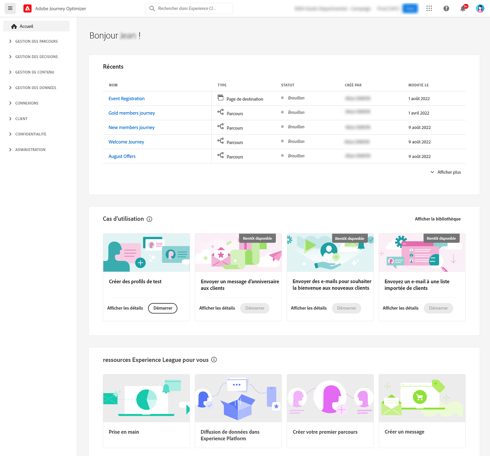

# Navigation dans l’interface {#user-interface}

Pour accéder à Adobe Journey Optimizer, connectez-vous à [Adobe Experience Cloud](https://experience.adobe.com?lang=fr) avec votre Adobe ID, puis sélectionnez [!DNL Journey Optimizer].

>[!NOTE]
>
>* Les composants et fonctionnalités disponibles dans votre environnement dépendent de vos [autorisations](../administration/permissions.md) et [package de licence](https://helpx.adobe.com/fr/legal/product-descriptions/adobe-journey-optimizer.html){target="_blank"}.
>* Cette documentation est fréquemment mise à jour. Certaines captures d’écran peuvent être légèrement différentes de votre interface.

## Visite guidée {#quick-tour}

L’interface de Journey Optimizer se compose de quatre zones principales :

1. **Navigation de gauche** - Accédez à toutes les fonctionnalités organisées par fonction
2. **Barre supérieure** - Recherche universelle, aide, notifications et paramètres
3. **Page d’accueil** - Accès rapide aux éléments récents et aux ressources utiles
4. **Espace de travail principal** - Emplacement où vous créez et gérez votre contenu

## Navigation de gauche {#left-nav}

Le volet de navigation de gauche organise les fonctionnalités de Journey Optimizer en catégories fonctionnelles. Les éléments de menu disponibles dépendent de vos autorisations et de votre licence.

### Sections principales {#main-sections}

**Accueil** - Votre point de départ avec un accès rapide aux éléments récemment créés et aux ressources utiles

**Gestion des Parcours** - Créez et gérez des expériences client
* **Campagnes** - Créez des messages ponctuels ou planifiés pour des audiences spécifiques. [Prise en main des campagnes](../campaigns/get-started-with-campaigns.md)
* **Parcours** - Créez des expériences client à plusieurs étapes et cross-canal. [Créer votre premier parcours](../building-journeys/journey-gs.md)
* **Rapports** - Analysez les performances avec les rapports Customer Journey Analytics intégrés. [Voir la documentation sur le reporting](../reports/campaign-global-report.md)

**Gestion des décisions** - Gérez les offres personnalisées. [En savoir plus sur la gestion des décisions &#x200B;](../offers/get-started/starting-offer-decisioning.md)
* **Offres** - Créez et gérez des offres personnalisées
* **Composants** - Configurez les emplacements, les règles et les balises pour les offres

**Gestion de contenu** - Créez et organisez du contenu
* **Assets** - Référentiel centralisé pour les images et les médias. [Gérer les ressources](../content-management/assets.md)
* **Modèles de contenu** - Modèles de message réutilisables pour les campagnes et les parcours. [Créer des modèles](../content-management/content-templates.md)
* **Fragments** - Blocs de contenu pouvant être utilisés dans plusieurs messages. [Utilisation de fragments](../content-management/fragments.md)
* **Pages de destination** - Formulaires web pour les abonnements et les préférences. [Concevoir des pages de destination](../landing-pages/get-started-lp.md)

**Gestion des données** - Gérez vos bases de données. [Découvrez les schémas et les jeux de données](../data/get-started-schemas.md)
* **Schémas** - Définition de la structure des données
* **Jeux de données** - Stocker et gérer les collections de données
* **Requêtes** - Écrivez et exécutez des requêtes
* **Surveillance** - Suivi de l’ingestion des données

**Connexions** - Intégration à d’autres systèmes
* **Sources** - Ingérez des données à partir de systèmes externes. [Configurer les sources](../data/get-started-sources.md)
* **Destinations** - Exportez les données vers l’espace de stockage dans le cloud. [Configurer des destinations](../data/export-datasets.md)

**Client** - Gestion des audiences et des profils
* **Audiences** - Créez et gérez des segments de clients. [Utiliser les audiences](../audience/about-audiences.md)
* **Listes d’abonnements** - Gérez les listes d’opt-in. [Gestion des abonnements](../landing-pages/subscription-list.md)
* **Profils** - Affichez les profils clients unifiés. [Explorer les profils](../audience/get-started-profiles.md)
* **Identités** - Gérez la résolution des identités. [En savoir plus sur les identités &#x200B;](../audience/get-started-identity.md)

**Confidentialité** - Contrôlez la confidentialité et la conformité. [Présentation de la confidentialité](../privacy/get-started-privacy.md)
* **Politiques** - Définition des politiques de gouvernance des données
* **Demandes** - Gérer les demandes d’accès à des informations personnelles (RGPD, CCPA)
* **Audit** - Consultez les journaux d’activité. [Afficher les journaux d’audit](../privacy/audit-logs.md)
* **Cycle de vie des données** - Configurer la conservation des données

**Administration** - Configurez les paramètres système. [Présentation du contrôle d’accès](../administration/permissions-overview.md)
* **Configurations** - Configurez des événements, des sources de données et des actions. [Configurer des canaux](../configuration/get-started-configuration.md)
* **Règles métier** - Contrôlez la fréquence des messages et l’entrée des parcours. [Configurer des règles métier](../configuration/frequency-rules.md)
* **Alertes** - Affichez et gérez les alertes système. [Surveiller les alertes](../reports/alerts.md)
* **Sandbox** - Gérez les environnements et copiez des objets entre les sandbox. [Utilisation des sandbox](../administration/sandboxes.md)
* **Canaux** - Configurez les paramètres des canaux et la délivrabilité
* **Balises** - Organiser et catégoriser le contenu

## Fonctions de la barre supérieure {#top-bar}

### Recherche universelle {#search}

Utilisez l’icône de recherche pour rechercher rapidement des parcours, des campagnes, des ressources et d’autres objets dans Journey Optimizer. Saisissez des mots-clés pour afficher les résultats pertinents dans toutes les zones de la plateforme.

### Aide et assistance {#help}

Cliquez sur l’icône **Aide** pour :
* Rechercher des articles et des vidéos d’aide
* Accéder à l’aide contextuelle pour la page active
* Contactez l’assistance Adobe
* Partager vos commentaires

### Notifications {#notifications}

Activez les notifications internes au produit et par e-mail pour rester informé des points suivants :
* **Alertes** - Défaillances du système et problèmes de performances
* **Approbations** - Demandes nécessitant votre examen
* **Nouvelles versions** - Mises à jour de produit et nouvelles fonctionnalités

Pour configurer des notifications :

1. Cliquez sur l’icône de votre profil et sélectionnez **[!UICONTROL Préférences]**
2. Dans **[!UICONTROL Notifications]**, recherchez **[!UICONTROL Journey Optimizer]**.
3. Activez les types de notification à recevoir

{width="60%" align="center"}

### Préférences de langue {#language}

L’interface est disponible en anglais, français, allemand, italien, espagnol, portugais (brésilien), japonais, coréen, chinois traditionnel et chinois simplifié.

Pour modifier la langue :

1. Cliquez sur **Préférences** dans le menu de votre profil
2. Sélectionner la langue de votre choix
3. Vous pouvez éventuellement sélectionner une deuxième langue comme langue de remplacement
4. Cliquez sur **Enregistrer**.

## Page d’accueil {#home-page}

La page d’accueil fournit les éléments suivants :

* **Récents** - Raccourcis vers des événements, parcours, campagnes et autres objets récemment créés
* **Cas d’utilisation** - Scénarios préconfigurés pour vous aider à commencer rapidement (création de profils de test, envoi de messages d’anniversaire, etc.)
* **Ressources** - Liens vers la documentation, les tutoriels et l’assistance

### Cas D’Utilisation Internes Au Produit {#use-cases}

Les workflows de démarrage rapide vous permettent d’accomplir les tâches courantes :

* **Création de profils de test** - Génération de profils de test à l’aide de modèles CSV
* **Envoyer des messages d&#39;anniversaire** - Envoyer automatiquement des e-mails d&#39;anniversaire (bientôt disponible)
* **Intégrer de nouveaux clients** - Série de bienvenue pour les nouveaux clients (bientôt disponible)
* **Envoyer un push aux listes importées** - Notifications push rapides à partir de données CSV (bientôt disponible)

Cliquez sur **[!UICONTROL Afficher les détails]** pour en savoir plus sur chaque cas d’utilisation, ou sur **[!UICONTROL Commencer]** pour commencer.

## Assistant IA {#ai-assistant}

AI Assistant fournit une aide instantanée et des informations opérationnelles. Cliquez sur l’icône de l’assistant d’IA dans la barre supérieure pour :
* Obtenir des réponses sur les fonctionnalités du produit
* Recevoir des informations opérationnelles sur vos parcours
* Parcourir les concepts et les bonnes pratiques

[En savoir plus sur l’assistant AI](ai-features.md#ai-assistant)

## Rubriques connexes {#related-topics}

* [Choisir votre parcours de formation par rôle](quick-start.md)
* [Recherche, filtrage et catégorisation du contenu](search-filter-categorize.md)
* [Comprendre le fonctionnement de Journey Optimizer](understanding-ajo.md)
* [Fonctionnalités d’accessibilité](accessibility.md)

<!--CONTEXTUAL HELP TO DISPATCH IN DOCS ONCE FEATURE LIVE-->

<!--ORCHESTRATED CAMPAIGNS - Overview page-->

<!--OVERVIEW TAB ORCHESTRATED CAMPAIGNS SKU only-->

>[!CONTEXTUALHELP]
>id="ajo_oc_campaign_ovv_1"
>title="Orchestration des campagnes"
>abstract="Partager, combiner, enrichir et manipuler des jeux de données relationnels pour définir votre audience"

>[!CONTEXTUALHELP]
>id="ajo_oc_campaign_ovv_2"
>title="Exploiter les données multi-entités"
>abstract="Découvrir comment les campagnes orchestrées peuvent tirer parti des jeux de données relationnelles pour enrichir les données à des fins de segmentation et de personnalisation."

>[!CONTEXTUALHELP]
>id="ajo_oc_campaign_ovv_3"
>title="Segmentation ad hoc et décomptes exacts"
>abstract="Créer votre segment étape par étape avec des décomptes exacts"

>[!CONTEXTUALHELP]
>id="ajo_oc_campaign_ovv_4"
>title="Canaux disponibles"
>abstract="E-mail, SMS, notifications push, courrier"

<!--OVERVIEW TAB ORCHESTRATED CAMPAIGNS + JOURNEYS SKU -->

>[!CONTEXTUALHELP]
>id="ajo_oc_jo_camppaign_ovv_1"
>title="IU guidée pour créer et envoyer une campagne"
>abstract="Définissez une ou plusieurs actions avec un canal, choisissez une audience, définissez un contenu, définissez un planning... tout est prêt pour l’envoi !"

>[!CONTEXTUALHELP]
>id="ajo_oc_jo_camppaign_ovv_2"
>title="Canaux disponibles"
>abstract="E-mail, SMS, notifications push et expériences in-app, web, basées sur du code"

<!--OVERVIEW TAB ORCHESTRATED CAMPAIGNS - API triggered tab -->

>[!CONTEXTUALHELP]
>id="ajo_oc_api_camppaign_ovv_1"
>title="Campagnes déclenchées par l’API transactionnelle"
>abstract="Déclencher des messages en temps réel par le biais d’appels API"

>[!CONTEXTUALHELP]
>id="ajo_oc_api_camppaign_ovv_2"
>title="Messages marketing"
>abstract="Contenu promotionnel (nécessite un accord préalable, soumis aux règles métier)"

>[!CONTEXTUALHELP]
>id="ajo_oc_api_camppaign_ovv_3"
>title="Messages transactionnels"
>abstract="Contenu lié au service (confirmations, alertes, non soumis à un consentement marketing)"

>[!CONTEXTUALHELP]
>id="ajo_oc_api_camppaign_ovv_4"
>title="Canaux disponibles"
>abstract="E-mail, SMS, notifications push"

<!--APPROVAL POLICIES-->

>[!CONTEXTUALHELP]
>id="ajo_campaigns_edit_disabled"
>title="Modifier désactivé"
>abstract="Modifier désactivé (campagnes)"

>[!CONTEXTUALHELP]
>id="ajo_journey_edit_disabled"
>title="Modifier désactivé"
>abstract="Modifier désactivé (parcours)"

>[!CONTEXTUALHELP]
>id="ajo_approval_policy_approval_status"
>title="Statut d’approbation"
>abstract="Statut d’approbation"

>[!CONTEXTUALHELP]
>id="ajo_campaigns_approve"
>title="Approuver"
>abstract="Approuver (campagnes)"

>[!CONTEXTUALHELP]
>id="ajo_journey_approve"
>title="Approuver"
>abstract="Approuver (parcours)"

>[!CONTEXTUALHELP]
>id="ajo_journey_simulation"
>title="Simuler votre parcours"
>abstract="La simulation de parcours vous permet de valider vos parcours et de voir leurs performances avant leur activation. Elle utilise les données d’un modèle formé pour fournir des chiffres sur tout le parcours, afin d’illustrer comment le parcours se comportera dans un scénario réel."

<!-- WEBHOOKS -->

>[!CONTEXTUALHELP]
>id="ajo_channels_feedback_webhook_settings"
>title="Activer les webhooks"
>abstract="Activez les webhooks pour recevoir un retour en temps réel sur le statut d’exécution de vos messages. Avant d’activer cette option, assurez-vous d’avoir configuré un webhook dans le menu **Administration** / **Canaux** / **Webhook de retour**."

>[!CONTEXTUALHELP]
>id="ajo_channels_feedback_webhook_settings_create"
>title="Webhooks de retour"
>abstract="Les webhooks de retour permettent de recevoir un retour en temps réel sur le statut d’exécution des messages envoyés avec des campagnes déclenchées par API transactionnelle. Une seule configuration de webhook par combinaison organisation + sandbox est autorisée."

>[!CONTEXTUALHELP]
>id="ajo_channels_feedback_webhook_settings_configuration"
>title="Configuration de base"
>abstract="Dans cette section, saisissez un nom explicite pour identifier le webhook et sélectionnez le ou les canaux pour lesquels ce webhook doit recevoir un retour (e-mail et/ou SMS). Dans le champ URL du webhook, indiquez le point d’entrée HTTPS où les événements de retour doivent être diffusés."

>[!CONTEXTUALHELP]
>id="ajo_channels_feedback_webhook_settings_authentication"
>title="Authentification"
>abstract="Si votre point d’entrée nécessite une authentification JWT, sélectionnez **Authentification JWT** dans la liste et fournissez les détails requis."

>[!CONTEXTUALHELP]
>id="ajo_channels_feedback_webhook_settings_header_parameters"
>title="Paramètres d’en-tête"
>abstract="Dans cette section, vous pouvez configurer des en-têtes personnalisés supplémentaires à envoyer avec chaque requête de webhook."
