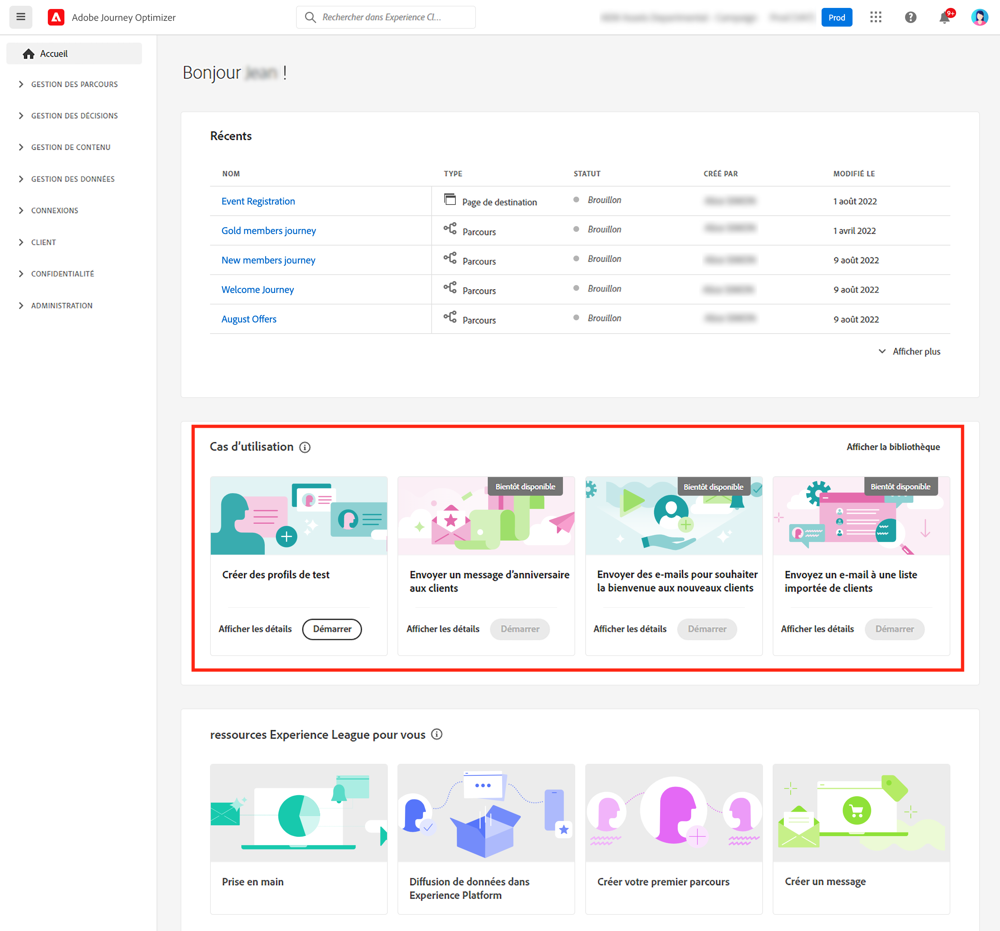
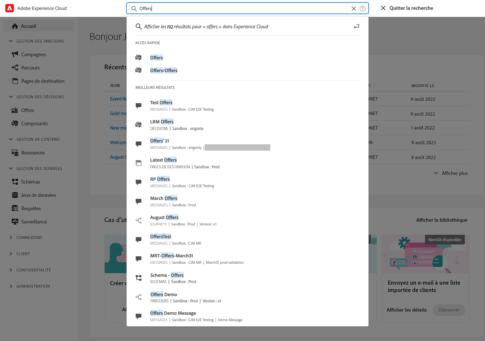
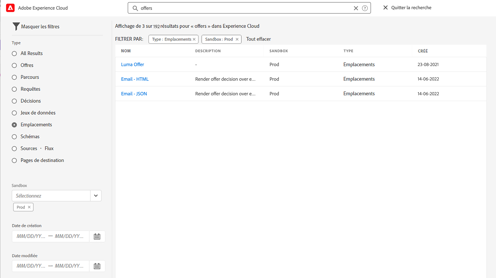

# Interface utilisateur {#cjm-user-interface}

Se connecter à [Adobe Experience Cloud](http://experience.adobe.com) et accédez à [!DNL Journey Optimizer].

Les concepts clés lors de la navigation dans l’interface utilisateur sont communs à Adobe Experience Platform. Voir [Documentation d’Adobe Experience Platform](https://experienceleague.adobe.com/docs/experience-platform/landing/platform-ui/ui-guide.html#adobe-experience-platform-ui-guide){target=&quot;_blank&quot;} pour plus d’informations.

Les composants et fonctionnalités disponibles dans l’interface utilisateur dépendent de votre [permissions](../administration/permissions.md) et sur votre [package de licence](https://helpx.adobe.com/legal/product-descriptions/adobe-journey-optimizer.html){target=&quot;_blank&quot;}. Pour toute question, contactez votre responsable du succès client Adobe.

>[!NOTE]
>
>Cette documentation est fréquemment mise à jour pour prendre en compte les dernières modifications apportées à l’interface utilisateur du produit. Cependant, certaines captures d’écran peuvent légèrement différer de votre interface utilisateur.

## Navigation de gauche {#left-nav}

Parcourir les liens à gauche pour accéder à [!DNL Journey Optimizer] fonctionnalités.

>[!NOTE]
>
>Les fonctionnalités disponibles peuvent varier en fonction de vos autorisations et de votre contrat de licence.

Vous trouverez ci-dessous la liste complète des services et fonctionnalités disponibles dans le volet de navigation de gauche, ainsi que des liens vers les pages d’aide associées.

**Accueil**

[!DNL Journey Optimizer] la page d’accueil contient des liens et des ressources clés à démarrer. Le **[!UICONTROL Recents]** La liste propose des raccourcis vers les événements et parcours récemment créés. Cette liste affiche les dates et statuts de création et de modification.

**[!UICONTROL JOURNEY MANAGEMENT]**

* **[!UICONTROL Journeys]** - Créez, configurez et orchestrez vos parcours client. [En savoir plus](../building-journeys/journey-gs.md#jo-build)

* **[!UICONTROL Landing pages]** - Créer, concevoir, tester et publier des landing pages. [En savoir plus](../landing-pages/get-started-lp.md)

**[!UICONTROL DECISION MANAGEMENT]**

* **[!UICONTROL Offers]** - Accédez à vos sources et jeux de données récents à partir de ce menu. Utilisez cette section pour créer de nouvelles offres. [En savoir plus](../offers/offer-library/creating-personalized-offers.md)

* **[!UICONTROL Components]** - Créez des emplacements, des règles et des balises. [En savoir plus](../offers/offer-library/key-steps.md)

**[!UICONTROL CONTENT MANAGEMENT]**

* **[!UICONTROL Assets]** - [!DNL Adobe Experience Manager Assets Essentials] est un référentiel centralisé de ressources que vous pouvez utiliser pour remplir vos messages. [En savoir plus](../email/assets-essentials.md)

**[!UICONTROL DATA MANAGEMENT]**

* **[!UICONTROL Schemas]** - Utilisez Adobe Experience Platform pour créer et gérer des schémas de modèle de données d’expérience (XDM) dans une zone de travail visuelle interactive appelée éditeur de schémas. [En savoir plus](../data/get-started-schemas.md)

* **[!UICONTROL Datasets]** - Toutes les données ingérées dans Adobe Experience Platform sont conservées sous forme de jeux de données dans le lac de données. Un jeu de données est une structure de stockage et de gestion pour une collecte de données, généralement sous la forme d’un tableau, qui contient un schéma (des colonnes) et des champs (des lignes). [En savoir plus](../data/get-started-datasets.md)

* **[!UICONTROL Queries]** - Utilisez Adobe Experience Platform Query Service pour écrire et exécuter des requêtes, afficher les requêtes précédemment exécutées et accéder aux requêtes enregistrées par les utilisateurs de votre entreprise. [En savoir plus](../data/get-started-queries.md)

* **[!UICONTROL Monitoring]** - Utilisez ce menu pour surveiller votre ingestion de données dans l’interface utilisateur d’Adobe Experience Platform. [En savoir plus](https://experienceleague.adobe.com/docs/experience-platform/ingestion/quality/monitor-data-ingestion.html){target=&quot;_blank&quot;}

**[!UICONTROL CONNECTIONS]**

* **[!UICONTROL Sources]** - Utilisez ce menu pour ingérer des données provenant de diverses sources (applications Adobe, stockage dans le cloud, bases de données, etc.), ainsi que pour structurer, étiqueter et améliorer les données entrantes. [En savoir plus](get-started-sources.md)

**[!UICONTROL CUSTOMER]**

* **[!UICONTROL Segments]** - Créez et gérez des définitions de segment Experience Platform et exploitez-les dans vos parcours. [En savoir plus](../segment/about-segments.md)

* **[!UICONTROL Profiles]** - Real-time Customer Profile offre une vue d’ensemble de chaque client, en combinant des données issues de plusieurs canaux, notamment des données en ligne, hors ligne, CRM et tierces. [En savoir plus](../segment/get-started-profiles.md)

* **[!UICONTROL Identities]** - Adobe Experience Platform Identity Service gère l’identification inter-appareils, cross-canal et en temps quasi réel de vos clients dans ce qu’on appelle un graphique d’identités dans Adobe Experience Platform. [En savoir plus](../segment/get-started-identity.md)

**[!UICONTROL ADMINISTRATION]**

* **[!UICONTROL Journey Administration]** - Utilisez ce menu pour configurer [events](../event/about-events.md), [sources de données](../datasource/about-data-sources.md) et [actions](../action/action.md) à utiliser dans vos parcours.

* **[!UICONTROL Sandboxes]** - Adobe Experience Platform fournit des environnements de test qui divisent une instance unique en environnements virtuels distincts pour favoriser le développement et l’évolution d’applications d’expérience numérique. [En savoir plus](../administration/sandboxes.md)

* **[!UICONTROL Alerts]** - L’interface utilisateur vous permet de consulter l’historique des alertes reçues en fonction des mesures affichées par Adobe Experience Platform Observability Insights. L’interface utilisateur vous permet également d’afficher, d’activer et de désactiver les règles d’alerte disponibles. [En savoir plus](https://experienceleague.adobe.com/docs/experience-platform/observability/alerts/overview.html){target=&quot;_blank&quot;}

## Cas d’utilisation internes au produit {#in-product-uc}

Utilisation [!DNL Adobe Journey Optimizer] des cas d’utilisation de la page d’accueil et fournissent quelques entrées rapides pour créer un parcours client.

Les cas d’utilisation disponibles sont les suivants :

* **Créer des profils de test**, pour créer des profils de test à l’aide de notre modèle CSV afin de tester les parcours et les messages personnalisés. Découvrez comment mettre en oeuvre ce cas pratique [sur cette page](../segment/creating-test-profiles.md#use-case-1).
* **Envoyer un message d&#39;anniversaire aux clients**, pour envoyer automatiquement un email pour souhaiter à vos clients la fin de leur anniversaire. (bientôt disponible)
* **Envoyer des emails aux nouveaux clients**, pour envoyer facilement jusqu’à deux e-mails afin d’accueillir vos nouveaux clients enregistrés. (bientôt disponible)
* **Envoyer des messages push à la liste de clients importée**, pour envoyer rapidement une notification push à une liste de clients importés à partir d’un fichier CSV. (bientôt disponible)

Cliquez sur **[!UICONTROL View details]** pour en savoir plus sur chaque cas d’utilisation.

Cliquez sur le bouton **[!UICONTROL Begin]** pour lancer le cas d’utilisation.

Vous pouvez accéder aux cas d’utilisation exécutés à partir de la **[!UICONTROL View use case library]** bouton .

## Accessibilité{#accessibility}

Fonctionnalités d’accessibilité dans [!DNL Adobe Journey Optimizer] sont hérités d’Adobe Experience Platform :

* Accessibilité au clavier
* Contraste de couleur
* Validation des champs obligatoires

[En savoir plus](https://experienceleague.adobe.com/docs/experience-platform/accessibility/features.html){target=&quot;_blank&quot;} dans la documentation Adobe Experience Platform.

Vous pouvez utiliser ces raccourcis clavier courants dans [!DNL Journey Optimizer]:

| Action | Raccourci |
| --- | --- |
| Déplacement entre les éléments, sections et groupes de menus de l’interface utilisateur | Onglet |
| Revenez en arrière entre les éléments, sections et groupes de menus de l’interface utilisateur. | Maj + tabulation |
| Déplacement dans des sections pour définir la cible d’action sur des éléments individuels | Flèche |
| Sélectionner ou effacer un élément ciblé | Entrée ou Barre d’espacement |
| Annulation d’une sélection, réduction d’un panneau ou fermeture d’une boîte de dialogue | Échap |

[En savoir plus](https://experienceleague.adobe.com/docs/experience-platform/accessibility/custom.html){target=&quot;_blank&quot;} dans la documentation Adobe Experience Platform.

Vous pouvez utiliser ces raccourcis dans des parties spécifiques de Journey Optimizer :

<table>
  <thead>
    <tr>
      <th>Elément de l’interface</th>
      <th>Action</th>
      <th>Raccourci</th>
    </tr>
  </thead>
  <tr>
    <td>Liste des parcours, actions, sources de données ou événements</td>
    <td>Créer un parcours, une action, une source de données ou un événement</td>
    <td>C</td>
  </tr>
  <tr>
    <td rowspan="3">Canevas du parcours à l’état préliminaire</td>
    <td>Ajoutez une activité à partir de la palette gauche à la première position disponible, du haut vers le bas.</td>
    <td>Double-cliquez sur l’activité.</td>
  </tr>
  <tr>
    <td>Sélectionner toutes les activités</td>
    <td>Ctrl + A (Windows) Commande + A (Mac)</td>
  </tr>
  <tr>
    <td>Supprimer les activités sélectionnées</td>
    <td>Supprimer ou Retour arrière, puis Entrée pour confirmer la suppression</td>
  </tr>
  <tr>
  <td rowspan="3">

Volet de configuration de ces éléments :

<ul>
  <li>Activité dans un parcours</li>
  <li>Événement</li>
  <li>Source de données</li>
  <li>Action</li>
</ul>

</td>
    <td>Accéder au champ suivant à configurer</td>
    <td>Onglet</td>
  </tr>
  <tr>
    <td>Enregistrez les modifications et fermez le volet de configuration.</td>
    <td>Entrée</td>
  </tr>
  <tr>
    <td>Ignorer les modifications et fermer le volet de configuration</td>
    <td>Échap</td>
  </tr>
  <tr>
    <td rowspan="4">Parcours en mode test</td>
    <td>Activation ou désactivation du mode test</td>
    <td>T</td>
  </tr>
  <tr>
    <td>Déclenchement d’un événement dans un parcours basé sur un événement</td>
    <td>E</td>
  </tr>
  <tr>
    <td>

Déclenchez un événement dans un parcours basé sur des segments pour lequel la variable **[!UICONTROL Single profile at a time]** l’option est activée.

</td>
    <td>P</td>
  </tr>
  <tr>
    <td>Afficher les journaux de test</td>
    <td>L</td>
  </tr>
<!-- //Ajouter ce raccourci quand il marchera (actuellement, le raccourci Ctrl/Cmd+F du navigateur a priorité sur celui de AJO).//
  <tr>
    <td>Page with a search bar</td>
    <td>Select the search bar</td>
    <td>Ctrl/Command + F</td>
  </tr>
-->
  <tr>
    <td>Champ de texte</td>
    <td>Sélectionner tout le texte du champ sélectionné</td>
    <td>Ctrl + A (Windows) Commande + A (Mac)</td>
  </tr>
  <tr>
    <td rowspan="2">Fenêtre contextuelle</td>
    <td>Enregistrer les modifications ou confirmer l’action</td>
    <td>Entrée</td>
  </tr>
  <tr>
    <td>Fermer la fenêtre</td>
    <td>Échap</td>
  </tr>
  <tr>
    <td>Éditeur d’expression simple</td>
    <td>Sélection et ajout d’un champ</td>
    <td>Double-cliquer sur un champ</td>
  </tr>
  <tr>
    <td>Navigation dans les champs XDM</td>
    <td>Sélectionner tous les champs d’un noeud</td>
    <td>Sélectionner le noeud parent</td>
  </tr>
  <tr>
    <td>Aperçu de la payload</td>
    <td>Sélectionner la payload</td>
    <td>Ctrl + A (Windows) Commande + A (Mac)</td>
  </tr>
</table>

## Recherche d’aide et d’assistance {#find-help}

Accédez aux pages d’aide de la clé Adobe Journey Optimizer depuis la section inférieure de la page d’accueil.

Utilisez la variable **Aide** pour accéder aux pages d’aide, contacter l’assistance et partager des commentaires. Vous pouvez rechercher des articles et des vidéos d’aide dans le champ de recherche.

## Navigateurs pris en charge {#browsers}

Adobe [!DNL Journey Optimizer] L’interface est conçue pour fonctionner de manière optimale dans la dernière version de Google Chrome. Vous pouvez rencontrer des problèmes lors de l’utilisation de certaines fonctionnalités sur des versions plus anciennes ou d’autres navigateurs.

## Préférences linguistiques {#language-pref}

L’interface utilisateur est actuellement disponible dans les langues suivantes :

* Anglais
* Français
* Allemand
* Italien
* Espagnol
* Portugais (brésilien)
* Japonais
* Coréen

La langue de votre interface par défaut est déterminée par la langue préférée spécifiée dans votre profil utilisateur.

Pour modifier votre langue :

* Cliquez sur **Préférences** de votre avatar, en haut à droite.
   
* Cliquez ensuite sur la langue affichée sous votre adresse email.
* Sélectionnez la langue de votre choix et cliquez sur **Enregistrer**. Vous pouvez sélectionner une seconde langue au cas où le composant que vous utilisez n’est pas localisé dans votre première langue.
   

## Rechercher{#unified-search}

Depuis l’interface d’Adobe Journey Optimizer, utilisez la fonctionnalité de recherche d’Adobe Experience Cloud unifiée au centre de la barre supérieure pour rechercher des ressources, des parcours, des jeux de données, etc. dans vos environnements de test.

Commencez à saisir du contenu pour afficher les principaux résultats. Les articles d’aide sur les mots-clés saisis apparaissent également dans les résultats.

Press **Entrée** pour accéder à tous les résultats et filtrer par objet professionnel.

## Filtrer les listes{#filter-lists}

Dans la plupart des listes, une barre de recherche permet de rechercher un élément spécifique et de sélectionner des critères de filtrage.

Pour accéder aux filtres, cliquez sur l’icône de filtre en haut à gauche de la liste. Le menu Filtrer permet de filtrer les éléments affichés en fonction de différents critères. Vous pouvez choisir d&#39;afficher uniquement les éléments d&#39;un certain type ou statut, ceux que vous avez créés ou ceux que vous avez modifiés au cours des 30 derniers jours. Les options varient en fonction du contexte.

Dans la liste des parcours, vous pouvez filtrer les parcours en fonction de leur état, de leur type et de leur version à partir du **[!UICONTROL Status and version filters]**. Le type peut être : **[!UICONTROL Unitary event]**, **[!UICONTROL Segment qualification]**, **[!UICONTROL Read segment]**, **[!UICONTROL Business event]** ou **[!UICONTROL Burst]**. Vous pouvez choisir d’afficher uniquement les parcours qui utilisent un événement, un groupe de champs ou une action spécifique de la **[!UICONTROL Activity filters]** et **[!UICONTROL Data filters]**. Le **[!UICONTROL Publication filters]** vous permet de sélectionner une date de publication ou un utilisateur. Vous pouvez, par exemple, choisir d’afficher les dernières versions des parcours actifs publiées hier. [En savoir plus](../building-journeys/using-the-journey-designer.md).

>[!NOTE]
>
>Notez que les colonnes affichées peuvent être personnalisées à l’aide du bouton de configuration situé en haut à droite des listes. La personnalisation est enregistrée pour chaque utilisateur.

Utilisez la variable **[!UICONTROL Last update]** et **[!UICONTROL Last update by]** colonnes pour vérifier quand s’est produit la dernière mise à jour de vos parcours et qui les a enregistrés.

Dans les volets de configuration Événement, Source de données et Action, la variable **[!UICONTROL Used in]** affiche le nombre de parcours qui utilisent cet événement, ce groupe de champs ou cette action spécifique. Vous pouvez cliquer sur le bouton **[!UICONTROL View journeys]** pour afficher la liste des parcours correspondants.

Dans les listes, vous pouvez effectuer des actions de base sur chaque élément. Vous pouvez par exemple dupliquer ou supprimer un élément.

