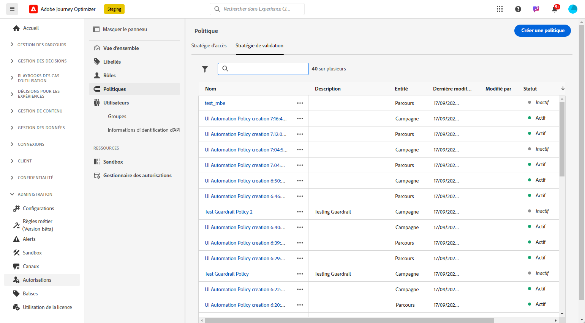
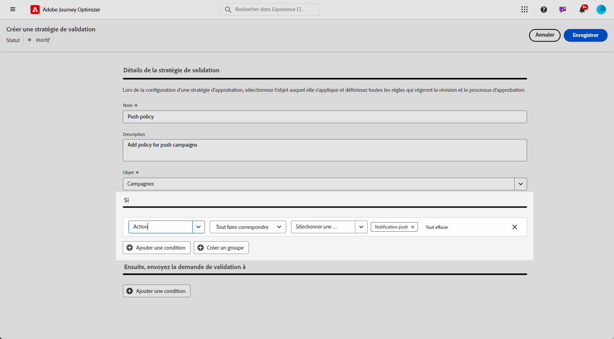
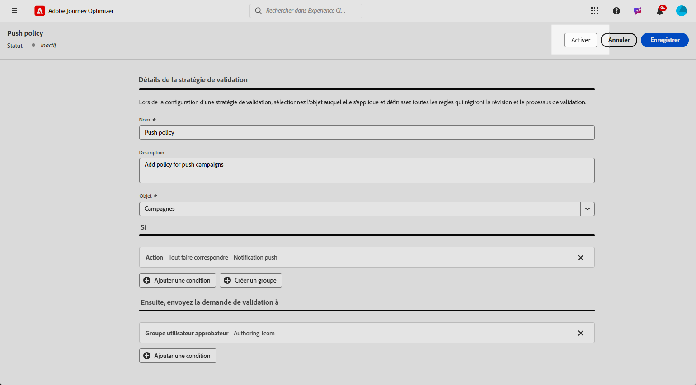
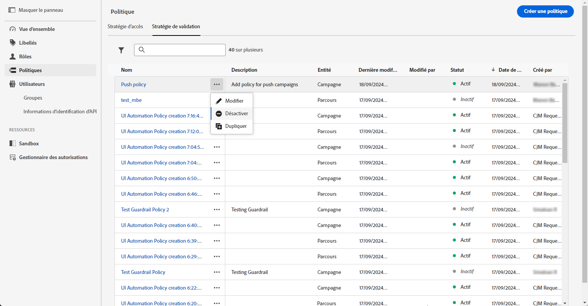

# Créer et gérer des politiques d’approbation {#approval-policies}

>[!CONTEXTUALHELP]
>id="ajo_approval_policy_request_approval"
>title="Demander l’approbation"
>abstract="Demander l’approbation"

>[!CONTEXTUALHELP]
>id="ajo_approval_policy_request_change"
>title="Demander une modification"
>abstract="Demander une modification"

>[!NOTE]
>
>Pour créer des politiques d’approbation, vous devez disposer de droits d’administration du système ou du produit dans Adobe Experience Platform. [En savoir plus](https://experienceleague.adobe.com/fr/docs/experience-platform/access-control/home)

Les politiques d’approbation permettent à l’équipe d’administration d’établir un processus de validation pour les parcours et les campagnes. Ce système décrit des conditions spécifiques qui déterminent si un parcours ou une campagne nécessite une approbation. La complexité de ces politiques peut varier. Elles vont de la simple exigence que toutes les campagnes soient examinées par une personne ou une équipe donnée, à la mise en place de critères fondés sur la personne à l’origine de la campagne.

Vous pouvez cibler des politiques d’approbation à l’aide de critères flexibles tels que les balises, les noms de campagne ou de parcours, les types de canal ou les informations sur la personne à l’origine de la demande. Par exemple, vous pouvez exiger une approbation pour tous les objets balisés « risque élevé » ou pour toute campagne correspondant à un modèle de dénomination spécifique.

## Créer des politiques d’approbation {#create-policies}

>[!CONTEXTUALHELP]
>id="ajo_permissions_approval_policy"
>title="Nouvelle politique d’approbation"
>abstract="Dans cet écran, saisissez le nom et sélectionnez le contexte de la politique d’approbation, puis créez les conditions pour déterminer qui peut lancer la demande d’approbation et qui peut la valider."

>[!CONTEXTUALHELP]
>id="ajo_approval_policy_self_approval"
>title="Bloquer l’auto-approbation"
>abstract="Activez cette option pour empêcher les utilisateurs d’approuver leurs propres demandes d’approbation, même s’ils appartiennent à un groupe d’utilisateurs ou à un rôle désigné comme réviseur."

Pour créer une politique d’approbation, procédez comme suit :

1. Dans le menu **[!UICONTROL Administration]** de [!DNL Journey Optimizer], accédez à **[!UICONTROL Autorisations]**, puis **[!UICONTROL Politiques]**.

   

1. Cliquez sur **[!UICONTROL Créer]** dans l’onglet **[!UICONTROL Politique d’approbation]**, sélectionnez **[!UICONTROL Politique d’approbation]**, puis cliquez sur **[!UICONTROL Confirmer]**.

1. Saisissez un **[!UICONTROL nom]** et une **[!UICONTROL description]** pour la politique.

1. Indiquez si la politique s’appliquera à des **[!UICONTROL parcours]** ou à des **[!UICONTROL campagnes]**.

1. Activez l’option **[!UICONTROL Bloquer l’auto-approbation]** pour empêcher les créateurs et créatrices de parcours/campagne de valider leurs propres objets.

   

Vous pouvez maintenant affiner les conditions afin de spécifier qui peut lancer la demande d’approbation et qui peut la valider.

## Définir les conditions des politiques d’approbation {#conditions}

Les politiques d’approbation offrent des options de ciblage flexibles pour répondre à vos besoins de gouvernance. Vous pouvez créer des politiques d’approbation basées sur différents critères, notamment :

* **Noms de campagne/parcours** : ciblez des objets spécifiques par nom.
* **Balises** : appliquez des politiques à toutes les campagnes ou à tous les parcours comportant une balise spécifique.
* **Types de canal** : demandez une approbation pour des actions spécifiques (e-mail, SMS, notification push, etc.)
* **Types de campagne** : définissez des règles différentes pour les campagnes [d’action ou déclenchées par API](../campaigns/get-started-with-campaigns.md#campaign-types).
* **Personnes à l’origine de la demande** : définissez des politiques en fonction de la personne qui crée la campagne ou le parcours.

Pour définir les conditions associées à une politique d’approbation, procédez comme suit :

1. Accédez à votre **[!UICONTROL politique d’approbation]**.

1. Dans le menu **[!UICONTROL Si]**, cliquez sur **[!UICONTROL Ajouter une condition]** pour définir quel objet ou quelle personne déclenchera une demande d’approbation.

1. Sélectionnez la **[!UICONTROL catégorie]**, la **[!UICONTROL règle de correspondance]** et les **[!UICONTROL options]** appropriées.

   Par exemple, « Si Action correspond à n’importe quel Courrier » ou « Si Nom de la personne à l’origine de la demande correspond à Jean Dupont ».

   

   +++ En savoir plus sur les catégories et options disponibles
   <table>
    <tr>
      <th>Catégorie</th>
      <th>Option</th>
    </tr>
    <tr>
      <td rowspan="3">Type de campagne</td>
      <td>Planifié (marketing)</td>
    </tr>
    <tr>
    <td>Déclenché par l’API (marketing)</td>
    </tr>
    <tr>
    <td>Déclenché par l’API (transactionnel)</td>
    </tr>
    <tr>
    <td rowspan="8">Action</td>
    <td>In-app</td>
    </tr>
    <tr>
    <td>Notification push</td>
   </tr>
    <tr>
    <td>SMS</td>
    </tr>
    <tr>
    <td>E-mail</td>
    </tr>
    <tr>
    <td>Courrier</td>
    </tr>
    <tr>
    <td>Web</td>
    </tr>
    <tr>
    <td>Basé sur le code</td>
    </tr>
    <tr>
    <td>Carte de contenu</td>
    </tr>
    <tr>
    <td>Balises</td>
    <td>Nom de la balise utilisée pour organiser vos audiences. </td>
    </tr>
    <tr>
    <td>Nom de l’objet</td>
    <td>Nom de votre objet.</td>
    </tr>
    <tr>
    <td>Nom de la personne à l’origine de la demande</td>
    <td>Nom et adresse e-mail de la personne désignée à l’origine de la demande</td>
    </tr>
    <tr>
    <td>Groupe d’utilisateurs et d’utilisatrices à l’origine de la demande</td>
    <td>Nom du groupe des personnes désignées à l’origine de la demande</td>
    </tr>
    </table>

1. Pour ajouter d’autres critères, cliquez sur **[!UICONTROL Ajouter une condition]** pour définir des règles supplémentaires et sélectionnez **[!UICONTROL Et]** ou **[!UICONTROL Ou]** pour spécifier la manière dont les conditions sont connectées.

1. Dans le menu **[!UICONTROL Envoyer ensuite la demande d’approbation à]**, cliquez sur **[!UICONTROL Ajouter une condition]** pour définir qui peut accepter la demande d’approbation.

1. Dans la liste déroulante **[!UICONTROL Catégorie]**, indiquez si vous souhaitez choisir un groupe d’utilisateurs et d’utilisatrices ou une individuelle.

1. Ensuite, dans la liste déroulante **[!UICONTROL Option]**, sélectionnez le groupe d’utilisateurs et d’utilisatrice ou la personne spécifique.

   La personne sélectionnée ou le groupe d’utilisateurs et d’utilisatrices sélectionné sera responsable de la validation de la demande d’approbation.

   

1. Pour ajouter d’autres critères, cliquez sur **[!UICONTROL Ajouter une condition]** pour définir des règles supplémentaires et sélectionnez **[!UICONTROL Et]** ou **[!UICONTROL Ou]** pour spécifier la manière dont les conditions sont connectées.

1. Une fois votre politique entièrement configurée, cliquez sur **[!UICONTROL Enregistrer]**.

Vous pouvez maintenant activer votre politique d’approbation pour l’appliquer.

## Activer et gérer des politiques d’approbation {#activate-policies}

Pour appliquer votre politique d’approbation, vous devez l’activer. Pour ce faire, procédez comme suit :

1. Accédez à votre **[!UICONTROL politique d’approbation]**.

1. Cliquez ensuite sur **[!UICONTROL Activer]** pour appliquer les conditions configurées à votre environnement.

   >[!NOTE]
   >
   >Une fois activée, les politiques ne peuvent pas être modifiées. Pour modifier les conditions, désactivez d’abord la politique.

   

1. Dans le menu **[!UICONTROL Politique]**, ouvrez les options avancées pour **[!UICONTROL modifier]**, **[!UICONTROL désactiver]** ou **[!UICONTROL dupliquer]** la politique selon les besoins.

   
