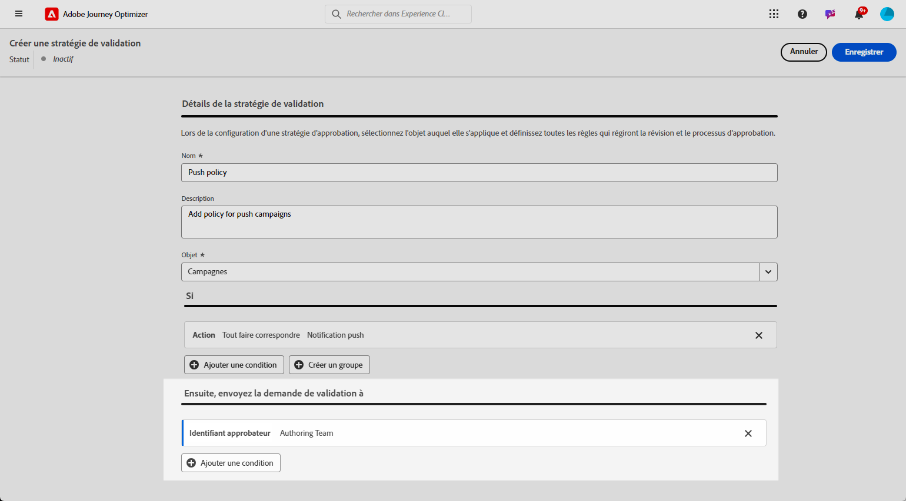

# Créer et gérer des politiques d’approbation {#approval-policies}

>[!NOTE]
>
>Pour créer des stratégies d’approbation, vous devez disposer de droits d’administrateur système ou produit dans Adobe Experience Platform. [En savoir plus](https://experienceleague.adobe.com/en/docs/experience-platform/access-control/home)

Les politiques d’approbation permettent à l’équipe d’administration d’établir un processus de validation pour les parcours et les campagnes. Ce système décrit des conditions spécifiques qui déterminent si un parcours ou une campagne nécessite une approbation. Ces politiques peuvent être d’une complexité variable, allant du simple fait d’exiger que toutes les campagnes soient examinées par une personne ou une équipe spécifique à l’établissement de critères en fonction de la personne qui a créé la campagne.

## Créer des politiques d’approbation {#create-policies}

1. Dans le menu **[!UICONTROL Administration]** de Journey Optimizer, accédez à **[!UICONTROL Autorisations]**, puis **[!UICONTROL Stratégies]**.

   

1. Cliquez sur **[!UICONTROL Créer]** dans l’onglet **[!UICONTROL Politique d’approbation]**, sélectionnez **[!UICONTROL Politique d’approbation]**, puis cliquez sur **[!UICONTROL Confirmer]**.

1. Saisissez un **[!UICONTROL nom]** et une **[!UICONTROL description]** pour la politique.

1. Indiquez si la politique s’appliquera à des **[!UICONTROL parcours]** ou à des **[!UICONTROL campagnes]**.

   

Vous pouvez maintenant affiner les conditions afin de spécifier qui lancera la demande d’approbation et qui la validera.

## Définir les conditions des politiques d’approbation {#conditions}

1. Accédez à votre **[!UICONTROL politique d’approbation]**.

1. Dans le menu **[!UICONTROL Si]**, cliquez sur **[!UICONTROL Ajouter une condition]** pour définir quel objet ou quelle personne déclenchera une demande d’approbation.

1. Sélectionnez la **[!UICONTROL catégorie]**, la **[!UICONTROL règle de correspondance]** et les **[!UICONTROL options]** appropriées.

   Par exemple, « Si Action correspond à un Courrier » ou « Si Nom du demandeur ou de la demandeuse correspond à Jean Dupont ».

   

+++ En savoir plus sur les catégories et options disponibles
   <table>
    <tr>
      <th>Catégorie</th>
      <th>Option</th>
    </tr>
    <tr>
      <td rowspan="3">Type de campagne</td>
      <td>Planifié (marketing)</td>
    </tr>
    <tr>
    <td>Déclenché par l’API (marketing)</td>
    </tr>
    <tr>
    <td>Déclenché par l’API (transactionnel)</td>
    </tr>
    <tr>
    <td rowspan="8">Action</td>
    <td>In-app</td>
    </tr>
    <tr>
    <td>Notification push</td>
   </tr>
    <tr>
    <td>SMS</td>
    </tr>
    <tr>
    <td>E-mail</td>
    </tr>
    <tr>
    <td>Courrier</td>
    </tr>
    <tr>
    <td>Web</td>
    </tr>
    <tr>
    <td>Basé sur le code</td>
    </tr>
    <tr>
    <td>Carte de contenu</td>
    </tr>
    <tr>
    <td>Nom du demandeur ou de la demandeuse</td>
    <td>Nom et adresse e-mail du demandeur désigné ou de la demandeuse désignée</td>
    </tr>
    <tr>
    <td>Groupe d’utilisateurs et d’utilisatrices du demandeur ou de la demandeuse</td>
    <td>Nom du groupe d’utilisateurs et d’utilisatrices des demandeurs et demandeuses désignés</td>
    </tr>
    </table>

1. Pour ajouter d’autres critères, cliquez sur **[!UICONTROL Ajouter une condition]** pour définir des règles supplémentaires et sélectionnez **[!UICONTROL Et]** ou **[!UICONTROL Ou]** pour spécifier la manière dont les conditions sont connectées.

1. Dans le menu **[!UICONTROL Envoyer ensuite la demande d’approbation à]**, cliquez sur **[!UICONTROL Ajouter une condition]** pour définir qui peut accepter la demande d’approbation.

1. Dans la liste déroulante **[!UICONTROL Catégorie]**, indiquez si vous souhaitez choisir un groupe d’utilisateurs et d’utilisatrices ou une individuelle.

1. Ensuite, dans la liste déroulante **[!UICONTROL Option]**, sélectionnez le groupe d’utilisateurs et d’utilisatrice ou la personne spécifique.

   La personne sélectionnée ou le groupe d’utilisateurs et d’utilisatrices sélectionné sera responsable de la validation de la demande d’approbation.

   

1. Pour ajouter d’autres critères, cliquez sur **[!UICONTROL Ajouter une condition]** pour définir des règles supplémentaires et sélectionnez **[!UICONTROL Et]** ou **[!UICONTROL Ou]** pour spécifier la manière dont les conditions sont connectées.

1. Une fois votre politique entièrement configurée, cliquez sur **[!UICONTROL Enregistrer]**.

Vous pouvez maintenant activer votre politique d’approbation pour l’appliquer.

## Activer et gérer des politiques d’approbation {#activate-policies}

1. Accédez à votre **[!UICONTROL politique d’approbation]**.

1. Cliquez ensuite sur **[!UICONTROL Activer]** pour appliquer les conditions configurées à votre environnement.

   >[!NOTE]
   >
   >Une fois activée, les politiques ne peuvent pas être modifiées. Pour modifier les conditions, désactivez d’abord la politique.

   

1. Dans le menu **[!UICONTROL Politique]**, ouvrez les options avancées pour **[!UICONTROL modifier]**, **[!UICONTROL désactiver]** ou **[!UICONTROL dupliquer]** la politique selon les besoins.

   

