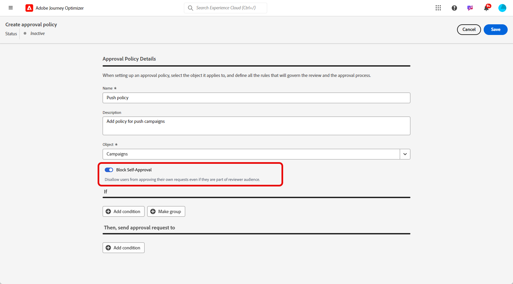

# Création et gestion des stratégies d’approbation {#approval-policies}

>[!AVAILABILITY]
>
> Actuellement, les stratégies d’approbation ne sont disponibles que pour un ensemble d’organisations (disponibilité limitée). Pour en bénéficier, contactez votre représentant ou représentante Adobe.

Les stratégies d’approbation permettent aux administrateurs d’établir un processus de validation pour les parcours et les campagnes. Ce système décrit des conditions spécifiques qui déterminent si un parcours ou une campagne doit être approuvé. Ces stratégies peuvent être d’une complexité variable, allant du simple fait d’exiger que toutes les campagnes soient examinées par un utilisateur ou une équipe spécifique à l’établissement de critères en fonction de la personne qui a créé la campagne.

## Création de stratégies d’approbation {#create-policies}

1. Dans le menu **[!UICONTROL Administration]**, accédez à **[!UICONTROL Autorisations]**, puis à **[!UICONTROL Stratégies]**.

   

1. Cliquez sur **[!UICONTROL Créer]** dans l’onglet **[!UICONTROL Stratégie d’approbation]**, sélectionnez **[!UICONTROL Stratégie d’approbation]**, puis cliquez sur **[!UICONTROL Confirmer]**.

1. Saisissez un **[!UICONTROL Nom]** et une **[!UICONTROL Description]** pour la stratégie.

1. Indiquez si la stratégie s’appliquera à **[!UICONTROL Parcours]** ou **[!UICONTROL Campagnes]**.

   

Vous pouvez maintenant affiner les conditions afin de spécifier qui lancera la demande d’approbation et qui la validera.

## Définition de conditions pour les stratégies d’approbation {#conditions}

1. Accédez à votre **[!UICONTROL politique d’approbation]**.

1. Dans le menu **[!UICONTROL If]** , cliquez sur **[!UICONTROL Add condition]** pour définir quel objet ou utilisateur déclenchera une demande d’approbation.

1. Sélectionnez la **[!UICONTROL catégorie]**, la **[!UICONTROL règle de correspondance]** et les **[!UICONTROL options]** appropriées.

   Par exemple, &quot;if Action match any Direct Mail&quot; ou &quot;If Requestor Username match John Doe&quot; (Si le nom d’utilisateur du demandeur correspond à John Doe).

   

+++ En savoir plus sur les catégories et options disponibles
   <table>
    <tr>
      <th>Catégorie</th>
      <th>Option</th>
    </tr>
    <tr>
      <td rowspan="3">Type de campagne</td>
      <td>Planifié (marketing)</td>
    </tr>
    <tr>
    <td>déclenchée par l’API (marketing)</td>
    </tr>
    <tr>
    <td>déclenché par l’API (transactionnel)</td>
    </tr>
    <tr>
    <td rowspan="8">Action</td>
    <td>In-app</td>
    </tr>
    <tr>
    <td>Notification push</td>
   </tr>
    <tr>
    <td>SMS</td>
    </tr>
    <tr>
    <td>E-mail</td>
    </tr>
    <tr>
    <td>Courrier</td>
    </tr>
    <tr>
    <td>Web</td>
    </tr>
    <tr>
    <td>Basé sur le code</td>
    </tr>
    <tr>
    <td>Carte de contenu</td>
    </tr>
    <tr>
    <td>Nom d’utilisateur du demandeur</td>
    <td>Nom et adresse électronique du demandeur conçu</td>
    </tr>
    <tr>
    <td>Groupe d’utilisateurs du demandeur</td>
    <td>Nom du groupe d’utilisateurs des demandeurs conçus</td>
    </tr>
    </table>

1. Pour ajouter d’autres critères, cliquez sur **[!UICONTROL Ajouter une condition]** pour définir des règles supplémentaires et sélectionnez **[!UICONTROL Et]** ou **[!UICONTROL Ou]** pour spécifier la manière dont les conditions sont connectées.

1. Dans le menu **[!UICONTROL Ensuite, envoyez la demande d’approbation à]** , cliquez sur **[!UICONTROL Ajouter une condition]** pour définir quel utilisateur peut accepter la demande d’approbation.

1. Dans la liste déroulante **[!UICONTROL Catégorie]**, choisissez si vous souhaitez choisir un groupe d’utilisateurs ou un utilisateur individuel.

1. Ensuite, dans la liste déroulante **[!UICONTROL Option]** , sélectionnez le groupe d’utilisateurs ou l’utilisateur spécifique.

   L’utilisateur ou le groupe d’utilisateurs sélectionné sera chargé de valider la demande de validation.

   

1. Pour ajouter d’autres critères, cliquez sur **[!UICONTROL Ajouter une condition]** pour définir des règles supplémentaires et sélectionnez **[!UICONTROL Et]** ou **[!UICONTROL Ou]** pour spécifier la manière dont les conditions sont connectées.

1. Une fois votre stratégie entièrement configurée, cliquez sur **[!UICONTROL Enregistrer]**.

Vous pouvez maintenant activer votre stratégie de validation pour l&#39;appliquer.

## Activation et gestion des stratégies d’approbation {#activate-policies}

1. Accédez à votre **[!UICONTROL politique d’approbation]**.

1. Cliquez ensuite sur **[!UICONTROL Activer]** pour appliquer les conditions configurées à votre environnement.

   >[!NOTE]
   >
   >Une fois activée, les stratégies ne peuvent pas être modifiées. Pour modifier les conditions, désactivez d’abord la stratégie.

   

1. Dans le menu **[!UICONTROL Stratégie]**, ouvrez les options avancées pour **[!UICONTROL Modifier]**, **[!UICONTROL Désactiver]** ou **[!UICONTROL Dupliquer]** la stratégie selon les besoins.

   

