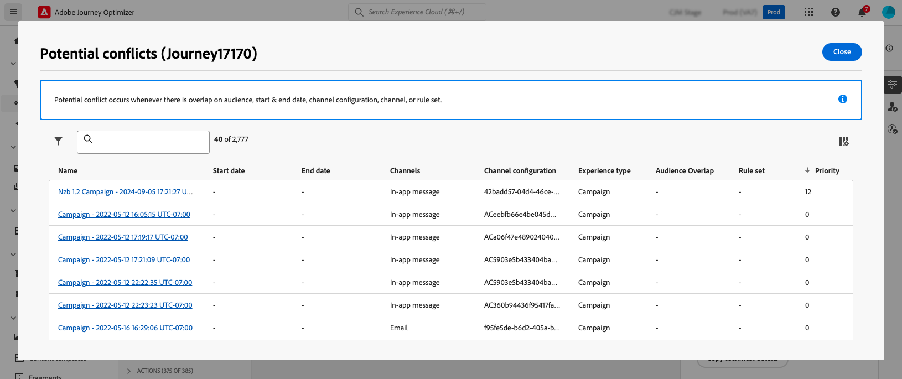

# Gestion des conflits et hiérarchisation {#conflict-prioritization}

>[!AVAILABILITY]
>
>Les outils de gestion des conflits et de hiérarchisation sont actuellement disponibles en version bêta uniquement pour certains utilisateurs.

Dans Journey Optimizer, la gestion du volume et du timing des campagnes et des parcours est essentielle pour éviter que les clients ne soient trop nombreux à avoir trop d’interactions. Les deux sections suivantes présentent des outils clés pour vous aider à maintenir l’équilibre et à hiérarchiser efficacement les communications.

## Afficher les conflits potentiels dans les parcours et les campagnes {#conflict}

>[!CONTEXTUALHELP]
>id="ajo_campaigns_campaign_conflict"
>title="Visionneuse de conflits dans les campagnes"
>abstract="Cet outil peut vous aider à déterminer le chevauchement avec d’autres parcours, campagnes ou configurations de canal. Si vous souhaitez identifier le chevauchement sur l’audience, la date de début et de fin, la configuration des canaux, le canal ou le jeu de règles, vous pouvez afficher les conflits potentiels ici."

>[!CONTEXTUALHELP]
>id="ajo_journey_conflict"
>title="Visionneuse de conflits dans les parcours"
>abstract="Cet outil peut vous aider à déterminer le chevauchement avec d’autres parcours, campagnes ou configurations de canal. Si vous souhaitez identifier le chevauchement sur l’audience, la date de début et de fin, la configuration des canaux, le canal ou le jeu de règles, vous pouvez afficher les conflits potentiels ici."

À mesure que les marketeurs augmentent le volume des campagnes et des Parcours dans Journey Optimizer, il devient de plus en plus difficile pour un marketeur de savoir s’il bombarde ses clients avec un trop grand nombre d’interactions marketing. il est donc essentiel d’identifier facilement les chevauchements des campagnes et des parcours pour s’assurer qu’ils trouvent le bon équilibre dans les communications marketing tout en atténuant le risque de fatigue client.

Les principaux domaines à surveiller pour détecter un chevauchement potentiel sont les suivants :

* **Chronologie** (dates de début et de fin) : Trop de parcours s’exécutent simultanément ?
* **Audience** : quel pourcentage de mon audience de parcours fait également partie d’autres parcours ?
* **Canal** : Existe-t-il d’autres communications programmées pour la même période, et si oui, combien ?
* **Jeu de règles de limitation** : quels types de parcours suis-je en train de plafonner et y a-t-il chevauchement dans ceux-ci ?
* **Configuration de canal** : Existe-t-il d’autres parcours ou campagnes utilisant cette configuration de canal qui pourraient empêcher l’affichage de cette campagne à l’utilisateur ?

Journey Optimizer vous permet de vérifier chaque fois qu’il existe un risque de chevauchement avec d’autres parcours ou campagnes. Pour ce faire, procédez comme suit :

1. Au moment de créer un parcours ou une campagne, cliquez sur le bouton **[!UICONTROL Afficher les conflits potentiels]** dans les propriétés du parcours ou de la campagne.

   

   >[!NOTE]
   >
   >Le bouton **[!UICONTROL Afficher les conflits potentiels]** devient disponible pour sélection dès que vous avez attribué l’un des paramètres suivants : **[!UICONTROL Date de début/fin]**, **[!UICONTROL Audience]**, **[!UICONTROL Canal]**, **[!UICONTROL Configuration de canal]** et **[!UICONTROL Ensemble de règles]**.

1. La fenêtre **[!UICONTROL Conflits potentiels]** s’ouvre, ce qui vous permet de visualiser tous les éléments qui chevauchent le parcours/la campagne actuel.

   Vous pouvez ouvrir un parcours ou une campagne se chevauchant directement à partir de cet écran en sélectionnant son nom.

   

>[!NOTE]
>
>Pour affiner davantage votre recherche de superpositions potentielles, vous pouvez filtrer votre liste de campagnes et de parcours en fonction du ou des champs pertinents. Pour ce faire, sélectionnez l’icône de filtre dans la vue de stock. [Découvrez comment utiliser les filtres](../start/search-filter-categorize.md#filter-lists)

Une fois les chevauchements potentiels identifiés, Journey Optimizer fournit plusieurs moyens de les résoudre.

* Ajustez les **dates de début/fin** pour éviter le chevauchement de campagnes ou de parcours.
* Affinez le **ciblage d’audience** afin de minimiser le chevauchement entre les parcours.
* Mettez en oeuvre des **plafonds de fréquence** pour empêcher les clients de recevoir trop de communications.
* Réduisez le nombre de **parcours actifs** pour gérer plus efficacement l’expérience client.
* Définissez **priorités** sur les actions entrantes pour vous assurer que l’action la plus importante s’affiche pour les clients.

En exploitant ces fonctionnalités, vous pouvez vous assurer que vos efforts marketing sont harmonisés et que vous maintenez le bon équilibre dans votre stratégie de communication.

## Attribuer des scores de priorité aux parcours et aux campagnes {#priority}

>[!CONTEXTUALHELP]
>id="ajo_journey_priority"
>title="Priorité"
>abstract="Attribuez un score de priorité au parcours, allant de 0 à 100. Les nombres plus élevés signalent une priorité plus élevée. La valeur de priorité insérée ici est héritée par toute action entrante (in-app, par exemple) contenue dans ce parcours. Dans les cas où cette même configuration de canal entrant est utilisée dans d’autres campagnes ou parcours, l’action entrante ayant le score de priorité le plus élevé est présentée aux destinataires. Si plusieurs parcours ou campagnes ont le même score, l’élément qui a été modifié le plus récemment est sélectionné."

>[!CONTEXTUALHELP]
>id="ajo_campaigns_campaign_priority"
>title="Priorité"
>abstract="Attribuez un score de priorité à la campagne, allant de 0 à 100. Les nombres plus élevés signalent une priorité plus élevée. Dans les cas où cette même configuration de canal entrant (in-app, par exemple) est utilisée dans d’autres campagnes ou parcours, l’action entrante ayant le score de priorité le plus élevé est présentée aux destinataires. Si plusieurs parcours ou campagnes ont le même score, l’élément qui a été modifié le plus récemment est sélectionné."

Journey Optimizer vous permet d’attribuer un score de priorité à un parcours ou à une campagne. La priorité est essentielle pour donner la priorité à un parcours, à une campagne ou à une action lorsqu’une contrainte est imposée (par exemple, une limite de fréquence). Dans les cas où un client est admissible pour de nombreux parcours, campagnes ou communications et où vous souhaitez être sélectif quant aux adresses auxquelles il doit entrer et recevoir, vous devez utiliser ce champ.

>[!NOTE]
>
>Le score de priorité est disponible pour les canaux entrants : web, in-app et code-based. En parcours, le score de priorité est disponible uniquement pour le canal **in-app**.

L’attribution d’un score de priorité est essentielle pour la communication entrante, par exemple web, mobile et in-app. Si plusieurs campagnes utilisent la même configuration de canal (une bannière dans la partie supérieure de votre page web, par exemple), cela peut s’avérer problématique, car seul le contenu d’une campagne peut être affiché. Le score de priorité est l&#39;emplacement où vous insérerez vos préférences pour la campagne qui doit s&#39;afficher lorsque le destinataire peut être admissible pour plusieurs campagnes.

Pour attribuer un score de priorité à un parcours ou à une campagne, saisissez une valeur numérique (de 0 à 100) dans le champ **[!UICONTROL Priority score]** situé dans les propriétés du parcours ou de la campagne. Veuillez noter que plus le nombre est élevé, plus la priorité est élevée. Si vous créez cette campagne et souhaitez vous assurer que le contenu de cette campagne s’affiche, vous lui donnez un score de 100.

Dans les cas où deux campagnes ont le même score de priorité, la dernière campagne activée s’affiche.
