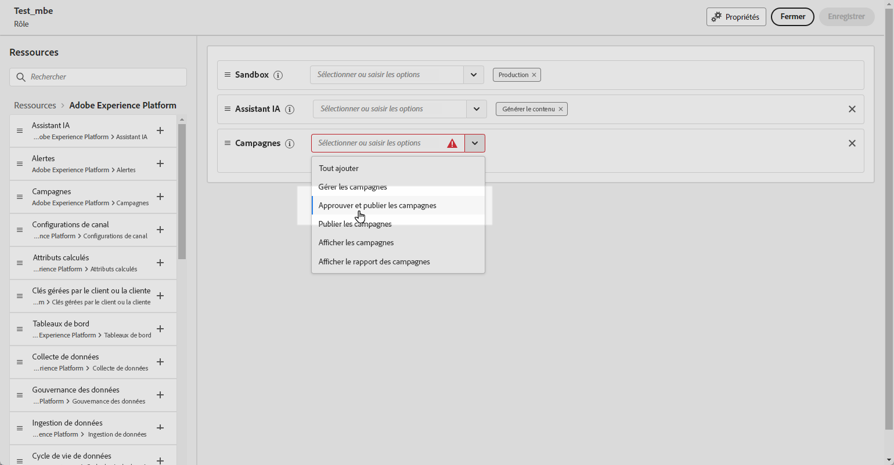
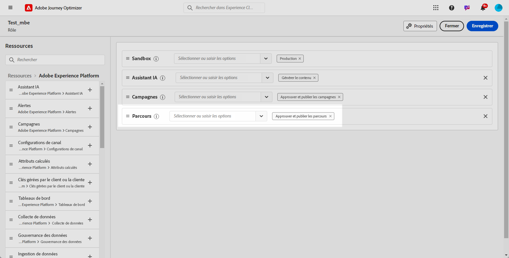
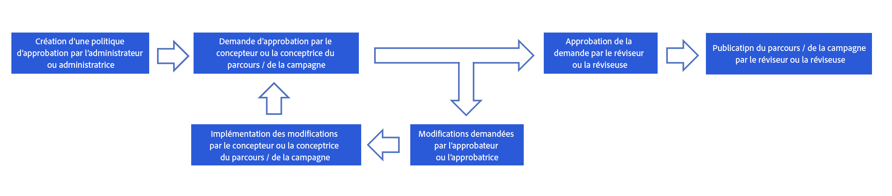
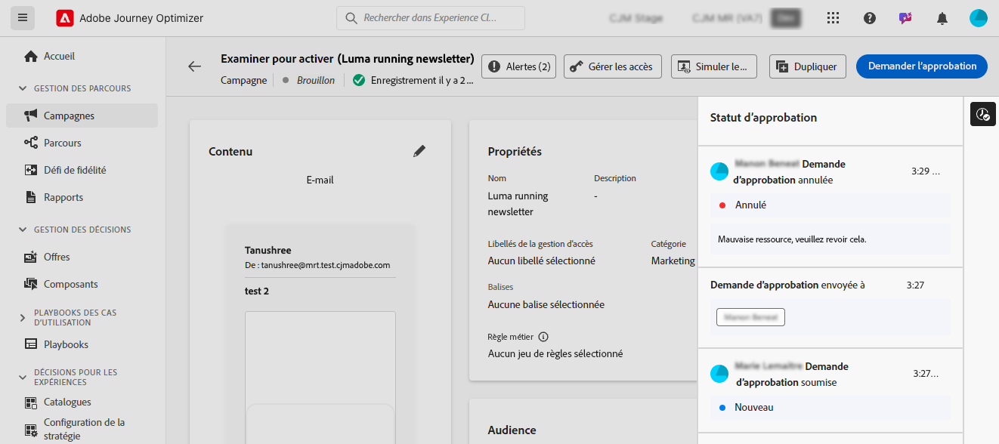

# Commencer avec l’approbation des parcours et des campagnes {#send-proofs}

## Commencer avec les politiques d’approbation {#gs}

[!DNL Journey Optimizer] permet de configurer un processus de validation qui permet aux équipes marketing de s’assurer que les campagnes et les parcours sont examinés et approuvés par les parties prenantes appropriées avant leur lancement.

Les politiques d’approbation introduisent un workflow structuré directement dans l’interface d’utilisation, éliminant ainsi la nécessité de recourir à des supports externes tels que des outils de gestion des e-mails ou des tâches, tout en assurant la gestion et le suivi centralisés de toutes les approbations.

En outre, cette fonctionnalité offre un meilleur contrôle sur la publication de vos parcours et campagnes : le processus d’approbation étant incorporé dans Journey Optimizer, les campagnes et les parcours restent à l’état Verrouillé pendant la révision, ce qui garantit qu’aucune modification ou activation involontaire ne se produit avant que toutes les approbations nécessaires ne soient mises en place.

## Conditions préalables {#prerequisites}

Avant de commencer, vérifiez que les autorisations ci-dessous ont été configurées.

Pour approuver et publier des parcours et des campagnes, les utilisateurs doivent disposer des autorisations **Approuver et publier des campagnes** et **Approuver et publier des Parcours**. [En savoir plus](../administration/permissions.md)

+++  Découvrez comment attribuer des autorisations liées à la validation

1. Dans le produit **Autorisations**, accédez à l’onglet **Rôles** et sélectionnez le **Rôle** de votre choix.

1. Cliquez sur **Modifier** pour modifier les autorisations.

1. Ajoutez la ressource **Campagnes**, puis sélectionnez **Approuver et publier des campagnes** dans le menu déroulant.

   {zoomable="yes"}

1. Ajoutez la ressource **Parcours**, puis sélectionnez **Approuver et publier des parcours** dans le menu déroulant.

   {zoomable="yes"}

1. Cliquez sur **Enregistrer** pour appliquer vos modifications.

Les autorisations des personnes déjà affectées à ce rôle seront automatiquement mises à jour.

1. Pour attribuer ce rôle à de nouvelles personnes, accédez à l’onglet **Utilisateurs et utilisatrices** du tableau de bord **Rôles** et cliquez sur **Ajouter un utilisateur ou une utilisatrice**.

1. Saisissez le nom de la personne, son adresse e-mail ou choisissez dans la liste, puis cliquez sur **Enregistrer**.

1. Si le profil de l’utilisateur ou de l’utilisatrice n’a pas été créé auparavant, consultez [cette documentation](https://experienceleague.adobe.com/fr/docs/experience-platform/access-control/abac/permissions-ui/users).

La personne recevra un e-mail avec des instructions pour accéder à votre instance.

+++

## Vue d’ensemble du processus d’approbation {#process}

Le processus d’approbation global se présente comme suit :

{zoomable="yes"}

1. **Configuration des politiques d’approbation**

   Un utilisateur administrateur crée une politique de validation , définissant les conditions dans lesquelles la politique doit s’appliquer aux parcours ou aux campagnes. Par exemple, vous pouvez créer une politique de validation qui requiert que toutes les campagnes planifiées créées par un utilisateur donné soient validées avant l’activation. [Découvrir comment créer des politiques d’approbation](approval-policies.md)

1. **Envoi de campagne/parcours pour approbation**

   Les créateurs de la campagne ou du parcours créent un parcours ou une campagne et l’envoient pour approbation. La campagne/le parcours passe à l’état En révision, durant lequel aucune modification ne peut être effectuée, sauf si la demande est annulée. [Découvrir comment demander l’approbation](request-approval.md)

   >[!NOTE]
   >
   >Les campagnes et les parcours ne doivent être soumis à approbation que si une politique d’approbation est en place. Si aucune politique de ce type ne s’applique, le créateur ou la créatrice peut publier directement la campagne ou le parcours sans nécessiter d’approbation.

1. **Révision et approbation**

   Les personnes en charge de l’approbation définies dans la politique d’approbation qui s’applique au parcours ou à la campagne reçoivent une notification. Elles peuvent consulter le contenu, l’audience et les paramètres du parcours ou de la campagne. Si des modifications sont nécessaires, la personne en charge de l’approbation les demande et renvoie la campagne à l’état « Version préliminaire » pour les révisions. Une fois que tout est prêt, la personne en charge de l’approbation peut activer et lancer le parcours ou la campagne. [Découvrir comment réviser et approuver une demande](review-approve-request.md)

## Surveiller les demandes d’approbation {#monitor}

Vous pouvez surveiller toutes les demandes d’approbation et de modification qui ont été soumises pour un parcours donné ou une campagne donnée. Pour ce faire, cliquez sur l’icône **[!UICONTROL Afficher le journal d’audit]** située dans la section supérieure droite de la zone de travail du parcours ou de l’écran de révision de la campagne.

## Ressources supplémentaires

* **[Créer des politiques de validation](approval-policies.md)** ; découvrez comment configurer des politiques de validation pour appliquer des workflows de révision aux campagnes et aux parcours.
* **[Demande d’approbation](request-approval.md)** ; découvrez comment soumettre du contenu pour approbation et suivre le statut de la demande.
* **[Révision et approbation des demandes](review-approve-request.md)** ; découvrez comment examiner, approuver ou refuser des demandes d’approbation en tant que personne en charge de l’approbation.
* **[Simuler avec des données d’exemple](simulate-sample-input.md)** ; découvrez comment tester et valider le contenu à l’aide de données de profil d’exemple.
