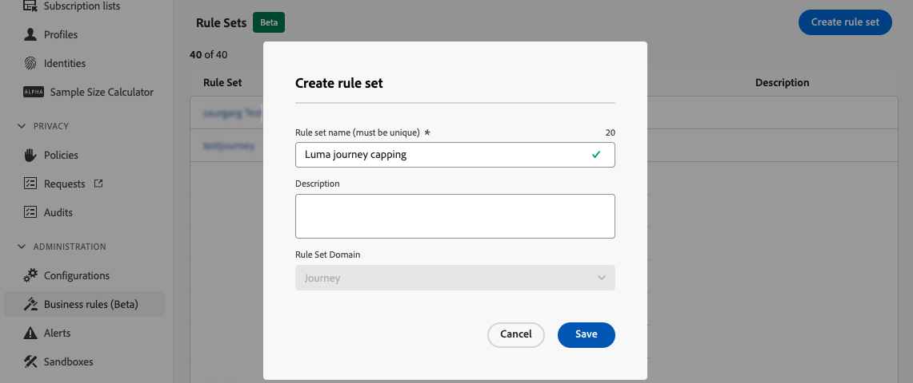
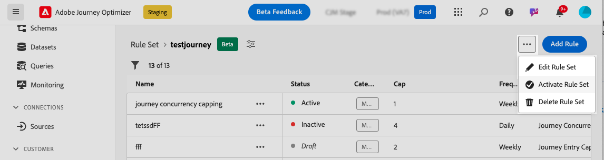

# Limitation et arbitrage des parcours {#journey-capping}

>[!BEGINSHADEBOX]

Ce guide couvre les sujets suivants :

* [Prise en main de la gestion des conflits et de la hiérarchisation](gs-conflict-prioritization.md)
* [Détecter les conflits potentiels dans les parcours et campagnes](conflicts.md)
* [Attribuer des scores de priorité aux parcours et aux campagnes](priority-scores.md)
* **[limitation et arbitrage des Parcours](journey-capping.md)**

>[!ENDSHADEBOX]

>[!AVAILABILITY]
>
>Les outils de gestion des conflits et de hiérarchisation des conflits sont actuellement disponibles en tant que disponibilité limitée pour certains utilisateurs uniquement.

La limitation des parcours permet de limiter le nombre de parcours dans lesquels un profil peut être inscrit, ce qui évite la surcharge de communication. Dans Journey Optimizer, vous pouvez définir deux types de règles de limitation :

* **La limitation des entrées** limite le nombre d’entrées de parcours sur une période donnée pour un profil.
* **La limitation de simultanéité** limite le nombre de parcours dans lesquels un profil peut être inscrit simultanément.

Les deux types de limitation de parcours tirent parti de scores de priorité pour arbitrer les entrées.

➡️ [Découvrir cette fonctionnalité en vidéo](#video)

## Création d’une règle de limitation de parcours {#create-rule}

Pour créer une règle de limitation de parcours, procédez comme suit :

1. Accédez au menu **[!UICONTROL Règles métier (Beta)]** pour accéder au stock des ensembles de règles.

1. Sélectionnez le jeu de règles dans lequel vous souhaitez ajouter la règle de limitation ou créez un nouveau jeu de règles :

   * Pour utiliser un jeu de règles existant, sélectionnez-le dans la liste. Les règles de limitation de parcours ne peuvent être ajoutées qu’aux ensembles de règles avec le domaine &quot;parcours&quot;. Vous pouvez vérifier ces informations dans les listes d’ensembles de règles, dans la colonne **[!UICONTROL Domaine]**.

     

   * Pour créer la règle de limitation dans un nouveau jeu de règles, cliquez sur **[!UICONTROL Créer un jeu de règles]**, spécifiez un nom unique pour le jeu de règles et sélectionnez &quot;Parcours&quot; dans la liste déroulante **[!UICONTROL Domaine du jeu de règles]**, puis cliquez sur **[!UICONTROL Enregistrer]**.

     

1. Dans l’écran du jeu de règles, cliquez sur le bouton **[!UICONTROL Ajouter une règle]** , puis configurez la règle en fonction de vos besoins :

   

   * Attribuez un nom unique à la règle.

   * Dans la liste déroulante **[!UICONTROL Type de règle]**, spécifiez le type de limitation de la règle.

      * **[!UICONTROL Limite d’entrée de Parcours]** : limite le nombre d’entrées dans le parcours sur une période donnée pour un profil.
      * **[!UICONTROL Limite de simultanéité par Parcours]** : limite le nombre de parcours dans lesquels un profil peut être inscrit simultanément.

   * Développez les sections ci-dessous pour savoir comment configurer chaque type de limitation :

     +++Configuration d’une règle de limitation d’entrée de parcours

      1. Dans le champ **[!UICONTROL Limitation]** , définissez le nombre maximal de parcours qu’un profil peut saisir.
      1. Dans le champ **[!UICONTROL Durée]** , définissez la période à prendre en compte. Veuillez noter que la durée est basée sur le fuseau horaire UTC. Par exemple, la limite quotidienne est réinitialisée à minuit UTC.

     Dans cet exemple, nous voulons limiter la saisie de plus de &quot;5&quot; parcours par mois pour les profils.

     

     >[!NOTE]
     >
     >Le système prendra en compte la priorité des parcours planifiés à venir auxquels cette même règle est appliquée.
     >
     >Dans cet exemple, si le marketeur est déjà entré 4 parcours et qu’il y a un autre parcours planifié à venir ce mois-ci avec une priorité plus élevée, les clients seront alors supprimés de l’accès au parcours de priorité plus faible.

+++

     +++Configuration d’une règle de limitation de la simultanéité des parcours

      1. Dans le champ **[!UICONTROL Limitation]** , définissez le nombre maximal de parcours dans lesquels un profil peut être inscrit simultanément.

      1. Utilisez le champ **[!UICONTROL Aperçu de la hiérarchisation]** pour arbitrer les entrées de parcours en fonction des scores de priorité sur une période donnée (par exemple, 1 jour, 7 jours, 30 jours). Cela permet de donner la priorité à l’entrée dans des parcours à plus forte valeur si un profil est éligible à plusieurs parcours.

     Dans cet exemple, nous voulons empêcher les profils d’entrer dans le parcours s’ils sont déjà inscrits dans un autre parcours contenant le même ensemble de règles. Si un autre parcours dans les 7 jours à venir a un score de priorité plus élevé, le profil n’entre pas dans ce parcours.

     {width="50%" zommable="yes"}

+++

1. Lorsque la règle de limitation est prête à être appliquée à des parcours, activez-la en cliquant sur le bouton représentant des points de suspension en regard de son nom.

   

1. Activez l’ensemble des règles en cliquant sur le bouton représentant des points de suspension en regard du bouton Ajouter une règle dans le coin supérieur droit de l’écran.

   

## Application de règles de limitation aux parcours {#apply-capping}

Pour appliquer une règle de limitation à un parcours, accédez au parcours et ouvrez ses propriétés. Dans la liste déroulante **[!UICONTROL Règles de limitation]** , sélectionnez le jeu de règles approprié.

Une fois le parcours activé, les règles de limitation définies dans le jeu de règles prennent effet.

>[!IMPORTANT]
>
>Si un parcours est activé immédiatement, cela peut prendre jusqu’à 15 minutes pour que le système puisse commencer à supprimer les clients. Vous pouvez planifier votre parcours pour qu’il commence au moins 15 minutes dans le futur afin d’éviter cette éventualité.

## Vidéo pratique {#video}

>[!VIDEO](https://video.tv.adobe.com/v/3435530?quality=12)
