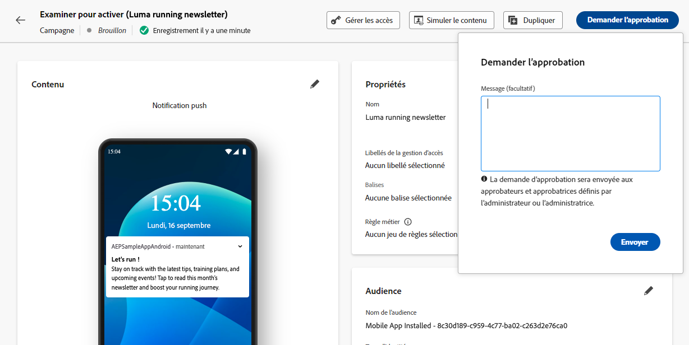
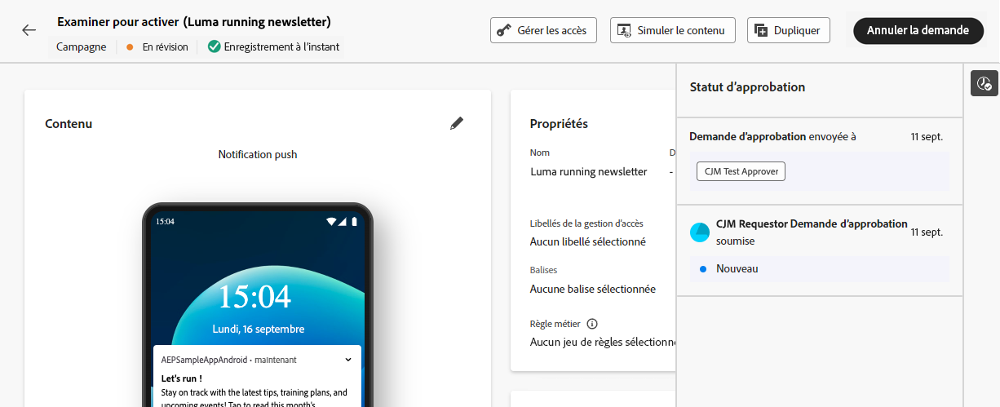
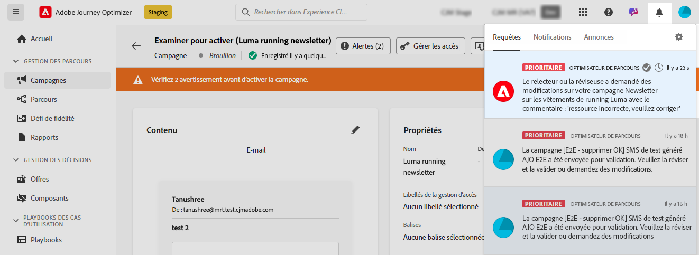

# Demander l’approbation {#request-approval}

L’accès au workflow d’approbation est déterminé par votre cas pratique spécifique :

* **Il n’existe aucune politique d’approbation active**

   * **Campagnes** : si aucune politique d’approbation n’est active pour l’objet de campagne dans un sandbox, les campagnes affichent le bouton **[!UICONTROL Activer]**, ce qui vous permet de les activer sans avoir à les approuver.

   * **Parcours** : si aucune politique d’approbation n’est active pour l’objet de parcours, les parcours affichent le bouton **[!UICONTROL Publier]**, ce qui vous permet de publier directement.

* **Il existe des politiques d’approbation actives**

   * **Campagnes** : s’il existe une ou plusieurs politiques d’approbation actives pour l’objet de campagne dans un sandbox, toutes les campagnes de ce sandbox afficheront le bouton **[!UICONTROL Demander l’approbation]**.
Si aucune politique d’approbation ne s’applique à l’objet sélectionné lorsque vous cliquez sur le bouton **[!UICONTROL Demander l’approbation]**, le processus d’approbation automatique est déclenché.

   * **Parcours** : s’il existe une ou plusieurs politiques d’approbation actives pour l’objet de parcours dans un sandbox, tous les parcours afficheront le bouton **[!UICONTROL Demander l’approbation]**.
Si aucune politique d’approbation ne s’applique à l’objet sélectionné lorsque vous cliquez sur le bouton **[!UICONTROL Demander l’approbation]**, le processus d’approbation automatique est déclenché.

## Envoyer une demande d&#39;approbation

Après avoir créé votre campagne ou votre parcours, cliquez sur le bouton **[!UICONTROL Demander l’approbation]**. Vous pouvez ainsi vérifier si votre sandbox contient une politique d’approbation active qui s’applique à la campagne ou au parcours.

* S’il existe une politique d’approbation applicable, votre campagne ou votre parcours sera envoyé(e) pour révision.

* Si aucune politique d’approbation n’est applicable à la campagne ou au parcours après avoir cliqué sur le bouton **[!UICONTROL Demander l’approbation]**, la campagne ou le parcours sera automatiquement approuvé(e) et activé(e) ou publié(e).

Le volet **[!UICONTROL Demander l’approbation]** s’ouvre. Si nécessaire, envoyez un message aux approbateurs et approbatrices, puis cliquez sur **[!UICONTROL Envoyer]** pour envoyer votre demande.

Bien que l’état de la campagne ou du parcours soit **[!UICONTROL En révision]**, vous avez la possibilité d’annuler la demande d’approbation. En cliquant sur le bouton **[!UICONTROL Annuler la demande]**, la campagne ou le parcours revient à l’étape de brouillon et une notification est envoyée aux réviseurs et réviseuses les informant que la demande a été annulée. Vous pouvez ensuite apporter les modifications nécessaires et demander à nouveau une approbation pour la campagne ou le parcours.

## Gérer les demandes d’approbation

Une fois la demande de validation envoyée aux approbateurs, ils peuvent la passer en revue et activer le parcours/la campagne pour la rendre active ou demander des modifications si nécessaire. [Découvrir comment réviser et approuver une demande](review-approve-request.md)

Si les approbateurs et approbatrices demandent des modifications, vous recevez un e-mail et une alerte Journey Optimizer, accessible lorsque vous cliquez sur l’icône représentant une cloche en haut à droite de l’écran, dans l’onglet **[!UICONTROL Demandes]**.

Pour consulter la demande de modification, ouvrez-la à partir de l’e-mail ou de l’alerte pour accéder au parcours ou à la campagne et apporter les modifications demandées. Lorsque votre parcours ou votre campagne peut de nouveau faire l’objet d’une révision, envoyez une nouvelle demande d’approbation à l’aide du bouton **[!UICONTROL Demander l’approbation]**.
