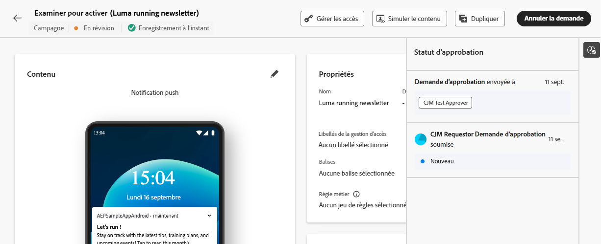

# Demander l’approbation {#request-approval}

Si la fonctionnalité de workflow d’approbation a été activée pour votre organisation, vous remarquerez que les boutons **[!UICONTROL Activer]** et **[!UICONTROL Publier]** ne sont plus disponibles dans les workflow de création de campagne et de parcours, respectivement. Ces boutons ont été remplacés par le bouton **[!UICONTROL Demander l’approbation]**.

Après avoir créé votre campagne ou votre parcours, vous devez cliquer sur le bouton **[!UICONTROL Demander l’approbation]**. Cela permet de vérifier si votre sandbox contient une politique d’approbation active qui s’applique à la campagne ou au parcours. Si une politique d’approbation appropriée est trouvée, le processus d’approbation commence. S’il n’existe aucune politique d’approbation applicable, l’élément (campagne ou parcours) sera automatiquement approuvé et activé ou publié.

Le volet **[!UICONTROL Demander l’approbation]** s’ouvre. Si nécessaire, envoyez un message aux approbateurs et approbatrices, puis cliquez sur **[!UICONTROL Envoyer]** pour envoyer votre demande.

Bien que l’état de la campagne ou du parcours soit **[!UICONTROL En révision]**, vous avez la possibilité d’annuler la demande d’approbation. En cliquant sur le bouton **[!UICONTROL Annuler la demande]**, la campagne ou le parcours revient à l’étape de brouillon et une notification est envoyée aux réviseurs et réviseuses les informant que la demande a été annulée. Vous pouvez ensuite apporter les modifications nécessaires et demander à nouveau une approbation pour la campagne ou le parcours.

Une fois que la demande d’approbation a été envoyée aux personnes en charge de l’approbation, elles peuvent la vérifier et activer le parcours ou la campagne pour sa mise en ligne, ou demander des modifications si nécessaire. [Découvrir comment réviser et approuver une demande](review-approve-request.md)

Si les approbateurs et approbatrices demandent des modifications, vous recevez un e-mail et une alerte Journey Optimizer, accessible lorsque vous cliquez sur l’icône représentant une cloche en haut à droite de l’écran, dans l’onglet **[!UICONTROL Demandes]**.

Pour consulter la demande de modification, ouvrez-la à partir de l’e-mail ou de l’alerte pour accéder au parcours ou à la campagne et apporter les modifications demandées. Lorsque votre parcours ou votre campagne peut de nouveau faire l’objet d’une révision, envoyez une nouvelle demande d’approbation à l’aide du bouton **[!UICONTROL Demander l’approbation]**.
