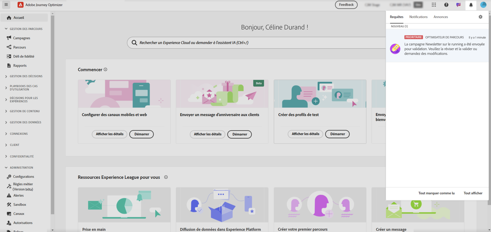
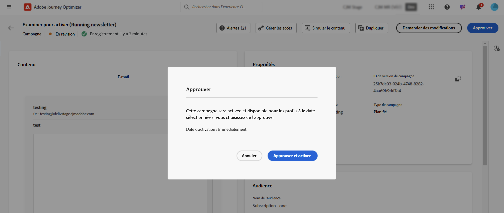
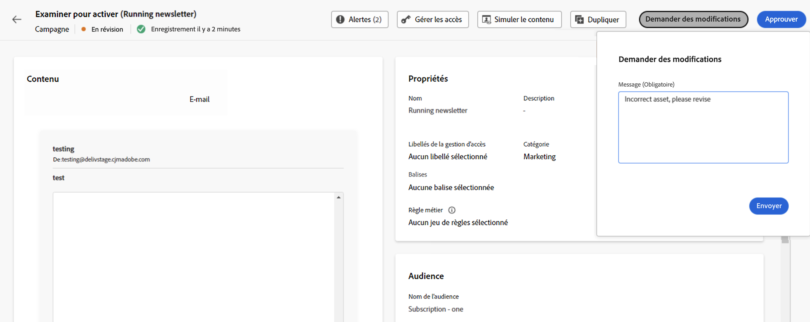

# Examiner et approuver une demande {#approve-requests}

Un élément (parcours ou campagne) auquel une politique d’approbation est appliquée doit être soumis pour approbation afin d’être publié. Pour ce faire, le créateur du parcours/de la campagne envoie une demande aux approbateurs définis dans la politique de validation et le parcours/la campagne obtient le statut **[!UICONTROL En révision]**.

Si le rôle d’approbateur ou d’approbatrice vous a été attribué, vous recevez un e-mail et une alerte Journey Optimizer, accessible lorsque vous cliquez sur l’icône représentant une cloche en haut à droite de l’écran, dans l’onglet **[!UICONTROL Demandes]**.

Pour passer en revue le parcours/la campagne, ouvrez-le à partir de l’e-mail ou de l’alerte, puis vérifiez ses paramètres, tels que l’audience, le contenu ou les paramètres.
Une fois que vous avez terminé, vous pouvez [approuver et publier le parcours ou la campagne](#approve) ou [demander des modifications avant de l’activer](#changes).

>[!NOTE]
>
>L’examen d’une campagne est une étape en lecture seule : vous pouvez visualiser tous ses paramètres, mais ne pouvez pas effectuer d’action sur la campagne.
>
>Avant d’examiner un parcours ou une campagne, assurez-vous de disposer des autorisations requises.

## Approuver et publier un parcours ou une campagne {#approve}

Si un élément (parcours ou campagne) peut être mis en ligne, vous pouvez l’approuver en cliquant sur le bouton **[!UICONTROL Approuver]**.

Dans la fenêtre qui s’affiche, cliquez sur **[!UICONTROL Approuver et activer]** pour mettre en ligne le parcours ou la campagne.

## Demander des modifications pour un parcours ou une campagne {#changes}

Si des modifications sont nécessaires dans un parcours ou une campagne qui a été envoyé pour approbation, vous pouvez envoyer une demande au créateur pour qu’il effectue les modifications nécessaires.

Pour ce faire, cliquez sur le bouton **[!UICONTROL Demander des modifications]**. Dans le volet qui s’ouvre, fournissez un message détaillant votre demande et cliquez sur **[!UICONTROL Envoyer]** pour envoyer votre demande.

Après l’envoi de la demande, le créateur ou la créatrice du parcours ou de la campagne reçoit un e-mail et une alerte Journey Optimizer. La campagne revient au statut « Brouillon ». Une fois les modifications intégrées, le créateur du parcours ou de la campagne peut les soumettre à nouveau pour approbation.

>[!NOTE]
>
> Si vous ne recevez pas de notification d’approbation par e-mail, vous devez mettre à jour vos préférences d’abonnement dans vos profils Experience Cloud. [En savoir plus](https://experienceleague.adobe.com/fr/docs/core-services/interface/features/account-preferences)
