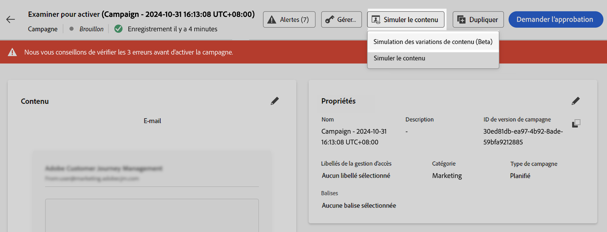
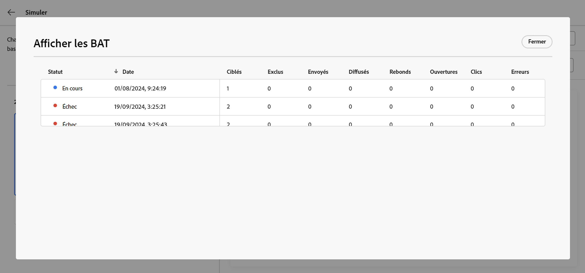

# Simuler des variations de contenu {#custom-profiles}

>[!CONTEXTUALHELP]
>id="ajo_simulate_sample_profiles"
>title="Simuler à l’aide d’un exemple d’entrée"
>abstract="Dans cet écran, vous pouvez tester les variantes de contenu en les générant automatiquement avec l’IA, en ajoutant des valeurs par le biais d’un modèle CSV ou JSON, en les saisissant manuellement ou en utilisant des profils de test."

Lorsque votre contenu inclut une personnalisation ou une logique conditionnelle, vous devez vérifier qu’il s’affiche correctement pour chaque type de destinataire avant de l’envoyer.

L’expérience **[!UICONTROL Simuler des variations de contenu]** dans [!DNL Journey Optimizer] résout ce problème en vous permettant de tester plusieurs variantes de votre contenu à partir d’un seul écran, générées automatiquement avec l’IA, saisies manuellement, importées d’un fichier ou basées sur des utilisateurs simulés réutilisables. Vous pouvez prévisualiser le rendu et l’envoi des BAT de chaque variante, le tout sans créer au préalable de profils persistants dans Adobe Experience Platform.

Dans votre contenu, sélectionnez **[!UICONTROL Simuler du contenu]** puis **[!UICONTROL Simuler des variations de contenu]** pour ouvrir une expérience unique dans laquelle vous pouvez :

* **Générer automatiquement des variantes** à l’aide de l’IA pour couvrir les branches de personnalisation et conditionnelles
* **Ajouter des variantes manuellement** ou à partir d’un fichier CSV ou JSON
* **Utiliser des utilisateurs simulés** pour prévisualiser et tester avec des données de test enregistrées et réutilisables
* **Prévisualisation** rendu et **envoi de BAT par e-mail** pour les variantes sélectionnées

Tous les attributs utilisés dans votre contenu pour la personnalisation sont automatiquement détectés. Une variante est une version du contenu avec différentes valeurs pour ses attributs.

>[!NOTE]
>
>Les variantes servent uniquement à des fins de test pour votre contenu actuel. Celles-ci ne sont pas stockées dans Adobe Experience Platform, mais dans la session de votre navigateur, ce qui signifie qu’elles ne s’afficheront pas si vous vous déconnectez ou si vous travaillez sur un autre appareil.

## Mécanismes de sécurisation et limitations {#limitations}

Avant de commencer à tester votre contenu à l’aide des exemples de données d’entrée, tenez compte des mécanismes de sécurisation et des conditions préalables suivants.

* **Canaux** : la simulation de variations de contenu est disponible pour :

   * les canaux E-mail, SMS et Notification push ;
   * tous les canaux entrants (web, expérience basée sur du code, in-app, cartes de contenu).

* **Fonctionnalités prises en charge** : les variations de contenu peuvent être utilisées avec le contenu multilingue [!DNL Journey Optimizer] et des fonctionnalités d’expérience de contenu. Vous pouvez ainsi tester les messages dans plusieurs langues et optimiser le contenu grâce à l’expérimentation.

  Vous pouvez également tirer parti des variations de contenu pour tester vos modèles de contenu.

  >[!NOTE]
  >
  >Pour l’instant, le rendu de la boîte de réception et les rapports de spam ne sont pas disponibles dans l’expérience actuelle. Pour utiliser ces fonctionnalités, sélectionnez le bouton **[!UICONTROL Simuler le contenu]** de votre contenu pour accéder à l’interface d’utilisation précédente.

* **Attributs** : les attributs de profil et contextuels sont pris en charge.

* **Types de données** - Seuls les types de données suivants sont pris en charge lors de la saisie de données pour vos variantes : nombre (entier et décimal), chaîne, valeur booléenne et type de date. Tout autre type de données affiche une erreur.

* **Nombre de variantes** - Vous pouvez ajouter jusqu’à 30 variantes pour tester votre contenu, à l’aide d’un fichier, manuellement ou par génération automatique.

## Créer des variantes de contenu

Pour créer des variations pour votre contenu, cliquez sur le bouton **[!UICONTROL Simuler du contenu]** et choisissez **[!UICONTROL Simuler des variations de contenu]**.



Vous pouvez créer des variantes des manières suivantes :

* [Ajouter des variantes manuellement ou depuis un fichier](#profiles).
* [générer automatiquement des variantes](#auto-generate-variants) avec l’IA ;
* [Sélectionnez des variantes parmi des utilisateurs simulés existants](#simulated-users).

Une fois vos variantes créées, vous pouvez [prévisualiser votre contenu et envoyer des BAT](#preview-proofs).

### Ajouter des variantes manuellement ou à partir d&#39;un fichier {#profiles}

Lors de l’accès à l’expérience de variations de contenu, tous les champs de personnalisation utilisés dans votre contenu sont automatiquement détectés et affichés dans une variante vide.

Par exemple, si votre e-mail contient deux champs de personnalisation : « Prénom » et « Ville », ils apparaîtront dans la liste. Au départ, aucune valeur n’est saisie et aucun contenu personnalisé n’est affiché dans le volet d’aperçu.


Vous pouvez ajouter des variantes manuellement ou les charger à partir d’un fichier.

+++ Ajouter manuellement des variantes

Pour modifier la valeur de la variante par défaut, cliquez sur le bouton **[!UICONTROL Modifier]** afin de fournir des valeurs personnalisées pour chaque champ de personnalisation. Le volet d’aperçu est mis à jour pour afficher le rendu de votre contenu avec les valeurs saisies.

Pour ajouter une nouvelle variante, cliquez sur le bouton **[!UICONTROL Créer un exemple]**. Une nouvelle variante vierge s’affiche, contenant tous les champs de personnalisation détectés. Vous pouvez modifier la nouvelle variante selon vos besoins.


+++

+++ Ajouter des variantes à partir d’un fichier

Vous pouvez charger un fichier avec des variantes et des valeurs prédéfinies pour accélérer le processus.

1. Cliquez sur le bouton **[!UICONTROL Télécharger des données]** pour ouvrir l’écran de chargement de fichier.
1. Sélectionnez **[!UICONTROL Télécharger l’exemple]** pour télécharger un modèle de fichier CSV, JSON ou JSONLINES.
1. Ouvrez le fichier de modèle et renseignez les valeurs souhaitées pour chaque attribut de profil. Le modèle inclut une colonne pour chaque attribut de profil utilisé dans votre contenu pour la personnalisation.

   Exemple de syntaxe JSON :

   ```json
   {
   "profile": {
       "attributes": {
       "person": {
           "name": {
               "lastName": "Doe",
               "firstName": "John"
               }
           }
       }
   }
   }
   ```

1. Une fois votre fichier prêt, sélectionnez **[!UICONTROL Confirmer]** pour le charger. Après le chargement, une nouvelle variante est ajoutée à la liste pour chaque entrée dans le fichier.

+++

### Générer automatiquement des variantes de contenu {#auto-generate-variants}

[!DNL Journey Optimizer] pouvez utiliser la simulation basée sur l’IA pour générer automatiquement une variante de contenu afin de pouvoir valider votre logique de personnalisation sans créer de variantes manuellement.

Lors du rendu du contenu à des fins de simulation ou de vérification, le système analyse votre contenu, identifie les champs de personnalisation et les remplace par des valeurs significatives pour un aperçu quasi réaliste.

Pour générer automatiquement une variante, cliquez sur le bouton **[!UICONTROL Générer]** et attendez que le système génère la variante.


>[!NOTE]
>
>La génération produit une seule variante. Cliquer sur **[!UICONTROL Générer]** remplace toutes les variantes de contenu existantes dans la liste, y compris celles que vous avez ajoutées manuellement ou à partir d’un fichier, par une variante générée.

Examinez la variante générée dans la liste des variantes et son rendu.

### Sélectionner des variantes à partir d’utilisateurs simulés {#simulated-users}

Dans **[!UICONTROL Simuler des variations de contenu]**, vous pouvez baser vos variantes sur **utilisateurs simulés**. Les utilisateurs simulés sont des entités temporaires de type profil créées à des fins de test sans utiliser de profils persistants dans Adobe Experience Platform. Contrairement aux variantes ajoutées uniquement pour la session de navigateur actuelle, les utilisateurs simulés sont enregistrés et peuvent être réutilisés dans plusieurs parcours et par d’autres utilisateurs.

Les utilisateurs simulés sont créés et gérés à partir de la fonctionnalité parcours **[!UICONTROL Simulation]**. Pour connaître la procédure complète permettant de les créer, de les enregistrer et de les réutiliser, voir [Création et gestion d’utilisateurs simulés](../building-journeys/simulate-journey.md#test-users).

Une fois vos utilisateurs simulés créés, vous pouvez les utiliser pour prévisualiser votre contenu. Pour ce faire, procédez comme suit :

1. Cliquez sur le bouton **[!UICONTROL Sélectionner les variantes]**.
1. Dans la liste des utilisateurs simulés existants, sélectionnez ceux que vous souhaitez utiliser, puis cliquez sur **[!UICONTROL Sélectionner]**.

   

1. Les utilisateurs simulés sélectionnés sont ajoutés à votre liste de variantes de contenu, où vous pouvez prévisualiser votre contenu avec leurs valeurs d’attribut. Vous pouvez également modifier manuellement les valeurs d’une variante à des fins de test, mais ces modifications ne sont pas réenregistrées par l’utilisateur simulé.

## Prévisualiser le contenu et envoyer des BAT {#preview-proofs}

Une fois les variantes ajoutées, vous pouvez les utiliser pour prévisualiser votre contenu dans le volet de droite et envoyer des BAT d’e-mail.

### Prévisualiser les variations de contenu {#preview}

Pour prévisualiser votre contenu à l’aide d’une variante, sélectionnez la variante appropriée dans la liste pour mettre à jour le contenu du volet d’aperçu avec les informations saisies pour cette variante.

Dans l’exemple ci-dessous, nous avons ajouté deux variantes pour l’objet de l’e-mail :

| Sélection de la variante 1 | Sélection de la variante 2 |
|----------|-------------|
|  |  |

<!--
For multilingual content and experimentation, a dropdown is available to switch between the different language variants or treatments.


-->

### Envoyer des BAT {#proofs}

Journey Optimizer permet d’envoyer des épreuves à des adresses e-mail tout en empruntant l’identité d’une ou plusieurs variantes ajoutées dans l’écran de simulation. Les étapes sont les suivantes :

1. Vérifiez que des variantes ont été ajoutées pour tester votre contenu et cliquez sur le bouton **[!UICONTROL Envoyer une épreuve]**.

1. Dans le champ **[!UICONTROL Destinataires]**, saisissez l’adresse e-mail à laquelle vous souhaitez envoyer l’épreuve, puis cliquez sur **[!UICONTROL Ajouter]**. Répétez l’opération pour envoyer l’épreuve à d’autres adresses e-mail. Vous pouvez ajouter jusqu’à 10 destinataires d’épreuve.

1. Dans la section inférieure de l’écran, sélectionnez la variante que vous souhaitez utiliser dans l’épreuve. Vous pouvez sélectionner plusieurs variantes, auquel cas l’e-mail contiendra autant d’épreuves que de variantes sélectionnées.

   Pour plus d’informations sur une variante, cliquez sur le lien **[!UICONTROL Afficher les détails du profil]**. Vous pouvez ainsi afficher les informations saisies dans l’écran précédent pour les différentes variantes.

   

1. Cliquez sur le bouton **[!UICONTROL Envoyer une épreuve]** pour commencer à envoyer l’épreuve.

1. Pour suivre l’envoi de l’épreuve, cliquez sur le bouton **[!UICONTROL Afficher les épreuves]** dans l’écran de simulation de contenu.


