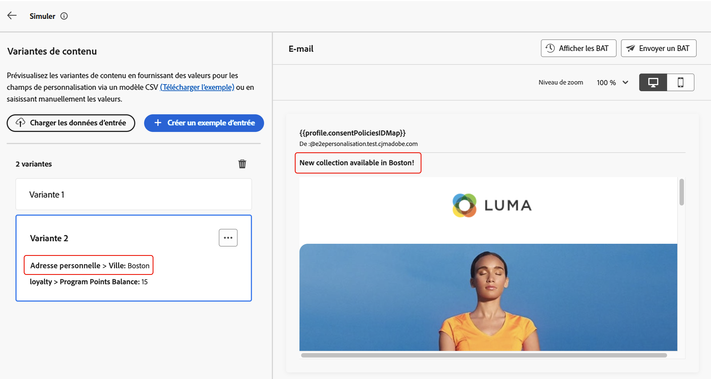

# Simuler des variations de contenu {#custom-profiles}

>[!CONTEXTUALHELP]
>id="ajo_simulate_sample_profiles"
>title="Simuler à l’aide d’un exemple d’entrée"
>abstract="Sur cet écran, vous pouvez tester différentes variantes de votre contenu en fournissant des valeurs pour les champs de personnalisation à l’aide d’un modèle CSV ou JSON, ou en saisissant manuellement les valeurs."

[!DNL Journey Optimizer] vous permet de prévisualiser différentes variations de votre contenu à l’aide d’exemples de données d’entrée chargées à partir d’un fichier CSV ou JSON ou ajoutées manuellement.

Tous les attributs utilisés dans votre contenu pour la personnalisation sont automatiquement détectés par le système et peuvent être utilisés dans vos tests afin de créer plusieurs variantes. Une variante fait référence à une version du contenu dont les attributs ont des valeurs différentes.

>[!NOTE]
>
>Les variantes servent uniquement à des fins de test pour votre contenu actuel. Celles-ci ne sont pas stockées dans Adobe Experience Platform, mais dans la session de votre navigateur, ce qui signifie qu’elles ne s’afficheront pas si vous vous déconnectez ou si vous travaillez sur un autre appareil.

## Mécanismes de sécurisation et limitations {#limitations}

Avant de commencer à tester votre contenu à l’aide des exemples de données d’entrée, tenez compte des mécanismes de sécurisation et des conditions préalables suivants.

* **Canaux** : la simulation de variations de contenu est disponible pour :

   * les canaux E-mail, SMS et Notification push ;
   * tous les canaux entrants (web, expérience basée sur du code, in-app, cartes de contenu).

* **Fonctionnalités prises en charge** : les variations de contenu peuvent être utilisées avec le contenu multilingue [!DNL Journey Optimizer] et des fonctionnalités d’expérience de contenu. Vous pouvez ainsi tester les messages dans plusieurs langues et optimiser le contenu grâce à l’expérimentation.

  Vous pouvez également tirer parti des variations de contenu pour tester vos modèles de contenu.

  >[!NOTE]
  >
  >Pour l’instant, le rendu de la boîte de réception et les rapports de spam ne sont pas disponibles dans l’expérience actuelle. Pour utiliser ces fonctionnalités, sélectionnez le bouton **[!UICONTROL Simuler le contenu]** de votre contenu pour accéder à l’interface d’utilisation précédente.

* **Attributs** : les attributs de profil et contextuels sont pris en charge.

* **Types de données** - Seuls les types de données suivants sont pris en charge lors de la saisie de données pour vos variantes : nombre (entier et décimal), chaîne, valeur booléenne et type de date. Tout autre type de données affiche une erreur.

* **Nombre de variantes** : vous pouvez ajouter jusqu’à 30 variantes pour tester votre contenu, soit à l’aide d’un fichier, soit manuellement.

## Ajouter et prévisualiser des variations de contenu

Pour créer des variations de votre contenu et les prévisualiser, cliquez sur le bouton **[!UICONTROL Simuler le contenu]** et choisissez **[!UICONTROL Simuler les variations de contenu]**.


Les principales étapes pour tester votre contenu sont les suivantes :

1. **Ajouter des variantes** : ajoutez jusqu’à 30 variantes avec des exemples de données d’entrée, soit en chargeant un fichier, soit en ajoutant manuellement les données. [Découvrir comment ajouter des variantes](#profiles)
1. **Prévisualiser des variations de contenu** : vérifiez l’aperçu de votre contenu à l’aide des différentes variantes. [Découvrir comment prévisualiser votre contenu](#preview)
1. **Envoyer des BAT d’e-mail** : pour du contenu d’e-mail, envoyez jusqu’à 10 BAT aux adresses e-mail à l’aide des différentes variantes. [Découvrir comment envoyer des BAT](#proofs)

### Ajouter des variantes {#profiles}

Lors de l’accès à l’expérience de variations de contenu, tous les champs de personnalisation utilisés dans votre contenu sont automatiquement détectés et affichés dans une liste de variantes vides.

Par exemple, si votre e-mail contient deux champs de personnalisation « Ville » et « Solde des points du programme », ils apparaîtront dans la liste. Au départ, aucune valeur n’est saisie et aucun contenu personnalisé n’est affiché dans le volet d’aperçu.


Pour modifier la valeur d’une variante :

1. Cliquez sur le bouton représentant des points de suspension en regard de la variante.
1. Sélectionnez **[!UICONTROL Modifier]** pour fournir des valeurs personnalisées pour chaque champ de personnalisation.
1. Le volet d’aperçu est mis à jour pour afficher le rendu de votre contenu avec les valeurs saisies.

Pour ajouter une nouvelle variante :

1. Cliquez sur le bouton **[!UICONTROL Créer un exemple d’entrée]**.
1. Une nouvelle variante vierge s’affiche, contenant tous les champs de personnalisation détectés.
1. Modifiez la nouvelle variante selon vos besoins.


Vous pouvez également charger un fichier avec des variantes et des valeurs prédéfinies pour accélérer le processus.

1. Cliquez sur **[!UICONTROL Télécharger l’exemple]** pour télécharger un modèle de fichier.
1. Choisissez un format de fichier : CSV, JSON ou JSONLINES.
1. Ouvrez le fichier de modèle et renseignez les valeurs souhaitées pour chaque attribut de profil. Le modèle inclut une colonne pour chaque attribut de profil utilisé dans votre contenu pour la personnalisation.

   Exemple de syntaxe JSON :

   ```
   {
   "profile": {
       "attributes": {
       "person": {
           "name": {
               "lastName": "Doe",
               "firstName": "John"
               }
           }
       }
   }
   }
   ```

1. Une fois votre fichier prêt, cliquez sur **[!UICONTROL Charger les données d’entrée]** pour le charger.
1. Après le chargement, une nouvelle variante est ajoutée à la liste pour chaque entrée dans le fichier.

   

Une fois les variantes ajoutées, vous pouvez les utiliser pour prévisualiser votre contenu dans le volet de droite et envoyer des BAT d’e-mail.

### Prévisualiser les variations de contenu {#preview}

Pour prévisualiser votre contenu à l’aide d’une variante, sélectionnez la variante appropriée dans la liste pour mettre à jour le contenu du volet d’aperçu avec les informations saisies pour cette variante.

Dans l’exemple ci-dessous, nous avons ajouté deux variantes pour l’objet de l’e-mail :

| Sélection de la variante 1 | Sélection de la variante 2 |
|----------|-------------|
|  |  |

Pour le contenu et l’expérimentation multilingues, une liste déroulante est disponible pour basculer entre les différentes variantes ou traitements de langue.


Vous pouvez supprimer une variante à tout moment à l’aide du bouton représentant des points de suspension dans le coin supérieur droit et en sélectionnant **[!UICONTROL Supprimer]**. Pour modifier les informations d’une variante, cliquez sur le bouton représentant des points de suspension et sélectionnez **[!UICONTROL Modifier]**.

### Envoyer des BAT {#proofs}

Journey Optimizer permet d’envoyer des épreuves à des adresses e-mail tout en empruntant l’identité d’une ou plusieurs variantes ajoutées dans l’écran de simulation. Les étapes sont les suivantes :

1. Vérifiez que des variantes ont été ajoutées pour tester votre contenu et cliquez sur le bouton **[!UICONTROL Envoyer une épreuve]**.

1. Dans le champ **[!UICONTROL Destinataires]**, saisissez l’adresse e-mail à laquelle vous souhaitez envoyer l’épreuve, puis cliquez sur **[!UICONTROL Ajouter]**. Répétez l’opération pour envoyer l’épreuve à d’autres adresses e-mail. Vous pouvez ajouter jusqu’à 10 destinataires d’épreuve.

1. Dans la section inférieure de l’écran, sélectionnez la variante que vous souhaitez utiliser dans l’épreuve. Vous pouvez sélectionner plusieurs variantes, auquel cas l’e-mail contiendra autant d’épreuves que de variantes sélectionnées.

   Pour plus d’informations sur une variante, cliquez sur le lien **[!UICONTROL Afficher les détails du profil]**. Vous pouvez ainsi afficher les informations saisies dans l’écran précédent pour les différentes variantes.

   

1. Cliquez sur le bouton **[!UICONTROL Envoyer une épreuve]** pour commencer à envoyer l’épreuve.

1. Pour suivre l’envoi de l’épreuve, cliquez sur le bouton **[!UICONTROL Afficher les épreuves]** dans l’écran de simulation de contenu.


