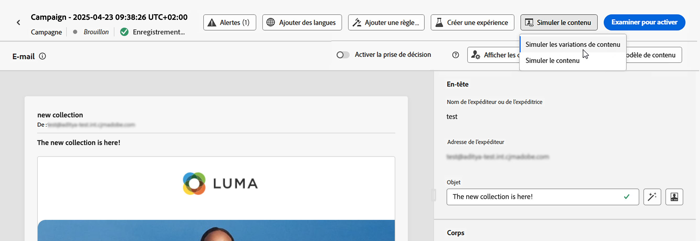
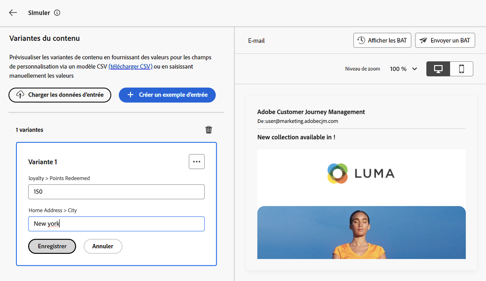
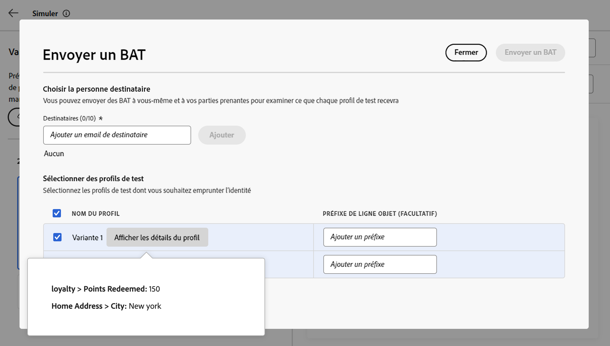

# Tester votre contenu à l’aide d’exemples de profils {#custom-profiles}

>[!CONTEXTUALHELP]
>id="ajo_simulate_sample_profiles"
>title="Simulation à l’aide d’exemples de profils"
>abstract="Dans cet écran, vous pouvez prévisualiser le contenu d’un email et envoyer des BAT tout en empruntant l’identité d’exemples de profils que vous pouvez télécharger à partir d’un fichier CSV ou ajouter manuellement depuis cet écran."

<!--ATTENTE CONFIRMATION 

- nom (custom/sample)
- campaigns/journeys ou que campaigns

-->

>[!AVAILABILITY]
>
>Cette fonctionnalité est actuellement disponible en version bêta pour les utilisateurs sélectionnés uniquement.

Parcours Optimizer vous permet de prévisualiser et de tester le contenu d’un email à l’aide d’exemples de profils que vous pouvez télécharger à partir d’un fichier CSV ou ajouter manuellement lors de la simulation de votre contenu. Cette fonctionnalité vous permet de sélectionner des exemples de profils à utiliser pour prévisualiser votre contenu et envoyer des bons à tirer. Tous les attributs de profil utilisés dans votre contenu pour la personnalisation sont automatiquement détectés par le système et peuvent être utilisés pour vos tests.

Pour accéder à cette expérience, cliquez sur le bouton **[!UICONTROL Simuler le contenu]** et sélectionnez **[!UICONTROL Simuler avec CSV(Beta)]**.

Les principales étapes pour tester votre contenu sont les suivantes :

1. Ajoutez jusqu’à 30 exemples de profils, soit en chargeant un fichier CSV, soit en les ajoutant un par un manuellement. [Découvrez comment ajouter des exemples de profils](#profiles)
1. Vérifiez l&#39;aperçu de votre contenu à l&#39;aide des profils ajoutés. [Découvrez comment prévisualiser votre contenu](#preview)
1. Envoyer jusqu’à 10 bons à tirer aux adresses email tout en empruntant l’identité des profils d’exemple souhaités. [Découvrir comment envoyer des BAT](#proofs)

## Mécanismes de sécurisation et limitations {#limitations}

Avant de commencer le test de votre contenu à l’aide d’exemples de profils, tenez compte des barrières de sécurité et des conditions préalables suivantes.

* Pour l’instant, le test à l’aide de profils d’exemple n’est disponible que dans les campagnes et pour le canal email.
* Les fonctionnalités suivantes ne sont pas disponibles dans l&#39;expérience actuelle : Inbox rendering, rapports sur les spams, contenu multilingue et expérience de contenu. Pour utiliser ces fonctionnalités, cliquez sur le bouton **[!UICONTROL Simuler le contenu]** de votre contenu pour accéder à l’interface utilisateur précédente.
* Seuls les attributs de profil sont actuellement pris en charge. Si des attributs contextuels sont utilisés dans votre contenu à des fins de personnalisation, vous ne pourrez pas tester votre contenu à l’aide de ces attributs.
* Seuls les types de données suivants sont pris en charge lors de la saisie de données pour vos profils d’exemple : nombre (entier et décimal), chaîne, valeur booléenne et type de date. Tout autre type de données affiche une erreur.

## Ajouter des exemples de profils {#profiles}

Vous pouvez ajouter jusqu’à 30 exemples de profils pour tester votre contenu à l’aide d’un fichier CSV ou manuellement :

* Pour charger des profils à partir d’un fichier CSV, cliquez sur le lien **[!UICONTROL Télécharger le modèle]** pour récupérer un modèle de fichier CSV. Ces modèles incluent une colonne pour chaque attribut de profil utilisé dans votre contenu pour la personnalisation.

  Renseignez le fichier CSV, puis cliquez sur le **[!UICONTROL Télécharger les exemples de profils]** pour le charger afin de tester votre contenu.

* Pour ajouter manuellement un profil, cliquez sur le bouton **[!UICONTROL Créer un exemple de profil]** et renseignez les informations du profil. Un champ s’affiche pour chaque attribut de profil utilisé dans votre contenu pour la personnalisation.

  

Une fois les profils sélectionnés, une zone s’affiche pour chaque profil sur le côté gauche de l’écran. Vous pouvez utiliser ces profils pour prévisualiser votre contenu et envoyer des bons à tirer.

>[!NOTE]
>
>Les exemples de profils ajoutés servent uniquement à des fins de test pour votre contenu actuel. Les ne sont pas stockés dans Adobe Experience Platform, mais dans la session de votre navigateur utilisateur, ce qui signifie qu’ils ne s’afficheront pas lors de la déconnexion ou si vous travaillez sur un autre appareil.

## Prévisualiser votre contenu à l’aide d’exemples de profils {#preview}

Pour prévisualiser votre contenu à l&#39;aide de l&#39;un des profils, cochez la case correspondante afin de mettre à jour l&#39;aperçu du contenu dans la section droite avec les informations renseignées pour ce profil.

Vous pouvez supprimer une zone à tout moment à l’aide du bouton représentant des points de suspension dans le coin supérieur droit et en sélectionnant **[!UICONTROL Supprimer]**. Pour modifier les informations d’un profil, cliquez sur le bouton représentant des points de suspension et sélectionnez **[!UICONTROL Modifier]**.

## Envoyer des BAT {#proofs}

Journey Optimizer permet d&#39;envoyer des BAT à des adresses email tout en empruntant l&#39;identité d&#39;un ou plusieurs exemples de profils que vous avez ajoutés à l&#39;écran de la simulation. Les étapes sont les suivantes :

1. Vérifiez que des exemples de profils ont été ajoutés pour tester votre contenu et cliquez sur le bouton **[!UICONTROL Envoyer un bon à tirer]** .

1. Dans le champ **[!UICONTROL Destinataires]**, saisissez l&#39;adresse email à laquelle vous souhaitez envoyer le BAT, puis cliquez sur **[!UICONTROL Ajouter]**. Répétez l’opération pour envoyer le BAT à des adresses email supplémentaires. Vous pouvez ajouter jusqu’à 10 destinataires de BAT.

1. Dans la section inférieure de l&#39;écran, sélectionnez les exemples de profils que vous souhaitez incarner dans le BAT. Vous pouvez sélectionner plusieurs profils, auquel cas l&#39;email contiendra autant de BAT que les profils sélectionnés.

   Pour plus d’informations sur un profil, cliquez sur le lien **[!UICONTROL Afficher les détails du profil]** . Vous pouvez ainsi afficher les informations saisies dans l’écran précédent pour les différents attributs de profil.

   

1. Cliquez sur le bouton **[!UICONTROL Envoyer le bon à tirer]** pour commencer à envoyer le bon à tirer.

Vous pouvez suivre l’envoi à tout moment en cliquant sur le bouton **[!UICONTROL Afficher les bons à tirer]** dans l’écran de simulation de contenu.

