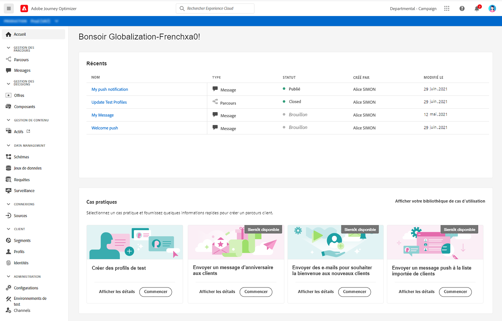
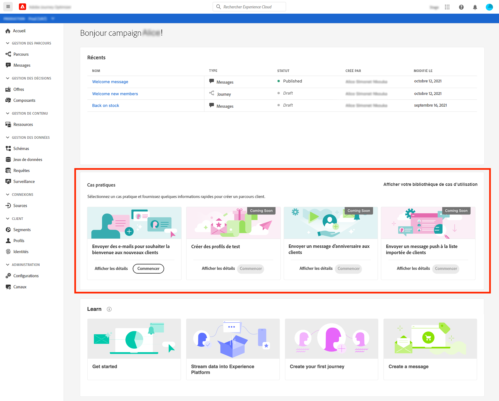
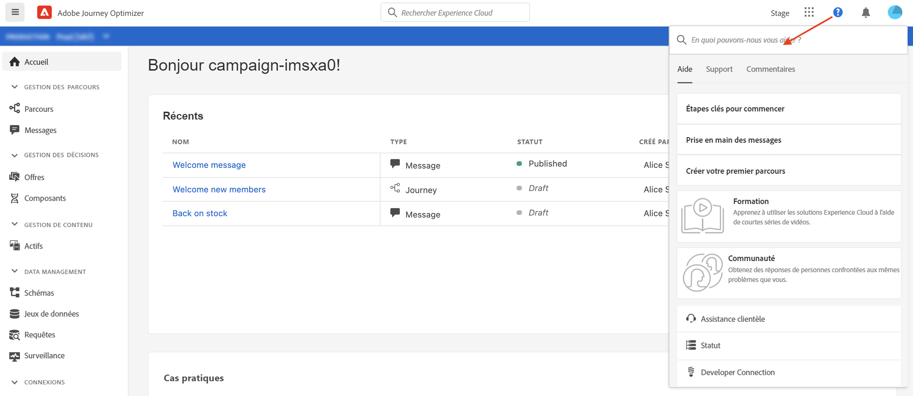
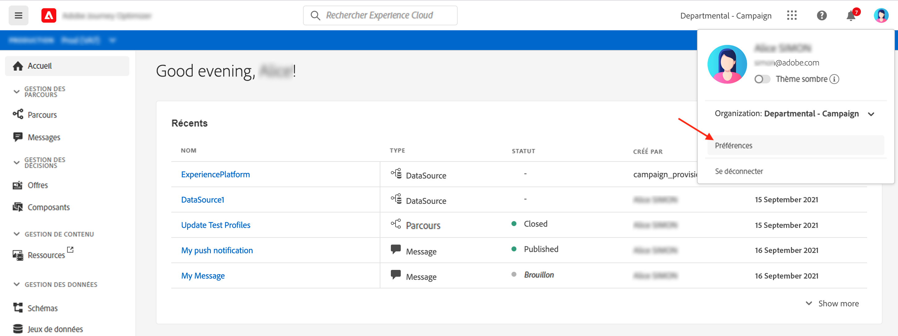
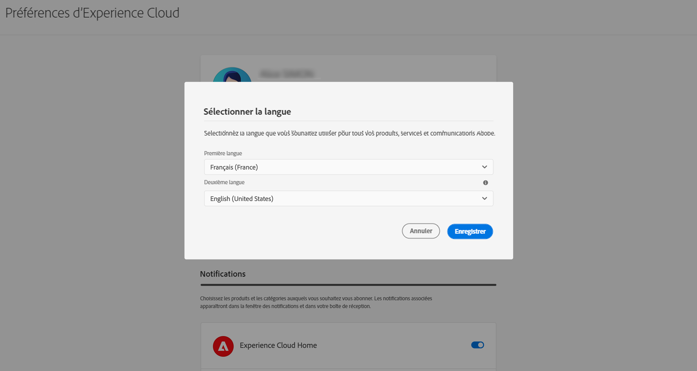
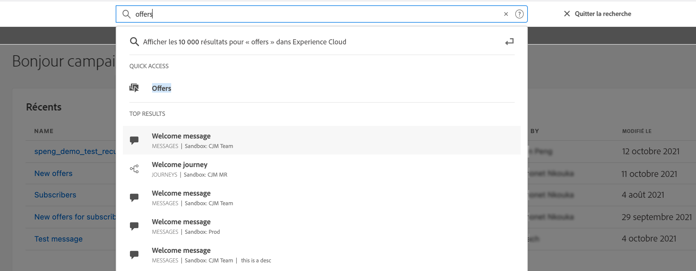
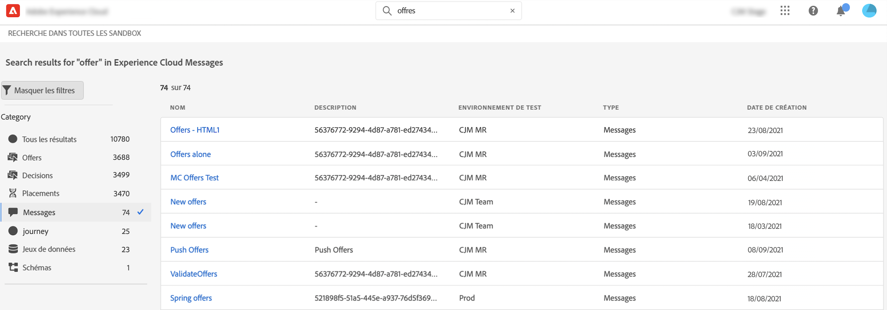
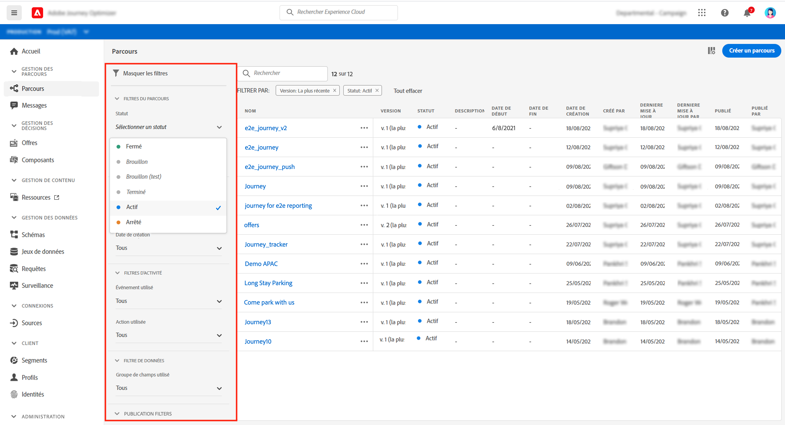
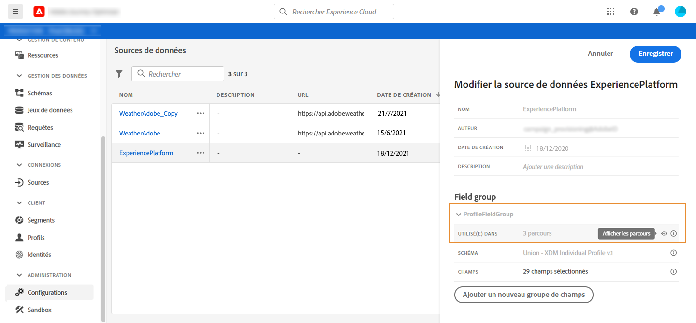
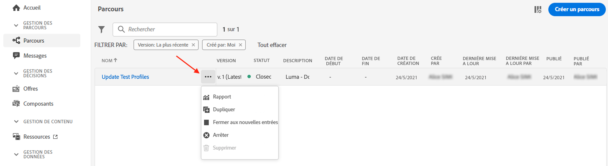

# Interface utilisateur {#cjm-user-interface}

Une fois connecté à [Adobe Experience Cloud](http://experience.adobe.com), accédez à [!DNL Journey Optimizer].

>[!NOTE]
>
>* Les concepts clés lors de la navigation dans l&#39;interface utilisateur sont les mêmes que ceux d&#39;Adobe Experience Platform. Pour plus d&#39;informations, consultez la [documentation Adobe Experience Platform](https://experienceleague.adobe.com/docs/experience-platform/landing/platform-ui/ui-guide.html#adobe-experience-platform-ui-guide){target=&quot;_blank&quot;}.
   >
   >
* Cette documentation est fréquemment mise à jour pour prendre en compte les dernières modifications de l&#39;interface utilisateur du produit. Cependant, certaines captures d&#39;écran peuvent être légèrement différentes de votre interface utilisateur.
   >
   > 
* Les composants et fonctionnalités disponibles dans l&#39;interface utilisateur dépendent de vos autorisations et de votre package de licence. Pour toute question, contactez votre responsable clients Adobe.

## Navigation gauche

Utilisez les liens sur la gauche pour parcourir les fonctionnalités.

>[!NOTE]
>
>Les fonctionnalités disponibles peuvent varier en fonction de vos autorisations et de votre contrat de licence.

Vous trouverez ci-dessous la liste complète des services et fonctionnalités disponibles dans la navigation de gauche et des liens vers la documentation associée.

**Accueil**

La page d&#39;accueil [!DNL Journey Optimizer] contient des liens et des ressources clés pour commencer. La liste **[!UICONTROL Récents]** fournit des raccourcis vers les messages, événements et parcours récemment créés ou mis à jour. Cette liste montre les dates et l&#39;état de leur création et de leur modification.

**[!UICONTROL GESTION DES PARCOURS]**

* **[!UICONTROL Parcours]** - Créez, configurez et orchestrez vos parcours clients. [En savoir plus](building-journeys/journey-gs.md#jo-build)

* **[!UICONTROL Messages]** - Créez, concevez, tester et publiez des e-mails et messages push. [En savoir plus](create-message.md)

**[!UICONTROL GESTION DES DÉCISIONS]**

* **[!UICONTROL Offres]** - Accédez à vos sources et ensembles de données récents à partir de ce menu. Utilisez cette section pour créer de nouvelles offres. [En savoir plus](offers/offer-library/creating-personalized-offers.md)

* **[!UICONTROL Composants]** - Créez des emplacements, des règles et des balises. [En savoir plus](offers/offer-library/key-steps.md)

**[!UICONTROL GESTION DE CONTENU]**

* **[!UICONTROL Ressources]** - [!DNL Adobe Experience Manager Assets Essentials] est un référentiel centralisé de ressources que vous pouvez utiliser pour renseigner vos messages. [En savoir plus](assets-essentials.md)

**[!UICONTROL GESTION DES DONNÉES]**

* **[!UICONTROL Schémas]** - Utilisez Adobe Experience Platform pour créer et gérer des schémas de modèle de données d&#39;expérience (XDM) dans une zone de travail visuelle interactive appelé Éditeur de schéma. [En savoir plus](get-started-schemas.md)

* **[!UICONTROL Jeux de données]** - Toutes les données correctement ingérées par Adobe Experience Platform sont conservées sous forme de jeux de données dans le lac de données. Un jeu de données est une structure de stockage et de gestion pour la collecte de données, généralement sous la forme d&#39;un tableau, qui contient un schéma (des colonnes) et des champs (des lignes). [En savoir plus](get-started-datasets.md)

* **[!UICONTROL Requêtes]** - Utilisez le service de requête d&#39;Adobe Experience Platform pour écrire et exécuter des requêtes, afficher des requêtes précédemment exécutées et accéder à des requêtes enregistrées par des utilisateurs de votre organisation. [En savoir plus](get-started-queries.md)

* **[!UICONTROL Surveillance]** - Utilisez ce menu pour surveiller l&#39;ingestion de vos données dans l&#39;interface utilisateur d&#39;Adobe Experience Platform. [En savoir plus](https://experienceleague.adobe.com/docs/experience-platform/ingestion/quality/monitor-data-ingestion.html?lang=fr){target=&quot;_blank&quot;}

**[!UICONTROL CONNEXIONS]**

* **[!UICONTROL Sources]** - Utilisez ce menu pour ingérer des données provenant de diverses sources (applications Adobe, enregistrements basés sur cloud, bases de données, etc.) et structurer, libeller et améliorer les données entrantes. [En savoir plus](get-started-sources.md)

**[!UICONTROL CLIENT]**

* **[!UICONTROL Segments]** - Créez et gérez des définitions de segment Experience Platform et exploitez-les dans vos parcours. [En savoir plus](segment/about-segments.md)

* **[!UICONTROL Profils]** - Le profil client en temps réel offre une vue d&#39;ensemble de chaque client en combinant des données issues de plusieurs canaux, notamment des données en ligne, hors ligne, CRM et tierces. [En savoir plus](get-started-profiles.md)

* **[!UICONTROL Identités]** - Le service d&#39;identités d&#39;Adobe Experience Platform gère l&#39;identification inter-appareils, inter-canaux et en temps quasi réel de vos clients, dans ce qu&#39;on appelle un graphique d&#39;identités dans Adobe Experience Platform. [En savoir plus](get-started-identity.md)

**[!UICONTROL ADMINISTRATION]**

* **[!UICONTROL Administration des parcours]** - Utilisez ce menu pour configurer les [événements](event/about-events.md), les [sources de données](datasource/about-data-sources.md) et les [actions](action/action.md) à utiliser dans vos parcours.

* **[!UICONTROL Environnements de test]** - Adobe Experience fournit des environnements de test qui divisent une instance de plateforme unique en environnements virtuels distincts pour favoriser le développement et l&#39;évolution d&#39;applications d&#39;expérience numérique. [En savoir plus](administration/sandboxes.md)

## Cas d&#39;utilisation internes au produit

Tirez parti des cas d&#39;utilisation [!DNL Adobe Journey Optimizer] de la page d&#39;accueil et fournissez quelques entrées rapides pour créer un parcours client.

Les cas d&#39;utilisation disponibles sont les suivants :

* **Créer des profils de test** : pour créer des profils de test à l&#39;aide de notre modèle CSV afin de tester des messages et des parcours personnalisés. Découvrez comment mettre en œuvre ce cas pratique [sur cette page](building-journeys/creating-test-profiles.md#use-case-1).
* **Envoyer un message d&#39;anniversaire aux clients** : pour envoyer automatiquement un e-mail afin de souhaiter un bon anniversaire à vos clients. (bientôt disponible)
* **Envoyer des e-mails pour souhaiter la bienvenue aux nouveaux clients** : pour envoyer facilement jusqu&#39;à deux e-mails afin d&#39;accueillir vos nouveaux clients enregistrés. (bientôt disponible)
* **Envoyer des messages push à la liste importée de clients** : pour envoyer rapidement une notification push à une liste de clients importés à partir d&#39;un fichier CSV. (bientôt disponible)

Cliquez sur **[!UICONTROL Afficher les détails]** pour en savoir plus sur chaque cas d&#39;utilisation.

Cliquez sur le bouton **[!UICONTROL Commencer]** pour lancer le cas d&#39;utilisation.

Vous pouvez accéder aux cas d&#39;utilisation exécutés à partir du bouton **[!UICONTROL Afficher la bibliothèque de cas d&#39;utilisation]**.

## Obtention d’aide et de support

Accédez aux pages d&#39;aide principales d&#39;Adobe Journey Optimizer à partir de la section inférieure de la page d&#39;accueil.

Utilisez l&#39;icône **Aide** pour accéder aux pages d&#39;aide, contacter l&#39;assistance et partager vos commentaires. Vous pouvez rechercher des articles et des vidéos d&#39;aide dans le champ de recherche.

## Navigateurs pris en charge

L&#39;interface d&#39;Adobe [!DNL Journey Optimizer] est conçue pour fonctionner de manière optimale avec la dernière version de Google Chrome. Vous pouvez rencontrer des problèmes lors de l&#39;utilisation de certaines fonctions sur des versions plus anciennes ou d&#39;autres navigateurs.

## Préférences linguistiques

L&#39;interface utilisateur est actuellement disponible dans les langues suivantes :

* Anglais
* Français
* Allemand

Votre langue d&#39;interface par défaut est déterminée par la langue préférée spécifiée dans votre profil utilisateur.

Pour modifier la langue :

* Cliquez sur **Préférences** depuis votre avatar, en haut à droite.
   
* Cliquez ensuite sur la langue affichée sous votre adresse électronique.
* Sélectionnez la langue de votre choix et cliquez sur **Enregistrer**. Vous pouvez sélectionner une seconde langue au cas où le composant que vous utilisez ne serait pas localisé dans votre langue maternelle.
   

## Recherche

Depuis n&#39;importe où dans l&#39;interface Adobe Journey Optimizer, utilisez la recherche Adobe Experience Cloud au centre de la barre supérieure pour rechercher des ressources, des parcours ou des messages dans vos environnements Sandbox. Commencez à saisir du contenu pour afficher les meilleurs résultats.

Appuyez sur **Entrée** pour accéder à tous les résultats et les filtrer.

## Filtrer les listes{#section_lgm_hpz_pgb}

Dans la plupart des listes, une barre de recherche permet de rechercher un élément spécifique et de sélectionner des critères de filtrage.

Pour accéder aux filtres, cliquez sur l&#39;icône en forme de filtre en haut à gauche de la liste. Le menu Filtrer permet de filtrer les éléments affichés en fonction de différents critères. Il est possible d&#39;afficher uniquement les éléments d&#39;un certain type ou dans un statut donné, ceux que vous avez créés, ou ceux que vous avez modifiés au cours des 30 derniers jours. Les options varient en fonction du contexte.

Dans la liste des parcours, vous pouvez filtrer les parcours en fonction de leur statut, de leur type et de leur version à partir des **[!UICONTROL filtres de statut et de version]**. Le type peut être : **[!UICONTROL Événement unitaire]**, **[!UICONTROL Qualification du segment]**, **[!UICONTROL Lecture de segment]**, **[!UICONTROL Événement métier]** ou **[!UICONTROL Rafale]**. Vous pouvez choisir d&#39;afficher uniquement les parcours qui utilisent un événement, un groupe de champs ou une action spécifique à l&#39;aide des **[!UICONTROL filtres d&#39;activité]** et des **[!UICONTROL filtres de données]**. Les **[!UICONTROL filtres de publication]** permettent de sélectionner une date de publication ou un utilisateur. Il est possible, par exemple, d&#39;afficher les dernières versions des parcours actifs publiées hier. [En savoir plus](building-journeys/using-the-journey-designer.md).

>[!NOTE]
>
>Notez que les colonnes affichées peuvent être personnalisées à l&#39;aide du bouton de configuration en haut à droite des listes. La personnalisation est enregistrée pour chaque utilisateur.

Utilisez les colonnes **[!UICONTROL Dernière mise à jour]** et **[!UICONTROL Dernière mise à jour par]** pour vérifier quand s&#39;est produit la dernière mise à jour de vos parcours et qui l&#39;a enregistrée.

Dans les volets de configuration des événements, des sources de données et des actions, le champ **[!UICONTROL Utilisé(e) dans]** affiche le nombre de parcours qui utilisent cet événement, ce groupe de champs ou cette action spécifique. Vous pouvez cliquer sur le bouton **[!UICONTROL Afficher les parcours]** pour faire apparaître la liste des parcours correspondants.

Il est possible d&#39;effectuer des actions de base sur chaque élément des différentes listes. Vous pouvez par exemple dupliquer ou supprimer un élément.

