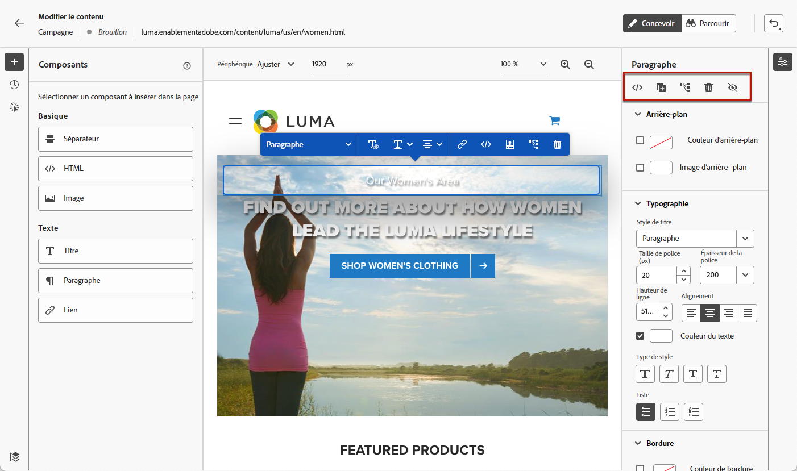
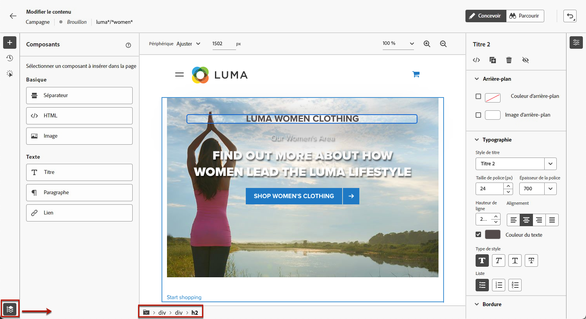
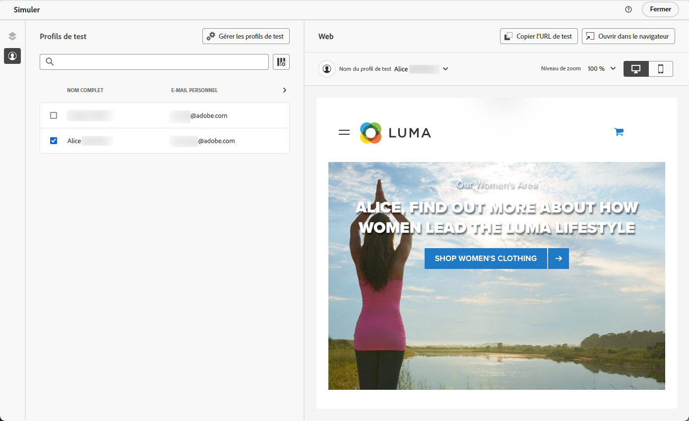

# Créer des pages web {#author-web}

>[!AVAILABILITY]
>
>La fonctionnalité de canal web est actuellement disponible en version bêta pour sélectionner uniquement les utilisateurs.

Dans [!DNL Journey Optimizer] la création web est optimisée par l’extension de navigateur Chrome Visual Helper de Adobe Experience Cloud. [En savoir plus](visual-editing-helper.md)

Pour accéder à des pages web et les créer dans le [!DNL Journey Optimizer] , suivez les conditions préalables répertoriées dans [cette section](create-web.md#prerequesites).

## Modifier le contenu d’une page web {#edit-web-content}

Une fois que vous avez créé une action web à partir de la campagne, vous pouvez éditer votre contenu à l&#39;aide du concepteur web. Procédez comme suit.

>[!CAUTION]
>
>Pour y accéder : [!DNL Journey Optimizer], votre page web doit être implémentée à l’aide de la fonction [SDK Web Adobe Experience Platform](https://experienceleague.adobe.com/docs/platform-learn/implement-web-sdk/overview.html?lang=fr){target=&quot;_blank&quot;}.

1. Dans la **[!UICONTROL Action]** de l&#39;opération, sélectionnez **[!UICONTROL Modifier le contenu]** pour commencer à créer votre campagne web.

1. Si vous avez créé une règle de correspondance de pages, vous devez saisir toute URL correspondant à cette règle. Les modifications seront appliquées à toutes les pages correspondant à la règle.

   >[!NOTE]
   >
   >Si vous avez saisi une seule URL comme surface web, l’URL à personnaliser est déjà renseignée.

   

1. Le contenu de la page s’affiche.

   >[!CAUTION]
   >
   >La page web doit inclure la variable [SDK Web Adobe Experience Platform](https://experienceleague.adobe.com/docs/platform-learn/implement-web-sdk/overview.html){target=&quot;_blank&quot;}.

1. Cliquez sur **[!UICONTROL Concepteur web d’ouverture]** pour la modifier. [En savoir plus](author-web.md)

   

1. Le concepteur web s’affiche.

   

1. Sélectionnez un élément dans la zone de travail, tel qu’une image, un bouton, un paragraphe, un texte, un conteneur, un en-tête, un lien, etc. et utilisez :

   * Le menu contextuel permettant d&#39;éditer son contenu, sa mise en page, insérer des liens ou la personnalisation, etc.

      

   * Les icônes situées en haut du panneau de droite permettent de modifier, dupliquer, supprimer ou masquer chaque élément.

      

   * Panneau de droite qui change dynamiquement en fonction de l’élément sélectionné. Vous pouvez, par exemple, modifier l’arrière-plan, la typographie, la bordure, la taille, la position, l’espacement, les effets ou les styles intégrés d’un élément.

      

## Utilisation de composants de contenu {#content-components}

1. Dans la **[!UICONTROL Composants]** dans le volet de gauche, vous pouvez ajouter les composants suivants à votre page web et les modifier selon vos besoins :

   * [Diviseur](../design/content-components.md#divider)
   * [HTML](../design/content-components.md#HTML)
   * [Image](../design/content-components.md#image)
   * En-tête : l’utilisation de ce composant est similaire à l’utilisation de la fonction **[!UICONTROL Texte]** dans le concepteur d’email. [En savoir plus](../design/content-components.md#text)
   * Paragraphe : l’utilisation de ce composant est similaire à l’utilisation de la propriété **[!UICONTROL Texte]** dans le concepteur d’email. [En savoir plus](../design/content-components.md#text)
   * Lien - Découvrez comment définir le style du lien dans [cette section](../design/styling-links.md)
   * [Décision sur l’offre](../design/deliver-personalized-offers.md)

   

1. Passez la souris sur la page, puis cliquez sur l’icône **[!UICONTROL Insérer avant]** ou **[!UICONTROL Insérer après]** pour ajouter le composant à un élément existant sur la page.

   

1. Dans le conteneur qui s’affiche pour ce composant, modifiez le contenu du composant selon les besoins.

   

1. Ajustez les styles qui s’affichent à partir du **[!UICONTROL Conteneur]** le volet de droite, comme l’arrière-plan, la couleur du texte, la bordure, la taille, la position, etc. ; selon le composant sélectionné.

   

## Navigation dans le concepteur web

### Utilisation des chemins de navigation

1. Sélectionnez un élément dans la zone de travail.

1. Cliquez sur le bouton **[!UICONTROL Développer/réduire le chemin de navigation]** dans le coin inférieur gauche de l’écran pour afficher rapidement les informations sur l’élément sélectionné.

   

1. Lorsque vous passez la souris sur le chemin de navigation, l’élément correspondant est mis en surbrillance dans l’éditeur.

1. Vous pouvez facilement y accéder à n’importe quel élément parent, frère ou enfant dans l’éditeur visuel.

### Basculer vers le mode de navigation {#browse-mode}

Vous pouvez passer de la valeur par défaut **[!UICONTROL Conception]** en mode **[!UICONTROL Parcourir]** à l’aide du bouton dédié.

Dans la **[!UICONTROL Parcourir]** , vous pouvez accéder à la page exacte à partir de la surface sélectionnée à personnaliser.

Elle est particulièrement utile lorsque vous traitez des pages qui se trouvent derrière l’authentification ou qui ne sont pas disponibles depuis le début à une certaine URL. Par exemple, vous pourrez vous authentifier, accéder à la page de votre compte ou à la page de votre panier, puis revenir à **[!UICONTROL Conception]** pour effectuer les modifications sur la page souhaitée.

### Modification de la taille de l’appareil

Vous pouvez définir la taille de l’appareil sur une taille prédéfinie, telle que **[!UICONTROL Tablette]** ou **[!UICONTROL Paysage mobile]** ou définir une taille personnalisée. Saisissez le nombre de pixels souhaité pour définir une taille personnalisée.

Vous pouvez également modifier la mise au point du zoom, de 25 % à 400 %.

## Gestion des modifications {#manage-modifications}

Vous pouvez facilement gérer tous les composants, réglages et styles que vous avez ajoutés à votre page web.

1. Sélectionnez la **[!UICONTROL Modifications]** pour afficher le volet correspondant à gauche.

   

1. Vous pouvez passer en revue chacune des modifications que vous avez apportées à la page.

1. Sélectionnez une modification indésirable et cliquez sur l’icône de suppression pour la supprimer.

   

   >[!CAUTION]
   >
   >Procédez avec précaution lors de la suppression d’une action, car elle peut avoir un impact sur les actions suivantes.

1. Vous pouvez également annuler et rétablir des actions à l’aide de la variable **[!UICONTROL Annuler/rétablir]** en haut à droite de l’écran.

   

   Cliquez sur le bouton et maintenez-le enfoncé pour passer de la **[!UICONTROL Annuler]** et **[!UICONTROL Rétablir]** options. Cliquez ensuite sur le bouton lui-même pour appliquer l’action souhaitée.

## Ajout d’offres et de personnalisation

Pour ajouter de la personnalisation, sélectionnez un conteneur et l&#39;icône de personnalisation dans la barre de menus contextuelle qui s&#39;affiche. Ajoutez vos modifications à l&#39;aide de l&#39;éditeur d&#39;expression. [En savoir plus](../personalization/personalization-build-expressions.md)

Utilisez la variable **[!UICONTROL Décision sur l’offre]** composant à insérer [offres](../offers/get-started/starting-offer-decisioning.md) dans vos pages web. Le processus est le même que lorsque [ajout d’une offre à un email](../design/deliver-personalized-offers.md). Elle tire parti de la gestion de la décision pour sélectionner la meilleure offre à fournir à vos clients.

## Tester la campagne web {#test-web-campaign}

Pour afficher un aperçu de votre expérience web modifiée, procédez comme suit.

>[!CAUTION]
>
>Vous devez disposer de profils de test pour simuler les offres qui leur seront diffusées. Découvrez comment [créer des profils de test](../segment/creating-test-profiles.md).

1. À partir de **[!UICONTROL Modifier le contenu]** ou le concepteur web, sélectionnez **[!UICONTROL Simulation du contenu]**.

   

1. Cliquez sur **[!UICONTROL Gestion des profils de test]** pour sélectionner un ou plusieurs profils de test.
1. Un aperçu de la page web modifiée s’affiche.

   

1. Vous pouvez également copier l’URL de test pour la coller dans n’importe quel navigateur ou l’ouvrir dans le navigateur par défaut.
