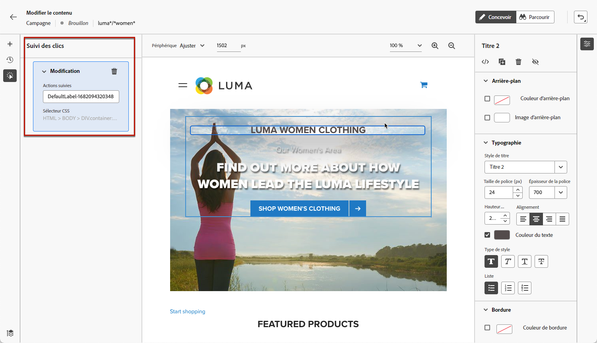

# Créer des pages web {#author-web}

Après l’[ajout d’une action web](create-web.md#create-web-campaign) dans votre campagne, vous pouvez modifier le contenu de votre site à l’aide du concepteur web.

Dans [!DNL Journey Optimizer], la création web est optimisée par l’extension de navigateur Chrome **Visual Helper d’Adobe Experience Cloud**. [En savoir plus](web-prerequisites.md#visual-authoring-prerequisites).

>[!CAUTION]
>
>Pour créer des pages web dans l’interface utilisateur de [!DNL Journey Optimizer] et y accéder, suivez les conditions préalables répertoriées dans [cette section](web-prerequisites.md).

[Découvrez comment créer une campagne web dans cette vidéo.](#video)

## Modifier le contenu d’une page web {#edit-web-content}

>[!CONTEXTUALHELP]
>id="ajo_web_url_to_edit_surface"
>title="Confirmer l’URL à modifier"
>abstract="Confirmez l’URL d’une page web spécifique à utiliser pour la modification du contenu qui sera appliquée sur la surface web définie ci-dessus. La page web doit être implémentée à l’aide du SDK Web Adobe Experience Platform."
>additional-url="https://experienceleague.adobe.com/docs/platform-learn/implement-web-sdk/overview.html?lang=fr" text="En savoir plus"

>[!CONTEXTUALHELP]
>id="ajo_web_url_to_edit_rule"
>title="Saisissez l’URL à modifier."
>abstract="Saisissez l’URL d’une page web spécifique à utiliser pour la modification du contenu qui sera appliqué à toutes les pages correspondant à la règle. La page web doit être mise en œuvre à l’aide du SDK web Adobe Experience Platform."
>additional-url="https://experienceleague.adobe.com/docs/platform-learn/implement-web-sdk/overview.html?lang=fr" text="En savoir plus"

Pour commencer à créer votre campagne web, procédez comme suit :

1. Dans l’onglet **[!UICONTROL Action]** de la [campagne](create-web.md#create-web-campaign), sélectionnez **[!UICONTROL Modifier le contenu]**.<!--change screen with rule-->

   

1. Si vous avez créé une règle de correspondance de pages, vous devez saisir toute URL correspondant à cette règle : les modifications seront appliquées à toutes les pages correspondant à la règle. Le contenu de la page s’affiche.

   >[!NOTE]
   >
   >Si vous avez saisi une seule URL comme surface web, l’URL à personnaliser est déjà renseignée.

   

   >[!CAUTION]
   >
   >La page web doit inclure le [SDK web d’Adobe Experience Platform](https://experienceleague.adobe.com/docs/platform-learn/implement-web-sdk/overview.html?lang=fr){target="_blank"}. [En savoir plus](web-prerequisites.md#implementation-prerequisites).

1. Cliquez sur **[!UICONTROL Modifier la page web]** pour commencer la création. Le concepteur web s’affiche.

   

   >[!NOTE]
   >
   >Si vous tentez de charger un site web et que le chargement échoue, un message s’affiche pour vous suggérer d’installer l’extension de navigateur [Visual Editing Helper](#install-visual-editing-helper). Consultez quelques conseils dans [cette section](web-prerequisites.md#troubleshooting) pour résoudre les problèmes.

1. Sélectionnez un élément dans la zone de travail, tel qu’une image, un bouton, un paragraphe, un texte, un conteneur, un en-tête, un lien, etc. [En savoir plus](#content-components).

1. Utilisation :

   * Le menu contextuel permettant de modifier son contenu, sa mise en page, d’insérer des liens ou la personnalisation, etc.

      

   * Les icônes situées en haut du panneau de droite permettent de modifier, dupliquer, supprimer ou masquer chaque élément.

      

   * Panneau de droite qui change dynamiquement en fonction de l’élément sélectionné. Vous pouvez, par exemple, modifier l’arrière-plan, la typographie, la bordure, la taille, la position, l’espacement, les effets ou les styles intégrés d’un élément.

      

>[!NOTE]
>
>Le concepteur de contenu web est très similaire au concepteur d’e-mail. En savoir plus sur la [conception de contenu avec  [!DNL Journey Optimizer]](../email/get-started-email-design.md).

## Utiliser les composants {#content-components}

>[!CONTEXTUALHELP]
>id="ajo_web_designer_components"
>title="Ajouter des composants à votre page web"
>abstract="Vous pouvez ajouter plusieurs composants à votre page web et les modifier selon vos besoins."

1. Dans le volet **[!UICONTROL Composants]** sur la gauche, sélectionnez un élément. Vous pouvez ajouter les composants suivants à votre page web et les modifier selon vos besoins :

   * [Diviseur](../email/content-components.md#divider)
   * [HTML](../email/content-components.md#HTML)
   * [Image](../email/content-components.md#image)
   * En-tête : l’utilisation de ce composant est similaire à l’utilisation du composant **[!UICONTROL Texte]** dans le concepteur d’e-mail. [En savoir plus](../email/content-components.md#text)
   * Paragraphe : l’utilisation de ce composant est similaire à l’utilisation du composant **[!UICONTROL Texte]** dans le Concepteur d’e-mail. [En savoir plus](../email/content-components.md#text)
   * Lien
   * [Décision d’offre](../email/add-offers-email.md)

   

1. Passez la souris sur la page, puis cliquez sur le bouton **[!UICONTROL Insérer avant]** ou **[!UICONTROL Insérer après]** pour ajouter le composant à un élément existant sur la page.

   

   >[!NOTE]
   >
   >Pour désélectionner un composant, cliquez sur le bouton **[!UICONTROL Échap]** dans la bannière contextuelle bleue affichée au-dessus de la zone de travail.

1. Modifiez le composant suivant vos besoins directement dans le contenu de votre page.

   

1. Ajustez les styles qui s’affichent à partir du volet contextuel à droite, comme l’arrière-plan, la couleur du texte, la bordure, la taille, la position, etc. en fonction du composant sélectionné.

   

## Ajouter des personnalisations et des offres

Pour ajouter de la personnalisation, sélectionnez un conteneur et l’icône de personnalisation dans la barre du menu contextuel qui s’affiche. Ajoutez vos modifications à l’aide de l’éditeur d’expression. [En savoir plus](../personalization/personalization-build-expressions.md)

Utilisez le composant **[!UICONTROL Décision d’offre]** pour insérer des [offres](../offers/get-started/starting-offer-decisioning.md) dans vos pages web. Le processus est le même que pour l’[ajout d’une offre à un e-mail](../email/add-offers-email.md). Il tire profit de la gestion des décisions pour choisir la meilleure offre à fournir à vos clients.

## Gérer les modifications {#manage-modifications}

>[!CONTEXTUALHELP]
>id="ajo_web_designer_modifications"
>title="Gérer facilement toutes vos modifications"
>abstract="Ce volet vous permet de parcourir et de gérer tous les réglages et styles ajoutés à votre page web."

Vous pouvez facilement gérer tous les composants, réglages et styles que vous avez ajoutés à votre page web.

1. Sélectionnez l’icône **[!UICONTROL Modifications]** pour afficher le volet correspondant à gauche.

   

1. Vous pouvez passer en revue chacune des modifications que vous avez apportées à la page.

1. Sélectionnez une modification indésirable et cliquez sur l’icône de suppression pour la supprimer.

   

   >[!CAUTION]
   >
   >Procédez avec précaution lors de la suppression d’une action, car elle peut avoir un impact sur les actions suivantes.

1. Cliquez sur le bouton **[!UICONTROL Plus dʼactions]** en haut du volet **[!UICONTROL Modifications]** pour supprimer toutes les modifications à la fois.

   

1. Dans le menu **[!UICONTROL Plus dʼactions]**, vous pouvez également supprimer uniquement les modifications non valides, c’est-à-dire les modifications qui ont été remplacées par d’autres modifications. Par exemple, si vous modifiez la couleur d’un texte, puis que vous le supprimez, la modification de couleur devient non valide car le texte n’existe plus.

1. Vous pouvez également annuler et rétablir des actions à l’aide du bouton **[!UICONTROL Annuler/rétablir]** en haut à droite de l’écran.

   

   Cliquez sur le bouton et maintenez-le enfoncé pour passer de l’option **[!UICONTROL Annuler]** à l’option **[!UICONTROL Rétablir]**, et inversement. Cliquez ensuite sur le bouton lui-même pour appliquer l’action souhaitée.

## Utiliser le suivi des clics {#use-click-tracing}

Cette fonctionnalité du concepteur web vous permet de sélectionner n’importe quel élément de votre site web et d’effectuer le suivi des clics sur cet élément.

Une fois votre campagne activée, vous pouvez vérifier le nombre de clics sur chaque élément du rapport web de la campagne. Ces informations peuvent se révéler utiles pour améliorer l’expérience des utilisateurs et utilisatrices de votre site web. Par exemple, si les [rapports web](../reports/campaign-global-report.md#web-tab) affichent que de nombreux utilisateurs et utilisatrices cliquent sur un élément qui n’est pas réellement cliquable, vous pouvez ajouter un lien à cet élément.

1. Sélectionnez un élément dans votre page et choisissez **[!UICONTROL Clic sur l’élément de suivi]** dans le menu contextuel.

   

   >[!NOTE]
   >
   >Tout élément, cliquable ou non, peut être sélectionné.

1. L’action suivie correspondante s’affiche automatiquement dans le volet **[!UICONTROL Suivi des clics]** sur la gauche.

   

1. Ajoutez un libellé significatif pour gérer tous les éléments suivis et les retrouver facilement dans les rapports. Le **[!UICONTROL sélecteur CSS]** affiche des informations sur la localisation de l’élément sélectionné.

1. Répétez les étapes ci-dessus pour sélectionner autant d’autres éléments que nécessaire pour le suivi des clics. Les actions correspondantes sont toutes répertoriées dans le volet de gauche.

   

1. Pour supprimer le suivi des clics sur un élément, sélectionnez l’icône de suppression correspondante.

Une fois votre campagne active, vous pouvez cliquer dans l’onglet **[!UICONTROL Web]** du rapport de campagne pour comparer le nombre d’impressions, le taux de clics et le nombre de clics par élément. [En savoir plus](../reports/campaign-global-report.md#web-tab).

## Naviguer dans le concepteur web {#navigate-web-designer}

### Utiliser des chemins de navigation {#breadcrumbs}

1. Sélectionnez un élément dans la zone de travail.

1. Cliquez sur le bouton **[!UICONTROL Développer/réduire le chemin de navigation]** dans le coin inférieur gauche de l’écran pour afficher rapidement les informations sur l’élément sélectionné.

   

1. Lorsque vous pointez sur le chemin de navigation, l’élément correspondant est mis en surbrillance dans l’éditeur.

1. Grâce à cela, vous pouvez facilement accéder à n’importe quel élément parent, frère ou enfant dans l’éditeur visuel.

### Basculer vers le mode de navigation {#browse-mode}

>[!CONTEXTUALHELP]
>id="ajo_web_designer_browse"
>title="Utiliser le mode de navigation"
>abstract="Dans ce mode, vous pouvez accéder à la page exacte à partir de la surface sélectionnée que vous voulez personnaliser."

Vous pouvez passer du mode **[!UICONTROL Conception]** par défaut au mode de **[!UICONTROL Navigation]** à l’aide du bouton dédié.

Dans le mode de **[!UICONTROL Navigation]**, vous pouvez accéder à la page exacte à partir de la surface sélectionnée à personnaliser.

Il est particulièrement utile lorsque vous traitez des pages qui se trouvent derrière une authentification ou qui ne sont pas disponibles depuis le début à une certaine URL. Par exemple, vous serez en mesure de vous authentifier, d’accéder à la page de votre compte ou à la page de votre panier, puis de revenir au mode **[!UICONTROL Conception]** pour effectuer les modifications sur la page souhaitée.

### Modifier la taille de l’appareil {#change-device-size}

Vous pouvez définir la taille de l’appareil d’affichage du concepteur web sur une taille prédéfinie, telle que **[!UICONTROL Tablette]** ou **[!UICONTROL Paysage mobile]**, ou encore définir une taille personnalisée en entrant le nombre de pixels souhaité.

Vous pouvez également modifier la mise au point du zoom, de 25 % à 400 %.

La possibilité de modifier la taille de l’appareil est conçue pour les sites réactifs qui s’affichent correctement sur divers appareils, fenêtres et tailles d’écran. Les sites réactifs s’ajustent et s’adaptent automatiquement à n’importe quelle taille d’écran, y compris les ordinateurs de bureau, les ordinateurs portables, les tablettes ou les téléphones portables.

>[!CAUTION]
>
>Vous pouvez modifier une expérience web avec une taille d’appareil spécifique. Toutefois, tant que les sélecteurs sont identiques, ces modifications s’appliquent à toutes les tailles et tous les appareils, et pas seulement à la taille de l’appareil dans lequel vous travaillez. De même, la modification d’une expérience dans l’affichage de bureau classique entraîne la modification de toutes les tailles d’écran et pas seulement pour l’affichage de bureau.
>
>Actuellement, [!DNL Journey Optimizer] ne prend pas en charge les modifications de page spécifiques à la fenêtre d’affichage. Cela signifie que si, par exemple, vous disposez d’un site web mobile distinct avec une structure de site distincte, vous devez apporter les modifications spécifiques à votre site mobile dans une autre campagne.

## Tester la campagne web {#test-web-campaign}

>[!CONTEXTUALHELP]
>id="ajo_web_designer_preview"
>title="Prévisualiser votre expérience web."
>abstract="Effectuez une simulation de ce à quoi ressemblera votre expérience web."

Pour afficher un aperçu de votre expérience web modifiée, suivez les étapes ci-dessous.

>[!CAUTION]
>
>Vous devez disposer de profils de test pour simuler les offres qui leur seront diffusées. Découvrez comment [créer des profils de test](../segment/creating-test-profiles.md).

1. Dans l’écran de modification du contenu de la campagne web, sélectionnez **[!UICONTROL Simuler le contenu]**.

   <!---->

   

1. Cliquez sur **[!UICONTROL Gérer les profils de test]** pour sélectionner un ou plusieurs profils de test.
1. Un aperçu de la page web modifiée s’affiche.

   

1. Vous pouvez également l’ouvrir dans le navigateur par défaut ou copier l’URL de test pour la coller dans n’importe quel navigateur. Vous pouvez ainsi partager le lien avec votre équipe et les parties prenantes qui pourront prévisualiser la nouvelle expérience web dans n’importe quel navigateur avant que la campagne ne soit activée.

   >[!NOTE]
   >
   >Lors de la copie de l’URL de test, le contenu affiché est celui personnalisé pour le profil de test utilisé lors de la génération de la simulation de contenu dans [!DNL Journey Optimizer].

## Vidéo pratique{#video}

La vidéo ci-dessous montre comment créer une expérience web à l’aide du concepteur web dans les campagnes de [!DNL Journey Optimizer].

>[!VIDEO](https://video.tv.adobe.com/v/3418803/?quality=12&learn=on)
