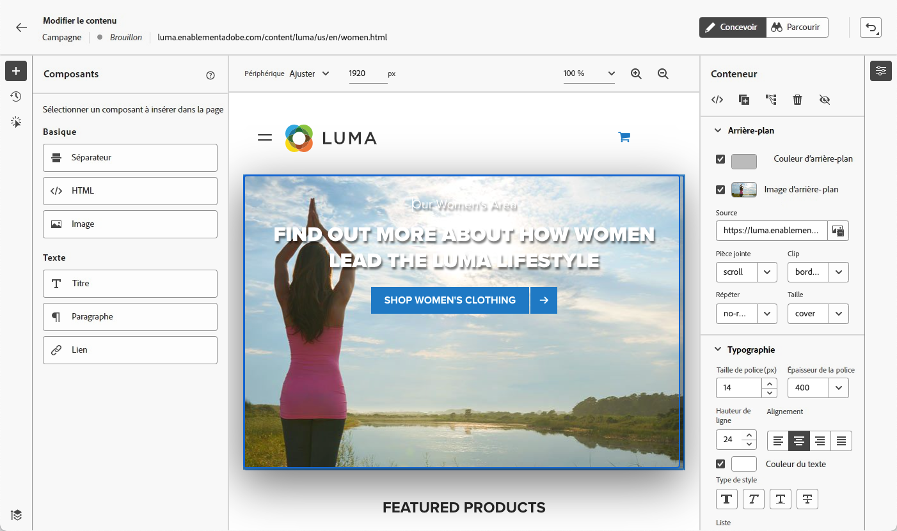
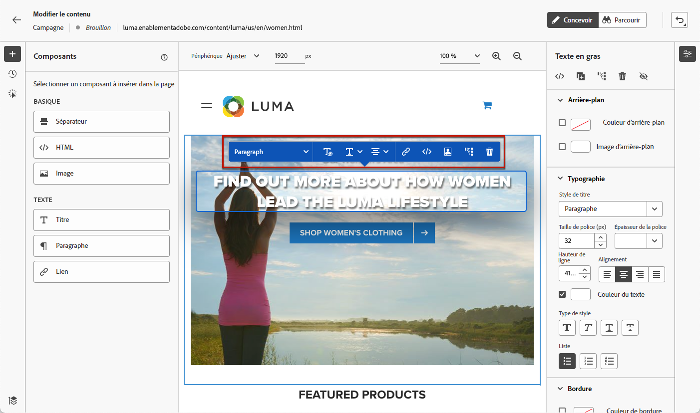
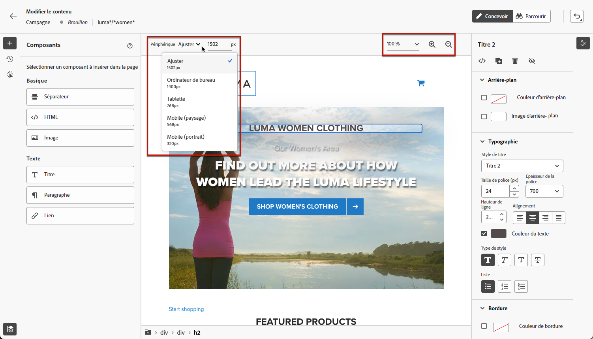
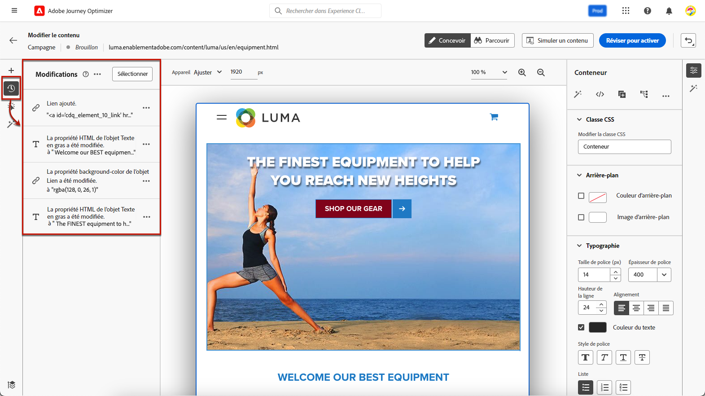
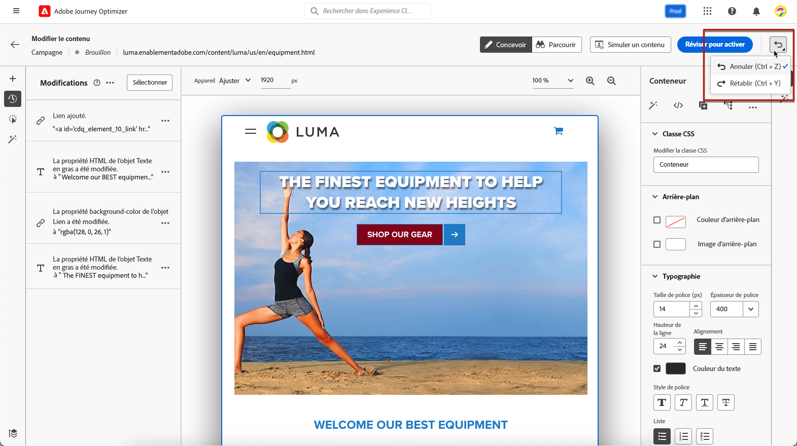
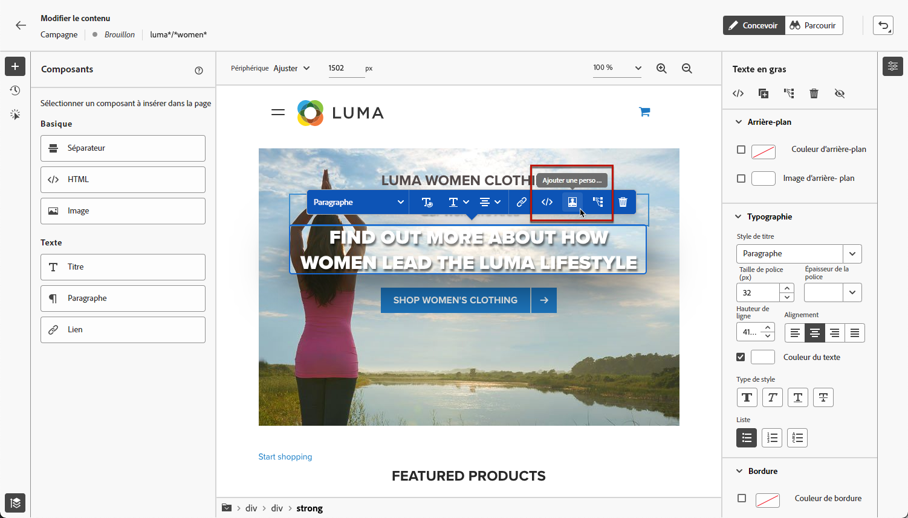

# Créer des pages web {#author-web}

>[!AVAILABILITY]
>
>La fonctionnalité de canal web est actuellement disponible en version bêta pour certains utilisateurs uniquement.

Dans [!DNL Journey Optimizer], la création web est optimisée par l’extension de navigateur Chrome Visual Helper d’Adobe Experience Cloud. [En savoir plus](visual-editing-helper.md)

Pour créer et accéder à des pages web dans l’interface utilisateur de [!DNL Journey Optimizer], suivez les conditions préalables répertoriées dans [cette section](create-web.md#prerequesites).

## Modifier le contenu d’une page web {#edit-web-content}

>[!CONTEXTUALHELP]
>id="ajo_web_url_to_edit_surface"
>title="Saisissez l’URL à modifier."
>abstract="Saisissez l&#39;URL d&#39;une page web spécifique à utiliser pour l&#39;édition du contenu qui sera appliqué sur la surface web définie ci-dessus. La page web doit être mise en oeuvre à l’aide du SDK Web de Adobe Experience Platform."
>additional-url="https://experienceleague.adobe.com/docs/platform-learn/implement-web-sdk/overview.html" text="En savoir plus"

>[!CONTEXTUALHELP]
>id="ajo_web_url_to_edit_rule"
>title="Saisissez l’URL à modifier."
>abstract="Saisissez l’URL d’une page web spécifique à utiliser pour l’édition du contenu qui sera appliqué à toutes les pages correspondant à la règle. La page web doit être mise en oeuvre à l’aide du SDK web Adobe Experience Platform."
>additional-url="https://experienceleague.adobe.com/docs/platform-learn/implement-web-sdk/overview.html" text="En savoir plus"

<!--Confirm the URL to use for authoring content on the surface. Typically the Authoring URL will be the surface URL itself, but you may include extra parameters if required. The page must include the Adobe Experience Platform Web SDK.-->

Une fois que vous avez créé une action web à partir de la campagne, vous pouvez modifier votre contenu à l’aide du concepteur web. Procédez comme suit.

>[!CAUTION]
>
>Pour y accéder : [!DNL Journey Optimizer], votre page web doit être implémentée à l’aide de la fonction [SDK Web Adobe Experience Platform](https://experienceleague.adobe.com/docs/platform-learn/implement-web-sdk/overview.html?lang=fr){target=&quot;_blank&quot;}.

1. Dans l’onglet **[!UICONTROL Action]** de la campagne, sélectionnez **[!UICONTROL Modifier le contenu]** pour commencer à créer votre campagne web.

1. Si vous avez créé une règle de correspondance de pages, vous devez saisir toutes les URL correspondant à cette règle. Les modifications seront appliquées à toutes les pages correspondant à la règle.

   >[!NOTE]
   >
   >Si vous avez saisi une seule URL comme surface web, l’URL à personnaliser est déjà renseignée.

   

1. Le contenu de la page s’affiche.

   >[!CAUTION]
   >
   >La page web doit inclure la variable [SDK Web Adobe Experience Platform](https://experienceleague.adobe.com/docs/platform-learn/implement-web-sdk/overview.html){target=&quot;_blank&quot;}.

1. Cliquez sur **[!UICONTROL Ouvrir le concepteur web]** pour la modifier. [En savoir plus](author-web.md)

   

1. Le concepteur web s’affiche.

   

1. Sélectionnez un élément dans la zone de travail, tel qu’une image, un bouton, un paragraphe, un texte, un conteneur, un en-tête, un lien, etc. et utilisez :

   * Le menu contextuel permettant de modifier son contenu, sa mise en page, d’insérer des liens ou la personnalisation, etc.

      

   * Les icônes situées en haut du panneau de droite permettent de modifier, dupliquer, supprimer ou masquer chaque élément.

      

   * Panneau de droite qui change dynamiquement en fonction de l’élément sélectionné. Vous pouvez, par exemple, modifier l’arrière-plan, la typographie, la bordure, la taille, la position, l’espacement, les effets ou les styles intégrés d’un élément.

      

## Utiliser des composants de contenu {#content-components}

>[!CONTEXTUALHELP]
>id="ajo_web_designer_components"
>title="Ajout de composants de contenu à une page web"
>abstract="Vous pouvez ajouter plusieurs composants à votre page web et les modifier selon vos besoins."

1. Dans le volet **[!UICONTROL Composants]** à gauche, vous pouvez ajouter les composants suivants à votre page web et les modifier selon vos besoins :

   * [Diviseur](../design/content-components.md#divider)
   * [HTML](../design/content-components.md#HTML)
   * [Image](../design/content-components.md#image)
   * En-tête : l’utilisation de ce composant est similaire à l’utilisation du composant **[!UICONTROL Texte]** dans le concepteur d’e-mail. [En savoir plus](../design/content-components.md#text)
   * Paragraphe : l’utilisation de ce composant est similaire à l’utilisation du composant **[!UICONTROL Texte]** dans le concepteur d’email. [En savoir plus](../design/content-components.md#text)
   * Lien - Découvrez comment définir le style du lien dans [cette section](../design/styling-links.md)
   * [Décision d’offre](../design/deliver-personalized-offers.md)

   

1. Passez la souris sur la page, puis cliquez sur le bouton **[!UICONTROL Insérer avant]** ou **[!UICONTROL Insérer après]** pour ajouter le composant à un élément existant sur la page.

   

1. Dans le conteneur qui s’affiche pour ce composant, modifiez le contenu du composant selon vos besoins.

   

1. Ajustez les styles qui s’affichent à partir du volet **[!UICONTROL Conteneur]** à droite, comme l’arrière-plan, la couleur du texte, la bordure, la taille, la position, etc. en fonction du composant sélectionné.

   

##  Naviguer dans le concepteur web

### Utiliser des chemins de navigation

1. Sélectionnez un élément dans la zone de travail.

1. Cliquez sur le bouton **[!UICONTROL Développer/réduire le chemin de navigation]** dans le coin inférieur gauche de l’écran pour afficher rapidement les informations sur l’élément sélectionné.

   

1. Lorsque vous pointez sur le chemin de navigation, l’élément correspondant est mis en surbrillance dans l’éditeur.

1. Grâce à cela, vous pouvez facilement accéder à n’importe quel élément parent, frère ou enfant dans l’éditeur visuel.

### Basculer vers le mode de navigation {#browse-mode}

>[!CONTEXTUALHELP]
>id="ajo_web_designer_browse"
>title="Utilisation du mode de navigation"
>abstract="Dans ce mode, vous pouvez accéder à la page exacte à partir de la surface sélectionnée à personnaliser."

Vous pouvez passer du mode **[!UICONTROL Conception]** par défaut au mode de **[!UICONTROL Navigation]** à l’aide du bouton dédié.

Dans le mode de **[!UICONTROL Navigation]**, vous pouvez accéder à la page exacte à partir de la surface sélectionnée à personnaliser.

Il est particulièrement utile lorsque vous traitez des pages qui se trouvent derrière une authentification ou qui ne sont pas disponibles depuis le début à une certaine URL. Par exemple, vous serez en mesure de vous authentifier, d’accéder à la page de votre compte ou à la page de votre panier, puis de revenir au mode **[!UICONTROL Conception]** pour effectuer les modifications sur la page souhaitée.

### Modifier la taille de l’appareil

Vous pouvez définir la taille de l’appareil sur une taille prédéfinie, telle que **[!UICONTROL Tablette]** ou **[!UICONTROL Paysage mobile]**, ou définir une taille personnalisée. Saisissez le nombre de pixels souhaité pour définir une taille personnalisée.

Vous pouvez également modifier la mise au point du zoom, de 25 % à 400 %.

## Gérer les modifications {#manage-modifications}

>[!CONTEXTUALHELP]
>id="ajo_web_designer_modifications"
>title="Gérer facilement toutes vos modifications"
>abstract="Ce volet vous permet de parcourir et de gérer tous les réglages et styles ajoutés à votre page web."

Vous pouvez facilement gérer tous les composants, réglages et styles que vous avez ajoutés à votre page web.

1. Sélectionnez le bouton **[!UICONTROL Modifications]** pour afficher le volet correspondant à gauche.

   

1. Vous pouvez passer en revue chacune des modifications que vous avez apportées à la page.

1. Sélectionnez une modification indésirable et cliquez sur l’icône de suppression pour la supprimer.

   

   >[!CAUTION]
   >
   >Procédez avec précaution lors de la suppression d’une action, car elle peut avoir un impact sur les actions suivantes.

1. Vous pouvez également annuler et rétablir des actions à l’aide du bouton **[!UICONTROL Annuler/rétablir]** en haut à droite de l’écran.

   

   Cliquez sur le bouton et maintenez-le enfoncé pour passer de l’option **[!UICONTROL Annuler]** à l’option **[!UICONTROL Rétablir]**, et inversement. Cliquez ensuite sur le bouton lui-même pour appliquer l’action souhaitée.

## Ajouter des personnalisations et des offres

Pour ajouter de la personnalisation, sélectionnez un conteneur et l’icône de personnalisation dans la barre du menu contextuel qui s’affiche. Ajoutez vos modifications à l’aide de l’éditeur d’expression. [En savoir plus](../personalization/personalization-build-expressions.md)

Utilisez le composant **[!UICONTROL Décision d’offre]** pour insérer des [offres](../offers/get-started/starting-offer-decisioning.md) dans vos pages web. Le processus est le même que pour l’[ajout d’une offre à un e-mail](../design/deliver-personalized-offers.md). Il tire profit de la gestion des décisions pour choisir la meilleure offre à fournir à vos clients.

## Tester la campagne web {#test-web-campaign}

>[!CONTEXTUALHELP]
>id="ajo_web_designer_preview"
>title="Prévisualiser votre expérience web"
>abstract="Effectuez une simulation de votre expérience web."

Pour afficher un aperçu de votre expérience web modifiée, suivez les étapes ci-dessous.

>[!CAUTION]
>
>Vous devez disposer de profils de test pour simuler les offres qui leur seront diffusées. Découvrez comment [créer des profils de test](../segment/creating-test-profiles.md).

1. À partir de l’écran **[!UICONTROL Modifier le contenu]** ou du concepteur web, sélectionnez **[!UICONTROL Simuler du contenu]**.

   

1. Cliquez sur **[!UICONTROL Gérer les profils de test]** pour sélectionner un ou plusieurs profils de test.
1. Un aperçu de la page web modifiée s’affiche.

   

1. Vous pouvez également copier l’URL de test pour la coller dans n’importe quel navigateur ou l’ouvrir dans le navigateur par défaut.
