# Créer des expériences web {#create-web}

>[!AVAILABILITY]
>
>La fonctionnalité de canal web est actuellement disponible en version bêta pour sélectionner uniquement les utilisateurs.

[!DNL Journey Optimizer] vous permet de personnaliser l’expérience web que vous diffusez à vos clients par le biais de campagnes web entrantes.

>[!CAUTION]
>
>Actuellement dans [!DNL Journey Optimizer] vous pouvez uniquement créer des expériences web en utilisant **campagnes**.

## Conditions préalables {#prerequesites}

Pour accéder à des pages web et les créer dans le [!DNL Journey Optimizer] dans l’interface utilisateur, procédez comme suit :

* Pour ajouter des modifications à votre site web, vous devez mettre en oeuvre le [SDK Web Adobe Experience Platform](https://experienceleague.adobe.com/docs/platform-learn/implement-web-sdk/overview.html?lang=fr){target=&quot;_blank&quot;} sur votre site web.

* Pour accéder au [!DNL Journey Optimizer] concepteur web, vous devez télécharger le [Assistant d’édition visuelle de Adobe Experience Cloud](https://chrome.google.com/webstore/detail/adobe-experience-cloud-vi/kgmjjkfjacffaebgpkpcllakjifppnca)Extension de navigateur {target=&quot;_blank&quot;} sur Chrome. [En savoir plus](visual-editing-helper.md)

>[!CAUTION]
>
>Google Chrome est actuellement le seul navigateur qui prend en charge la création de pages web dans [!DNL Journey Optimizer].

Pour que l’expérience web soit correctement diffusée, les paramètres suivants doivent être définis :

* Dans le [Collecte de données Adobe Experience Platform](https://experienceleague.adobe.com/docs/experience-platform/edge/datastreams/overview.html){target=&quot;_blank&quot;}, assurez-vous qu’un flux de données est défini, comme sous **[!UICONTROL Adobe Experience Platform]** vous disposez des deux options suivantes : **[!UICONTROL Segmentation Edge]** et **[!UICONTROL Adobe Journey Optimizer]** options activées.

   Cela permet de s’assurer que les événements entrants Journey Optimizer sont correctement gérés par Adobe Experience Platform Edge. [En savoir plus](https://experienceleague.adobe.com/docs/experience-platform/edge/datastreams/configure.html){target=&quot;_blank&quot;}

   

   >[!NOTE]
   >
   >Le **[!UICONTROL Adobe Journey Optimizer]** ne peut être activée que lorsque la variable **[!UICONTROL Segmentation Edge]** est déjà activée.

* Dans [Adobe Experience Platform](https://experienceleague.adobe.com/docs/experience-platform/profile/home.html?lang=fr){target=&quot;_blank&quot;}, assurez-vous d’avoir une stratégie de fusion avec la variable **[!UICONTROL Stratégie de fusion principale sur le périphérique]** activée. Pour ce faire, sélectionnez une stratégie sous le **[!UICONTROL Client]** > **[!UICONTROL Profils]** > **[!UICONTROL Stratégies de fusion]** menu Experience Platform. [En savoir plus](https://experienceleague.adobe.com/docs/experience-platform/profile/merge-policies/ui-guide.html#configure){target=&quot;_blank&quot;}

   Cette stratégie de fusion est utilisée par [!DNL Journey Optimizer] canaux entrants pour activer et publier correctement les campagnes entrantes sur le serveur Edge. [En savoir plus](https://experienceleague.adobe.com/docs/experience-platform/profile/merge-policies/ui-guide.html){target=&quot;_blank&quot;}

   

## Créer une campagne web {#create-web-campaign}

Pour commencer à créer votre expérience web par le biais d’une campagne, procédez comme suit.

1. Créer une campagne. [En savoir plus](../campaigns/create-campaign.md)

1. Sélectionnez la **[!UICONTROL Web]** action.

   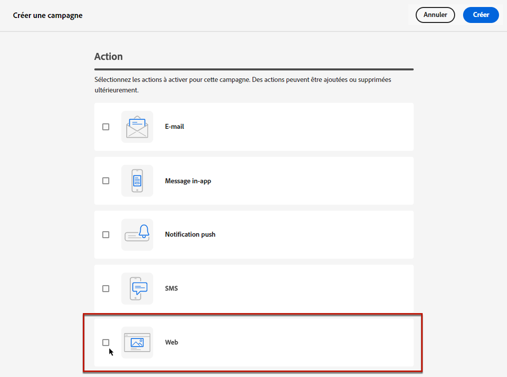

1. Définissez une surface web.

   >[!NOTE]
   >
   >Une surface web est une propriété web identifiée par une URL où le contenu sera diffusé. Il peut correspondre à une ou plusieurs pages d’une seule page, ce qui vous permet de diffuser des modifications sur une ou plusieurs pages web.

   Vous pouvez saisir une **[!UICONTROL URL de la page]** si vous souhaitez appliquer les modifications à une seule page uniquement.

   

1. Vous pouvez également créer une **[!UICONTROL Règle de correspondance des pages]** pour cibler plusieurs URL correspondant à la même règle ; par exemple, si vous souhaitez appliquer les modifications à une bannière principale sur l’ensemble d’un site web ou ajouter une image principale qui s’affiche sur toutes les pages de produit d’un site web.

   Pour ce faire, sélectionnez **[!UICONTROL Règle de correspondance des pages]** et cliquez sur **[!UICONTROL Créer une règle]**.

   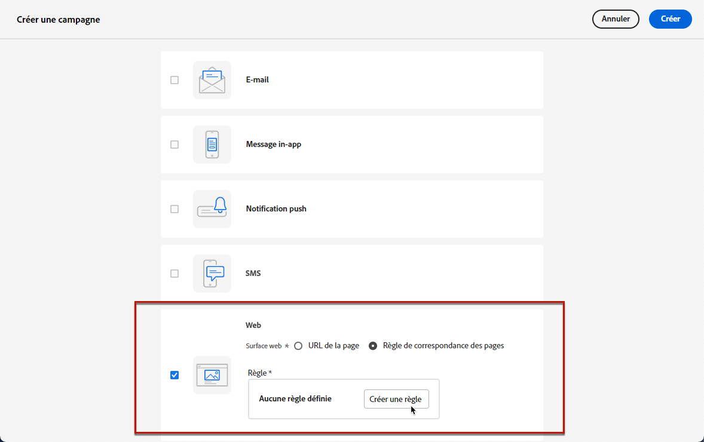

1. Définissez vos critères pour le **[!UICONTROL Domaine]** et **[!UICONTROL Page]** champs.

   Par exemple, si vous souhaitez modifier des éléments qui s’affichent sur toutes les pages de produit pour femmes de votre site web Luma, sélectionnez **[!UICONTROL Domaine]** > **[!UICONTROL Commence par]** > `luma` et **[!UICONTROL Page]** > **[!UICONTROL Contient]** > `women`.

   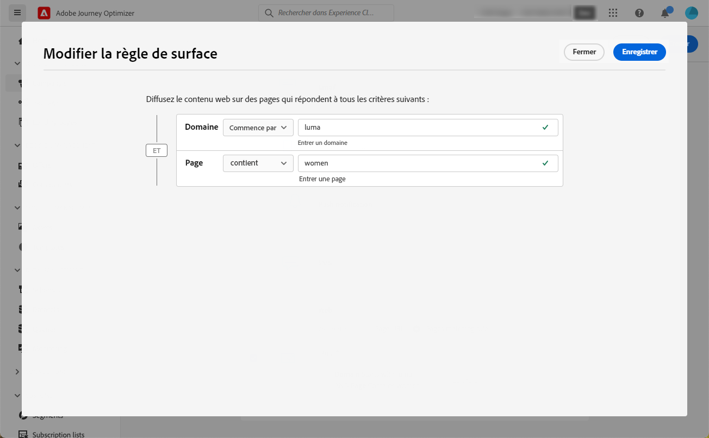

1. Enregistrez vos modifications. La règle s’affiche dans la variable **[!UICONTROL Créer une campagne]** écran.

   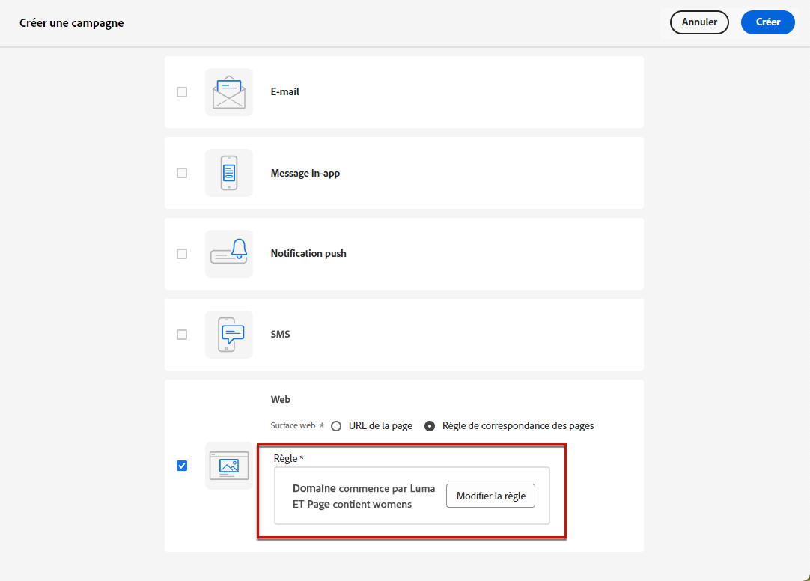

1. Une fois la surface web définie, sélectionnez **[!UICONTROL Créer]**. Vous pouvez maintenant configurer les propriétés et les paramètres de votre campagne.

## Configuration de la campagne web {#configure-web-campaign}

1. Dans le **[!UICONTROL Propriétés]** vous pouvez modifier le nom de la campagne et ajouter une description si nécessaire.

   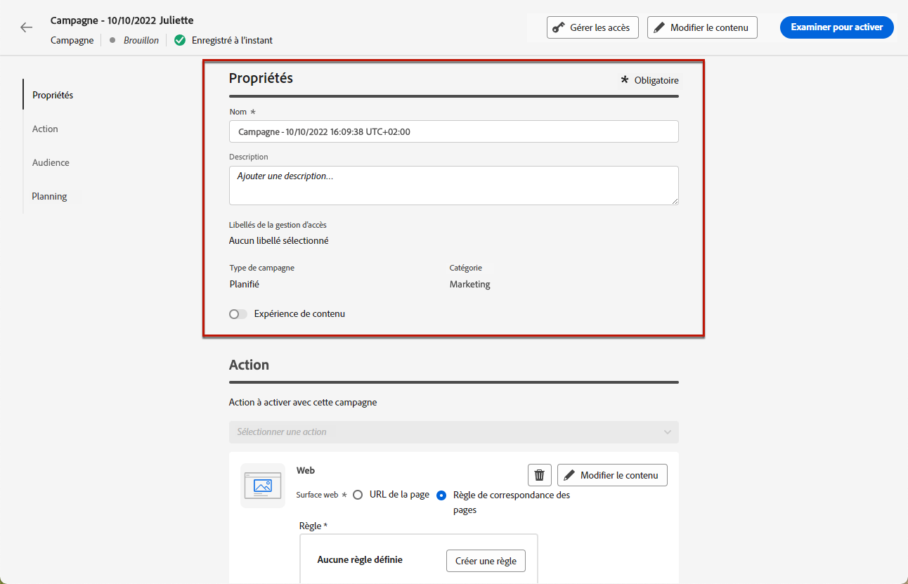

1. Pour attribuer des libellés d’utilisation des données personnalisés ou de base à la campagne web, sélectionnez l’option **[!UICONTROL Gérer l’accès]** en haut de l’écran. [En savoir plus sur le contrôle d’accès au niveau de l’objet (OLAC)](../administration/object-based-access.md)

1. Vous pouvez sélectionner **[!UICONTROL Expérience de contenu]** pour tester les traitements de contenu avec des parties de l’audience, afin de déterminer le traitement le plus performant par rapport à une mesure spécifique. [En savoir plus](../campaigns/content-experiment.md)

   >[!AVAILABILITY]
   >
   >La fonctionnalité **Expérience de contenu** est actuellement disponible uniquement pour un ensemble d’organisations (disponibilité limitée). Pour en savoir plus, contactez votre représentant Adobe.

1. Dans la **[!UICONTROL Action]** de l&#39;opération, sélectionnez **[!UICONTROL Modifier le contenu]** pour commencer à créer votre campagne web. [En savoir plus](author-web.md)

   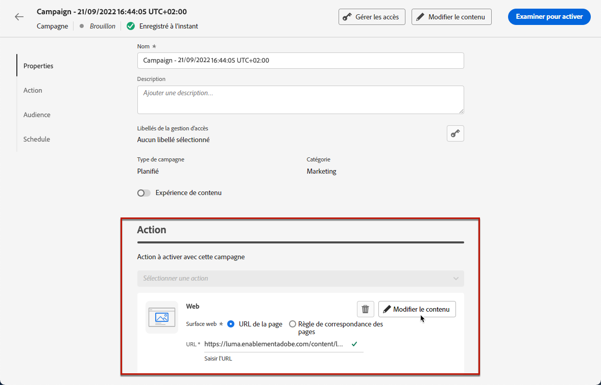

1. Dans la **[!UICONTROL Audience]** , définissez qui pourra voir votre campagne web. Par défaut, la campagne web sera visible par tous les visiteurs.

   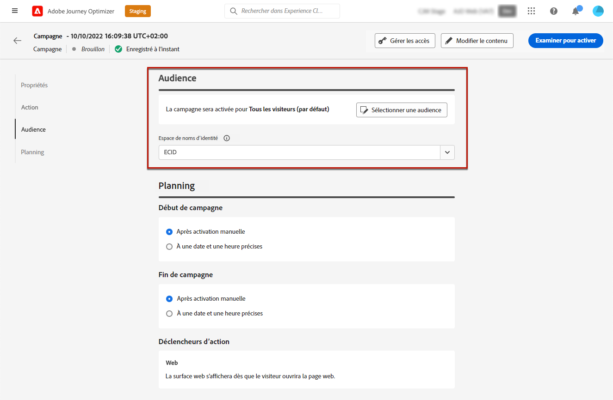

   Vous pouvez également sélectionner une audience spécifique. Utilisez la variable **[!UICONTROL Sélection de l’audience]** pour afficher la liste des segments Adobe Experience Platform disponibles. [En savoir plus sur les segments](../segment/about-segments.md)

   >[!NOTE]
   >
   >Pour les campagnes déclenchées par API, l’audience doit être définie via un appel API. [En savoir plus](../campaigns/api-triggered-campaigns.md)

   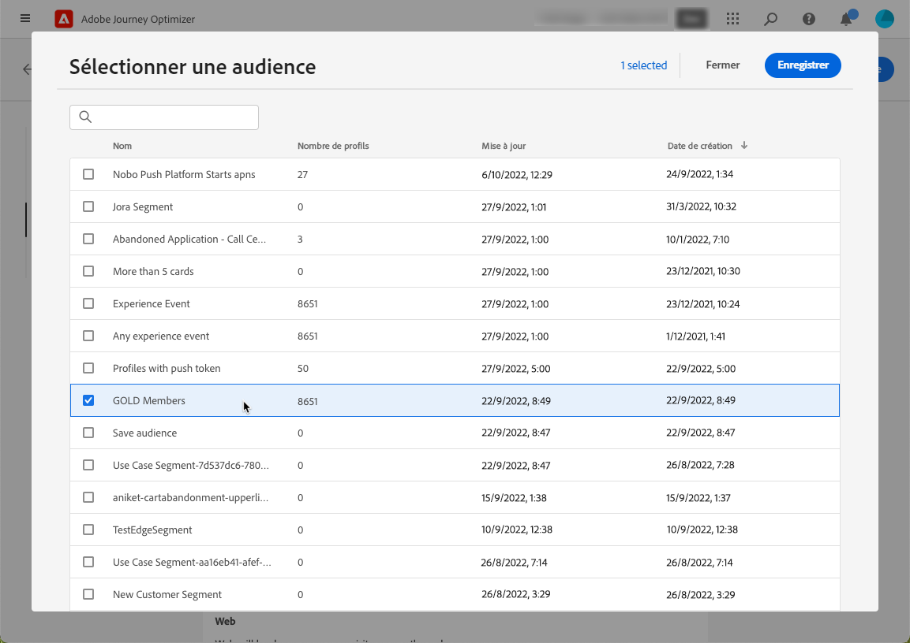

1. Dans le champ **[!UICONTROL Espace de noms d’identité]**, choisissez l’espace de noms à utiliser pour identifier les personnes à partir du segment sélectionné. [En savoir plus sur les espaces de noms](../event/about-creating.md#select-the-namespace)

1. Définition d’une **[!UICONTROL Planification]** pour votre campagne web. [En savoir plus](../campaigns/create-campaign.md#schedule)

   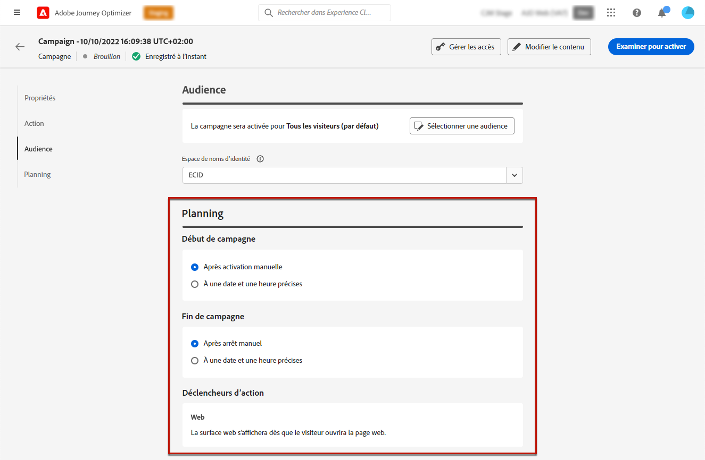

   Par défaut, il commence lorsqu’il est activé manuellement et se termine lorsqu’il est arrêté manuellement, mais vous pouvez également définir des dates et heures spécifiques pour que vos modifications soient visibles.

   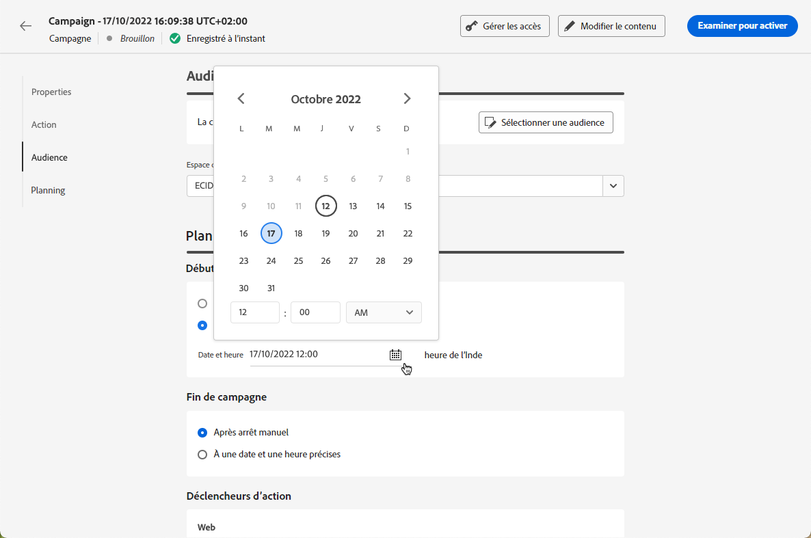

## Activer la campagne web {#activate-web-campaign}

Une fois que vous avez défini votre [paramètres de campagne web](#configure-web-campaign) et vous avez modifié votre contenu selon vos besoins à l’aide de la fonction [web designer](author-web.md), vous pouvez passer en revue et activer votre campagne web. Suivez les étapes ci-dessous.

>[!NOTE]
>
>Vous pouvez également prévisualiser le contenu de votre campagne web avant de l’activer. [En savoir plus](author-web.md#test-web-campaign)

1. Dans votre campagne web, sélectionnez **[!UICONTROL Réviser pour activer]**.

   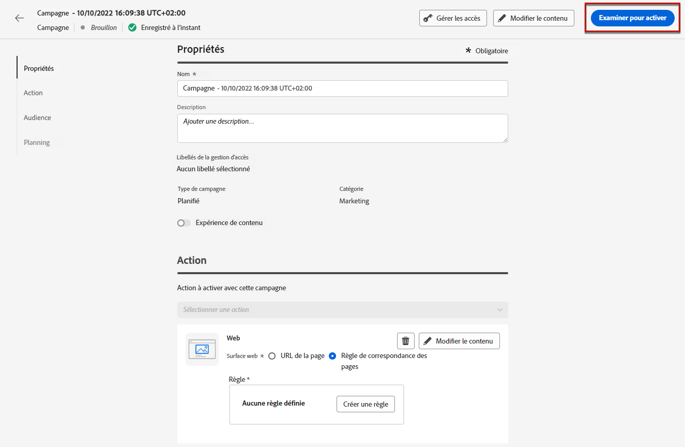

1. Vérifiez et modifiez si nécessaire le contenu, les propriétés, la surface, l’audience et le planning.

1. Sélectionner **[!UICONTROL Activer]**.

   

   >[!NOTE]
   >
   >Après avoir cliqué sur **[!UICONTROL Activer]**, les modifications des campagnes web peuvent prendre jusqu’à 15 minutes pour être disponibles en direct sur votre site web.

Votre campagne web utilise la variable **[!UICONTROL En direct]** et est maintenant visible pour l’audience sélectionnée. Chaque destinataire de votre campagne peut voir les modifications que vous avez ajoutées à votre site web à l’aide du [!DNL Journey Optimizer] web designer.

>[!NOTE]
>
>Si vous avez défini un planning pour votre campagne web, celui-ci comprend la variable **[!UICONTROL Planifié]** jusqu’à ce que la date et l’heure de début soient atteintes.
>
>Si vous activez une campagne web ayant un impact sur les mêmes pages qu’une autre campagne déjà active, toutes les modifications seront appliquées à vos pages web.

En savoir plus sur l’activation des campagnes dans [cette section](../campaigns/review-activate-campaign.md).

## Arrêter une campagne web {#stop-web-campaign}

Lorsqu’une campagne web est active, vous pouvez l’arrêter afin d’empêcher votre audience de voir vos modifications. Suivez les étapes ci-dessous.

1. Sélectionnez une campagne active dans la liste.

1. Dans le menu supérieur, sélectionnez **[!UICONTROL Arrêter la campagne]**.

   

1. Les modifications que vous avez ajoutées ne seront plus visibles pour l’audience que vous avez définie.

>[!NOTE]
>
>Une fois une campagne web arrêtée, vous ne pouvez plus la modifier ni l’activer. Vous pouvez uniquement le dupliquer et activer la campagne dupliquée.
