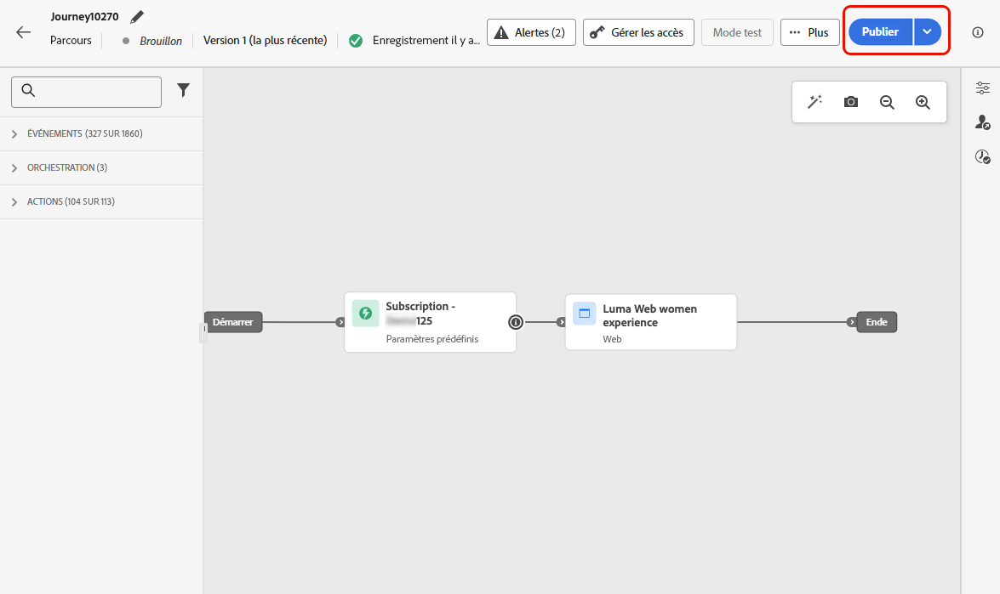

# Créer des expériences web {#create-web}

[!DNL Journey Optimizer] vous permet de personnaliser l’expérience web que vous diffusez à vos clients par le biais de parcours ou de campagnes entrants.

## Ajout d’une expérience web par le biais d’un parcours ou d’une campagne {#create-web-experience}

>[!CONTEXTUALHELP]
>id="ajo_web_surface"
>title="Définir une configuration web"
>abstract="Une configuration web peut correspondre à l’URL d’une ou de plusieurs pages, ce qui vous permet de diffuser des modifications de contenu sur une ou plusieurs pages web."

>[!CONTEXTUALHELP]
>id="ajo_web_surface_rule"
>title="Créer une règle de correspondance de pages"
>abstract="Une règle de correspondance de pages permet de cibler plusieurs URL qui correspondent à la même règle, notamment si vous souhaitez appliquer les modifications à une bannière principale sur l’ensemble d’un site web ou ajouter une image principale qui s’affiche sur toutes les pages de produits d’un site web."

Pour commencer à créer votre expérience web par le biais d’une campagne ou d’un parcours, procédez comme suit.

>[!NOTE]
>
>Si c’est la première fois que vous créez une expérience web, veillez à respecter les conditions préalables décrites dans [cette section](web-prerequisites.md).

>[!BEGINTABS]

>[!TAB Ajouter une expérience web à un parcours]

Pour ajouter une activité **Web** à un parcours, procédez comme suit :

1. [Créez un parcours](../building-journeys/journey-gs.md).

1. Débutez votre parcours avec une activité [Événement](../building-journeys/general-events.md) ou [Lecture d’audience](../building-journeys/read-audience.md).

1. Faites glisser et déposez une activité **[!UICONTROL Web]** depuis la section **[!UICONTROL Actions]** de la palette.

   

   >[!NOTE]
   >
   >Comme **Web** est une activité de message entrant, elle est fournie avec une activité **Attente** de 3 jours. [En savoir plus](../building-journeys/wait-activity.md#auto-wait-node)

1. Saisissez un **[!UICONTROL libellé]** et une **[!UICONTROL description]** pour votre message.

1. Sélectionnez ou créez la [configuration Web](web-configuration.md) à utiliser.

   

1. Sélectionnez le bouton **[!UICONTROL Modifier le contenu]** et modifiez votre contenu selon vos besoins à l’aide du concepteur web. [En savoir plus](edit-web-content.md)

1. Si nécessaire, complétez votre flux de parcours en faisant glisser et en déposant des actions ou des événements supplémentaires. [En savoir plus](../building-journeys/about-journey-activities.md).

1. Une fois votre expérience web prête, finalisez la configuration et publiez votre parcours pour l’activer. [En savoir plus](../building-journeys/publishing-the-journey.md)

Pour plus d’informations sur la configuration de votre parcours, consultez cette [page](../building-journeys/journey-gs.md).

>[!TAB Créer une campagne web]

Pour commencer à créer votre expérience web par le biais d’une campagne, suivez les étapes ci-dessous.

1. Création d’une campagne. [En savoir plus](../campaigns/create-campaign.md)

1. Sélectionner le type de campagne que vous souhaitez exécuter.

   * **Scheduled - Marketing** : permet d’exécuter la campagne immédiatement ou à une date spécifiée. Les campagnes planifiées visent à envoyer des messages marketing. Elles sont configurées et exécutées à partir de l’interface d’utilisation.

   * **API-triggered - Marketing/Transactional** : permet d’exécuter la campagne à l’aide d’un appel API. Les campagnes déclenchées par l’API sont destinées à envoyer des messages marketing ou transactionnels, c’est-à-dire des messages envoyés suite à une action effectuée par un individu : réinitialisation de mot de passe, achat de panier, etc. [Découvrez comment déclencher une campagne à l’aide d’API](../campaigns/api-triggered-campaigns.md)

1. Suivez les étapes de création d’une campagne web, telles que les propriétés de la campagne, l’[audience](../audience/about-audiences.md) et le [planning](../campaigns/create-campaign.md#schedule).

1. Sélectionnez l’action **[!UICONTROL Web]**.

1. Sélectionnez ou créez la configuration web. [En savoir plus sur la configuration web](web-configuration.md)

   

1. Cliquez sur le bouton **[!UICONTROL Modifier le contenu]** pour modifier votre contenu comme vous le souhaitez à l’aide du concepteur web. [En savoir plus](edit-web-content.md)

   <!---->

Pour plus d’informations sur la configuration d’une campagne, consultez cette [page](../campaigns/get-started-with-campaigns.md).

➡️ [Découvrez comment créer une campagne web dans cette vidéo](#video)

>[!ENDTABS]

## Test de l’expérience web {#test-web-experience}

>[!CONTEXTUALHELP]
>id="ajo_web_designer_preview"
>title="Prévisualiser votre expérience web."
>abstract="Effectuez une simulation de ce à quoi ressemblera votre expérience web."

Une fois que vous avez [créé votre expérience web](edit-web-content.md) grâce au concepteur web, vous pouvez afficher un aperçu de vos pages web modifiées. Si vous avez inséré du contenu personnalisé, vous pouvez vérifier l’affichage de ce contenu à l’aide des données de profil de test.

Pour ce faire, cliquez sur **[!UICONTROL Simuler le contenu]** à partir de l’écran de contenu d’édition de parcours ou de campagne, puis ajoutez un profil de test pour vérifier votre page web à l’aide des données de profil de test.

Vous pouvez également l’ouvrir dans le navigateur par défaut ou copier l’URL de test pour la coller dans n’importe quel navigateur. Vous pouvez ainsi partager le lien avec votre équipe et les parties prenantes qui pourront prévisualiser la nouvelle expérience web dans n’importe quel navigateur avant que la campagne ne soit activée.

>[!NOTE]
>
>Lors de la copie de l’URL de test, le contenu affiché est celui personnalisé pour le profil de test utilisé lors de la génération de la simulation de contenu dans [!DNL Journey Optimizer].

Vous trouverez des informations détaillées sur la sélection des profils de test et la prévisualisation de votre contenu dans la section [Gestion de contenu](../content-management/preview-test.md).

## Mettre en ligne votre expérience web {#web-experience-live}

>[!IMPORTANT]
>
>À compter de la version de septembre, une nouvelle expérience d’activation de campagne et de parcours vous permet de gérer l’ensemble du processus d’approbation, en veillant à ce que les campagnes et les parcours soient minutieusement examinés et approuvés par les parties prenantes appropriées avant de passer en ligne. Cette fonctionnalité est disponible en disponibilité limitée. [En savoir plus](../test-approve/gs-approval.md)

Une fois que vous avez défini votre expérience web et modifié votre contenu comme vous le souhaitez à l’aide du [concepteur web](edit-web-content.md#work-with-web-designer), vous pouvez activer votre parcours ou campagne pour rendre vos modifications visibles à votre audience.

Vous pouvez également prévisualiser le contenu de votre expérience web avant de le rendre actif. [En savoir plus](#test-web-experience)

>[!NOTE]
>
>Si vous activez un parcours/une campagne web ayant un impact sur les mêmes pages qu’un autre parcours ou campagne déjà actif, toutes les modifications seront appliquées à vos pages web.
>
>Si plusieurs parcours ou campagnes mettent à jour le ou les mêmes éléments de votre site web, le parcours/la campagne de priorité la plus élevée est prioritaire.

### Publish d’un parcours web {#activate-web-journey}

Pour rendre votre expérience web active à partir d’un parcours, procédez comme suit.

1. Vérifiez que votre parcours est valide et qu’il n’y a aucune erreur. [En savoir plus](../building-journeys/troubleshooting.md#checking-for-errors-before-testing)

1. Dans le parcours, sélectionnez l’option **[!UICONTROL Publish]** située dans le menu déroulant supérieur droit.

   

   >[!NOTE]
   >
   >En savoir plus sur la publication de parcours dans [cette section](../building-journeys/publishing-the-journey.md).

Votre parcours web prend l’état **[!UICONTROL Live]** et est désormais en lecture seule. Chaque destinataire de votre parcours peut voir les modifications que vous avez ajoutées à votre site web.

>[!NOTE]
>
>Une fois que vous avez cliqué sur **[!UICONTROL Publish]**, les modifications peuvent prendre jusqu’à 15 minutes pour être disponibles en direct sur votre site web.

### Activer une campagne web {#activate-web-campaign}

Une fois que vous avez défini les paramètres de vos campagnes web et que vous avez modifié le contenu à l’aide du [concepteur web](edit-web-content.md#work-with-web-designer), vous pouvez passer en revue et activer votre campagne web. Suivez les étapes ci-dessous.

1. Dans votre campagne web, sélectionnez **[!UICONTROL Examiner pour activer]**.

1. Vérifiez et modifiez si nécessaire le contenu, les propriétés, la configuration, l’audience et le planning.

1. Sélectionnez **[!UICONTROL Activer]**.

   

   >[!NOTE]
   >
   >En savoir plus sur l’activation des campagnes dans [cette section](../campaigns/review-activate-campaign.md).

Votre campagne web passe au statut **[!UICONTROL Actif]** et est maintenant visible pour l’audience sélectionnée. Chaque destinataire de votre campagne peut voir les modifications que vous avez ajoutées à votre site web.

>[!NOTE]
>
>Après avoir cliqué sur **[!UICONTROL Activer]**, les modifications des campagnes web peuvent prendre jusqu’à 15 minutes pour être disponibles en direct sur votre site web.
>
>Si vous avez défini un planning pour votre campagne web, celle-ci conserve le statut **[!UICONTROL Planifié]** jusqu’à ce que la date et l’heure de début soient atteintes.

## Arrêter un parcours web ou une campagne {#stop-web-experience}

Lorsqu’un parcours web ou une campagne est actif, vous pouvez l’arrêter afin d’empêcher votre audience de voir vos modifications. Suivez les étapes ci-dessous.

1. Sélectionnez un parcours ou une campagne actif dans la liste correspondante.

1. Effectuez l’action appropriée en fonction de votre cas :

   * Dans le menu supérieur de la campagne, sélectionnez **[!UICONTROL Arrêter la campagne]**.

     

   * Dans le menu supérieur parcours, cliquez sur le bouton **[!UICONTROL Plus]** et sélectionnez **[!UICONTROL Arrêter]**.

     

1. Les modifications que vous avez ajoutées ne sont plus visibles pour l’audience que vous avez définie.

>[!NOTE]
>
>Une fois qu’un parcours web ou une campagne est arrêté, vous ne pouvez plus le modifier ni l’activer. Vous pouvez uniquement le dupliquer et activer le parcours/la campagne dupliqué.

## Vidéo pratique{#video}

La vidéo ci-dessous montre comment créer une campagne web, configurer ses propriétés, la réviser et la publier.

>[!VIDEO](https://video.tv.adobe.com/v/3418800/?quality=12&learn=on)