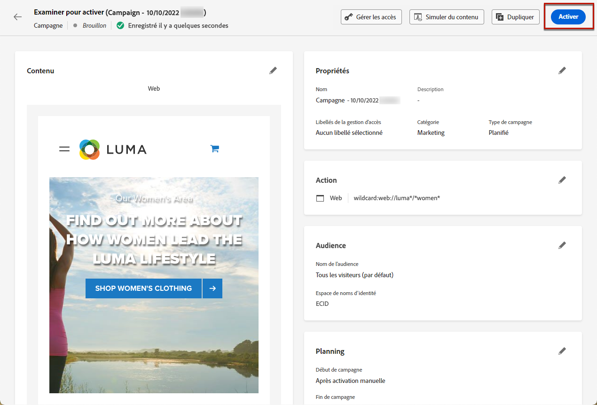

# Créer des expériences web {#create-web}

[!DNL Journey Optimizer] vous permet de personnaliser l’expérience web que vous diffusez à vos clients par le biais de campagnes web entrantes.

>[!CAUTION]
>
>Dans [!DNL Journey Optimizer], vous ne pouvez actuellement créer des expériences web qu’en utilisant des **campagnes**.

[Découvrez comment créer une campagne web dans cette vidéo.](#video)

## Créer une campagne web {#create-web-campaign}

>[!CONTEXTUALHELP]
>id="ajo_web_surface"
>title="Définir une surface web"
>abstract="Une surface web peut correspondre à l’URL d’une ou de plusieurs pages, ce qui vous permet de diffuser des modifications de contenu sur une ou plusieurs pages web."

>[!CONTEXTUALHELP]
>id="ajo_web_surface_rule"
>title="Créer une règle de correspondance de pages"
>abstract="Une règle de correspondance de pages permet de cibler plusieurs URL qui correspondent à la même règle, notamment si vous souhaitez appliquer les modifications à une bannière principale sur l’ensemble d’un site web ou ajouter une image principale qui s’affiche sur toutes les pages de produits d’un site web."

Pour commencer à créer votre expérience web par le biais d’une campagne, suivez les étapes ci-dessous.

>[!NOTE]
>
>Si c’est la première fois que vous créez une expérience web, veillez à respecter les conditions préalables décrites dans [cette section](web-prerequisites.md).

1. Création d’une campagne. [En savoir plus](../campaigns/create-campaign.md)

1. Sélectionnez l’action **[!UICONTROL Web]**.

1. Définissez une surface web.

   >[!NOTE]
   >
   >Une surface web est une propriété web identifiée par une URL où le contenu sera diffusé. Elle peut correspondre à l’URL d’une ou de plusieurs pages, ce qui vous permet de diffuser des modifications sur une ou plusieurs pages web.

   Vous pouvez saisir une **[!UICONTROL URL de la page]** si vous souhaitez appliquer les modifications à une seule page uniquement.

   

1. Vous pouvez également créer une **[!UICONTROL Règle de correspondance de pages]** pour cibler plusieurs URL correspondant à la même règle, notamment si vous souhaitez appliquer les modifications à une bannière principale sur l’ensemble d’un site web ou ajouter une image principale qui s’affiche sur toutes les pages de produits d’un site web.

   Pour ce faire, sélectionnez **[!UICONTROL Règle de correspondance de pages]** et cliquez sur **[!UICONTROL Créer une règle]**.

   

1. Définissez vos critères pour les champs **[!UICONTROL Domaine]** et **[!UICONTROL Page]**.

   Par exemple, si vous souhaitez modifier des éléments qui s’affichent sur toutes les pages de produits pour femmes de votre site web Luma, sélectionnez **[!UICONTROL Domaine]** > **[!UICONTROL Commence par]** > `luma` et **[!UICONTROL Page]** > **[!UICONTROL Contient]** > `women`.

   

1. Enregistrez vos modifications. La règle s’affiche dans l’écran **[!UICONTROL Créer une campagne]**.

   

1. Une fois la surface web définie, sélectionnez **[!UICONTROL Créer]**.

1. Suivez les étapes de création d’une campagne web, telles que les propriétés de la campagne, l’[audience](../audience/about-audiences.md) et le [planning](../campaigns/create-campaign.md#schedule).

   

Pour plus d’informations sur la configuration d’une campagne, consultez cette [page](../campaigns/get-started-with-campaigns.md).

## Tester la campagne web {#test-web-campaign}

>[!CONTEXTUALHELP]
>id="ajo_web_designer_preview"
>title="Prévisualiser votre expérience web."
>abstract="Effectuez une simulation de ce à quoi ressemblera votre expérience web."

Une fois que vous avez [créé votre expérience web](edit-web-content.md) grâce au concepteur web, vous pouvez afficher un aperçu de vos pages web modifiées. Si vous avez inséré du contenu personnalisé, vous pouvez vérifier l’affichage de ce contenu à l’aide des données de profil de test.

Pour ce faire, cliquez sur **[!UICONTROL Simuler du contenu]** depuis l’écran de modification de contenu de la campagne web ou le concepteur web, ajoutez un profil de test pour vérifier votre page web à l’aide des données du profil de test.

Vous pouvez également l’ouvrir dans le navigateur par défaut ou copier l’URL de test pour la coller dans n’importe quel navigateur. Vous pouvez ainsi partager le lien avec votre équipe et les parties prenantes qui pourront prévisualiser la nouvelle expérience web dans n’importe quel navigateur avant que la campagne ne soit activée.

>[!NOTE]
>
>Lors de la copie de l’URL de test, le contenu affiché est celui personnalisé pour le profil de test utilisé lors de la génération de la simulation de contenu dans [!DNL Journey Optimizer].

Vous trouverez des informations détaillées sur la sélection des profils de test et la prévisualisation de votre contenu dans la section [Gestion de contenu](../content-management/preview-test.md).

## Activation de la campagne web {#activate-web-campaign}

Une fois que vous avez défini vos [paramètres de campagne web](#configure-web-campaign) et que vous avez modifié votre contenu selon vos besoins à l’aide du [concepteur web](edit-web-content.md#work-with-web-designer), vous pouvez examiner et activer votre campagne web. Suivez les étapes ci-dessous.

<!--
>[!NOTE]
>
>You can also preview your web campaign content before activating it. [Learn more](#test-web-campaign)-->

1. Dans votre campagne web, sélectionnez **[!UICONTROL Examiner pour activer]**.

1. Vérifiez et modifiez si nécessaire le contenu, les propriétés, la surface, l’audience et le planning.

1. Sélectionnez **[!UICONTROL Activer]**.

   

   >[!NOTE]
   >
   >Après avoir cliqué sur **[!UICONTROL Activer]**, les modifications des campagnes web peuvent prendre jusqu’à 15 minutes pour être disponibles en direct sur votre site web.

Votre campagne web passe au statut **[!UICONTROL Actif]** et est maintenant visible pour l’audience sélectionnée. Chaque destinataire de votre campagne peut voir les modifications que vous avez ajoutées à votre site web à l’aide du concepteur web [!DNL Journey Optimizer].

>[!NOTE]
>
>Si vous avez défini un planning pour votre campagne web, celle-ci conserve le statut **[!UICONTROL Planifié]** jusqu’à ce que la date et l’heure de début soient atteintes.
>
>Si vous activez une campagne web ayant un impact sur les mêmes pages qu’une autre campagne déjà active, toutes les modifications seront appliquées à vos pages web.

En savoir plus sur l’activation des campagnes dans [cette section](../campaigns/review-activate-campaign.md).

## Arrêt d’une campagne web {#stop-web-campaign}

Lorsqu’une campagne web est active, vous pouvez l’arrêter afin d’empêcher votre audience de voir vos modifications. Suivez les étapes ci-dessous.

1. Sélectionnez une campagne active dans la liste.

1. Dans le menu supérieur, sélectionnez **[!UICONTROL Arrêter la campagne]**.

   

1. Les modifications que vous avez ajoutées ne seront plus visibles pour l’audience que vous avez définie.

>[!NOTE]
>
>Une fois une campagne web arrêtée, vous ne pouvez plus la modifier ni l’activer. Vous pouvez uniquement la dupliquer et activer la campagne dupliquée.

## Vidéo pratique{#video}

La vidéo ci-dessous montre comment créer une campagne web, configurer ses propriétés, la réviser et la publier.

>[!VIDEO](https://video.tv.adobe.com/v/3418800/?quality=12&learn=on)